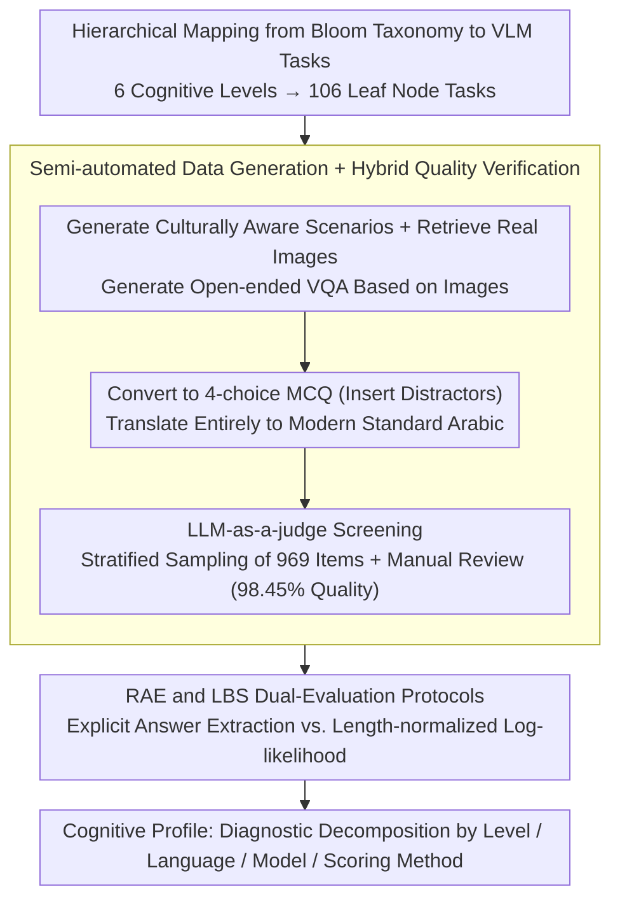

# Almieyar-Oryx-BloomBench: A Bilingual Multimodal Benchmark for Cognitively Informed Evaluation of Vision-Language Models

**Conference**: ACL2026 Findings  
**arXiv**: [2606.05531](https://arxiv.org/abs/2606.05531)  
**Code**: https://github.com/qcri/Almieyar-Oryx-BloomBench  
**Area**: Multimodal VLM / Evaluation Benchmark  
**Keywords**: Bloom’s Taxonomy, Multimodal Evaluation, English-Arabic Bilingual, Cognitive Diagnosis, Likelihood-based Scoring  

## TL;DR
BloomBench restructures VLM evaluation using Bloom’s cognitive taxonomy, organizing 7,747 bilingual image-text question-answer samples into 6 cognitive levels and 106 task types. The study finds that high scores in current VLMs often mask significant shortfalls in factual recall, creative synthesis, and cross-lingual reasoning.

## Background & Motivation
**Background**: VLM evaluation has evolved from early VQA, image captioning, and hallucination detection to more comprehensive benchmarks like MMMU, MMT-Bench, and VLM2-Bench. The mainstream approach typically aggregates a large number of tasks into a single overall score to compare model performance in multimodal knowledge, perception, reasoning, or grounding.

**Limitations of Prior Work**: While these benchmarks have widened in coverage, their diagnostic granularity remains insufficient. A model achieving a high score in reading charts or answering multiple-choice questions does not necessarily possess human-like hierarchical cognitive abilities; instead, it may have simply learned specific task formats, statistical shortcuts, or common patterns in English-centric corpora. Furthermore, existing VLM benchmarks are significantly biased toward English, with inadequate coverage of non-English vision-language scenarios such as Arabic.

**Key Challenge**: VLM evaluation needs to simultaneously satisfy scalability, automated scoring, and explainable diagnosis. However, the more one pursues a large-scale unified score, the easier it is to conflate different cognitive abilities. The authors argue that the problem is not just "how much the model gets right," but "at which level of the cognitive process the model succeeds or fails."

**Goal**: This paper aims to construct a cognitive-driven bilingual multimodal benchmark: on one hand, it utilizes Bloom's taxonomy to cover six levels—Remember, Understand, Apply, Analyze, Evaluate, and Create; on the other hand, it exposes cross-lingual generalization capabilities through English-Arabic bilingual questions and distinguishes between explicit output correctness and internal confidence distribution using two scoring methods.

**Key Insight**: Bloom's taxonomy, derived from educational psychology, naturally decomposes cognitive processes into levels ranging from shallow to deep. The authors map this framework onto image-question-answer tasks, such that each sample belongs not only to a task type but also to a cognitive level, allowing evaluation results to be interpreted as a "cognitive profile" of the model.

**Core Idea**: Replace loose task collections with Bloom's taxonomy to organize VLM evaluation, and use English-Arabic bilingualism alongside RAE/LBS dual-scoring protocols to simultaneously diagnose cognitive level differences, cross-lingual differences, and confidence calibration differences.

## Method
BloomBench is essentially a framework for benchmark construction and analysis rather than a new model architecture. Its key lies in mapping the abstract cognitive taxonomy to executable multimodal multiple-choice questions (MCQs) and forming a closed loop through automated generation, translation, quality verification, and dual-scoring evaluation.

### Overall Architecture
The overall process is divided into four steps. First, the authors define the BloomBench taxonomy: six Bloom levels are further decomposed into finer task leaf nodes, totaling 106 specific task types. Second, the system generates culturally aware scenarios for each leaf node, retrieves real images, and generates open-ended VQA based on the images. Third, the open-ended VQA is converted into four-option MCQs and translated into Modern Standard Arabic. Fourth, quality is controlled using LLM-as-a-judge and manual verification of samples, and evaluations are run across multiple open-source/closed-source VLMs using Regex-based Answer Extraction (RAE) and Likelihood-based Scoring (LBS).

The input consists of an image, a question, and four candidate answers; the output includes not only the model's accuracy but also diagnostic results decomposed by language, cognitive level, model family, model size, and scoring method. This design makes BloomBench resemble a "cognitive checkup" rather than a single leaderboard.

### Key Designs
**1. Hierarchical Mapping from Bloom Taxonomy to VLM Tasks: Aligning each question with a clear cognitive operation**

Traditional benchmarks often mix questions of different difficulties and cognitive processes into a single score; if a model fails, it is unclear whether it cannot perceive the image, apply rules, or perform creative synthesis. BloomBench transposes the six levels of Bloom's taxonomy to multimodal tasks: lower levels (Remember/Understand) cover object, attribute, activity, symbol, and text recognition as well as compositional semantic understanding; middle levels (Apply/Analyze) cover knowledge application, basic logic, contextual reasoning, and table/chart analysis; higher levels (Evaluate/Create) cover consistency, safety, quality judgment, and constrained creative selection. These six levels are further refined into 106 leaf tasks, ensuring that every sample is explicitly assigned to a cognitive operation—making errors interpretable as failures at specific levels.

**2. Semi-automated Data Generation + Hybrid Quality Verification: Maintaining quality across 7,747 bilingual samples**

Full manual construction cannot cover such a large bilingual multimodal scale, while purely automated generation risks producing unanswerable, image-irrelevant, or translation-drifted questions. BloomBench utilizes a specialized pipeline: Gemini 2.5 Pro generates culturally aware scenarios and image keywords for each taxonomy leaf node and produces open-ended VQA based on real web images; another instruction model converts these into four-option MCQs and deliberately inserts deceptive distractors; the set is then translated into Arabic. Quality is guarded by a "machine screening + stratified sampling + manual review" process: after LLM-as-a-judge filtering, 969 samples are stratified from the 106 leaf nodes for verification. Gemini 3 Pro identified 15 suspicious samples, and manual review confirmed these as errors, resulting in a final quality rate of 98.45%.

**3. RAE and LBS Dual-Evaluation Protocols: Distinguishing "stating the right option" from "probabilistic belief in the right answer"**

Many models can output the correct letter following a prompt, but their internal probability distribution might not actually rank the correct answer first—relying solely on explicit output may overestimate the model. BloomBench therefore runs two scoring sets: RAE (Regex-based Answer Extraction) extracts A/B/C/D from free-form model outputs, reflecting what a real user sees; LBS (Likelihood-based Scoring) calculates the length-normalized log-likelihood for each candidate answer conditioned on the image and question:

$$ \text{NormalizedScore}(C_i)=\frac{1}{k}\sum_{j=1}^{k}\log P(w_j\mid I,Q,w_{<j}) $$

The option with the highest score is then selected. A larger discrepancy between the two metrics indicates that the model has merely learned formatted output, while its confidence calibration and reasoning consistency remain fragile—LBS serves to expose this "surface-level correctness."

### Loss & Training
BloomBench does not involve training new models, so there is no model optimization loss. The "training strategy" during the construction phase refers to the evaluation protocol design: data generation uses prompt engineering and an agentic pipeline, quality control uses LLM judges + stratified manual validation, and model evaluation uses a zero-shot setting with the decoding temperature set to 0. Evaluation metrics are primarily accuracy-based, reported in both micro and macro formats to prevent category imbalances from masking weaknesses.

## Key Experimental Results

### Main Results
BloomBench contains 7,747 bilingual image-question-answer samples covering 106 task types. The sample distribution across the six cognitive levels shows that it does not focus solely on a single reasoning category.

| Cognitive Level | Sample Count | Evaluation Implication |
|----------|--------|----------|
| Remember | 2,948 | Basic recognition and recall of objects, attributes, symbols, text, etc. |
| Understand | 1,592 | Understanding of relations, compositional semantics, emotions, and visual paraphrasing |
| Apply | 499 | Applying knowledge of math, science, and logic to visual scenarios |
| Analyze | 1,431 | Contextual reasoning, structured data analysis, and anomaly identification |
| Evaluate | 592 | Judgments on consistency, safety, and image quality |
| Create | 685 | Identifying the most reasonable creative synthesis under constraints |
| Total | 7,747 | 106 taxonomy leaf nodes, English and Arabic |

Overall model results show that under RAE, Gemma4-31B performs best when looking only at explicit answers; however, model rankings change significantly under LBS, suggesting that "outputting an answer" and "probabilistically believing in an answer" are distinct phenomena.

| Model | Eng RAE Micro | Eng LBS Micro | Ara RAE Micro | Ara LBS Micro | Key Observation |
|------|---------------|---------------|---------------|---------------|----------|
| Qwen2-VL-7B | 0.854 | 0.421 | 0.773 | 0.326 | Fair RAE, but weak LBS confidence |
| Qwen2.5-VL-7B | 0.869 | 0.654 | 0.792 | 0.503 | One of the most stable under LBS |
| Gemma3-27B | 0.883 | 0.336 | 0.859 | 0.440 | High RAE, but significant English LBS drop |
| Gemma4-31B | 0.898 | 0.430 | 0.876 | 0.397 | Best overall RAE, LBS remains suboptimal |
| GPT-4o mini | 0.824 | N/A | 0.769 | N/A | Closed-source models do not support LBS |

### Ablation Study
The paper lacks model architecture ablations but provides two valuable diagnostic comparisons: the difference between RAE and LBS for the same model, and the coverage gap between BloomBench taxonomy and MMMU.

| Analysis Item | Result | Note |
|--------|------|------|
| Quality Validation | 15 errors in 969 samples, 98.45% quality rate | Stratified coverage of 106 leaf nodes confirms data reliability |
| MMMU Coverage Mapping | Analyze accounts for 66.4%; Create + Evaluate < 1.1% | Existing strong benchmarks favor expert knowledge/analysis over full cognitive coverage |
| Zero-coverage Leaf Nodes | 45 taxonomy leaf nodes have no samples in MMMU | Capabilities like Ambiguity Resolution, Toxicity Detection, and Dialogue Generation are missing |
| Qwen2.5-VL-7B Metric Delta | Eng 0.869 RAE → 0.654 LBS | Relatively stable, indicating consistent output and confidence |
| Gemma3-27B Metric Delta | Eng 0.883 RAE → 0.336 LBS | Exposes strong surface output but weak probabilistic calibration |

### Key Findings
- English performance is generally superior to Arabic, but the gap is not merely a translation issue; LBS is affected by Arabic tokenization fertility and non-English probabilistic priors.
- Performance on "Understand" and "Evaluate" levels under RAE reaches or exceeds 0.88, indicating that current VLMs are strong in discriminative visual semantic understanding.
- "Apply," "Create," and "Remember" levels expose deeper flaws under LBS, suggesting that models may lean toward semantic association rather than stable factual recall, procedural application, and creative synthesis.
- The Gemma3 series shows good cross-lingual RAE consistency, but larger models exhibit inverse scaling in LBS, suggesting that stronger instruction tuning does not necessarily yield better probabilistic calibration.

## Highlights & Insights
- The most valuable contribution is shifting "multimodal evaluation" toward "cognitive level diagnosis." This allows model failures to be localized to specific ability layers like basic memory, procedural application, structural analysis, or creative synthesis, rather than being just a low score.
- The RAE/LBS dual-metric approach is enlightening: RAE mirrors how real users interact with output, while LBS acts as a probe to check if the model truly ranks the correct answer highest internally. The divergence between the two highlights cases where models learn to format outputs without reliable confidence distributions.
- The bilingual design goes beyond "adding another language" to directly challenge the extrapolation assumptions of English-centric evaluation. The degradation of "Create" and "Apply" in Arabic shows that cross-lingual transfer of higher-order cognitive abilities is far more fragile than basic semantic understanding.

## Limitations & Future Work
- The number of evaluated models is limited by GPU and closed-source API costs; future work should include a wider range of VLMs, particularly those with different training corpora and vision encoder architectures.
- All questions are multiple-choice for ease of automated scoring, which may not fully cover open-ended generation, multi-step reasoning, or real-world interactive tasks. Future versions could include short answers, fill-in-the-blanks, or adaptive difficulty.
- While sampling validation showed high quality, not all 7,747 samples were manually verified; automated benchmarks may still contain local image failures, ambiguous options, or translation nuances.
- LBS is not entirely fair across languages due to tokenization differences; in morphologically rich languages like Arabic, length normalization may still retain some systemic bias.

## Related Work & Insights
- **vs MMMU**: MMMU excels in expert domain knowledge and analysis, but when mapped to the BloomBench taxonomy, "Analyze" accounts for 66.4% while "Create/Evaluate" combined is under 1.1%. BloomBench offers more balanced cognitive levels, though currently lacks MMMU's open-ended complex tasks.
- **vs MMT-Bench / VLM2-Bench**: These benchmarks extend task coverage and fine-grained visual capabilities but remain organized primarily as task collections. BloomBench differs by defining a cognitive framework first, making the results better suited for ability profiling.
- **vs Arabic VLM benchmarks like CAMEL-Bench**: While Arabic benchmarks emphasize linguistic and cultural coverage, BloomBench integrates English and Arabic into the same cognitive taxonomy to compare cross-lingual cognitive transfer via isomorphic tasks.
- **Insight**: Future VLM/MLLM evaluations should move away from single leaderboards toward reporting decomposed results by cognitive level, language, and scoring mechanism; training data curation can also proactively target weak levels like "Apply" and "Create."

## Rating
- Novelty: ⭐⭐⭐⭐⭐ Systematically organizes bilingual multimodal evaluation via Bloom's taxonomy with a clear diagnostic perspective.
- Experimental Thoroughness: ⭐⭐⭐⭐ Covers multiple open/closed VLMs, two languages, and two scoring methods, though the model pool is constrained by resources.
- Writing Quality: ⭐⭐⭐⭐ Well-structured with clear methodology and discussion; some large tables require cross-referencing between overall and level-specific results.
- Value: ⭐⭐⭐⭐⭐ Highly valuable for building more explainable and inclusive VLM evaluations, particularly for multilingual multimodal diagnostic work.

<!-- RELATED:START -->

## Related Papers

- [\[ACL 2026\] VIGNETTE: Socially Grounded Bias Evaluation for Vision-Language Models](vignette_socially_grounded_bias_evaluation_for_vision-language_models.md)
- [\[CVPR 2026\] CrossHOI-Bench: A Unified Benchmark for HOI Evaluation across Vision-Language Models and HOI-Specific Methods](../../CVPR2026/multimodal_vlm/crosshoi-bench_a_unified_benchmark_for_hoi_evaluation_across_vision-language_mod.md)
- [\[ACL 2026\] Can MLLMs Reason Beyond Language? VisReason: A Comprehensive Benchmark for Vision-Centric Reasoning](can_mllms_reason_beyond_language_visreason_a_comprehensive_benchmark_for_vision-.md)
- [\[ACL 2026\] MMErroR: A Benchmark for Erroneous Reasoning in Vision-Language Models](mmerror_a_benchmark_for_erroneous_reasoning_in_vision-language_models.md)
- [\[ACL 2026\] Cross-Cultural Expert-Level Art Critique Evaluation with Vision-Language Models](cross-cultural_expert-level_art_critique_evaluation_with_vision-language_models.md)

<!-- RELATED:END -->
