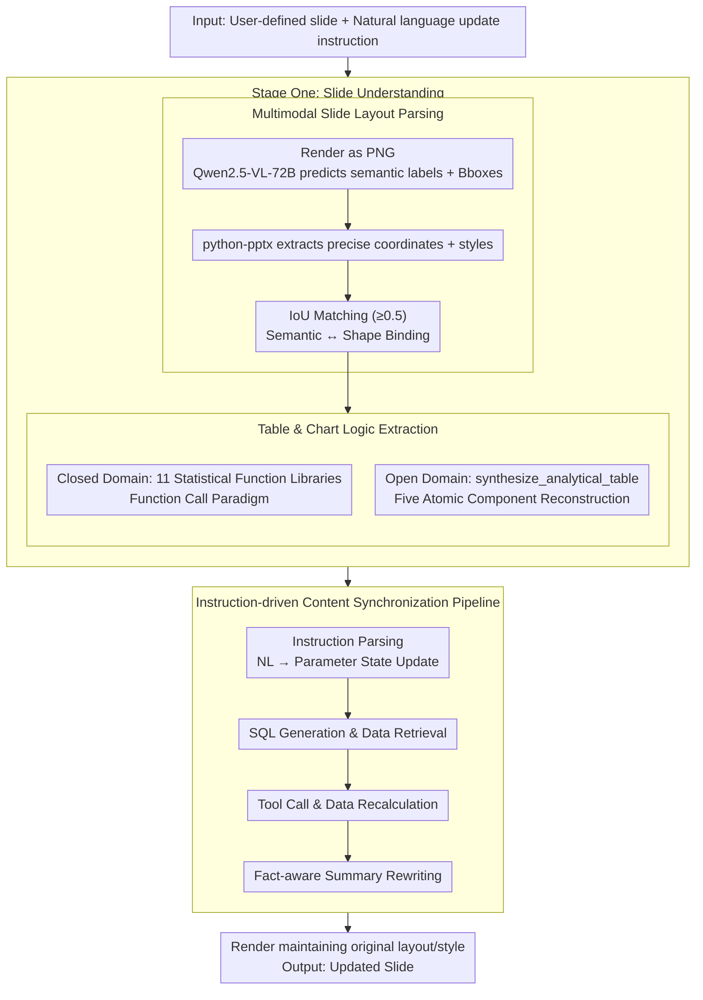

# Automatic Slide Updating with User-Defined Dynamic Templates and Natural Language Instructions

**Conference**: ACL 2026 Findings  
**arXiv**: [2604.17894](https://arxiv.org/abs/2604.17894)  
**Code**: [github](https://github.com/XiaoZhou2024/SlideAgent)  
**Area**: Multimodal/VLM  
**Keywords**: Automatic Slide Updating, Dynamic Templates, Natural Language Instructions, Multimodal Agent, Data-driven Reporting

## TL;DR

This work defines a new task of "dynamic slide updating on user-defined templates based on natural language instructions," constructs the DynaSlide benchmark containing 20,036 instruction-execution triples, and proposes SlideAgent as a strong reference baseline.

## Background & Motivation

**Background**: Presentation slides are the core medium for data-driven reporting, yet maintaining complex analytical slides remains extremely labor-intensive. Existing automation methods primarily adopt a fixed-template filling paradigm, which cannot support diverse user-defined slides.

**Limitations of Prior Work**: (1) In periodic business reports, updates usually involve only local data replacement and conclusion refining, but significant human effort is consumed in low-value "copy-paste-modify" workflows; (2) Existing methods are limited to injecting information from structured data sources into fixed templates and cannot handle complex slide structures created by users.

**Key Challenge**: The Bring Your Own Template (BYO-Template) scenario requires the system to understand the multimodal structure of arbitrary slides (titles, tables, charts, summaries, and their layouts/dependencies) while accurately mapping natural language update instructions to executable operations—which far exceeds simple value replacement.

**Goal**: To formally define the dynamic slide updating task, construct a large-scale benchmark dataset, and propose an Agent baseline system.

**Key Insight**: Building a controllable template family based on real estate business analysis data to generate a large number of instruction-execution triples, supporting reproducible evaluation.

**Core Idea**: Slide updating is modeled as a closed-loop process of perception-reasoning-execution: first parsing the semantic structure and data logic of the slide, then updating data queries, recalculating statistical results, redrawing charts, and rewriting summaries according to natural language instructions, all while maintaining the original layout and style.

## Method

### Overall Architecture

SlideAgent adopts a two-stage architecture: Stage One (Slide Understanding) parses the input slide into a structured representation, capturing element positions, data sources, and functional logic; Stage Two (Instruction-driven Update) interprets user instructions, retrieves updated data, executes transformations, and regenerates content.

### Key Designs

**1. Multimodal Slide Layout Parsing: Restoring an "image" into a structured representation with semantic roles and precise coordinates.**

To update a user-defined template, the first step is to understand what components the slide consists of and their roles. Relying solely on a VLM to view the rendered image can identify "this is a title, that is a table header, and below is a summary," but it cannot provide pixel-perfect geometry and styling. Relying solely on `python-pptx` can extract precise coordinates and style metadata but lacks the semantic function of each shape. SlideAgent aligns and complements both: it first renders the slide as a PNG, uses Qwen2.5-VL-72B to predict semantic labels and bounding boxes, then uses `python-pptx` to extract precise coordinates and styles. Finally, it binds VLM semantic predictions with PPTX ground-truth shapes via IoU matching (threshold 0.5), resulting in a structured layout that is both semantically aware and geometrically precise.

**2. Table and Chart Logic Extraction (Closed/Open Domain): Inferring underlying data queries and aggregation logic from visual results.**

What is seen on a slide are rendered tables and charts; to update the data, one must know "how these numbers were calculated." SlideAgent infers this in two modes: in the closed domain, the LLM identifies the corresponding function and parameters from 11 predefined statistical function libraries, following a function-calling paradigm suitable for known templates. In the open domain, where predefined functions cannot cover arbitrary user-created analyses, a general `synthesize_analytical_table` interface is designed to reconstruct analysis logic into five atomic components: table structure type, headers, constraint specifications, source fields, and aggregation operations. These modes are complementary, ensuring precision for common templates while generalizing to arbitrary custom analyses.

**3. Instruction-driven Content Synchronization Pipeline: Mapping a single natural language instruction to end-to-end, diagnosable updates.**

Once the slide structure and data logic are understood, an instruction like "replace Q2 data with Q3 and update conclusions" must simultaneously trigger data queries, statistical recalculation, chart redrawing, and summary rewriting. SlideAgent breaks this into a four-step pipeline: Instruction Parsing (mapping NL to parameter state updates) → SQL Generation & Data Retrieval → Tool Execution & Data Recalculation → Fact-aware Summary Rewriting and Final Rendering. This process maintains the original layout and style throughout. Breaking the process into independently evaluable sub-modules allows for precise error localization (experiments revealed that summary rewriting is the primary bottleneck).

### A Complete Example: Updating a Quarterly Real Estate Analysis Slide

Consider a "Q2 Regional Transaction Analysis" slide with the instruction "Update to Q3 data":

1.  **Layout Parsing**: Rendered as PNG, the VLM recognizes the top title, a transaction price table in the center, a bar chart on the right, and a text summary at the bottom; `python-pptx` provides precise coordinates and color schemes; IoU matching binds the "center area" as "Table + Table Title."
2.  **Logic Extraction**: Infers that the bar chart is based on `AVG(price) GROUP BY district` and the table summarizes transaction volume. If the template is within the 11 predefined functions, it is matched directly; otherwise, it is reconstructed using `synthesize_analytical_table`.
3.  **Instruction Parsing**: Parses "Update to Q3" into a parameter state update—changing the time filter from `quarter = 'Q2'` to `'Q3'`, keeping other dimensions constant.
4.  **Data Retrieval & Recalculation**: Generates SQL to fetch raw Q3 data and calls tools to recalculate average prices and volumes for each district.
5.  **Redrawing & Rewriting**: Redraws the bar chart with new values, refills the table, and performs fact-aware summary rewriting (changing "Q2 average price increased" to a conclusion consistent with Q3 figures). Finally, the updated slide is rendered following the original layout.

The layout parsing is the most stable (99.5% accuracy in the open domain), while step 5, summary rewriting, is the most error-prone (68.44%), serving as the main bottleneck for end-to-end success.

### Loss & Training

The proposed method is primarily based on LLM inference rather than training. Evaluation uses Success Rate (SR, the proportion of generated slides that perfectly match the ground truth in content and layout) and element-level accuracy.

## Key Experimental Results

### Main Results

| Model | Closed Domain SR (%) | Open Domain SR (%) |
| :--- | :--- | :--- |
| GPT-OSS-120B | 80.64 | 68.86 |
| Qwen3-80B | 75.33 | 63.91 |
| GPT-OSS-20B | 69.20 | 56.25 |
| Qwen3-30B | 71.40 | 59.69 |
| Qwen3-14B | 45.48 | 31.13 |

### Ablation Study

| Module (GPT-OSS-120B, Open Domain) | Accuracy (%) | Description |
| :--- | :--- | :--- |
| Layout Parsing | 99.5 | Most stable module |
| Function Logic Extraction | 88.34 | High accuracy |
| Data Source Extraction | 90.37 | High accuracy |
| Summary Update | 68.44 | Largest bottleneck |
| End-to-End Task SR | 68.86 | Error accumulation effect |

### Key Findings
*   Model scale is strongly correlated with task performance: GPT-OSS-120B outperforms the 20B version by 11-12 percentage points, and Qwen3-80B outperforms the 14B version by approximately 30 percentage points.
*   Open-domain scenarios consistently lead to performance degradation, with a larger impact on smaller models (Qwen3-14B shows a relative decrease of 31.5%).
*   Summary updating is the primary bottleneck (68.44%), significantly lower than logic extraction (88.34%)—models can effectively extract calculation logic, but translating quantitative updates into coherent natural language conclusions remains a fundamental challenge.
*   Task difficulty varies significantly with the theme: Simple table structures (Theme 1: 90.12%) vs. complex cross-dimensional aggregation (Theme 4: 77.03%).

## Highlights & Insights
*   The new task definition has significant practical value—periodic report updates are a real and high-frequency demand in enterprises.
*   The DynaSlide benchmark design is ingenious: controllable template families ensure verifiable ground truth, and YAML metadata supports reproducible end-to-end evaluation.
*   The comparison between closed and open domains effectively reveals the boundaries of model generalization capabilities.
*   The module-level evaluation protocol provides a clear diagnostic framework for identifying error bottlenecks.

## Limitations & Future Work
*   Only covers the real estate domain, although the core mechanism is domain-agnostic.
*   Uses controllable templates rather than entirely "in-the-wild" slides, sacrificing some stylistic diversity for verifiability.
*   Assumes slide elements can be linked to a structured database; it does not handle "cold start" problems (reconstructing a database from static slides).
*   Does not handle decorative graphics or conceptual diagrams.

## Related Work & Insights
*   **vs. AutoPresent/PPTAgent**: These focus on one-time document-to-slide generation, whereas Ours focuses on dynamic updates on user-defined templates.
*   **vs. Traditional Template Filling**: Those use fixed predefined templates and cannot handle complex layouts created by users.
*   **vs. LLM Agent Methods (e.g., Yao et al.)**: Those update surface content but cannot reconstruct underlying computational dependencies.

## Rating
*   Novelty: ⭐⭐⭐⭐⭐ First to formally define the dynamic slide updating task, opening a new direction.
*   Experimental Thoroughness: ⭐⭐⭐⭐ Multi-model, multi-theme, module-level evaluation, though limited to a single domain.
*   Writing Quality: ⭐⭐⭐⭐ Clear task definition and detailed dataset construction process.
*   Value: ⭐⭐⭐⭐ High practical utility; the benchmark dataset provides a lasting contribution to the community.

<!-- RELATED:START -->

## Related Papers

- [\[CVPR 2026\] CodeMMR: Bridging Natural Language, Code, and Image for Unified Retrieval](../../CVPR2026/multimodal_vlm/codemmr_bridging_natural_language_code_and_image_for_unified_retrieval.md)
- [\[CVPR 2026\] Interactive Episodic Memory with User Feedback](../../CVPR2026/multimodal_vlm/interactive_episodic_memory_with_user_feedback.md)
- [\[ACL 2025\] Aria-UI: Visual Grounding for GUI Instructions](../../ACL2025/multimodal_vlm/aria-ui_visual_grounding_for_gui_instructions.md)
- [\[ICCV 2025\] Global and Local Entailment Learning for Natural World Imagery](../../ICCV2025/multimodal_vlm/global_and_local_entailment_learning_for_natural_world_imagery.md)
- [\[CVPR 2025\] Ground-V: Teaching VLMs to Ground Complex Instructions in Pixels](../../CVPR2025/multimodal_vlm/ground-v_teaching_vlms_to_ground_complex_instructions_in_pixels.md)

<!-- RELATED:END -->
