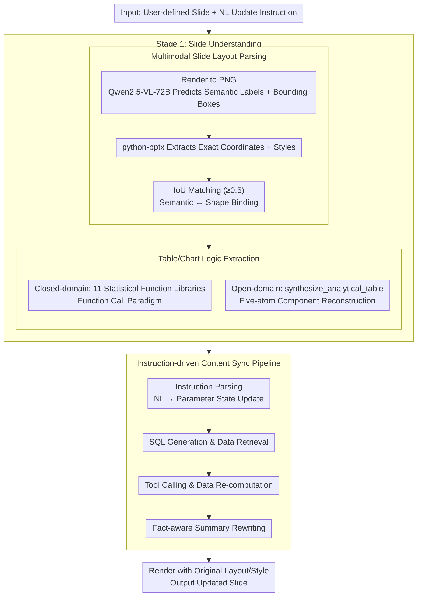

# Automatic Slide Updating with User-Defined Dynamic Templates and Natural Language Instructions

**Conference**: ACL 2026 Findings  
**arXiv**: [2604.17894](https://arxiv.org/abs/2604.17894)  
**Code**: [github](https://github.com/XiaoZhou2024/SlideAgent)  
**Area**: Multimodal/VLM  
**Keywords**: Slide auto-updating, Dynamic templates, Natural language instructions, Multimodal Agent, Data-driven reporting

## TL;DR

Defines the new task of "dynamic slide updating on user-defined templates based on natural language instructions," constructs the DynaSlide benchmark containing 20,036 instruction-execution triplets, and proposes SlideAgent as a strong reference baseline.

## Background & Motivation

**Background**: Presentation slides serve as the core medium for data-driven reporting, yet maintaining complex analytical slides remains extremely labor-intensive. Existing automation methods primarily adopt a fixed-template filling paradigm, which fails to support diverse user-defined slides.

**Limitations of Prior Work**: (1) In periodic business reports, updates usually involve only local data replacement and conclusion refinement, but significant human effort is consumed in low-value "copy-paste-modify" workflows; (2) Existing methods are limited to injecting information from structured data sources into fixed templates and cannot handle complex slide structures created by users.

**Key Challenge**: The bring-your-own-template (BYO-template) scenario requires the system to understand the multimodal structure of arbitrary slides (titles, tables, charts, summaries, and their layouts/dependencies) while accurately mapping natural language update instructions to executable operations—this goes far beyond simple value replacement.

**Goal**: To formally define the dynamic slide updating task, construct a large-scale benchmark dataset, and propose an Agent baseline system.

**Key Insight**: Building a controllable template family based on real-world real estate business analysis data to generate a large number of instruction-execution triplets, supporting reproducible evaluation.

**Core Idea**: Modeling slide updating as a closed-loop process of perception-reasoning-execution: first parsing the semantic structure and data logic of the slide, then updating data queries, recomputing statistical results, redrawing charts, and rewriting summaries based on natural language instructions, all while maintaining the original layout and style.

## Method

### Overall Architecture

SlideAgent adopts a two-stage architecture: Stage 1 (Slide Understanding) parses the input slide into a structured representation capturing element positions, data sources, and functional logic; Stage 2 (Instruction-driven Update) interprets user instructions, retrieves updated data, executes transformations, and regenerates content.

### Key Designs

**1. Multimodal Slide Layout Parsing: Restoring an "image" into a structured representation with semantic roles and precise coordinates**

To update a user-defined template, the first step is to understand which components make up the slide and their respective roles. Relying solely on a VLM to view the rendered image can identify "this is a title, that is a table title, and the bottom is a summary," but it cannot provide pixel-perfect geometry and styles. Conversely, parsing via `python-pptx` yields precise coordinates and style metadata but lacks semantic functional context. SlideAgent aligns and complements both: it first renders the slide as a PNG, uses Qwen2.5-VL-72B to predict semantic labels and bounding boxes for each element, and then uses `python-pptx` to extract precise coordinates and styles. Finally, it binds VLM semantic predictions to PPTX ground-truth shapes via IoU matching (threshold 0.5), resulting in a structured layout that is both semantically aware and geometrically precise.

**2. Table and Chart Logic Extraction (Closed/Open Domain): Back-inferring underlying data queries and aggregation logic from presented results**

What is seen on a slide are processed tables and charts; to update the data, one must know "how these numbers were calculated." SlideAgent back-infers this in two modes: In the closed-domain mode, it lets the LLM identify corresponding functions and parameters from 11 predefined statistical function libraries, following a function-calling paradigm suitable for known templates. In the open-domain mode, where predefined functions cannot cover arbitrary user-created analyses, it designs a general `synthesize_analytical_table` interface. This interface reconstructs analysis logic by deconstructing it into five atomic components: table structure type, headers, constraint specifications, source fields, and aggregation operations. These two modes complement each other, ensuring accuracy on common templates while generalizing to arbitrary custom analyses.

**3. Instruction-driven Content Sync Pipeline: Executing end-to-end, diagnosable updates from a single NL instruction**

Once the slide structure and data logic are understood, an instruction like "replace Q2 data with Q3 and update conclusions" must simultaneously trigger data queries, statistical re-computation, chart redrawing, and summary rewriting; a single error can propagate. SlideAgent breaks this into a four-step pipeline: instruction parsing (mapping NL to parameter state updates) → SQL generation and data retrieval → tool calling and data re-computation → fact-aware summary rewriting and final rendering. This process maintains the original layout and style throughout. Decomposing the process into independently evaluable sub-modules allows for precise identification of failures (experiments revealed summary rewriting as the primary bottleneck).

### A Complete Example: Updating a Quarterly Real Estate Analysis Slide

Taking a "Q2 Regional Transaction Analysis" slide with the instruction "update to Q3 data":

1.  **Layout Parsing**: Rendered as PNG, the VLM identifies a top title, a transaction price table in the middle, a bar chart on the right, and a text summary at the bottom. `python-pptx` provides precise coordinates and color schemes for each shape. IoU matching (≥0.5) binds the "middle area" as "Table + Table Title."
2.  **Logic Extraction**: Back-infers that the bar chart is based on `AVG(price) GROUP BY district` and the table summarizes transaction volume. If the template is within the 11 predefined functions, it is hit via function call; otherwise, the aggregation logic is reconstructed from five atomic components via `synthesize_analytical_table`.
3.  **Instruction Parsing**: Parses "update to Q3" into parameter state updates—the time filter `quarter = 'Q2'` is rewritten as `'Q3'`, while other dimensions remain unchanged.
4.  **Data Retrieval & Re-computation**: Generates SQL to fetch Q3 raw data and calls tools to recompute average prices and volumes for each district.
5.  **Redrawing & Rewriting**: Redraws the bar chart with new values, backfills the table, and performs fact-aware summary rewriting (e.g., changing "Q2 price rose QoQ" to a conclusion consistent with Q3 figures). Finally, the updated slide is rendered following the original layout and style.

In the entire chain, layout parsing is the most stable (99.5% open-domain accuracy), while summary rewriting in step 5 is the most error-prone (68.44%), serving as the main bottleneck for end-to-end success.

### Loss & Training

The proposed method is primarily based on LLM reasoning rather than training. Evaluation uses Task Success Rate (SR, the proportion of generated slides that perfectly match the ground truth in content and layout) and element-level accuracy.

## Key Experimental Results

### Main Results

| Model | Closed-domain SR (%) | Open-domain SR (%) |
|------|-------------|-------------|
| GPT-OSS-120B | 80.64 | 68.86 |
| Qwen3-80B | 75.33 | 63.91 |
| GPT-OSS-20B | 69.20 | 56.25 |
| Qwen3-30B | 71.40 | 59.69 |
| Qwen3-14B | 45.48 | 31.13 |

### Ablation Study

| Module (GPT-OSS-120B, Open-domain) | Accuracy (%) | Description |
|---------------------------|-----------|------|
| Layout Parsing | 99.5 | Most stable module |
| Function Logic Extraction | 88.34 | High accuracy |
| Data Source Extraction | 90.37 | High accuracy |
| Summary Update | 68.44 | Largest bottleneck |
| End-to-End Task SR | 68.86 | Error accumulation effect |

### Key Findings
- Model scale is strongly correlated with task performance: GPT-OSS-120B outperforms the 20B version by 11-12 percentage points; Qwen3-80B outperforms the 14B version by approximately 30 percentage points.
- Open-domain scenarios consistently lead to performance degradation, with a significantly larger impact on smaller models (Qwen3-14B relative drop of 31.5%).
- Summary updating is the primary bottleneck (68.44%), significantly lower than logic extraction (88.34%)—models can effectively extract computational logic, but translating quantitative updates into coherent natural language conclusions remains a fundamental challenge.
- Task difficulty varies significantly by theme: Simple table structures (Theme 1: 90.12%) vs. complex cross-dimensional aggregation (Theme 4: 77.03%).

## Highlights & Insights
- The new task definition has significant practical value—periodic report updating is a real and high-frequency requirement in enterprises.
- The DynaSlide benchmark is cleverly designed: the controllable template family ensures verifiable ground truth, while YAML metadata supports reproducible end-to-end evaluation.
- The comparative design of closed-domain vs. open-domain effectively reveals the boundaries of model generalization capabilities.
- The module-level evaluation protocol provides a clear diagnostic framework for identifying error bottlenecks.

## Limitations & Future Work
- Currently covers only the real estate domain, although the core mechanism is domain-agnostic.
- Uses controllable templates rather than entirely "in-the-wild" slides, sacrificing some stylistic diversity for verifiability.
- Assumes slide elements can be linked to structured databases and does not address the "cold start" problem (reconstructing a database from static slides).
- Does not handle decorative graphics or purely conceptual diagrams.

## Related Work & Insights
- **vs. AutoPresent/PPTAgent**: These focus on one-time document-to-slide generation, whereas Ours focuses on dynamic updating on user-defined templates.
- **vs. Traditional template filling**: These use fixed predefined templates and cannot handle complex layouts created by users.
- **vs. LLM Agent methods (e.g., Yao et al.)**: These update surface content but cannot reconstruct underlying computational dependencies.

## Rating
- Novelty: ⭐⭐⭐⭐⭐ First formal definition of the dynamic slide updating task, opening a new direction.
- Experimental Thoroughness: ⭐⭐⭐⭐ Multi-model, multi-theme, module-level evaluation, though limited to a single domain.
- Writing Quality: ⭐⭐⭐⭐ Clear task definition and detailed dataset construction process.
- Value: ⭐⭐⭐⭐ Strong task utility; the benchmark dataset provides a lasting contribution to the community.

<!-- RELATED:START -->

## Related Papers

- [\[CVPR 2026\] CodeMMR: Bridging Natural Language, Code, and Image for Unified Retrieval](../../CVPR2026/multimodal_vlm/codemmr_bridging_natural_language_code_and_image_for_unified_retrieval.md)
- [\[CVPR 2026\] Interactive Episodic Memory with User Feedback](../../CVPR2026/multimodal_vlm/interactive_episodic_memory_with_user_feedback.md)
- [\[ACL 2025\] Aria-UI: Visual Grounding for GUI Instructions](../../ACL2025/multimodal_vlm/aria-ui_visual_grounding_for_gui_instructions.md)
- [\[ICCV 2025\] Global and Local Entailment Learning for Natural World Imagery](../../ICCV2025/multimodal_vlm/global_and_local_entailment_learning_for_natural_world_imagery.md)
- [\[CVPR 2025\] Ground-V: Teaching VLMs to Ground Complex Instructions in Pixels](../../CVPR2025/multimodal_vlm/ground-v_teaching_vlms_to_ground_complex_instructions_in_pixels.md)

<!-- RELATED:END -->
