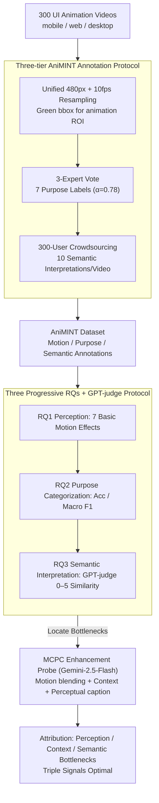

# Beyond Screenshots: Evaluating VLMs' Understanding of UI Animations

**Conference**: ACL 2026 Findings  
**arXiv**: [2604.26148](https://arxiv.org/abs/2604.26148)  
**Code**: <https://github.com/publicationacc/AniMINT>  
**Area**: Multimodal VLM / UI Understanding / Evaluation  
**Keywords**: UI Animation, VLM Evaluation, AniMINT, Rhetorical Structure, Motion Blending

## TL;DR
This work constructs AniMINT, the first evaluation set for UI animation understanding (300 densely annotated animation videos + 3 experts + 300 user annotations). After systematically testing nine SOTA VLMs, it was found that while basic motion effects are recognizable, significant gaps remain in functional classification and high-level semantic interpretation compared to humans. Furthermore, enhancing Gemini-2.5-Flash with Motion-Context-Perceptual Cues (MCPC) simultaneously improves classification and interpretation performance.

## Background & Motivation

**Background**: UI agents (GPT-Operator, Mind2Web, etc.) require a comprehensive perception of user interfaces. However, existing VLM research on UI understanding focuses almost exclusively on static screenshots—button identification, layout parsing, UI semantics, etc.

**Limitations of Prior Work**: Animations in modern UIs serve as core communicative functions rather than mere decorations—MacOS dock bouncing conveys notifications, password field shaking indicates input errors, and loading animations suggest status progress. This information is often captured only in motion and missed by static frames. If VLM agents can only process screenshots, they lose approximately 30-50% of the feedback channels between users and systems.

**Key Challenge**: "The meaning of animation is in the motion, not in the drawing" ("motion that is drawn, not drawings that move"). However, VLM inputs are typically single frames or sparse video samplings—structurally making it difficult to capture brief, spatially localized, and semantically abstract UI motions.

**Goal**: (1) Provide the first UI animation evaluation set covering mobile, web, and desktop platforms, with three-tier annotations: motion effects, functional purposes, and semantic interpretations; (2) Systematically test the capability ceilings of nine mainstream VLMs; (3) Explore which signal enhancements (motion blending / context / caption) significantly improve performance.

**Key Insight**: Starting from existing UI/UX taxonomies (7 purpose categories × 7 basic motion effects), a multi-layered annotation was constructed. Simultaneously, 3 experts provided purpose labels, and 300 Prolific users provided 10 independent natural language interpretations for each animation, forming both expert and crowd perspectives.

**Core Idea**: By aligning the evaluation design directly with the vocabulary of the UI design community, it is possible to measure both whether VLMs can perceive motion and whether they can understand why the animation exists as humans do.

## Method

### Overall Architecture
This work is divided into two phases: (1) **AniMINT Dataset Construction**—300 UI animation videos (primarily mobile: Top 100 App Store/Google Play apps) + multi-layered annotations (temporal range, ROI, interaction context, purpose category, and 10 independent semantic interpretations); (2) **Systematic VLM Evaluation + Enhancement Exploration**—evaluating 9 VLMs across three RQs: recognition of basic motion effects (RQ1), classification of animation purposes (RQ2), and interpretation of animation semantics (RQ3). Subsequently, the MCPC three-factor probe was used to locate bottlenecks and verify enhancement effects.

### Key Designs

**1. Three-tier AniMINT Annotation Protocol: Supporting low/mid/high granularity evaluation on the same animation to identify the exact bottleneck layer.**

A single purpose label cannot fully express the rich semantics of an animation, nor can it answer whether a VLM fails because it cannot see the motion or because it sees it but misses the meaning. The protocol ensures each animation carries three layers of annotation. All videos are unified to 480px resolution at 10 fps, with a green bounding box (bbox) highlighting the animation ROI to minimize interference. Subsequently, 3 UI/UX experts selected a label from 7 categories (Transition, Demonstration, Guidance, Feedback, Visualization, Highlight, Aesthetic) via majority vote ($\alpha=0.78$ consistency before consensus discussion). Concurrently, 300 Prolific users each annotated 10 videos, resulting in 10 independent natural language interpretations per video (3,000 total responses). All videos were manually screened for sensitive or harmful content before uploading. This "expert purpose + crowd semantics" dual-perspective preserves fine-grained professional judgment and reflects the natural diversity of human understanding—the 10 independent interpretations also allow for characterization of "semantic alignment distributions."

**2. Three Progressive RQs + GPT-judge Evaluation Protocol: Decomposing "understanding animation" into three independently quantifiable questions.**

To locate bottlenecks, the protocol sets three progressive sub-questions. RQ1 measures perception: using a static square with a single motion overlay as a controlled stimulus, covering 7 geometric motion effects (move, rotate, size, color, fade, blur, morph), with option randomization over 10 trials. RQ2 measures purpose classification: feeding the animation along with context (app/task), user input (action type), and the green bbox to the model, reporting accuracy and macro F1. RQ3 measures semantic interpretation: having the VLM generate free-form text, then calculating a semantic similarity score (0–5) against human responses via GPT-5-mini. The prompt strictly controls output length to avoid scoring bias, and GPT-5 is used to summarize the 10 human responses into a single "consensus response" for alignment. GPT-judge with a unified rubric (5=equivalent / 0=irrelevant) is used as it captures semantic alignment better than surface metrics like BLEU.

**3. Motion-Context-Perceptual Cue (MCPC) Enhancement Probe: Using three complementary signals to identify the stage of failure.**

To determine if a model fails due to a lack of motion perception, contextual understanding, or high-level semantics, the MCPC probe injects specific signals for attribution. It decomposes "VLM animation viewing" into: **Motion blending** (overlaying the last 6 frames with decreasing opacity into one image, inspired by Phosphor afterglow, effectively "drawing" the trajectory to bypass inter-frame reasoning bottlenecks); **Context** (interaction context and user input); and **Perceptual caption** (explicitly stating what motion occurred via text). Using Gemini-2.5-Flash as the backbone, combinations of M/C/P were tested against RQ2 and RQ3. If a specific enhancement is effective, the bottleneck is localized to that layer; if only the combination of all three is optimal, it indicates a strong synergy between perception, context, and semantics.

### Loss & Training
This is a zero-shot evaluation paper; no models were trained. All 9 VLMs were used with default temperature settings through OpenRouter for closed-source models and local inference for open-source models. Context lengths ranged from 64K (GLM-4.5V) to 1M (Gemini-2.5-Pro).

## Key Experimental Results

### Main Results: RQ2 Purpose Classification (Accuracy + Macro F1)

| Model | Accuracy | Macro F1 |
|------|----------|----------|
| Gemini-2.5-Pro | **0.64** | **0.55** |
| GPT-5 | 0.64 | 0.53 |
| GPT-o4-mini | 0.63 | 0.51 |
| GPT-o3 | 0.62 | 0.54 |
| Gemini-2.5-Flash | 0.61 | 0.53 |
| GPT-5-mini | 0.58 | 0.48 |
| Claude-Sonnet-4 | 0.57 | 0.46 |
| GLM-4.5V | 0.45 | 0.40 |
| Qwen2.5-VL-72B | 0.39 | 0.32 |

The strongest model reached only 0.64, showing a significant gap from human performance. Per-category recall: Feedback (0.69), Visualization (0.69), and Guidance (0.59) were high, while Highlight (0.24) and Aesthetic (0.16) were poor—VLMs excel at functional animations with clear feedback but fail at "subtle" animations for emotion or branding.

### RQ3 Semantic Interpretation Similarity (vs Consensus, 0–5)

| Model | Mean | Std |
|------|------|-----|
| GPT-o3 | **3.47** | 0.91 |
| GPT-5 | 3.44 | 0.90 |
| Gemini-2.5-Pro | 3.40 | 0.90 |
| GPT-5-mini | 3.39 | 0.82 |
| Gemini-2.5-Flash | 3.31 | 0.95 |
| Claude-Sonnet-4 | 3.10 | 1.12 |
| Qwen2.5-VL-72B | 2.94 | 1.24 |
| GLM-4.5V | 2.71 | 1.47 |

Most models scored around 3—capturing the gist but missing key details or drifting in direction.

### Ablation Study: MCPC Ablation (Gemini-2.5-Flash)

| Enhancement | RQ2 Acc | RQ2 F1 | RQ3 Mean | RQ3 Std |
|------|---------|--------|----------|---------|
| Base | 0.59 | 0.47 | 3.15 | 1.09 |
| + Motion | 0.52 | 0.41 | 3.08 | 1.07 |
| + Context | 0.58 | 0.48 | 3.30 | 0.95 |
| + Perceptual | 0.57 | 0.45 | 3.50 | 0.89 |
| + M+P | 0.53 | 0.40 | 3.48 | 0.86 |
| + C+P | 0.55 | 0.46 | 3.48 | 0.77 |
| **+ M+C+P** | **0.61** | **0.52** | **3.52†** | **0.73** |

The combination of all three signals is significantly superior to any single or dual combination, confirming strong synergy across perception, context, and semantics.

### Key Findings
- **VLMs perceive motion but fail to interpret it**: In RQ1, 5/9 models perfectly identified 7 basic motions, but performance dropped significantly in RQ2/RQ3, suggesting the bottleneck is not low-level perception.
- **Error Pattern 1: Over-reliance on static final frames**: In a McDonald's animation (M-logo bouncing in), models misclassified it as "Feedback" because the final frame showed "Your order is confirmed," ignoring the "Aesthetic" nature of the motion.
- **Error Pattern 2: Failure on small ROIs**: ROI size averaged 24.3% in correct predictions vs 14.1% in errors; Mann-Whitney $p=0.03$ confirmed that smaller ROIs lead to more interference from surrounding elements.
- **Error Pattern 3: Ignoring interaction context**: When repeated swipe failures led to a demonstration animation, 8/9 models misclassified it as "Transition," failing to link the "failure gesture → instructional animation" sequence.
- **Subtle/Fast animations are missed**: 5/9 models reported "no animation" or hallucinated progress bars for brief password field vibrations.
- **Gemini-2.5-Pro shows hallucinations**: It occasionally fabricates "translucent rounded objects," consistent with known VLM hallucination literature.

## Highlights & Insights
- The definition "motion that is drawn, not drawings that move" accurately justifies why frame-level analysis is insufficient and why video-level evaluation is essential.
- The three-tier evaluation (Motion → Purpose → Semantics) provides a precise diagnostic framework that can be applied to other VLM perception tasks.
- Motion blending leverages the "Phosphor afterglow" trick (stacking transparency) to compress dynamic video into a single image, cleverly bypassing VLM inter-frame reasoning limits.
- The discovery of "shallow persona detection" (recognizing existence but not purpose) aligns with HCI persona studies, suggesting a common failure mode in fine-grained distinction tasks for VLMs.
- The dual-perspective annotation (experts for taxonomy, crowd for semantic diversity) ensures both rigorous classification and representative interpretation.

## Limitations & Future Work
- Data is primarily from US-based apps with English interfaces, lacking coverage for cultural or linguistic differences (e.g., RTL layouts, Asian stock market color conventions).
- All annotators were native US English speakers, potentially biasing semantic interpretations.
- Only 9 SOTA VLMs were tested; smaller models (7-14B) were almost entirely incapable of the task due to context or frame limits.
- The MCPC probe was only validated on Gemini-2.5-Flash; transferability to other models remains unverified.
- ROIs were enforced via green bboxes; real-world deployment would require the VLM to self-locate the ROI, which is significantly more difficult.

## Related Work & Insights
- **vs Rico / MONDAY / GUI World**: Unlike these datasets which focus on UI screenshots or interaction logs, AniMINT is the first specifically designed for and annotated with animation semantics.
- **vs HCI Research (Mackamul 2025 / Dessart 2011)**: While those studies measured human perception, this work introduces their taxonomies to VLM evaluation, bridging HCI and NLP.
- **vs General VLM Agent Benchmarks (OSWorld / WebWalker)**: While those benchmarks measure end-to-end task completion, this work measures fine-grained perception. If an agent cannot understand animation feedback, end-to-end failures become difficult to diagnose; this work provides the diagnostic tool.

## Rating
- Novelty: ⭐⭐⭐⭐⭐ First systematic focus on UI animation understanding; the taxonomy, motion blending, and MCPC probe are highly original.
- Experimental Thoroughness: ⭐⭐⭐⭐ Covering 9 SOTA VLMs across 3 RQs with exhaustive MCPC combinations and detailed quantitative error analysis.
- Writing Quality: ⭐⭐⭐⭐⭐ Excellent use of examples (McDonald's, vibrating password fields) to make abstract failure modes intuitive.
- Value: ⭐⭐⭐⭐⭐ Addresses a major blind spot in UI agent research; the 3,000 human interpretations and tiered annotations are a rare and valuable resource for dynamic UI research.

<!-- RELATED:START -->

## Related Papers

- [\[ACL 2026\] Measuring What Matters Beyond Text: Evaluating Multimodal Summaries by Quality, Alignment, and Diversity (MM-Eval)](measuring_what_matters_beyond_text_evaluating_multimodal_summaries_by_quality_al.md)
- [\[ACL 2026\] Long Story Short: Disentangling Compositionality and Long-Caption Understanding in Contrastive VLMs](long_story_short_disentangling_compositionality_and_long-caption_understanding_i.md)
- [\[ACL 2026\] Do MLLMs Capture How Interfaces Guide User Behavior? A Benchmark for Multimodal UI/UX Design Understanding](do_mllms_capture_how_interfaces_guide_user_behavior_a_benchmark_for_multimodal_u.md)
- [\[CVPR 2026\] UI-Lens: Assessing General MLLMs' Potential to Automate UI Display Quality Assurance](../../CVPR2026/multimodal_vlm/ui-lens_assessing_general_mllms_potential_to_automate_ui_display_quality_assuran.md)
- [\[CVPR 2026\] VS-Bench: Evaluating VLMs for Strategic Abilities in Multi-Agent Environments](../../CVPR2026/multimodal_vlm/vs_bench_evaluating_vlms_for_strategic_abilities_in_multi_agent_environments.md)

<!-- RELATED:END -->
