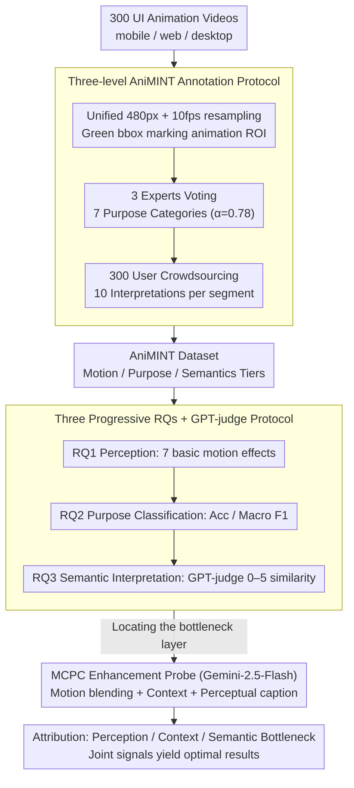

# Beyond Screenshots: Evaluating VLMs' Understanding of UI Animations

**Conference**: ACL 2026 Findings  
**arXiv**: [2604.26148](https://arxiv.org/abs/2604.26148)  
**Code**: <https://github.com/publicationacc/AniMINT>  
**Area**: Multimodal VLM / UI Understanding / Evaluation  
**Keywords**: UI Animation, VLM Evaluation, AniMINT, Rhetorical Structure, motion blending

## TL;DR
This work constructs the first UI animation evaluation dataset, AniMINT (300 densely annotated animation videos + 3 experts + 300 user annotations). Systematic testing of 9 SOTA VLMs reveals that while basic motion effects can be identified, there is a massive gap between models and humans in animation purpose classification and high-level semantic interpretation. Furthermore, enhancement using the Motion-Context-Perceptual Cue (MCPC) concurrently improves both classification and interpretation performance on Gemini-2.5-Flash.

## Background & Motivation

**Background**: UI agents (GPT-Operator, Mind2Web, etc.) need to perceive user interfaces comprehensively. However, existing VLM research on UI understanding focuses almost exclusively on static screenshots—button recognition, layout parsing, and UI semantics.

**Limitations of Prior Work**: Animations in modern UIs serve as core communication functions rather than mere decoration; for instance, the macOS dock bounce conveys notifications, a shaking password box indicates input errors, and loading animations suggest status progress. This information is often contained only within the animation and cannot be captured by static frames. If VLM agents only see screenshots, they miss approximately 30-50% of the feedback channels between the user and the system.

**Key Challenge**: "The meaning of animation is in the motion, not in the frames" ("motion that is drawn, not drawings that move"). However, VLM inputs are typically single frames or sparsely sampled videos, which are structurally ill-suited to capture transient, spatially localized, and semantically abstract UI motions.

**Goal**: (1) Provide the first UI animation evaluation dataset covering mobile, web, and desktop platforms with three levels of annotation: motion effects, functional purposes, and semantic interpretations; (2) Systematically measure the capability ceiling of 9 mainstream VLMs; (3) Explore which signal enhancements (motion blending, context, or captions) can significantly improve performance.

**Key Insight**: Building on existing UI/UX taxonomies (7 categories of purposes × 7 types of basic motion effects), this work constructs multi-level annotations. It recruits 3 experts for purpose labeling and 300 Prolific users to provide 10 independent natural language interpretations for each animation, forming a dual expert-crowd perspective.

**Core Idea**: The evaluation design aligns directly with the linguistic framework of the UI design community, allowing for measurements of both "whether VLMs can perceive motion" and "whether VLMs can understand why the animation exists like a human."

## Method

### Overall Architecture
This work proceeds in two stages: (1) **AniMINT Dataset Construction**—300 UI animation videos (primarily mobile: Top 100 App Store/Google Play apps) with multi-level annotations (temporal range, ROI, interaction context, purpose category, and 10 independent semantic interpretations); (2) **Systematic VLM Evaluation + Enhancement Exploration**—investigating 9 VLMs across three RQs: identifying basic motion effects (RQ1), classifying animation purposes (RQ2), and interpreting animation semantics (RQ3). Subsequently, the MCPC three-factor probe is used to locate bottlenecks and verify enhancement effects.

### Key Designs

**1. Three-level AniMINT Annotation Protocol: Supporting low/medium/high granularity evaluation to identify exact bottlenecks.**

A single purpose label cannot express the rich semantics of an animation, nor can it answer whether a VLM "cannot see the motion" or "sees it but does not understand the meaning." The protocol thus attaches three layers of annotation to each animation. All videos are first unified to 480px resolution at 10 fps, with a green bbox marking the ROI to reduce interference. Subsequently, 3 UI/UX experts selected one of 7 purposes (Transition, Demonstration, Guidance, Feedback, Visualization, Highlight, Aesthetic) via majority vote ($\alpha=0.78$), with discussions to reach consensus. Simultaneously, 300 Prolific users labeled 10 videos each, resulting in 10 independent natural language interpretations per video (3,000 total user responses). This dual "expert purpose + crowd semantics" perspective preserves fine-grained professional judgment while reflecting the natural diversity of user understanding.

**2. Three Progressive RQs + GPT-judge Evaluation Protocol: Decomposing "animation understanding" into quantifiable questions.**

General "animation understanding" is too broad, so the protocol sets three sub-questions. RQ1 measures perception using a static square with a single motion as a controlled stimulus, covering 7 geometric effects (move, rotate, size, color, fade, blur, morph). RQ2 measures classification by feeding the animation alongside context (app/task), user input (action type), and the green bbox to the model. RQ3 measures interpretation by having VLMs generate free text, which is compared to human responses via a 0–5 semantic similarity score judged by GPT-5-mini. The judge uses a unified rubric (5=equivalent, 0=irrelevant) to capture semantic alignment better than surface metrics like BLEU.

**3. Motion-Context-Perceptual Cue (MCPC) Enhancement Probe: Using supplementary signals to reverse-engineer failures.**

To determine if a model fails because it cannot "see motion," "understand context," or "grasp semantics," signals are injected for attribution. MCPC decomposes VLM animation viewing into: **Motion blending** (stacking the last 6 frames with decreasing opacity into one image, inspired by Phosphor afterglow, effectively drawing the trajectory to bypass inter-frame reasoning bottlenecks); **Context** (interaction context and user input); and **Perceptual captions** (textual descriptions of what happens in the animation). Experiments used Gemini-2.5-Flash as the backbone, starting with a base sampling and incrementally adding combinations of M/C/P.

### Loss & Training
This is a zero-shot evaluation paper; no models were trained. All 9 VLMs were used with default temperature settings. Closed-source models were called via OpenRouter; open-source models were run locally. Context lengths ranged from 64K (GLM-4.5V) to 1M (Gemini-2.5-Pro).

## Key Experimental Results

### Main Results: RQ2 Purpose Classification (Accuracy + Macro F1)

| Model | Accuracy | Macro F1 |
|------|----------|----------|
| Gemini-2.5-Pro | **0.64** | **0.55** |
| GPT-5 | 0.64 | 0.53 |
| GPT-o4-mini | 0.63 | 0.51 |
| GPT-o3 | 0.62 | 0.54 |
| Gemini-2.5-Flash | 0.61 | 0.53 |
| GPT-5-mini | 0.58 | 0.48 |
| Claude-Sonnet-4 | 0.57 | 0.46 |
| GLM-4.5V | 0.45 | 0.40 |
| Qwen2.5-VL-72B | 0.39 | 0.32 |

The strongest model only reached 0.64, showing a significant gap from human levels. Per-category recall was high for Feedback (0.69) and Visualization (0.69), but very low for Highlight (0.24) and Aesthetic (0.16), suggesting VLMs struggle with "subtle" animations focused on emotion or branding.

### Interpretation Similarity (RQ3 vs. Consensus, 0-5)

| Model | Mean | Std |
|------|------|-----|
| GPT-o3 | **3.47** | 0.91 |
| GPT-5 | 3.44 | 0.90 |
| Gemini-2.5-Pro | 3.40 | 0.90 |
| GPT-5-mini | 3.39 | 0.82 |
| Gemini-2.5-Flash | 3.31 | 0.95 |
| Claude-Sonnet-4 | 3.10 | 1.12 |
| Qwen2.5-VL-72B | 2.94 | 1.24 |
| GLM-4.5V | 2.71 | 1.47 |

Most models scored around 3, capturing the gist but often missing key details or drifting in direction.

### Ablation Study: MCPC (Gemini-2.5-Flash)

| Enhancement | RQ2 Acc | RQ2 F1 | RQ3 Mean | RQ3 Std |
|------|---------|--------|----------|---------|
| Base | 0.59 | 0.47 | 3.15 | 1.09 |
| + Motion | 0.52 | 0.41 | 3.08 | 1.07 |
| + Context | 0.58 | 0.48 | 3.30 | 0.95 |
| + Perceptual | 0.57 | 0.45 | 3.50 | 0.89 |
| + M+P | 0.53 | 0.40 | 3.48 | 0.86 |
| + C+P | 0.55 | 0.46 | 3.48 | 0.77 |
| **+ M+C+P** | **0.61** | **0.52** | **3.52†** | **0.73** |

The combination of all three signals significantly outperformed any single or double signal combination, confirming strong synergy between perception, context, and semantics.

### Key Findings
- **VLMs see motion but fail to interpret**: In RQ1, 5/9 models answered all 7 basic motions correctly, but performance dropped significantly in RQ2/RQ3, suggesting the bottleneck is not in low-level perception.
- **Error Pattern 1: Over-reliance on static end frames**: In a McDonald's animation (Aesthetic bounce), models misjudged it as Feedback because the final frame contained "order confirmed" text.
- **Error Pattern 2: Small ROI failures**: The animation ROI significantly affected success (average size 24.3% for correct vs 14.1% for incorrect, Mann-Whitney $p=0.03$). Models are easily distracted by surrounding large elements.
- **Error Pattern 3: Ignoring interaction context**: When repeated swipe failures triggered a demonstration animation, 8/9 models misjudged it as a Transition, failing to link the "failed action" to the "instructional animation."
- **Subtle/Fast animations are missed**: Quick shaking animations were often reported as "no animation" or caused hallucinations of non-existent progress bars.
- **Gemini-2.5-Pro exhibits hallucination**: It sometimes fabricated descriptions of "translucent rounded objects" not present in the video.

## Highlights & Insights
- The definition of "motion that is drawn, not drawings that move" is poignant, justifying why video-level evaluation is essential.
- The three-level evaluation (Motion → Purpose → Semantics) provides a reusable methodology for locating bottlenecks in any VLM-based perception task.
- Motion blending—using the "Phosphor afterglow" trick—is a clever prompt engineering technique to compress dynamics into a single image.
- The dual-perspective annotation (experts for taxonomy, crowd for diversity) ensures both rigor and a reflection of real-world user variability.

## Limitations & Future Work
- Data is primarily from US-based apps with English interfaces, missing cultural/linguistic variations (e.g., RTL layouts or regional color conventions).
- Annotators were all native English speakers, introducing potential bias.
- Small models (7-14B) were excluded as they largely failed the task due to context length or image processing limits.
- MCPC probes were only validated on Gemini-2.5-Flash.
- ROI was provided via green bboxes; real-world deployment would require models to perform ROI localization themselves.

## Related Work & Insights
- **vs. Rico / MONDAY / GUI World**: While those datasets contain UI screenshots or recordings, AniMINT is the first specifically annotated for multi-level animation semantics.
- **vs. HCI Research**: This work bridges the gap between HCI/UX taxonomies and VLM evaluation.
- **vs. OSWorld / WebWalker**: While generic benchmarks measure end-to-end task completion, this work measures fine-grained perception, providing diagnostic utility for why an agent might fail to understand system feedback.

## Rating
- Novelty: ⭐⭐⭐⭐⭐ First systematic focus on UI animation understanding with novel MCPC probes and afterglow techniques.
- Experimental Thoroughness: ⭐⭐⭐⭐ Extensive testing across 9 VLMs, 3 RQs, and 8 combinations of cues with statistical validation.
- Writing Quality: ⭐⭐⭐⭐⭐ Excellent use of concrete examples (McDonald’s, password shake) to explain abstract failure modes.
- Value: ⭐⭐⭐⭐⭐ Vital for the era of UI agents; the 3,000 human interpretations are a rare and valuable resource for dynamic UI research.

<!-- RELATED:START -->

## Related Papers

- [\[ACL 2026\] Measuring What Matters Beyond Text: Evaluating Multimodal Summaries by Quality, Alignment, and Diversity (MM-Eval)](measuring_what_matters_beyond_text_evaluating_multimodal_summaries_by_quality_al.md)
- [\[ACL 2026\] Long Story Short: Disentangling Compositionality and Long-Caption Understanding in Contrastive VLMs](long_story_short_disentangling_compositionality_and_long-caption_understanding_i.md)
- [\[CVPR 2026\] Think360: Evaluating the Width-centric Reasoning Capability of MLLMs Beyond Depth](../../CVPR2026/multimodal_vlm/think_360_evaluating_the_width-centric_reasoning_capability_of_mllms_beyond_dept.md)
- [\[CVPR 2026\] VisRes Bench: On Evaluating the Visual Reasoning Capabilities of VLMs](../../CVPR2026/multimodal_vlm/visres_bench_on_evaluating_the_visual_reasoning_capabilities_of_vlms.md)
- [\[ACL 2026\] Do MLLMs Capture How Interfaces Guide User Behavior? A Benchmark for Multimodal UI/UX Design Understanding](do_mllms_capture_how_interfaces_guide_user_behavior_a_benchmark_for_multimodal_u.md)

<!-- RELATED:END -->
