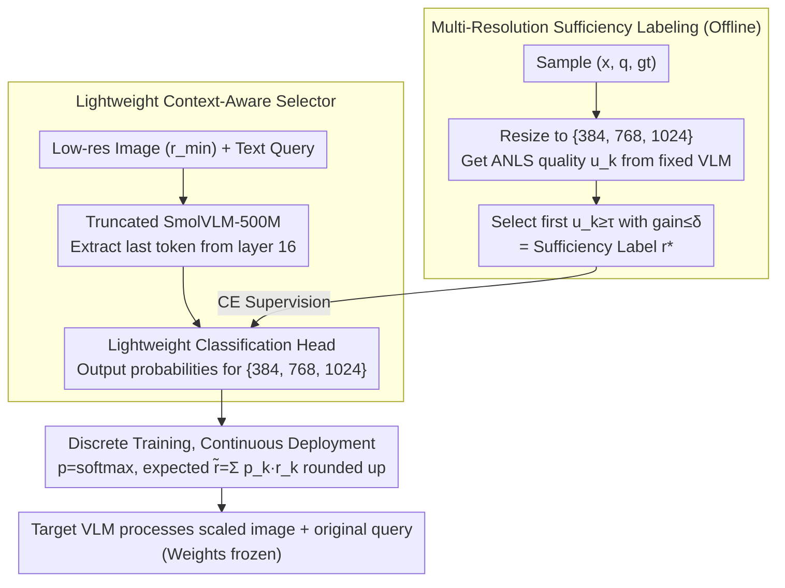

# CARES: Context-Aware Resolution Selector for VLMs

**Conference**: ACL2026 Oral  
**arXiv**: [2510.19496](https://arxiv.org/abs/2510.19496)  
**Code**: https://mkimhi.github.io/CARES/  
**Area**: Multimodal VLM / Inference Efficiency / Adaptive Resolution  
**Keywords**: Resolution Selection, Visual Token Compression, VLM Inference Acceleration, ANLS, Continuous Routing

## TL;DR
CARES adds a lightweight query-aware resolution selector before the target VLM. Using low-resolution images and text queries, it predicts the minimal input resolution "sufficient to answer." It maintains accuracy across 9 multimodal benchmarks while saving approximately 65–85% of prefill computational costs on average.

## Background & Motivation
**Background**: To cover tasks such as OCR, document understanding, natural image QA, and chart reasoning, general-purpose VLMs typically default to high-resolution or AnyRes/tiling inputs. Higher resolution leads to a greater number of visual tokens; in the prefill stage, visual tokens can account for up to 99% of the total tokens.

**Limitations of Prior Work**: Many user queries do not require high resolution. For example, "What is the breed of the dog?" might be answered with a low-res image, whereas "What name is written on the collar?" requires high resolution. Existing token pruning, pooling, and merging techniques mostly occur after visual encoding, meaning the high-resolution tokenization cost has already been paid. Furthermore, these methods are often unaware of the current text query.

**Key Challenge**: VLMs need high resolution to ensure quality on difficult samples, but processing all samples at the maximum resolution wastes significant compute. The truly controllable lever exists before tokenization: deciding how many pixels to use in the first place.

**Goal**: Learn a preprocessing module that can be placed before any VLM to predict the minimum sufficient resolution based on the image-query pair. This reduces visual tokens, FLOPS, TTFT, or API costs without modifying the target VLM architecture or weights.

**Key Insight**: Instead of directly predicting "hard/easy," the authors generate supervision using real-world response quality from the target VLM under multi-resolution rollouts. The lowest resolution that achieves sufficient quality is used as the label.

**Core Idea**: Shift the VLM inference efficiency problem forward to input resolution selection. By using query-conditioned sufficiency labels, the model learns to allocate pixels based on a "just enough" principle.

## Method
The primary version of CARES is a discriminative selector: it uses a truncated SmolVLM-500M to jointly encode the image and query at a low resolution, extracts the representation of the last token from an intermediate layer, and feeds it into a lightweight classification head to predict three resolution categories (384/768/1024). During inference, a continuous resolution is obtained through probability weighting.

### Overall Architecture
Before training, the authors perform multi-resolution labeling for samples $(x,q,gt)$: the image is resized to candidate resolutions and processed by a fixed VLM to obtain answers. These are evaluated using ANLS or corresponding metrics, and the minimum sufficient resolution is selected as the label. During training, CARES observes only the low-resolution image and query to learn this label. At deployment, CARES outputs a continuous resolution, and the target VLM only processes the scaled image and the original query.

### Key Designs

**1. Multi-Resolution Sufficiency Labeling: Defining "Sufficient Thresholds" via Target VLM Performance Curves**

The selector must learn "the minimum pixels required for this question." Since manual judgment is difficult, CARES lets the target model answer this: for each sample $(x,q,gt)$, images are resized to a discrete candidate set $\mathcal R_d=\{384,768,1024\}$. These are fed into a fixed VLM to calculate quality $u_k=ANLS(F(x^{(r_k)},q),gt)$. The label is the smallest $r_k$ that satisfies $u_k\ge\tau$ and ensuring the gain from further increasing resolution does not exceed $\delta$ (default $\tau=0.85$, $\delta=0.1$). This provides labels with "stop when performance converges" semantics.

**2. Lightweight Context-Aware Selector: Pre-judging Pixel Budget Before Large VLM Overhead**

Prediction must occur before expensive high-resolution tokenization. CARES uses a truncated SmolVLM-500M as a selector, retaining intermediate representations up to layer 16 and discarding the rest. It jointly encodes the low-resolution image ($r_{min}$) and the query. Using intermediate layers is beneficial as they often retain rich perceptual and semantic information. The query-aware joint encoding is crucial: the pixel requirements for "What breed is the dog?" versus "What name is on the collar?" for the same image are vastly different.

**3. Discrete Training, Continuous Deployment: Transforming Coarse Tiers into Fine-Grained Resolution via Probabilistic Weighting**

Three-tier labels are easy to train, but hard switching between 384/768/1024 during deployment could lead to excessive resolution increases near classification boundaries. CARES utilizes the classifier's probability distribution: trained for discrete classification, it calculates an expected continuous resolution $\tilde r=\sum_k p_k r_k$ using $p=softmax(\ell)$ during inference, then rounds up to the nearest size supported by the target backbone. This allows model uncertainty to participate in the compute-quality trade-off.

### Loss & Training
CARES uses an 80K training set (20K each from TextVQA, ChartQA, DocVQA, LLaVA-Multi), covering document and natural images. The main selector is trained for 6 epochs with a learning rate of $10^{-3}$, a batch size of 32, and cross-entropy loss $\mathcal L(\theta)=CE(f_\theta(z),r^*)$ with 0.05 label smoothing to support continuous resolution deployment. An autoregressive version using Granite-Docling-258M was also implemented using LoRA rank 8 for 3 epochs to predict `<1>/<2>/<3>` resolution tokens.

## Key Experimental Results

### Main Results

| Target VLM | Native Avg Score | CARES Avg Score | Avg Cost Change | Description |
|------------|---------------|--------------|--------------|------|
| Granite-Vision-2B | 0.59 | 0.60 | -63% | Accuracy slightly increases while cost drops significantly |
| InternVL3-8B | 0.77 | 0.77 | -64% | Performance maintained across benchmarks |
| Qwen2.5-VL-72B | 0.79 | 0.80 | -70% | Transferability demonstrated on large models |
| GPT-4o | 0.69 | 0.68 | -55% | API cost reduced with quality remaining stable |

| Benchmark Scope | Metric | CARES Setting |
|----------------|------|-------------|
| Ai2D / ChartQA / SeedBench-2 | exact-match accuracy | Evaluation of natural images, charts, and general VQA |
| DocVQA / OCRBench | ANLS | Testing high-res necessity in document/OCR scenarios |
| MMMU / RealWorldQA / InfoVQA / MathVista | task score | Cross-domain generalization testing |
| DocVQA latency frontier | TTFT / TFLOPs | CARES achieves native-level performance at ~2.58 TFLOPs vs. ~7.5 TFLOPs |

### Ablation Study

| Configuration | Key Metric | Description |
|------|----------|------|
| SigLIP v2 feature | 56.1% resolution accuracy | Dual-tower features underperform joint VLM encoding |
| SmolVLM Mid | 63.3% / 0.35B params | Default choice; best balance of efficiency and accuracy |
| SmolVLM Last | 62.3% / 0.5B params | Last layer is slightly weaker and more expensive |
| Qwen2.5-3B Mid | 67.2% / 2.3B params | Most accurate resolution classification but heavier |
| Two-tier resolution {384,1024} | 96.2% classification accuracy / 0.76 downstream | Simpler labels but too coarse for control |
| Three-tier resolution {384,768,1024} | 67.2% classification accuracy / 0.80 downstream | Harder classification but better downstream results |
| Continuous routing | -63% FLOPS (Granite/InternVL) | Saves more than discrete (-46%) with negligible score loss |
| Label smoothing | OCRBench 0.821 vs 0.811 | Improves continuous resolution probability calibration |

### Key Findings
- **High Transferability**: CARES maintains performance across Granite, InternVL, Qwen2.5-VL, and GPT-4o with less than 1 percentage point average quality change while providing massive prefill savings.
- **Label Consistency**: Sufficiency labels are not random preferences of a single teacher; Granite-Vision-2B and Qwen3-VL-235B show over 95% label agreement on 1,000 samples (Pearson correlation 0.908).
- **Value of Continuous Resolution**: Continuous prediction further reduces FLOPS compared to discrete prediction and avoids excessive resolution jumps at decision boundaries.

## Highlights & Insights
- The primary highlight of CARES is placing efficiency control "before pixels enter the VLM." Unlike token pruning, it avoids the "pay first, save later" dilemma of high-resolution encoding.
- Using multi-resolution rollouts to generate sufficiency labels is practical: it removes the need for human judgment regarding resolution requirements, letting the model's own performance curve define what is "enough."
- Query-awareness is critical. Visual information alone cannot determine resolution needs; the same image requires different pixel budgets for coarse classification versus OCR tasks.

## Limitations & Future Work
- Generating training labels requires multi-resolution VLM rollouts for large datasets, incurring high offline costs. If the target model is updated frequently, labels may need recalibration.
- Current work focuses on single-image static inputs. Resolution selection for video, multi-image reasoning, and interactive retrieval will be more complex.
- CARES only selects input resolution and does not address visual token redundancy inside the model. It is complementary to token pruning/merging, but error accumulation in combination warrants further study.
- For extremely small text or safety-critical tasks, low resolution carries higher risks. Deployment may require task-level safety floors or confidence-based fallbacks.

## Related Work & Insights
- **vs HiRED / SparseVLM / PyramidDrop / VTW**: These methods reduce visual tokens after tokenization or encoding. CARES decides image resolution before tokenization, avoiding unnecessary costs.
- **vs TokenFLEX / Matryoshka / LLaVA-Mini**: These methods train models to adapt to different token budgets. CARES does not modify the target VLM and can serve as a front-end for elastic token models.
- **vs AnyRes / tiling**: AnyRes preserves details through more tiles; CARES uses query-based judgment to determine if those details are needed, potentially bypassing expensive tiling for coarse queries.

## Rating
- Novelty: ⭐⭐⭐⭐☆ Resolution selection is not a new concept, but query-aware sufficiency rollouts for VLM inference front-ends are highly practical.
- Experimental Thoroughness: ⭐⭐⭐⭐⭐ Covers 9 benchmarks, 4 target VLMs, an AR version, and multiple ablations with strong evidence.
- Writing Quality: ⭐⭐⭐⭐☆ Motivation and algorithms are clear. Tables are dense but contain complete key information.
- Value: ⭐⭐⭐⭐⭐ Highly valuable for real-world VLM deployment, cost control, and dynamic visual computation.

<!-- RELATED:START -->

## Related Papers

- [\[CVPR 2025\] Context-Aware Multimodal Pretraining](../../CVPR2025/multimodal_vlm/context-aware_multimodal_pretraining.md)
- [\[ICCV 2025\] HRScene: How Far Are VLMs from Effective High-Resolution Image Understanding?](../../ICCV2025/multimodal_vlm/hrscene_how_far_are_vlms_from_effective_high-resolution_image_understanding.md)
- [\[CVPR 2026\] HiconAgent: History Context-aware Policy Optimization for GUI Agents](../../CVPR2026/multimodal_vlm/hiconagent_history_context-aware_policy_optimization_for_gui_agents.md)
- [\[ICML 2026\] Density-Aware Translation of Spurious Correlations in Zero-Shot VLMs](../../ICML2026/multimodal_vlm/density-aware_translation_of_spurious_correlations_in_zero-shot_vlms.md)
- [\[CVPR 2026\] CoVFT: Context-aware Visual Fine-tuning for Multimodal Large Language Models](../../CVPR2026/multimodal_vlm/covft_context-aware_visual_fine-tuning_for_multimodal_large_language_models.md)

<!-- RELATED:END -->
