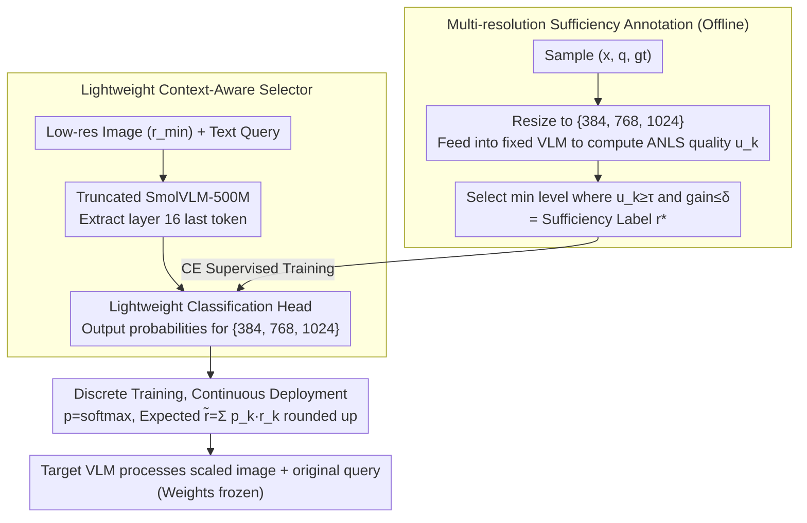

# CARES: Context-Aware Resolution Selector for VLMs

**Conference**: ACL 2026 Oral  
**arXiv**: [2510.19496](https://arxiv.org/abs/2510.19496)  
**Code**: https://mkimhi.github.io/CARES/  
**Area**: Multimodal VLM / Inference Efficiency / Adaptive Resolution  
**Keywords**: Resolution selection, visual token compression, VLM inference acceleration, ANLS, continuous routing  

## TL;DR
CARES adds a lightweight query-aware resolution selector before the target VLM. Using low-resolution images and text questions, it predicts the minimum input resolution "sufficient to answer," maintaining accuracy across 9 multimodal benchmarks while saving approximately 65–85% of prefill computation costs on average.

## Background & Motivation
**Background**: To cover tasks like OCR, document understanding, natural image Q&A, and chart reasoning, general VLMs typically use high-resolution or AnyRes/tiling inputs by default. Higher resolutions lead to more visual tokens; in the prefill stage, visual tokens can even account for 99% of the total tokens.

**Limitations of Prior Work**: Many user questions do not require high resolution. For instance, "What breed is the dog?" might be answered with a low-res image, whereas "What name is written on the collar?" requires high resolution. Existing methods like token pruning, pooling, and merging mostly occur after visual encoding, meaning the high-resolution tokenization cost has already been paid, and they are typically unaware of the current text query.

**Key Challenge**: VLMs need high resolution to ensure quality on difficult samples, but processing all samples at the maximum resolution wastes significant compute. The truly controllable lever lies before tokenization: deciding how many pixels to use beforehand.

**Goal**: Learn a preprocessing module placed before any VLM to predict the minimum sufficient resolution for an image-query pair, reducing visual tokens, FLOPS, TTFT, or API costs without modifying the target VLM's architecture and weights.

**Key Insight**: Rather than predicting "difficult/easy" directly, the authors generate supervision using the target VLM's actual answer quality under multi-resolution rollouts: whichever lowest resolution achieves sufficient quality is used as the label.

**Core Idea**: Shift the VLM inference efficiency problem forward to input resolution selection, learning "just-enough" pixel allocation with query-conditioned sufficiency labels.

## Method
The main version of CARES is a discriminative selector: it uses a truncated SmolVLM-500M to jointly encode the image and question at a low resolution, takes the representation of the last token from an intermediate layer, applies a lightweight classification head to predict 384/768/1024 resolution categories, and uses probability weighting to achieve continuous resolution during inference.

### Overall Architecture
Before training, the authors perform multi-resolution annotation on samples `(x, q, gt)`: images are resized to candidate resolutions and fed into a fixed VLM to obtain answers. Answer quality is evaluated using ANLS or corresponding metrics, and the minimum sufficient resolution is selected as the label. During training, CARES looks only at low-resolution images and queries to learn this label. At deployment, CARES outputs a continuous resolution, and the target VLM processes only the scaled image and the original query.

### Key Designs

**1. Multi-resolution sufficiency annotation: Letting the target VLM's performance curve define the "sufficiency threshold"**

The selector needs to learn "the minimum pixels required for this question," but humans cannot manually judge the required clarity for every sample. CARES delegates this to the target model: for each sample $(x, q, gt)$, it resizes the image to a discrete candidate set $\mathcal R_d=\{384, 768, 1024\}$, feeds them into the fixed VLM to get answers, and calculates quality $u_k = ANLS(F(x^{(r_k)}, q), gt)$. It then picks the smallest $r_k$ that is "good enough"—specifically, satisfying $u_k \ge \tau$ and where further increasing the resolution yields a gain no greater than $\delta$ (default $\tau=0.85, \delta=0.1$).

**2. Lightweight context-aware selector: Pre-judging pixel budget using half a small model before large VLM costs occur**

Prediction must occur before expensive high-resolution tokenization. CARES uses a truncated SmolVLM-500M as the selector: it retains only up to layer 16 intermediate representations, joint-encodes the low-res image ($r_{min}$) and text query, and applies a lightweight classification head to the hidden state of the last token. Query-awareness is the key: the pixel budget for "What breed is the dog?" vs. "What name is written on the collar?" for the same image is vastly different.

**3. Discrete training, continuous deployment: Using probability weighting to turn coarse bins into fine-grained resolutions**

Three-tier labels are easy to annotate and train, but hard-switching between 384/768/1024 during deployment causes frequent over-scaling near classification boundaries. CARES utilizes the classifier's probability distribution: after training as a classifier, it takes $p=softmax(\ell)$ during inference and calculates an expected continuous resolution $\tilde r = \sum_k p_k r_k$, which is then rounded up to the nearest input size supported by the target backbone.

### Loss & Training
CARES uses an 80K training set (20K each from TextVQA, ChartQA, DocVQA, and LLaVA-Multi). The main selector is trained for 6 epochs with a learning rate of $10^{-3}$, batch size 32, using cross-entropy $\mathcal L(\theta)=CE(f_\theta(z), r^*)$ for 3-class classification, including 0.05 label smoothing to support continuous resolution deployment.

## Key Experimental Results

### Main Results

| Target VLM | Native Avg Score | CARES Avg Score | Avg Cost Change | Description |
|------------|------------------|-----------------|-----------------|-------------|
| Granite-Vision-2B | 0.59 | 0.60 | -63% | Accuracy slightly increases while cost drops significantly on small models |
| InternVL3-8B | 0.77 | 0.77 | -64% | Maintains performance across multiple benchmarks |
| Qwen2.5-VL-72B | 0.79 | 0.80 | -70% | Still transferable to large models |
| GPT-4o | 0.69 | 0.68 | -55% | API cost decreases with nearly identical quality |

### Ablation Study

| Configuration | Key Metric | Description |
|---------------|------------|-------------|
| SigLIP v2 feature | 56.1% resolution accuracy | Dual-tower features underperform compared to joint VLM encoding |
| SmolVLM Mid | 63.3% / 0.35B params | Default choice with the best balance of efficiency and accuracy |
| SmolVLM Last | 62.3% / 0.5B params | Using the last layer is slightly weaker and more expensive |
| Continuous routing | Granite/InternVL FLOPS -63% | More efficient than discrete (-46%) with almost no score drop |
| Label smoothing | OCRBench 0.821 vs 0.811 | Improves probability calibration for continuous resolutions |

### Key Findings
- **Cross-model transferability**: CARES yields massive prefill savings on Granite, InternVL, Qwen2.5-VL, and GPT-4o with less than a 1 percentage point average change in quality.
- **Consistency**: The sufficiency labels are not quirks of a single teacher; Granite-Vision-2B and Qwen3-VL-235B show over 95% label consistency on 1,000 samples (Pearson correlation 0.908).
- **Continuous resolution is vital**: While discrete prediction saves compute, continuous prediction further reduces FLOPS and avoids over-scaling at hard classification boundaries.

## Highlights & Insights
- The primary highlight of CARES is placing efficiency control **before pixels enter the VLM**. Compared to token pruning, it avoids the "pay first, save later" problem of high-resolution encoding.
- Using multi-resolution rollouts to generate sufficiency labels is highly practical: it eliminates the need for human judgment and lets the target model define what is "enough."
- **Query-awareness** is the linchpin. Image-only features cannot determine resolution needs; the same image requires entirely different pixel budgets for coarse classification versus OCR tasks.

## Limitations & Future Work
- Training labels require multi-resolution VLM rollouts on large datasets, making offline annotation costly. Calibration may be needed if the target model is updated.
- Currently handles single-image static inputs; resolution selection for video, multi-image reasoning, or interactive retrieval is more complex.
- Error accumulation: CARES only selects input resolution and does not handle internal visual token redundancy. Its combination with token pruning/merging requires further study.
- Safety-critical tasks or extreme small text might require task-specific safety lower bounds or confidence-based fallbacks.

## Related Work & Insights
- **vs HiRED / SparseVLM / PyramidDrop / VTW**: These methods reduce visual tokens after tokenization or encoding. CARES decides resolution before tokenization, avoiding unnecessary input costs.
- **vs TokenFLEX / Matryoshka / LLaVA-Mini**: These methods train models to adapt to different token budgets. CARES does not modify the target VLM and can serve as a front-end to elastic token models.
- **vs AnyRes / tiling**: AnyRes preserves details via more tiles; CARES uses the query to judge if those details are necessary, bypassing expensive tiling for coarse queries.

## Rating
- Novelty: ⭐⭐⭐⭐☆ Resolution selection is not new, but query-aware sufficiency rollout is highly practical for VLM inference.
- Experimental Thoroughness: ⭐⭐⭐⭐⭐ Covers 9 benchmarks, 4 target VLMs, AR versions, and extensive ablations.
- Writing Quality: ⭐⭐⭐⭐☆ Motivations and algorithms are clear; tables are dense but informative.
- Value: ⭐⭐⭐⭐⭐ Highly valuable for practical VLM deployment, cost control, and dynamic visual computation.

<!-- RELATED:START -->

## Related Papers

- [\[CVPR 2025\] Context-Aware Multimodal Pretraining](../../CVPR2025/multimodal_vlm/context-aware_multimodal_pretraining.md)
- [\[ICML 2025\] MMInference: Accelerating Pre-filling for Long-Context VLMs via Modality-Aware Permutation Sparse Attention](../../ICML2025/multimodal_vlm/mminference_accelerating_pre-filling_for_long-context_vlms_via_modality-aware_pe.md)
- [\[ICCV 2025\] HRScene: How Far Are VLMs from Effective High-Resolution Image Understanding?](../../ICCV2025/multimodal_vlm/hrscene_how_far_are_vlms_from_effective_high-resolution_image_understanding.md)
- [\[CVPR 2026\] HiconAgent: History Context-aware Policy Optimization for GUI Agents](../../CVPR2026/multimodal_vlm/hiconagent_history_context-aware_policy_optimization_for_gui_agents.md)
- [\[ICML 2026\] Density-Aware Translation of Spurious Correlations in Zero-Shot VLMs](../../ICML2026/multimodal_vlm/density-aware_translation_of_spurious_correlations_in_zero-shot_vlms.md)

<!-- RELATED:END -->
