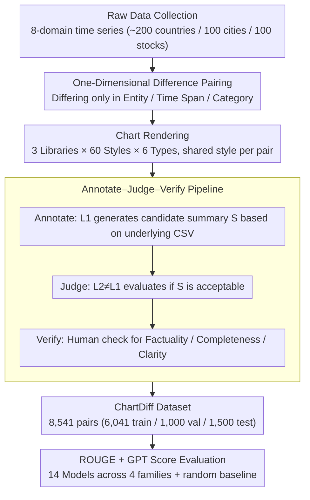

# ChartDiff: A Large-Scale Benchmark for Comprehending Pairs of Charts

**Conference**: ACL 2026  
**arXiv**: [2603.28902](https://arxiv.org/abs/2603.28902)  
**Code**: https://ckchaos.github.io/ChartDiff  
**Area**: Multimodal / Chart Understanding  
**Keywords**: Chart Comparison, Benchmark, VLM Evaluation, Cross-chart Reasoning, ROUGE vs GPT Score

## TL;DR
The authors constructed ChartDiff, the first large-scale benchmark for "comparative summarization of chart pairs" (8,541 pairs, covering 6 chart types, 3 visualization libraries, ~60 visual styles, with LLM-generated + human-verified comparative summaries). Systematic evaluation of 14 VLMs/pipelines reveals that state-of-the-art closed-source models lead in GPT Score but yield low ROUGE scores, while specialized chart models show the opposite, exposing a severe mismatch between ROUGE and human-perceived quality. Furthermore, multi-series charts remain a consistent blind spot for all models.

## Background & Motivation

**Background**: Chart understanding (ChartQA, Chart-to-Text, Chart Summarization) has progressed rapidly, moving from template-based synthetic datasets like FigureQA/PlotQA to real-world datasets like ChartQA, CharXiv, and ChartX, alongside specialized models such as ChartGemma and MatCha. However, nearly all focus on "single-chart understanding"—treating each chart as an independent unit for QA, data extraction, or summarization.

**Limitations of Prior Work**: Real-world analysis is predominantly **comparative**—analysts compare two charts to judge A/B test effects, model performance, regional/temporal trend differences, or anomaly detection. This capability is largely absent from current evaluation systems: attempts like MultiChartQA or ReMI are small-scale (~1k), and their task formats are primarily QA rather than open-ended summarization. While contemporaneous work like ChartAB matches this paper's scale, it focuses on "fine-grained grounding/alignment" rather than evaluating overall comparative reasoning. Consequently, there has been no large-scale, reproducible metric for "whether VLMs can perform open-ended cross-chart comparative summarization."

**Key Challenge**: (1) The difficulty of comparative tasks is not a simple linear addition of single-chart understanding; models must simultaneously perform data extraction, alignment, trend comparison, and anomaly recognition across two charts. (2) Standard evaluations rely on ROUGE, a lexical overlap metric that is insensitive to the semantic/factual correctness of long summaries. If datasets reuse similar sentence patterns, specialized models can "memorize templates" to achieve high scores without true comprehension.

**Goal**: (1) Build a "dual-chart comparative summarization" benchmark with sufficient scale, diversity, and annotation quality for rigorous evaluation; (2) Systematically evaluate the performance gap between closed-source, open-source, domain-specialized models, and pipeline solutions; (3) Quantitatively reveal the extent of lexical metric failure using both ROUGE and GPT Score; (4) Perform diagnostic analysis across multiple dimensions (chart types, libraries).

**Key Insight**: Design principles for chart pairs—each pair differs by only **one dimension** (data entity, time span, or data category), while keeping others consistent. This makes "difference" the sole variable, creating an interpretable and controlled pressure test for models.

**Core Idea**: Use a three-stage "LLM generation $\to$ independent LLM judge $\to$ human verification" pipeline to produce high-quality comparative summaries at scale, bypassing the dilemma between "slow manual annotation" and "noisy pure LLM generation."

## Method

### Overall Architecture
The ChartDiff dataset construction consists of four stages: (1) **Raw Data Collection**: Scraping time-series data across 8 domains (economy, health, stocks, etc.) from Macrotrends and Yahoo Finance, covering ~200 countries/regions. (2) **Pairing**: Each pair consists of two CSV datasets differing in exactly one of three dimensions (entity, time span, category). (3) **Chart Rendering**: Using Matplotlib, Plotly, and Plotnine with 60 style configurations to produce 6 chart types (Line, Bar, Pie, etc.), ensuring the same pair shares styles. (4) **Annotation**: An annotate–judge–verify pipeline. The final dataset contains 8,541 pairs (6,041 train / 1,000 val / 1,500 test). The evaluation suite covers 14 models across 4 families: closed-source (GPT-5.4, Gemini 3.1 Pro, etc.), open-source (Qwen3.5, Qwen2.5-VL), specialized (ChartGemma, MatCha), and pipelines (DePlot + LLM). Metrics include ROUGE-1/2/L and GPT Score (using GPT-5.4 as a judge, with a Pearson $r=0.91$ correlation with human judgment).

### Key Designs

**1. "One-Dimensional Difference" Pairing Constraint: Eliminating confounding variables to isolate "content difference"**
In multi-chart benchmarks, if charts differ across multiple dimensions simultaneously, evaluators cannot determine which specific contrast the model "understood." ChartDiff imposes a hard constraint: the two CSVs must differ in exactly one dimension (entity, time span, or category). Data point counts are kept strictly equal, and styling is shared. This isolation makes "difference" the sole variable, providing an interpretable pressure test and allowing for clean diagnostic slicing by dimension.

**2. Annotate–Judge–Verify LLM Pipeline: Balancing scale with human-perceived quality**
Pure manual annotation for 8,541 pairs is too slow, while single-model LLM annotation introduces self-bias. ChartDiff uses a three-stage pipeline: randomizing model $L_1$ from a pool $\mathcal{A}=\{\text{GPT-5.4, Gemini 3.1 Pro}\}$ to generate a candidate $S$ based on **underlying CSVs** (not images) to ensure ground-truth accuracy. Then, $L_2 \in \mathcal{A}\setminus\{L_1\}$ evaluates $S$, followed by final human verification. Providing the LLM with CSVs instead of images is a key trick to decouple "annotation factuality" from the "perceptual capability" being tested.

**3. ROUGE + GPT Score: Quantifying the failure of lexical metrics in long summaries**
Comparative summaries prioritize semantic and factual correctness. ROUGE, measuring n-gram overlap, is insensitive to these—specialized models often "cheat" by mimicking reference templates. ChartDiff reports both: ROUGE for lexical overlap and GPT Score (0–5 scale) for quality and correctness. The GPT Score's reliability is validated by a 300-sample human study (Pearson $r=0.91$).

## Key Experimental Results

### Main Results: 14 Models × 4 Metrics (Test set: 1,500 pairs)

| Model | Category | ROUGE-1 | ROUGE-2 | ROUGE-L | GPT Score |
|------|------|---------|---------|---------|-----------|
| GPT-5.4 | Closed-source | 46.02 | 12.28 | 23.45 | **4.95** |
| Gemini 3.1 Pro | Closed-source | 47.21 | 13.48 | 24.20 | 4.86 |
| GPT-5.4-mini | Closed-source | 43.00 | 10.62 | 21.68 | 4.82 |
| Gemini 3.1 Flash Lite | Closed-source | 46.37 | 12.83 | 22.82 | 4.63 |
| Claude Sonnet 4.6 | Closed-source | 47.54 | 13.31 | 23.42 | 4.58 |
| GPT-4o | Closed-source | 44.43 | 11.48 | 22.44 | 4.23 |
| Qwen3.5-397B-A17B | Open-source | 47.07 | 12.68 | 22.57 | 4.54 |
| Qwen3.5-9B | Open-source | 44.09 | 10.84 | 21.16 | 3.65 |
| Qwen2.5-VL-7B | Open-source | 41.18 | 9.82 | 20.88 | 3.18 |
| **ChartGemma** | Specialized | **51.49** | 17.81 | 28.53 | 2.00 |
| **MatCha** | Specialized | 49.52 | **18.34** | **28.75** | 1.45 |
| DePlot + GPT-5.4 | Pipeline | 50.75 | 17.25 | 28.88 | 3.58 |
| DePlot + GPT-4o | Pipeline | 46.46 | 13.19 | 23.66 | 3.38 |
| DePlot + Qwen3.5-9B | Pipeline | 43.10 | 10.38 | 20.30 | 2.81 |
| Random baseline | – | 25.50 | 2.50 | 12.81 | 1.17 |

### Ablation Study: GPT Score by Chart Type (Selected Models)

| Model | Overall | Line | Bar | Bar(H.) | Line(M.) | Bar(M.) | Pie |
|------|---------|------|-----|---------|----------|---------|-----|
| GPT-5.4 | 4.95 | 4.97 | 4.97 | 4.89 | 4.90 | 4.88 | **4.99** |
| Gemini 3.1 Pro | 4.86 | 4.82 | 4.90 | 4.94 | 4.65 | 4.85 | 4.98 |
| Qwen3.5-9B | 3.65 | 3.82 | 3.89 | 3.55 | **3.20** | **3.33** | 3.57 |
| Qwen2.5-VL-7B | 3.18 | 3.54 | 3.14 | 2.79 | **2.79** | **2.53** | 3.58 |
| ChartGemma | 2.00 | 2.36 | 2.36 | 2.01 | **1.30** | **1.36** | 1.68 |
| DePlot+GPT-5.4 | 3.58 | 3.89 | 4.63 | 3.16 | 2.91 | 4.65 | **1.24** |

**Library Slice (GPT Score)**: GPT-5.4 scores consistently (4.94–4.97) across Matplotlib, Plotly, and Plotnine, while the DePlot+GPT-5.4 pipeline drops nearly 1 full point on Plotly.

### Key Findings
- **Extreme ROUGE vs GPT Score Mismatch**: ChartGemma/MatCha score ~5 points higher on ROUGE than GPT-5.4, but their GPT Scores (1.45–2.00) are barely above the random baseline (1.17). This indicates that specialized models rely on template rote-learning.
- **Multi-series charts are the ultimate blind spot**: Scores for Line(M.) and Bar(M.) drop by 0.5–0.6 for medium models like Qwen3.5-9B, and hit near-random levels for specialized models.
- **Pie charts are a disaster for pipelines**: DePlot+GPT-5.4 scores only 1.24 on Pie charts because DePlot was not pre-trained on them, highlighting the lack of robustness in pipeline solutions compared to end-to-end VLMs.
- **Strong end-to-end models are library-agnostic**: GPT-5.4's variance across libraries is $\le 0.04$, suggesting that frontier models have developed library-independent visual generalization.

## Highlights & Insights
- **Quantifying ROUGE Failure**: ChartDiff is the first to prove that a model can achieve a ROUGE-1 of 51 while having a GPT Score near baseline, forcing future work to adopt model-based evaluation.
- **"One-Dimension Difference" Methodology**: This principle is transferable to other tasks like multi-image VQA or causal reasoning to create controlled, analyzable experiments.
- **Annotate–Judge–Verify Pipeline**: Successfully scales high-quality annotation ($0.93 - 0.97$ acceptance rate) while decoupling factual ground truth from visual perception issues.
- **Pipeline Vulnerability**: The results confirm that chart-to-table upstream errors are a hard bottleneck for pipelines, matching insights from ChartMimic.

## Limitations & Future Work
- The benchmark covers 6 chart types and 3 libraries, excluding complex visualizations like Sankey diagrams or 3D plots.
- Despite human verification, LLM-generated references may still inherit specific stylistic biases.
- The evaluation focuses on "open-ended summarization," leaving "difference-detection QA" or "point-by-point alignment" for future exploration.
- Specialized models were only fine-tuned for 5 epochs; more compute might bridge the GPT Score gap.
- Future work could introduce programmatic fact-checking (comparing LLM-extracted numeric dictionaries against ground truth).

## Related Work & Insights
- **vs ChartAB**: While both handle multi-chart tasks, ChartAB is a diagnostic grounding framework, whereas ChartDiff focuses on holistic comparative summarization.
- **vs Specialized Models (MatCha/ChartGemma)**: These models overfit existing templates, performing poorly on comparative tasks despite high lexical scores.
- **vs Pipeline Approaches**: ChartDiff provides quantitative evidence of the fragility of pipeline solutions (e.g., failure on Pie charts and specific libraries).
- **Insight**: Future chart-to-text research must transition from "mimicking reference sentence patterns" to "generating factually accurate and semantically comprehensive contrastive descriptions."

## Rating
- **Novelty**: ⭐⭐⭐⭐ First 8k+ scale comparative summarization benchmark; the "one-dimension difference" pairing is a novel methodology.
- **Experimental Thoroughness**: ⭐⭐⭐⭐ Solid across 14 models and various slices, though lacking large-scale fine-tuning experiments.
- **Writing Quality**: ⭐⭐⭐⭐ Clear arguments and honest discussion of limitations.
- **Value**: ⭐⭐⭐⭐⭐ The revelation of the ROUGE/GPT Score mismatch and specialized model failure will likely reshape the evaluation paradigm for chart understanding.

<!-- RELATED:START -->

## Related Papers

- [\[ACL 2026\] From Charts to Code: A Hierarchical Benchmark for Multimodal Models](from_charts_to_code_a_hierarchical_benchmark_for_multimodal_models.md)
- [\[ACL 2026\] MedLayBench-V: A Large-Scale Benchmark for Expert-Lay Semantic Alignment in Medical Vision Language Models](medlaybench-v_a_large-scale_benchmark_for_expert-lay_semantic_alignment_in_medic.md)
- [\[ACL 2025\] WikiMixQA: A Multimodal Benchmark for Question Answering over Tables and Charts](../../ACL2025/multimodal_vlm/wikimixqa_a_multimodal_benchmark_for_question_answering_over_tables_and_charts.md)
- [\[ICML 2025\] LAION-C: An Out-of-Distribution Benchmark for Web-Scale Vision Models](../../ICML2025/multimodal_vlm/laion-c_an_out-of-distribution_benchmark_for_web-scale_vision_models.md)
- [\[ACL 2026\] "I See What You Did There": Can Large Vision-Language Models Understand Multimodal Puns?](i_see_what_you_did_there_can_large_vision-language_models_understand_multimodal_.md)

<!-- RELATED:END -->
