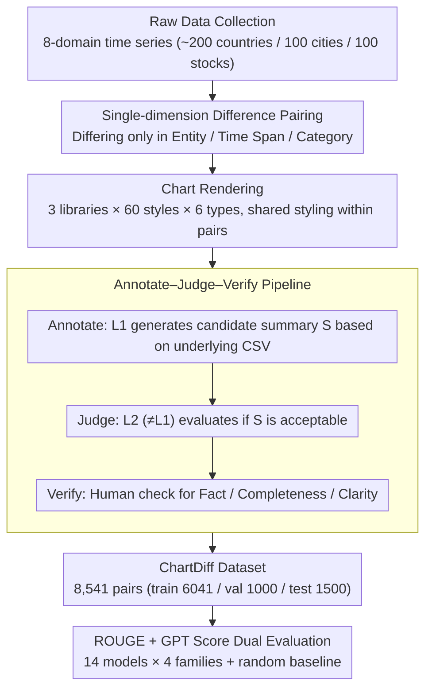

# ChartDiff: A Large-Scale Benchmark for Comprehending Pairs of Charts

**Conference**: ACL 2026  
**arXiv**: [2603.28902](https://arxiv.org/abs/2603.28902)  
**Code**: https://ckchaos.github.io/ChartDiff  
**Area**: Multimodal / Chart Understanding  
**Keywords**: Chart Comparison, Benchmark, VLM Evaluation, Cross-chart Reasoning, ROUGE vs GPT Score

## TL;DR
The authors constructed ChartDiff, the first large-scale benchmark for "comparative summarization of chart pairs" (8,541 pairs, covering 6 chart types, 3 plotting libraries, approximately 60 visual styles, with comparative summaries generated by LLMs and verified by humans). A systematic evaluation of 14 VLMs/pipelines reveals that advanced closed-source models lead in GPT Score but achieve low ROUGE, while specialized chart models/pipelines show the opposite, exposing a severe mismatch between ROUGE and human-perceived quality. Furthermore, multi-series charts remain a consistent bottleneck for all models.

## Background & Motivation

**Background**: Chart understanding (ChartQA, Chart-to-Text, Chart Summarization) has developed rapidly, progressing from template-based synthetic datasets like FigureQA/PlotQA to real-world datasets such as ChartQA, ChartQAPro, CharXiv, ChartX, and ChartBench. Specialized models like ChartLlama, UniChart, MatCha, ChartAssistant, and ChartGemma have almost exclusively focused on "single-chart understanding"—treating each chart as an independent unit for QA, data extraction, or summarization.

**Limitations of Prior Work**: Real-world analysis often involves **comparative** tasks—analysts examine two charts simultaneously to judge A/B test results, compare models, identify trend differences across periods or regions, detect anomalies, or verify reproducibility. However, this capability is largely absent from current evaluation systems. Efforts like MultiChartQA, INTERCHART, and ReMI explore multi-chart tasks but are small in scale (thousands) and focus on QA rather than open-ended summarization. While ChartAB (comparable in scale) also addresses multiple charts, it targets "fine-grained grounding/alignment" diagnostics rather than overall comparative reasoning. Consequently, the core capability of "whether VLMs can perform open-ended cross-chart comparative summarization" lacks a large-scale, reproducible benchmark.

**Key Challenge**: (1) Comparison tasks are not merely an additive extension of single-chart understanding; models must simultaneously perform data extraction, alignment, trend comparison, anomaly identification, and text generation for two charts. Performance curves on single-chart benchmarks do not generalize here. (2) Standard evaluations rely on ROUGE, a lexical overlap metric that is insensitive to semantic or factual correctness in long summaries. Specialized models can "memorize templates" to achieve high scores without true understanding if the dataset uses repetitive sentence structures.

**Goal**: (1) Construct a "dual-chart comparative summarization" benchmark with sufficient scale, diversity, and labeling quality for rigorous evaluation; (2) Systematically evaluate the performance gaps between current closed-source LLMs, open-source LLMs, domain-specific models, and pipeline solutions; (3) Use both ROUGE and GPT Score to quantitatively reveal the extent to which lexical metrics fail in comparative summarization; (4) Perform diagnostic analyses across multiple dimensions (chart types, plotting libraries).

**Key Insight**: Design principles for chart pairs—each pair differs in **only one dimension** (data entity / time span / data category) while keeping others consistent. This makes "difference" the sole variable, creating an interpretable and controlled stress test for models.

**Core Idea**: Utilize a three-stage pipeline "LLM Generation → Secondary LLM Judge → Human Verification" to produce high-quality comparative summaries at scale, avoiding the trade-offs between slow purely manual labeling and noisy purely LLM-based labeling.

## Method

### Overall Architecture
The construction of the ChartDiff dataset involves four phases: (1) **Raw Data Collection**—scraping time-series data from 8 domains (Economy, Health, Immigration, Labor, Population, Trade, Stock, Weather) via Macrotrends, Yahoo Finance, and Visual Crossing, covering ~200 countries/regions, 100 cities, and 100 stocks, with incomplete data filtered out. (2) **Pairing**—each pair consists of two CSV datasets constrained to differ in only one of three dimensions: entity, time span, or data category. (3) **Chart Rendering**—using Matplotlib, Plotly, and Plotnine with 60 style configurations to cover 6 chart types (Line, Bar, Horizontal Bar, Multi-series Line, Multi-series Bar, Pie). Line/Bar charts contain 6–12 points, and Pie charts contain 3–5 categories. Pairs share identical styling, and manual checks are performed to avoid occlusions or scaling anomalies. (4) **Annotation**—a three-stage annotate–judge–verify pipeline. The final dataset contains 8,541 pairs (6,041 train / 1,000 val / 1,500 test). The evaluation suite covers 14 models across 4 families: closed-source (GPT-5.4, Gemini 3.1 Pro, etc.), open-source (Qwen3.5, etc.), domain-specific (ChartGemma, MatCha), and pipelines (DePlot + LLM). Metrics include ROUGE-1/2/L and GPT Score (using GPT-5.4 as a judge, with a Pearson $r=0.91$ correlation with 300 human evaluations).

### Key Designs

**1. "Single-dimension Difference" Pairing Constraint: Isolating variables to content differences**

In multi-chart benchmarks, if two charts differ across multiple dimensions simultaneously, evaluators cannot discern which specific contrast the model "understood." ChartDiff imposes a hard constraint: the two CSVs must differ in **only one** dimension—entity (country/stock/city), time span, or data category. For example, the same country across different periods, or the same period for different countries. Data point counts are kept strictly equal, and styling (library, color, font) is shared. This isolates "difference" as the sole variable for interpretable stress testing. It also allows for clean diagnostic slicing by dimension (e.g., reporting GPT Score by chart type).

**2. Annotate–Judge–Verify Three-stage LLM Pipeline: Balancing scale and human-perceived quality**

Purely manual annotation of 8,541 pairs is too slow, while purely single-model LLM annotation introduces self-bias. ChartDiff bypasses this by first randomly prompting a model $L_1$ from a pool $\mathcal{A}=\{\text{GPT-5.4, Gemini 3.1 Pro}\}$ to generate a summary $S$ based on **underlying CSVs** (not images). A different model $L_2 \in \mathcal{A} \setminus \{L_1\}$ then acts as a judge to determine if $S$ is acceptable. Finally, humans verify factual accuracy, completeness of key differences, and clarity. Using CSVs for annotation is a key trick: it decouples "ground truth numerical accuracy" from "visual understanding," ensuring training data is free from OCR or perceptual errors.

**3. ROUGE + GPT Score Dual Metrics: Quantifying the failure of lexical metrics in long summaries**

Core qualities of comparative summaries are semantic and factual correctness. Standard ROUGE metrics, which measure n-gram overlap, are largely insensitive to these factors; specialized models can inflate scores by mimicking reference templates. ChartDiff reports ROUGE alongside GPT Score (GPT-5.4 grading based on quality and correctness from 0–5). The reliability of this "ruler" is backed by a Pearson $r=0.91$ correlation with human ratings across 300 samples. The comparison reveals a dramatic reversal: ChartGemma leads in ROUGE-1 (51.49) but scores only 2.0 in GPT Score, while GPT-5.4 scores lower in ROUGE-1 (46.02) but achieves the highest GPT Score (4.95).

## Key Experimental Results

### Main Results: 14 Models × 4 Metrics (test set 1500 pairs)

| Model | Category | ROUGE-1 | ROUGE-2 | ROUGE-L | GPT Score |
|------|------|---------|---------|---------|-----------|
| GPT-5.4 | Closed LLM | 46.02 | 12.28 | 23.45 | **4.95** |
| Gemini 3.1 Pro | Closed LLM | 47.21 | 13.48 | 24.20 | 4.86 |
| GPT-5.4-mini | Closed LLM | 43.00 | 10.62 | 21.68 | 4.82 |
| Gemini 3.1 Flash Lite | Closed LLM | 46.37 | 12.83 | 22.82 | 4.63 |
| Claude Sonnet 4.6 | Closed LLM | 47.54 | 13.31 | 23.42 | 4.58 |
| GPT-4o | Closed LLM | 44.43 | 11.48 | 22.44 | 4.23 |
| Qwen3.5-397B-A17B | Open LLM | 47.07 | 12.68 | 22.57 | 4.54 |
| Qwen3.5-9B | Open LLM | 44.09 | 10.84 | 21.16 | 3.65 |
| Qwen2.5-VL-7B | Open LLM | 41.18 | 9.82 | 20.88 | 3.18 |
| **ChartGemma** | Specialized | **51.49** | 17.81 | 28.53 | 2.00 |
| **MatCha** | Specialized | 49.52 | **18.34** | **28.75** | 1.45 |
| DePlot + GPT-5.4 | Pipeline | 50.75 | 17.25 | 28.88 | 3.58 |
| DePlot + GPT-4o | Pipeline | 46.46 | 13.19 | 23.66 | 3.38 |
| DePlot + Qwen3.5-9B | Pipeline | 43.10 | 10.38 | 20.30 | 2.81 |
| Random baseline | – | 25.50 | 2.50 | 12.81 | 1.17 |

### Ablation Study: GPT Score by Chart Type (Selected Models)

| Model | Overall | Line | Bar | Bar(H.) | Line(M.) | Bar(M.) | Pie |
|------|---------|------|-----|---------|----------|---------|-----|
| GPT-5.4 | 4.95 | 4.97 | 4.97 | 4.89 | 4.90 | 4.88 | **4.99** |
| Gemini 3.1 Pro | 4.86 | 4.82 | 4.90 | 4.94 | 4.65 | 4.85 | 4.98 |
| Qwen3.5-9B | 3.65 | 3.82 | 3.89 | 3.55 | **3.20** | **3.33** | 3.57 |
| Qwen2.5-VL-7B | 3.18 | 3.54 | 3.14 | 2.79 | **2.79** | **2.53** | 3.58 |
| ChartGemma | 2.00 | 2.36 | 2.36 | 2.01 | **1.30** | **1.36** | 1.68 |
| DePlot+GPT-5.4 | 3.58 | 3.89 | 4.63 | 3.16 | 2.91 | 4.65 | **1.24** |

### Key Findings
- **Extreme ROUGE vs. GPT Score Mismatch**: ChartGemma and MatCha lead ROUGE metrics by over 5 points, yet their GPT Scores (1.45–2.00) hover near the random baseline (1.17). This indicates that high ROUGE scores in specialized models stem from "mimicking templates" rather than understanding.
- **Multi-series Charts are the Common Blind Spot**: Performance on Line(M.) and Bar(M.) dropped significantly for medium-sized models like Qwen3.5-9B (by 0.5–0.6 compared to single-series). ChartGemma dropped to near-random levels (1.30/1.36).
- **Pie Charts are a Disaster for Pipelines**: DePlot+GPT-5.4 scored only 1.24 on Pie charts (vs. 3.58 overall) because DePlot was not pre-trained on pie charts, highlighting a lack of robustness in pipeline solutions compared to end-to-end VLMs.
- **Strong E2E Models are Library-Agnostic**: GPT-5.4 fluctuates by only $\pm 0.02$ across Matplotlib, Plotly, and Plotnine, showing that powerful LLMs possess robust generalization across visualization libraries.
- **Open-source Gap Remains Significant**: The strongest open-source model (Qwen3.5-397B-A17B) scores 4.54, trailing GPT-5.4 by 0.41. Smaller models like Qwen2.5-VL-7B (3.18) show a massive gap, proving multi-chart tasks are strong discriminators between open and closed models.

## Highlights & Insights
- **Exposing ROUGE Failure**: While ROUGE's inadequacy for generation is known, this study provides extreme evidence ("ROUGE 51 vs GPT Score 2") that forces future chart work to adopt model-based evaluation.
- **Single-Dimension Difference Methodology**: This approach is a transferable methodology for multi-image VQA and causal reasoning, turning messy multi-variable evaluation into controlled experiments.
- **Standardized Pipeline for Data Synthesis**: The annotate–judge–verify pipeline provides a template for scaling benchmark synthesis via LLMs while mitigating individual model bias.
- **Modular Vulnerability of Pipelines**: The failure of DePlot+LLM on pie charts and Plotly reinforces that upstream chart-to-table errors are hard bottlenecks for pipelines.

## Limitations & Future Work
- Covers only 6 chart types and 3 libraries; does not include complex visualizations like Sankey, Heatmaps, or 3D plots.
- Although human-verified, the underlying summaries are LLM-generated and may inherit stylistic biases.
- Relies heavily on GPT Score; despite $r=0.91$, it is an automatic metric that doesn't replace deep domain-expert evaluation.
- Focused on open-ended summarization; does not cover specific tasks like trend classification or point-by-point alignment.
- Future work: Include programmatic validation of factual correctness (comparing numerical dicts) and extend comparison to $N > 2$ charts to study scaling.

## Related Work & Insights
- **vs. ChartAB (2025)**: ChartAB focuses on fine-grained grounding; ChartDiff focuses on holistic summarization. They are complementary.
- **vs. MultiChartQA / INTERCHART / ReMI**: These are either smaller or focused on QA; ChartDiff fills the gap for large-scale open-ended generation.
- **vs. Specialized models (MatCha, etc.)**: These models appear to be heavily overfitted to single-chart patterns, failing significantly when tasked with comparative reasoning.
- **Insight**: Chart specialized models need to move from "mimicking reference sentence patterns" toward "generating factually correct and semantically comprehensive descriptions."

## Rating
- Novelty: ⭐⭐⭐⭐ First 8k+ dual-chart summary benchmark; robust synthesis methodology.
- Experimental Thoroughness: ⭐⭐⭐⭐ Solid model variety and diagnostic slicing, though lacks extensive fine-tuning experiments.
- Writing Quality: ⭐⭐⭐⭐ Clear arguments and honest discussion of limitations.
- Value: ⭐⭐⭐⭐⭐ Will likely reshape evaluation paradigms in chart understanding by debunking ROUGE and providing a new stress test.

<!-- RELATED:START -->

- **ChartQA**: Single-chart QA focusing on reasoning.
- **Chart-to-Text**: Precursor for chart summarization focusing on lexical metrics.
- **DePlot**: State-of-the-art pipeline component for chart-to-table conversion.
- **ChartAB**: Diagnostic framework for multi-chart alignment.

<!-- RELATED:END -->

## Related Papers

- [\[ACL 2026\] MedLayBench-V: A Large-Scale Benchmark for Expert-Lay Semantic Alignment in Medical Vision Language Models](medlaybench-v_a_large-scale_benchmark_for_expert-lay_semantic_alignment_in_medic.md)
- [\[ACL 2025\] WikiMixQA: A Multimodal Benchmark for Question Answering over Tables and Charts](../../ACL2025/multimodal_vlm/wikimixqa_a_multimodal_benchmark_for_question_answering_over_tables_and_charts.md)
- [\[ICML 2025\] LAION-C: An Out-of-Distribution Benchmark for Web-Scale Vision Models](../../ICML2025/multimodal_vlm/laion-c_an_out-of-distribution_benchmark_for_web-scale_vision_models.md)
- [\[ACL 2026\] GeoRC: A Benchmark for Geolocation Reasoning Chains](georc_a_benchmark_for_geolocation_reasoning_chains.md)
- [\[CVPR 2026\] Towards Open-Vocabulary Industrial Defect Understanding with a Large-Scale Multimodal Dataset](../../CVPR2026/multimodal_vlm/towards_open-vocabulary_industrial_defect_understanding_with_a_large-scale_multi.md)

<!-- RELATED:END -->
