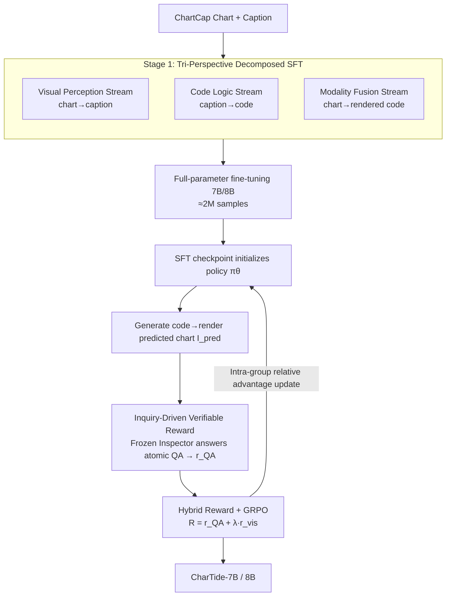

# CharTide: Data-Centric Chart-to-Code Generation via Tri-Perspective Tuning and Inquiry-Driven Evolution

**Conference**: ACL2026  
**arXiv**: [2604.22192](https://arxiv.org/abs/2604.22192) ⚠️ Subject to original text  
**Code**: To be confirmed  
**Area**: Multimodal VLM  
**Keywords**: Chart-to-Code, Data-Centric, Tri-Perspective Decomposed SFT, Verifiable Reward, GRPO  

## TL;DR
CharTide attributes the bottleneck of "chart-to-plotting code" to the **data itself**. It utilizes Tri-Perspective Decomposed SFT (orthogonal data streams for visual perception, text-only code logic, and modality fusion) to break the scaling wall of homogeneous data. Furthermore, it employs a frozen Inspector for objective verification via atomic QA to provide verifiable rewards for RL, allowing 7B/8B open-source models to outperform GPT-4o and approach GPT-5.

## Background & Motivation
**Background**: Chart-to-Code generation requires VLMs to reverse-engineer plotting code from a chart that can render back to the original image, posing zero-tolerance constraints on both **visual precision** and **syntactic correctness**. The mainstream approach involves end-to-end Supervised Fine-Tuning (SFT) on synthesized or collected chart-code pairs.

**Limitations of Prior Work**: The authors identify two "data-centric" dilemmas. First, SFT has hit a **scaling wall**—scaling data to 3M (e.g., MSRL) shows diminishing returns. The root cause is the inefficiency of the single chart-code pair format: boilerplate syntax and non-visual logic occupy an excessive token share, **diluting supervision signals for critical visual attributes** and biasing the model toward template memorization rather than fine-grained visual alignment. Second, the RL stage lacks verifiable evaluation: existing methods rely either on **rule matching** (heuristic attributes like color/legends, ignoring global visual semantics) or **VLM-as-a-Judge** (subjective, black-box, high-variance, and expensive).

**Key Challenge**: Chart-to-code requires the model to **simultaneously** possess fine-grained visual perception and precise code synthesis. However, single chart→code pairs entangle these two capabilities during training, failing to master perception while mixing visual and logical hallucinations. Moreover, the alignment stage lacks objective, reproducible rewards for correction.

**Goal**: Redesign training and alignment data from the data side: (1) **decouple** supervision signals across perception, logic, and fusion dimensions; (2) refactor alignment from "subjective scoring" to "objective verification."

**Key Insight**: On the training side, rather than stacking homogeneous data, it is more effective to construct **orthogonal** data streams to feed the three capabilities separately. On the alignment side, the authors propose an **information invariance** hypothesis—a model should provide consistent answers to visual questions on both the original chart and the generated chart. Thus, "generation quality" is transformed into the verifiable fact of "whether the generated chart can correctly answer the same questions."

**Core Idea**: Break data homogeneity bottlenecks with Tri-Perspective Decomposed SFT + replace black-box VLM scoring with Inquiry-Driven Verifiable Rewards (atomic QA verification).

## Method

### Overall Architecture
CharTide is a two-stage pipeline. **Stage 1: Tri-Perspective Decomposed SFT**: Using high-quality charts and captions from ChartCap as the core source, three complementary data streams are constructed via multi-perspective distillation—visual perception (chart→caption), code logic (caption→code), and modality fusion (chart→code). These are combined with open-source instruction data (approx. 2M samples) to perform full-parameter fine-tuning on Qwen2.5-VL-7B / Qwen3-VL-8B. **Stage 2: Inquiry-Driven RL**: The policy is initialized with the SFT checkpoint. The policy generates code to render a predicted chart $I_{pred}$. A **frozen Inspector** answers pre-constructed atomic QA on the predicted chart, providing semantic rewards $r_{QA}$ based on accuracy, combined with WebSSL-based visual similarity rewards $r_{vis}$, optimized via GRPO.

### Key Designs

**1. Tri-Perspective Decomposed SFT: Decoupling Entangled "Perception + Logic" into Three Orthogonal Streams**

To address the dilution of visual supervision and the entanglement of hallucinations, the authors construct three streams distilled from ChartCap. **Visual Perception Stream (chart→caption)**: Closely aligns visual features with dense text descriptions, using length-based filtering to remove excessively long captions, helping the 7B model focus on concise visual grounding to fix perception weaknesses. **Code Logic Stream (caption→code)**: Uses Qwen3-Coder-30B to generate plotting code from detailed captions, followed by visual consistency verification using Qwen3-VL-235B. This **isolates syntax learning from visual perception**—pure text-to-code, free of visual noise. **Modality Fusion Stream (chart→code)**: Integrates 1M images, using Qwen3-VL-235B to generate code from source images. A critical trick here is **rendered-image re-pairing**: code is paired with its **actually rendered chart** rather than the original source, eliminating "visual-code inconsistency" and ensuring pixel-level correspondence. This decoupling allows the 7B model to distill capabilities exceeding the 235B baseline.

**2. Inquiry-Driven Verifiable Reward: Turning "Generation Quality" into "Answer Accuracy"**

Subjective black-box scoring by VLM-as-a-Judge suffers from high variance. The authors refactor rewards based on **information invariance**: if the generated chart faithfully restores the original information, a downstream model should answer the same visual questions correctly. Specifically, they construct Chart-VQA data—selecting 30k representative images via K-Means on WebSSL-1B features, with GPT-5 generating $N=10$ atomic QA pairs per image (including numerical tolerance). **Consistency pre-filtering** ensures the Inspector answers at least 9 questions correctly (Acc $\geq 0.9$) on the original image, guaranteeing a valid reward signal. During training, a **frozen Inspector** answers these QA on the predicted chart $I_{pred}$:

$$r_{QA}=\frac{1}{|\mathcal{Q}|}\sum_{(q,a)\in\mathcal{Q}}\mathbb{I}\!\left(\mathcal{M}(\text{Inspector}(I_{pred},q),a)\right)$$

where $\mathbb{I}(\cdot)$ is the indicator function and $\mathcal{M}$ performs semantic alignment with numerical tolerance. This transforms black-box scoring into deterministic, low-variance supervision.

**3. Hybrid Reward + GRPO: Bridging the "Correct Answers but Poor Visuals" Gap**

While $r_{QA}$ ensures semantic correctness, code generation is "one-to-many"—numerical values might be correct while the style is collapsed. Thus, a visual consistency reward is added: $r_{vis}=\text{CosineSim}(\text{Enc}_{web}(I_{src}), \text{Enc}_{web}(I_{pred}))$, utilizing WebSSL-1B (which outperforms DINO or SigLIP in detecting structural collapse). The total reward $R_{total}=r_{QA}+\lambda\cdot r_{vis}$ is optimized via GRPO, maximizing relative group advantages while using a KL penalty for stability.

### Loss & Training
In the SFT stage, the model undergoes full-parameter fine-tuning on 2M samples with a global batch of 256 and an initial lr of $1e{-5}$, taking ~36 hours on 8×H100. In the RL stage, the SFT checkpoint is optimized on 20k verified V6A samples with an lr of $1e{-6}$ and KL coefficient $\beta=0.02$. The policy runs on 8×H100, with 4×H100 dedicated to the frozen Inspector and WebSSL reward model, completing in ~20 hours.

## Key Experimental Results

### Main Results
On ChartMimic, Plot2Code, and ChartX benchmarks, CharTide achieves SOTA among open-source models, surpassing GPT-4o and approaching GPT-5. CharTide-7B reached 91.6 on ChartMimic High-Level, exceeding MSRL-7B (87.4) and GPT-4o (87.7).

| Model | ChartMimic High | Plot2Code Rating | ChartX GPT |
|------|----------------|------------------|-----------|
| GPT-4o | 87.7 | 5.66 | 2.61 |
| GPT-5 | 94.7 | 7.28 | 3.59 |
| MSRL-7B | 87.4 | 3.24 | 3.22 |
| ChartMaster-7B | 83.3 | 4.73 | 2.82 |
| **CharTide-7B** | 91.6 | 5.60 | 3.22 |
| **CharTide-8B** | **92.7** | **5.93** | **3.23** |

### Ablation Study
SFT Data Strategy (ChartMimic): Stacking homogeneous C2C data saturates quickly (85.3→85.1). Introducing decoupled streams provides steady gains—adding caption data improves perception, and caption-code data boosts execution rate from 92.5 to 94.3.

| Data Composition (C2C / Cap / Cap2C) | Exec | Low | High |
|------------------------------|------|-----|------|
| 800K / – / – | 91.3 | 77.5 | 85.3 |
| 1M / – / – | 92.0 | 77.6 | 85.1 |
| 1M / 500K / – | 92.5 | 78.8 | 86.4 |
| 1M / 500K / 400K | **94.3** | **79.3** | **87.4** |

Synergy of SFT and RL (ChartMimic): RL directly on the base Qwen2.5-VL only improves execution rate, while visual fidelity lags significantly (High 76.7). The full SFT + RL pipeline pushes High-Level to 91.6.

| Phase | Exec | Low | High |
|------|------|-----|------|
| Qwen2.5-VL Base | 75.0 | 49.0 | 51.8 |
| RL only (No SFT) | 94.5 | 68.0 | 76.7 |
| SFT only | 94.3 | 79.3 | 86.4 |
| SFT + RL | **96.7** | **81.7** | **91.6** |

### Key Findings
- **Decoupling is more effective than volume**: Homogeneous C2C data hits a wall at 800K; orthogonal streams unlock gains by isolating perception, syntax, and fusion.
- **SFT is a prerequisite for RL**: Skipping SFT fails to learn global visual alignment. Inquiry-Driven RL rewards are transferable, as applying them to other models (e.g., ChartMaster) also yields improvements.
- **WebSSL catches structural collapse**: As a $r_{vis}$ encoder, WebSSL-1B is more sensitive to stylistic failures than other visual backbones.

## Highlights & Insights
- **Reframing Alignment as Data Verification**: The "AHA" moment is using information invariance to replace subjective scores with verifiable atomic QA performance.
- **Rendered-image re-pairing is a crucial detail**: Pairing code with its actual output rather than source images eliminates noise at the root.
- **Data-Centric Perspective**: Showing that bottlenecks in Chart-to-Code lie in data organization rather than model capacity is a significant insight.

## Limitations & Future Work
- **Heavily reliant on large model distillation**: The pipeline depends on Qwen3-Coder-30B, Qwen3-VL-235B, and GPT-5, making reproduction expensive.
- **Reward quality is bounded by Inspector and QA coverage**: $r_{QA}$ depends on whether the QA covers all critical visual attributes.
- **arXiv ID Anomaly**: The ID 2604.22192 (year 2026) is unusual; refer to original sources for confirmation.

## Related Work & Insights
- **vs MSRL**: While MSRL scales C2C pairs to 3M, CharTide proves that orthogonal streams allow a 7B model to outperform MSRL's scaled versions.
- **vs ChartMaster**: Rule-based rewards ignore global semantics; CharTide's QA-based verification is more holistic.
- **vs VLM-as-a-Judge**: CharTide replaces high-variance black-box scoring with deterministic, verifiable facts.

## Rating
- Novelty: ⭐⭐⭐⭐⭐ 
- Experimental Thoroughness: ⭐⭐⭐⭐⭐ 
- Writing Quality: ⭐⭐⭐⭐ 
- Value: ⭐⭐⭐⭐⭐ 

<!-- RELATED:START -->

## Related Papers

- [\[ACL 2026\] Aligned Multi-View Scripts for Universal Chart-to-Code Generation](aligned_multi-view_scripts_for_universal_chart-to-code_generation.md)
- [\[ACL 2026\] Enhancing Multimodal Large Language Models for Ancient Chinese Character Evolution Analysis via Glyph-Driven Fine-Tuning](enhancing_multimodal_large_language_models_for_ancient_chinese_character_evoluti.md)
- [\[CVPR 2026\] MM-ReCoder: Advancing Chart-to-Code Generation with Reinforcement Learning and Self-Correction](../../CVPR2026/multimodal_vlm/mm-recoder_advancing_chart-to-code_generation_with_reinforcement_learning_and_se.md)
- [\[ICLR 2026\] Breaking the SFT Plateau: Multimodal Structured Reinforcement Learning for Chart-to-Code Generation](../../ICLR2026/multimodal_vlm/breaking_the_sft_plateau_multimodal_structured_reinforcement_learning_for_chart-.md)
- [\[CVPR 2026\] Why Does RL Generalize Better Than SFT? A Data-Centric Perspective on VLM Post-Training](../../CVPR2026/multimodal_vlm/why_does_rl_generalize_better_than_sft_a_data-centric_perspective_on_vlm_post-tr.md)

<!-- RELATED:END -->
