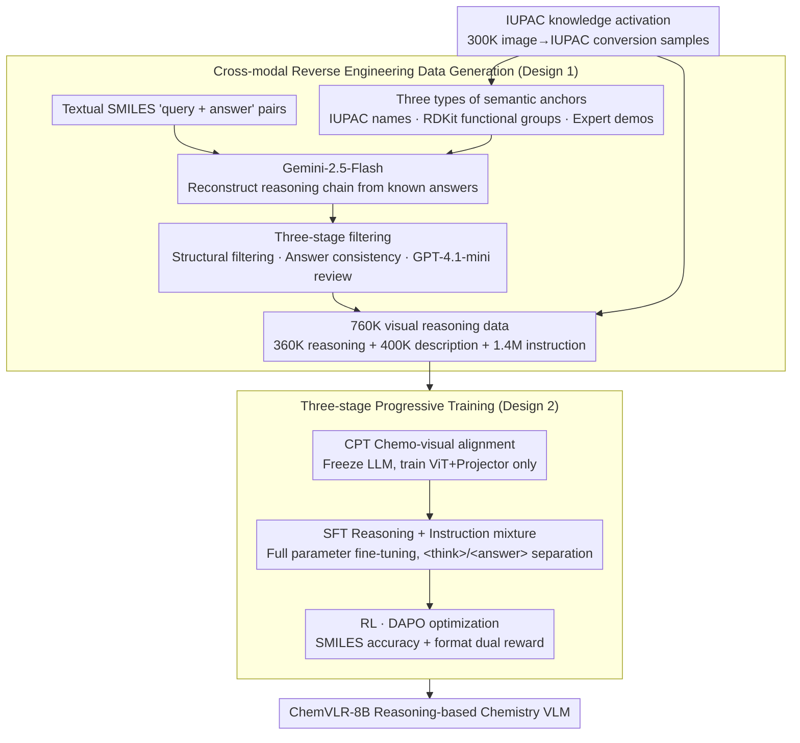

# ChemVLR: Prioritizing Reasoning in Perception for Chemical Vision-Language Understanding

**Conference**: ACL 2026 Findings  
**arXiv**: [2604.06685](https://arxiv.org/abs/2604.06685)  
**Code**: [https://github.com/xxlllz/ChemVLR](https://github.com/xxlllz/ChemVLR)  
**Area**: Interpretability  
**Keywords**: Chemical vision understanding, Reasoning VLM, Cross-modal reverse engineering, Three-stage training, Molecular recognition

## TL;DR
Ours proposes ChemVLR, the first reasoning-based VLM in the chemistry domain. It constructs a 760K reasoning dataset through a cross-modal reverse engineering strategy and employs a three-stage training process (CPT-SFT-RL), significantly outperforming proprietary models and domain-expert VLMs in molecular recognition and reaction prediction tasks.

## Background & Motivation

**Background**: Chemistry VLMs (e.g., ChemVLM, TinyChemVL) have made some progress but mainly adopt an end-to-end direct answering paradigm relying on SFT. Meanwhile, RLVR has demonstrated strong reasoning enhancement capabilities in fields such as mathematics and programming.

**Limitations of Prior Work**: Existing chemistry VLMs are "black-box" systems—jumping directly from molecular images to answers without generating interpretable reasoning paths. They do not fully utilize the LLM's ability to infer underlying reaction mechanisms and perform poorly on complex visual chemistry problems. Furthermore, high-quality chemical reasoning data is extremely scarce, especially visually-grounded reasoning annotations.

**Key Challenge**: Chemical image understanding requires fine-grained substructure analysis (e.g., functional group recognition), but general VLMs lack domain knowledge, and direct SFT cannot fully activate pre-trained knowledge.

**Goal**: To build a chemistry VLM that prioritizes reasoning in the perception process—explicitly identifying fine-grained chemical descriptors (e.g., functional groups) first, then deriving the final answer.

**Key Insight**: Utilize textual chemical queries + ground truth answers to reconstruct the reasoning process via an LLM, then pair this with image rendering to generate visual reasoning data.

**Core Idea**: Large-scale reasoning data generation through cross-modal reverse engineering + CPT→SFT→RL three-stage progressive training.

## Method

### Overall Architecture
Regarding data construction, reasoning processes are reconstructed from textual SMILES QA pairs using Gemini-2.5-Flash, supplemented by IUPAC names, RDKit functional groups, and expert demonstrations as semantic anchors. High-quality samples (760K) are generated via three-stage filtering. Regarding training, a three-stage workflow is adopted: CPT (chemo-visual alignment) → SFT (reasoning + instruction mixture) → RL (DAPO optimization).

### Key Designs

**1. Cross-modal reverse engineering data generation: Deducing reasoning from answers to solve the lack of visual chemical reasoning annotations.**

The chemistry field lacks ready-made "image—reasoning—answer" annotations, and manual labeling cannot scale. ChemVLR reverses the approach: using existing textual SMILES "query + answer" pairs, Gemini-2.5-Flash reconstructs a reasoning chain that leads to the correct answer. To prevent hallucination, each sample is anchored with IUPAC names retrieved from PubChem, functional groups calculated by RDKit, and expert demonstrations. Post-generation, three filters are applied: structural filtering, answer consistency checks (derived SMILES must match ground truth), and external LLM verification (GPT-4.1-mini). 

This anchor + filter setup increased data retention from 55%–78% to 73%–95%, yielding 360K reasoning, 400K description, and 1.4M instruction samples. Its value lies in converting "annotation scarcity" into "reverse generation from answers + multi-layer verification," a method transferable to other specialized domains.

**2. Three-stage progressive training: Supplementing chemo-visual perception before teaching reasoning and refining with RL.**

General VLMs are largely "blind" to molecular images; direct SFT or RL shows little effect because the models cannot even identify functional groups accurately. ChemVLR builds capabilities incrementally: the CPT stage freezes the LLM backbone and trains the ViT+Projector using 500K chemo-image-text pairs for domain alignment; the SFT stage performs full parameter fine-tuning on mixed reasoning and instruction data using `<think>/<answer>` tags; the RL stage employs DAPO optimization with rewards based on SMILES accuracy ($Tanimoto \ similarity = 1.0$) and format correctness. 

This sequence—"perception before reasoning"—underpins the title "Prioritizing Reasoning in Perception." Without CPT, RL lacks a foundation (RL-only is ineffective in ablations); after bridging the domain gap, RL provides an average gain of ~9% across all tasks.

**3. IUPAC knowledge activation: Changing representation to awaken chemical knowledge already present in pre-training corpora.**

Models encounter vast chemical content during general pre-training, but this knowledge often appears as IUPAC names (e.g., "2-methylbutane") rather than SMILES strings. Training solely on SMILES is akin to asking questions in an unfamiliar dialect. Ours constructs 300K image→IUPAC conversion samples to trigger the model's inherent chemical common sense using familiar representations. 

The effect is direct: adding IUPAC data increased the retention rate of reverse engineering data from 78% to 92%. This reveals that the utilization of pre-trained knowledge often depends on whether the representation aligns with the pre-training distribution.

### Loss & Training
The RL stage uses DAPO (Decoupled Clip and Dynamic Sampling Policy Optimization) with binary rewards (accuracy + format). The SFT model filters 100K medium-difficulty samples for training.

## Key Experimental Results

### Main Results

| Model | MMChemOCR Avg Sim. | MMChemOCR Tani@1.0 | img2smiles Tani@1.0 | ChemRxn-V Pred |
| :--- | :--- | :--- | :--- | :--- |
| ChemVLR-8B | **93.8** | **84.6** | **92.7** | **67.8** |
| TinyChemVL | 91.2 | 77.4 | 75.6 | 52.4 |
| Gemini-3-Flash | 77.6 | 61.2 | 63.8 | 51.7 |
| ChemDFM-X | 70.9 | 36.5 | 77.6 | 0.7 |

### Ablation Study

| Configuration | Effect | Description |
| :--- | :--- | :--- |
| SFT only | Baseline | Lacks chemo-visual understanding |
| CPT + SFT | Gain | Visual alignment improves perception |
| CPT + SFT + RL | **Optimal** | RL improves performance by 9% on average |
| RL only | Ineffective | Lacks domain foundation for effective optimization |

### Key Findings
- ChemVLR is the first VLM to match the precision of specialized SMILES OCR models like Decimer.
- RL training exhibits an "Aha moment"—rewards rise sharply between 200-400 steps.
- IUPAC data acts as a critical catalyst, significantly activating pre-trained knowledge.

## Highlights & Insights
- The **reverse engineering data generation strategy** is highly practical—deducing reasoning from answers with multi-stage verification is applicable to other data-scarce professional fields.
- The **discovery of IUPAC knowledge activation** is insightful—the utilization of pre-trained knowledge depends on the training data's representation matching the pre-training distribution.
- The **RL "Aha moment"** confirms the effectiveness of RLVR for reasoning enhancement in specialized domains.

## Limitations & Future Work
- Training requires 16xH800 GPUs, involving high resource demands.
- The correctness of the reasoning process depends on filtering quality; logical inconsistencies may exist even if the reasoning path is superficially correct.
- Validation is limited to organic molecules/reactions; inorganic chemistry and complex mechanisms remain unexplored.

## Related Work & Insights
- **vs TinyChemVL**: Both are chemistry VLMs, but TinyChemVL uses SFT only. ChemVLR enhances reasoning capabilities through RL.
- **vs ChemDFM-R/Chem-R**: These models enhance reasoning in the text domain; ChemVLR extends this to multimodal visual reasoning.

## Rating
- Novelty: ⭐⭐⭐⭐ First chemistry reasoning VLM; novel reverse engineering data strategy.
- Experimental Thoroughness: ⭐⭐⭐⭐⭐ Multiple benchmarks, baselines, and detailed ablations.
- Writing Quality: ⭐⭐⭐⭐ Clear description of data construction and training workflows.
- Value: ⭐⭐⭐⭐ Significant contribution to Chemistry AI and scientific reasoning.

<!-- RELATED:START -->

## Related Papers

- [\[ACL 2026\] Decoding Scientific Experimental Images: The SPUR Benchmark for Perception, Understanding, and Reasoning](decoding_scientific_experimental_images_the_spur_benchmark_for_perception_unders.md)
- [\[ACL 2026\] Addressing Overthinking in Large Vision-Language Models via Gated Perception-Reasoning Optimization](addressing_overthinking_in_large_vision-language_models_via_gated_perception-rea.md)
- [\[CVPR 2026\] Select Less, Reason More: Prioritizing Evidence Purity for Video Reasoning](../../CVPR2026/multimodal_vlm/select_less_reason_more_prioritizing_evidence_purity_for_video_reasoning.md)
- [\[AAAI 2026\] TinyChemVL: Advancing Chemical Vision-Language Models via Efficient Visual Token Reduction and Complex Reaction Tasks](../../AAAI2026/multimodal_vlm/tinychemvl_advancing_chemical_vision-language_models_via_efficient_visual_token_.md)
- [\[CVPR 2026\] PDCR: Perception-Decomposed Confidence Reward for Vision-Language Reasoning](../../CVPR2026/multimodal_vlm/pdcr_perception-decomposed_confidence_reward_for_vision-language_reasoning.md)

<!-- RELATED:END -->
