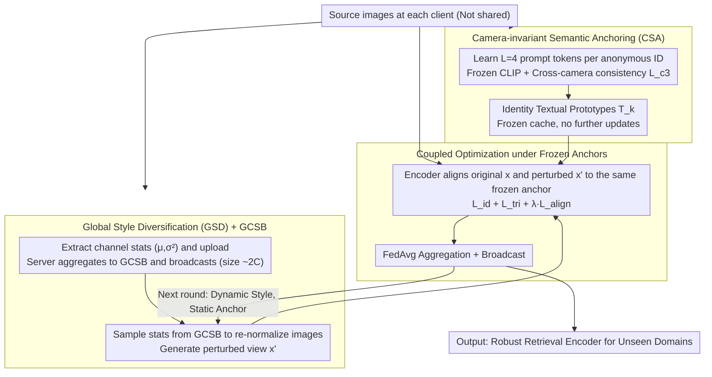

# CO-EVO: Co-evolving Semantic Anchoring and Style Diversification for Federated DG-ReID

**Conference**: ACL 2026  
**arXiv**: [2604.26363](https://arxiv.org/abs/2604.26363)  
**Code**: https://github.com/NanYiyuzurn/ACL-LGPS-2026  
**Area**: Federated Learning / Domain Generalization / Person ReID  
**Keywords**: Federated Domain Generalization, Person Re-identification, CLIP Semantic Anchoring, Style Diversification, Camera Invariance

## TL;DR
Addressing the "semantic-style conflict" in Federated Domain Generalized Person Re-identification (FedDG-ReID), CO-EVO proposes CSA (Camera-invariant Semantic Anchoring) to learn frozen identity-level textual prototypes as "gravitational centers" and GSD (Global Style Diversification) using a lightweight GCSB (Global Camera Style Bank) to synthesize realistic cross-domain perturbations. The coupled optimization of these two components achieves an average mAP improvement of 14 points (34.1→48.1) over SOTA on ViT across Market-1501/MSMT17/CUHK03 leave-one-out experiments.

## Background & Motivation

**Background**: Person ReID faces severe cross-camera domain shifts in real-world deployments. DG-ReID attempts to generalize from multi-source training to unseen target domains. Privacy requirements have pushed the FedDG-ReID paradigm, where multiple clients hold source domain data without sharing raw images, collaboratively training a retrieval model capable of generalizing to unseen target domains. SOTA methods like DACS and SSCU utilize Style Transformation Models (STM) for local diversification.

**Limitations of Prior Work**: (1) **Shortcut Learning**: Local optimization lacks a global semantic reference, causing models to take shortcuts by using background textures or camera color imprints to distinguish identities, leading to stable local performance but failure across the federation. (2) **VLM Deployment Challenges**: VLMs like CLIP have strong semantic priors, but ReID labels are anonymous IDs without natural language names, and transmitting LLMs in a federated setting incurs massive communication costs. (3) **Style Perturbation Issues**: STM requires training auxiliary generative networks, which is computationally expensive, unstable in federated settings, and often results in repetitive artifacts and overexposure in generated images.

**Key Challenge**: **Semantic-Style Conflict**—pure visual supervision falls into domain-specific shortcuts, while excessively strong style augmentation destroys identity-sensitive cues without grounding anchors. Existing methods either have grounding without diversification or diversification without grounding, failing to address both simultaneously.

**Goal**: Within strict federated constraints (no raw data sharing, controllable communication overhead), to **simultaneously achieve** (a) a stable global semantic reference (preventing shortcut learning) and (b) high-quality cross-domain style diversification (exploring visual boundaries), while allowing both to reinforce each other through coupled loops.

**Key Insight**: The authors introduce "language-guided semantic supervision" to FedDG-ReID for the first time, using CLIP to learn learnable prompt tokens for each identity as textual anchors. Simultaneously, they share camera styles through statistics (channel mean/var) without transmitting raw data, avoiding the training burden of STM.

**Core Idea**: The identity textual prototypes learned by CSA serve as "gravitational centers" $T_k$ which are frozen in cache. GSD then uses channel statistic re-normalization to transform images into diverse stylized views $x'$, forcing the encoder to map both the original view $x$ and the perturbed view $x'$ to the same anchor $t_{y_i}$. As styles change while the anchor remains stationary, the representation is forced to focus on identity-related anatomical features.

## Method

### Overall Architecture
CO-EVO is a two-phase federated framework designed to learn cross-domain robust representations where "styles change but identity remains invariant" without sharing raw images and with controllable communication overhead. Phase I involves each client learning a set of learnable prompt tokens for each identity locally, freezing the CLIP dual towers to obtain pure identity textual prototypes, which are then stored in a frozen cache. Simultaneously, channel statistics for each camera are uploaded to the server to be aggregated into a Global Camera Style Bank (GCSB). In subsequent federated loops, clients use GSD to sample statistics from the GCSB to re-normalize images and generate perturbed views. The encoder is forced to align both original and perturbed views to the same frozen anchor. After local training, FedAvg is used for aggregation and broadcasting. The core of this process is the coupled loop between "dynamically evolving style inputs" and "stationary semantic anchors," outputting a retrieval encoder ready for deployment in unseen target domains.

### Key Designs

**1. Camera-invariant Semantic Anchoring (CSA): Learning a Pure Textual Gravitational Center for Anonymous IDs**

Since ReID identities are anonymous numbers without natural language names, pure visual supervision leads the model to exploit shortcuts like background textures or camera color imprints. CSA introduces $L$ learnable tokens for each identity $y$ inserted into a template "a photo of a [$X_1^y$]...[$X_L^y$] person." CLIP is frozen while only the tokens are optimized using a bidirectional contrastive loss to align vision and text: $L_{i2t}(i) = -\log\frac{\exp(s(v_i, t_{y_i})/\tau)}{\sum_a \exp(s(v_i, t_a)/\tau)}$ and its symmetric version $L_{t2i}(y)$. A key innovation is the cross-camera consistency regularization $L_{c3} = \sum_y \sum_{i,j \in P(y), c_i \ne c_j} \|s(v_i, t_y) - s(v_j, t_y)\|^2$, which serves as a hard constraint that the similarity between the same identity and its text should be consistent across different cameras. This forces tokens to encode identity-invariant features rather than camera imprints. The total loss is $L_{CSA} = L_{i2t} + L_{t2i} + \lambda_{c3} L_{c3}$ ($\lambda_{c3}=0.1$). Prototypes $T_k$ are cached after Phase I and not updated during the federated loop—ablations show that dynamically updating prototypes drops mAP by 3.3% because they become re-contaminated by local camera noise. Only frozen anchors can consistently serve as stable "gravitational centers." The optimal token length was found to be $L=4$.

**2. Global Style Diversification (GSD) + Global Camera Style Bank (GCSB): Sharing Realistic Cross-domain Styles via Channel Statistics**

STM-based methods (DACS/SSCU) rely on training auxiliary generative networks for style perturbation, which are unstable in federated settings and often produce artifacts. GSD uses pure statistical re-normalization: channel first and second-order statistics primarily capture illumination, color tone, and texture while preserving semantic structure. At the end of Phase I, each client $k$ extracts $(\mu_{k,c}, \sigma^2_{k,c}) = \mathrm{Stat}(\{x_i^k | c_i^k = c\})$ for each camera $c$ and uploads them. The server aggregates these into a GCSB $\mathcal{B} = \cup_k \cup_c \{(\mu_{k,c}, \sigma^2_{k,c})\}$ and broadcasts it. During local training, $(\mu_s, \sigma_s^2)$ are sampled from $\mathcal{B}$ to re-normalize images: $\hat{x} = \frac{x - \mu(x)}{\sqrt{\sigma^2(x) + \epsilon}}$, followed by injecting the target style: $x' = \hat{x} \odot \sqrt{\sigma_s^2} + \mu_s$. The resulting perturbed views are based on actual camera distributions rather than arbitrary noise. A "global" bank is crucial—single-client styles are already seen during local training; sharing across clients is necessary to form an unseen domain proxy (GSD-Global 42.4% vs GSD-Local 40.2% mAP on Market). Sharing only ~$2C$-dimensional statistics ensures privacy and yields near-zero communication overhead.

**3. Coupled Optimization under Frozen Anchors: Binding Static Semantics and Dynamic Styles**

While CSA provides grounding and GSD provides diversification, they must be coupled during training to truly elicit invariance. Each mini-batch contains both the original view $x$ and the perturbed view $x' \sim GSD(\mathcal{B})$. Both views are subject to classification loss $L_{id}$, triplet loss $L_{tri}$, and the critical semantic alignment loss $L_{align}(i; \tilde{x}) = -\log\frac{\exp(s(v_i(\tilde{x}), t_{y_i})/\tau)}{\sum_{y\in Y_k} \exp(s(v_i(\tilde{x}), t_y)/\tau)}$. Both $x$ and $x'$ are aligned to the same frozen anchor $t_{y_i}$, forcing the encoder to map any stylized input back to the identity's anchor. The total objective is $L_{loc} = \sum_{\tilde{x}\in\{x,x'\}}(L_{id} + L_{tri} + \lambda L_{align})$, with FedAvg performed after $E=1$ local epoch. The authors define this mechanism, where input distributions evolve via GSD while encoder parameters evolve under fixed anchor gravity, as co-evolution. This reduces the average same-identity cosine distance from 0.68 (SSCU) to 0.35 (−48.5%) and increases different-identity distance from 0.42 to 0.78 (+85.7%), fully recovering decision boundaries.

### Loss & Training
Phase I: $L_{CSA} = L_{i2t} + L_{t2i} + \lambda_{c3} L_{c3}$ (120 rounds, $\lambda_{c3}=0.1$, $L=4$, $\tau=0.07$, CLIP ViT-B/16 frozen, optimizing tokens only). Phase II/III: $L_{loc} = \sum_{\tilde{x}}(L_{id} + L_{tri} + \lambda L_{align})$ (60 rounds, $E=1$, batch 64, SGD lr=1e-3, FedAvg aggregation).

## Key Experimental Results

### Main Results — Leave-One-Domain-Out (mAP / Rank-1 %)

| Method | MS+C2+C3→M | M+C2+C3→MS | MS+C2+M→C3 | Average mAP/R1 |
|--------|------------|------------|------------|-----------------|
| FedPav | 25.4 / 49.4 | 5.2 / 15.5 | 22.5 / 24.3 | 17.7 / 29.7 |
| MixStyle | 31.2 / 53.5 | 5.5 / 16.0 | 28.6 / 31.5 | 21.8 / 33.6 |
| SNR | 32.7 / 59.4 | 5.1 / 15.3 | 28.5 / 30.0 | 22.1 / 34.9 |
| DACS (RN50) | 36.3 / 61.2 | 10.4 / 27.5 | 30.7 / 34.1 | 25.8 / 40.9 |
| SSCU (RN50) | 39.5 / 66.4 | 11.9 / 32.3 | 32.8 / 34.1 | 28.1 / 44.3 |
| **CO-EVO (RN50)** | **42.4** / **71.2** | **12.9** / **33.7** | **34.9** / **37.1** | **30.1** / **47.3** |
| DACS (ViT) | 45.4 / 70.7 | 20.3 / 44.2 | 36.6 / 42.1 | 34.1 / 52.3 |
| **CO-EVO (ViT)** | **60.7** / **80.2** | **32.2** / **60.3** | **51.3** / **52.7** | **48.1** / **64.4** |

Average mAP on the ViT backbone improves by **+14.0** (34.1→48.1) and Rank-1 by **+12.1** (52.3→64.4) compared to DACS-ViT.

### Ablation Study

| Configuration | MS+C2+C3→M mAP/R1 | M+C2+C3→MS mAP/R1 | MS+C2+M→C3 mAP/R1 | Description |
|------|-------------------|-------------------|-------------------|------|
| Baseline (no CSA, no GSD) | 25.4 / 49.4 | 5.2 / 15.5 | 22.5 / 24.3 | FedPav |
| + CSA only | 38.7 / 66.7 | 9.1 / 30.7 | 33.8 / 35.2 | +13.3 mAP avg |
| + GSD only | 39.8 / 67.6 | 10.8 / 30.3 | 34.1 / 35.9 | +14.4 mAP avg |
| **+ CSA + GSD (full)** | **42.4** / **71.2** | **12.9** / **33.7** | **37.1** / **38.9** | **+17.0 mAP avg, Synergistic** |
| CSA Dynamic (vs Static) | 39.1 / 67.8 | 10.4 / 30.1 | 34.2 / 35.6 | Dynamic prototypes: -3.3 mAP |
| GSD Local-only (vs Global) | 40.2 / 68.5 | 10.5 / 31.4 | 35.1 / 36.3 | Style sharing omitted: -2.2 mAP |

### Key Findings
- **Strong CSA and GSD Synergy**: CSA alone adds +13.3 mAP, GSD alone adds +14.4 mAP, correctly combined they add +17.0 mAP—proving they solve distinct issues (grounding vs diversification).
- **Static Anchors > Dynamic Anchors**: Frozen prototypes outperform dynamic ones by +3.3 mAP, validating the "stationary center" philosophy.
- **Global GCSB > Local Stylization > Random Noise**: Sharing statistics is the essence of GSD; local styles are already seen, and random noise is unrealistic. Only cross-client real statistics form an effective unseen domain proxy.
- **Robustness**: Performance drops by only ~2 mAP with 30% camera ID noise. Using K-means pseudo-groups still outperforms the clean baseline of SSCU.
- **Decision Boundary Recovery**: Same-identify cosine distance dropped from 0.68 to 0.35 (-48.5%), while different-identity distance rose from 0.42 to 0.78 (+85.7%).
- **Greater Gains on ViT**: CO-EVO leads DACS by a larger margin on stronger backbones, suggesting the method's potential is far from saturated.

## Highlights & Insights
- **Naming the Semantic-Style Conflict**: Formally identifies the tension between domain-invariant features and style augmentation in FedDG, and solves it cleanly via the "frozen anchor + dynamic style" paradigm.
- **CLIP Prompt-based Anchoring for Label-free Domains**: Solves the issue where ReID (and other ID-based tasks) cannot use CLIP directly due to missing natural language names by turning anonymous IDs into pure textual anchors via learnable prompts and consistency losses.
- **Style Sharing via Channel Statistics**: Uses ~$2C$ vectors instead of images or heavy generative models to share domain knowledge, providing an elegant federated design that maximizes privacy with zero communication overhead.
- **Frozen Anchor Philosophy**: Demonstrates that keeping anchors frozen in a federated setting is more stable than dynamic updates, aligning with the "target network" logic in RL/CL but tailored for FedDG representation learning.

## Limitations & Future Work
- **Limitations**: (1) CSA anchors only derive from source domain IDs, limiting effectiveness for extreme occlusions or out-of-distribution samples; (2) GSD statistics only capture photometric changes, lacking modeling for geometric or structural variation; (3) Reliance on camera IDs or metadata for grouping; (4) Lack of formal privacy guarantees like Differential Privacy (DP).
- **Future Directions**: (1) Introduce spatial-aware augmentation (geometric perturbations, occlusion synthesis); (2) Integrate DP or secure aggregation; (3) Compress ViT models via federated knowledge distillation; (4) Extend to cross-modal FedDG (e.g., text-to-ReID).

## Related Work & Insights
- **vs MixStyle / CrossStyle**: These perform single-machine style perturbation; CO-EVO elevates style templates to a federated global bank and adds semantic anchoring.
- **vs DACS / SSCU (FedDG-ReID SOTA)**: These train generative models for stylization; this work uses lightweight statistics—faster, more stable, and compatible with CSA grounding.
- **vs CLIP-ReID / TF-CLIP**: These use CLIP prompts for identity features but lack federated or cross-camera considerations.
- **vs DiPrompT (General FedDG)**: DiPrompT uses disentangled prompt tuning but does not address the style aspect specifically for ID-sensitive tasks like ReID.

## Rating
- Novelty: ⭐⭐⭐⭐ Diagnosis of "semantic-style conflict" and the frozen anchor coupled with dynamic style paradigm.
- Experimental Thoroughness: ⭐⭐⭐⭐⭐ 3 protocols, 2 backbones, multiple baselines, and comprehensive robustness analysis.
- Writing Quality: ⭐⭐⭐⭐ Clear concepts and intuitive diagrams.
- Value: ⭐⭐⭐⭐ Significant SOTA performance and highly generalizable GCSB/frozen anchor designs.

<!-- RELATED:START -->

## Related Papers

- [\[CVPR 2025\] Calico: Part-Focused Semantic Co-Segmentation with Large Vision-Language Models](../../CVPR2025/multimodal_vlm/calico_part-focused_semantic_co-segmentation_with_large_vision-language_models.md)
- [\[ACL 2025\] I See What You Mean: Co-Speech Gestures for Reference Resolution in Multimodal Dialogue](../../ACL2025/multimodal_vlm/i_see_what_you_mean_co-speech_gestures_for_reference_resolution_in_multimodal_di.md)
- [\[ACL 2026\] From Verbatim to Gist: Distilling Pyramidal Multimodal Memory via Semantic Information Bottleneck](from_verbatim_to_gist_distilling_pyramidal_multimodal_memory_via_semantic_inform.md)
- [\[NeurIPS 2025\] Scene-Aware Urban Design: A Human-AI Recommendation Framework Using Co-Occurrence Embeddings and Vision-Language Models](../../NeurIPS2025/multimodal_vlm/scene-aware_urban_design_a_human-ai_recommendation_framework_using_co-occurrence.md)
- [\[AAAI 2026\] Towards Long-window Anchoring in Vision-Language Model Distillation](../../AAAI2026/multimodal_vlm/towards_long-window_anchoring_in_vision-language_model_distillation.md)

<!-- RELATED:END -->
