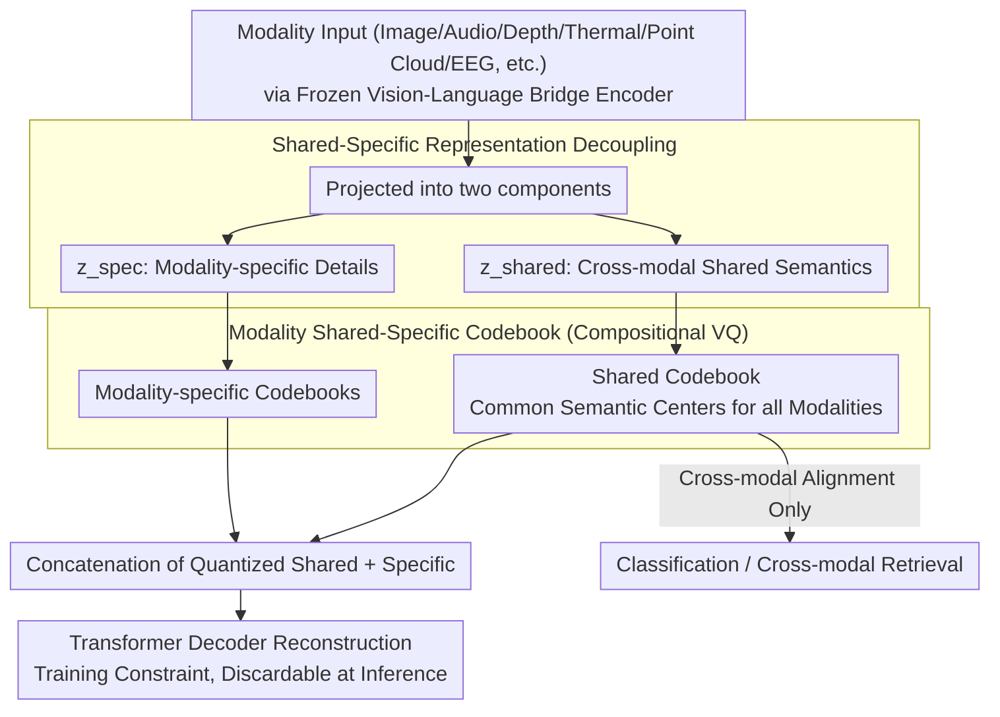

# CodeBind: Decoupled Representation Learning for Multimodal Alignment with Unified Compositional Codebook

**Conference**: ACL2026 Findings  
**arXiv**: [2605.18257](https://arxiv.org/abs/2605.18257)  
**Code**: https://visual-ai.github.io/codebind  
**Area**: Multimodal Alignment / 3D Vision  
**Keywords**: Multimodal Representation, Compositional Vector Quantization, Shared-specific Decoupling, Codebook, Cross-modal Retrieval

## TL;DR
CodeBind revamps ImageBind/ViT-Lens style multimodal alignment using shared-specific representation decoupling and a compositional VQ codebook. It simultaneously improves cross-modal classification/retrieval across nine modalities while preserving stronger mode-specific fine-grained information.

## Background & Motivation
**Background**: Multimodal representation alignment is key to enabling LLMs, robotics, and perception systems to access multi-sensor inputs such as images, videos, audio, depth, thermal, tactile, point clouds, and EEG. The mainstream approach typically aligns specialized modalities into a mature vision-language space, using models like OpenCLIP, ImageBind, or ViT-Lens as bridges.

**Limitations of Prior Work**: First, "hard alignment" compresses all modalities into a single shared space, often leading to a "least common denominator" effect: while cross-modal semantic consistency is achieved, modality-unique information such as color, texture, tactile pressure, and thermal signals is flattened. Second, specialized modality data is far scarcer than image-text data; during training, dominant modalities can overwhelm the space, suppressing low-resource or rare modalities. Third, existing methods often rely on large-scale paired data, synthetic data, or unified encoders, making expansion to new modalities costly.

**Key Challenge**: Cross-modal tasks require a shared semantic space, but fine-grained recognition and robotic perception necessitate the preservation of modality-private details. Complete sharing results in over-compression; complete separation prevents cross-modal retrieval and interaction.

**Goal**: The authors aim to achieve two objectives through "partial alignment": placing cross-modal consistent semantics into a shared space for classification and retrieval, and placing modality-unique details into a specific space for fine-grained recognition, reconstruction, and fusion.

**Key Insight**: The paper treats the VQ codebook as a distribution-agnostic discrete semantic substrate. The shared embeddings of different modalities share the same codebook to ensure consistent semantic centers, while each modality maintains its own specific codebook to prevent private information from being consumed by the shared space.

**Core Idea**: Using shared-specific representation decoupling combined with a compositional VQ codebook, the method expands expression capacity, reduces modality bias, and protects fine-grained features within a compact parameter set.

## Method

### Overall Architecture
CodeBind uses a frozen vision-language foundation model as a bridging space to gradually align target modalities to the text/image semantic space. The output of each modality encoder is first projected into two components: $z^{\mathcal{M}}_{shared}$ for cross-modal shared semantics and $z^{\mathcal{M}}_{spec}$ for modality-specific information. The shared component enters a codebook used by all modalities, while the specific component enters a modality-specific codebook. The quantized shared and specific embeddings are concatenated and passed to a Transformer decoder for reconstruction to ensure no information loss. During inference for cross-modal alignment, only the shared embedding is retained, and the reconstruction module can be discarded to reduce costs.

### Key Designs

**1. Shared-Specific Representation Decoupling: Separating Cross-modal Semantics and Private Details**

Traditional alignment directly maximizes mutual information between complete embeddings of two modalities. This forces private features like color, texture, and thermal patterns—along with noise—into the same space. While the shared concept of "cat" is captured, details like fur color and tactile pressure are flattened. CodeBind splits the modality encoder output into two paths: $z^{\mathcal{M}}_{shared}$ only participates in cross-modal alignment, while $z^{\mathcal{M}}_{spec}$ captures modality-specific information. The two paths are separated using an orthogonal constraint $\mathcal{L}_{orth}$ and a uniform constraint $\mathcal{L}_{uni}$, with a reconstruction loss $\mathcal{L}_{recon}$ forcing the specific component to retain non-redundant details. Thus, classification and retrieval use the shared component for "cat," while fine-grained retrieval can access the specific component for fur color or thermal patterns without mutual interference.

**2. Modality Shared-Specific Codebook: Discrete Codevectors as Unified Semantic Substrates**

If all modalities are crowded into a continuous space, dominant image-text modalities will govern the coordinate system, leaving low-resource modalities (Depth, Thermal, EEG) to follow. CodeBind treats the VQ codebook as distribution-agnostic discrete semantic centers: shared embeddings are quantized to a universal codebook $\mathcal{C}_{shared}$ to ensure semantic anchor alignment across modalities; each modality is also assigned a specific codebook $\mathcal{C}^{\mathcal{M}}_{spec}$. For instance, "striking" in the shared space represents general "hitting" semantics, but in the specific spaces of audio/video/tactile, it maps to sound, motion, and pressure patterns, respectively. The shared codebook prevents low-resource modalities from being biased by dominant ones, while specific codebooks prevent the collapse of all details into a single set of abstract semantics.

**3. Compositional Vector Quantization: High Capacity from Small Codebooks**

The most direct way to increase expressive power is to enlarge the codebook, but large codebooks introduce computational overhead, codebook collapse, and low utilization. CodeBind employs compositional quantization: a $d$-dimensional embedding is sliced into $m$ sub-vectors, each independently choosing a codevector from its own low-dimensional sub-codebook. If each sub-codebook has $K$ codevectors, the total compositional space reaches $K^m$. Consequently, the number of parameters remains nearly constant while the expressive capacity of discrete combinations grows exponentially, making it ideal for multimodal scenarios where new modalities are continuously added.

### Loss & Training
The training objective consists of several loss types. Cross-modal semantic alignment uses InfoNCE $\mathcal{L}_{align}$. Representation decoupling uses orthogonal loss $\mathcal{L}_{orth}$, uniform loss $\mathcal{L}_{uni}$, and reconstruction loss $\mathcal{L}_{recon}$. Codebook stability is maintained through EMA updates, commitment loss, dynamic re-initialization, and codevector regularization $\mathcal{L}_{cctr}$, $\mathcal{L}_{cuni}$. Cross-modal matching of the shared codebook is constrained by the Cross-Modal Code Matching loss $\mathcal{L}_{cm}$. To reduce manual tuning, the authors designed adaptive loss balancing using EMA to estimate loss magnitudes and dynamically scale weights relative to $\mathcal{L}_{align}$.

In implementation, CodeBind is integrated into ImageBind and ViT-Lens to produce CodeBind-IB and CodeBind-VL. Experiments use 1024 shared codevectors and 256 specific codevectors, with a codevector dimension of 8. Initialized from ImageBind/ViT-Lens, it was trained on 8 NVIDIA RTX 3090s with a learning rate of $5\times10^{-4}$. Target modality encoders can be fine-tuned via LoRA; adding new modalities only requires training a new codebook and its corresponding path.

## Key Experimental Results

### Main Results
The paper evaluates on 9 modalities across multiple classification and retrieval datasets. The table below highlights representative gains of CodeBind-IB over ImageBind; classification is Acc@1, AudioSet is mAP, and Clotho/AudioCaps use Recall@1/Recall@10.

| Modality/Dataset | ImageBind | CodeBind-IB (Ours) | Gain |
|-------------|----------:|------------:|-----:|
| NYU-D Depth Classification | 54.0 | 59.3 | +5.3 |
| SUN-D Depth Classification | 35.1 | 45.7 | +10.6 |
| AudioSet Audio Classification | 17.6 | 21.1 | +3.5 |
| VGGSound Audio Classification | 27.8 | 30.5 | +2.7 |
| ESC Audio Classification | 66.9 | 71.0 | +4.1 |
| LLVIP Thermal Classification | 63.4 | 95.5 | +32.1 |
| FLIR_v2 Thermal Classification | 46.6 | 97.2 | +50.6 |
| MSR-VTT Video Retrieval | 36.1 | 37.8 | +1.7 |
| AudioCaps Audio Retrieval | 9.3/42.3 | 13.3/53.8 | +4.0/+11.5 |

CodeBind-VL also consistently outperforms ViT-Lens; for example, ModelNet40 point cloud classification improved from 70.6/94.4 to 78.3/96.5, and IN-EEG improved from 41.8/42.7 to 54.5/54.1.

### Ablation Study

| Configuration | NYU-D | SUN-D | FLIR_v2 | Note |
|------|------:|------:|--------:|------|
| w/o codebook / w/o decoupling / w/o reconstruction | 54.0 | 35.1 | 46.6 | ImageBind Baseline |
| decoupling + reconstruction only | 54.1 | 39.7 | 94.5 | Decoupling significantly helps low-resource modalities |
| codebook only | 57.6 | 46.9 | 80.5 | Discrete substrate improves shared space |
| codebook + decoupling | 56.7 | 45.3 | 97.7 | Close to optimal |
| codebook + decoupling + reconstruction | 59.3 | 45.7 | 97.2 | Full proposed method |

### Key Findings
- Improvements are most significant in low-resource/high-variance datasets like Thermal and Depth, indicating that the codebook effectively counters modality bias.
- The specific embedding is not merely a reconstruction auxiliary; it contributes usable details in fine-grained retrieval and multimodal fusion.
- Compositional VQ improves over standard VQ by +10.8, +5.7, and +16.1 across three ablation datasets, primarily due to larger combinatorial expression capacity.
- The reconstruction module adds overhead during training but can be discarded during inference; its role is a training-time constraint to ensure the specific component retains information.

## Highlights & Insights
- **Partial alignment is more realistic for multi-sensors**: Robotics and medical scenarios do not benefit from complete modality homogenization. CodeBind's shared/specific division provides a clear modeling language for this.
- **Codebooks serve as both alignment tools and information regulators**: The shared codebook extracts cross-modal invariants, while the specific codebook captures modality-unique signals, providing more structural constraint than simple projectors.
- **Compositional VQ elegantly solves the capacity problem**: Using combinations of low-dimensional sub-vectors expands the expression space without infinitely enlarging the codebook.
- **Broad experimental coverage**: Ranging from image, video, and audio to depth, thermal, tactile, EEG, and point clouds, it demonstrates framework scalability rather than just validation on image-text.

## Limitations & Future Work
- While visual embedding specific information can be textually explained via VLMs, explaining specific information for modalities like tactile or EEG without strong foundation spaces remains challenging.
- Main results primarily use category name alignment for fairness; however, dense descriptions from LLMs/VLMs might further unlock the potential of the decoupled space, though this introduces dependency on description quality.
- The method still relies on bridge modalities and existing foundation models; if a new modality has weak semantic links to text/image, transfer performance may decline.
- Future work could integrate CodeBind into MLLMs for on-demand fusion, using gating to decide when to use shared concepts versus specific cues; this could also improve interpretability in medical diagnostics.

## Related Work & Insights
- **vs ImageBind / ViT-Lens**: These seek a unified space for all modalities; CodeBind adds a shared-specific codebook on top to reduce detail loss caused by hard alignment.
- **vs LanguageBind / FreeBind / OmniBind**: These often rely on large-scale or pseudo-paired data for expansion; CodeBind emphasizes naturally paired data and parameter-efficient codebook design.
- **vs MoE-based Unified Encoders**: MoE fuses modalities via routing but may collapse under data imbalance; CodeBind directly constrains representation structure via discrete codebooks and decoupling.
- **Insights**: For 3D, thermal, tactile, and medical multimodal tasks, shared embeddings can be used for cross-modal semantic retrieval, while specific embeddings can be utilized for diagnostic details, sensor anomalies, or fine-grained localization.

## Rating
- Novelty: ⭐⭐⭐⭐⭐ The combination of shared-specific decoupling and compositional codebooks is highly structural and addresses a core issue in multimodal hard alignment.
- Experimental Thoroughness: ⭐⭐⭐⭐⭐ Covers 9 modalities, multiple baselines, main experiments, and multi-layer ablations with solid evidence.
- Writing Quality: ⭐⭐⭐⭐☆ High method density but clear logic; some table layouts are complex and require background knowledge of multimodal baselines.
- Value: ⭐⭐⭐⭐⭐ Directly insightful for robotics, multi-sensor perception, and MLLMs integrating new modalities.

<!-- RELATED:START -->

## Related Papers

- [\[ECCV 2024\] UniCode: Learning a Unified Codebook for Multimodal Large Language Models](../../ECCV2024/multimodal_vlm/unicode_learning_a_unified_codebook_for_multimodal_large_language_models.md)
- [\[ACL 2025\] DALR: Dual-level Alignment Learning for Multimodal Sentence Representation Learning](../../ACL2025/multimodal_vlm/dalr_dual-level_alignment_learning_for_multimodal_sentence_representation_learni.md)
- [\[CVPR 2026\] Bridging the Modality Gap in Compositional Zero-Shot Learning via Sparse Alignment and Unimodal Memory Bank](../../CVPR2026/multimodal_vlm/bridging_the_modality_gap_in_compositional_zero-shot_learning_via_sparse_alignme.md)
- [\[ICML 2026\] DIVA: Harnessing the Representation Divergence in Unified Multimodal Models for Mutual Reinforcement](../../ICML2026/multimodal_vlm/diva_harnessing_the_representation_divergence_in_unified_multimodal_models_for_m.md)
- [\[ICML 2026\] Calibrated Multimodal Representation Learning with Missing Modalities](../../ICML2026/multimodal_vlm/calibrated_multimodal_representation_learning_with_missing_modalities.md)

<!-- RELATED:END -->
