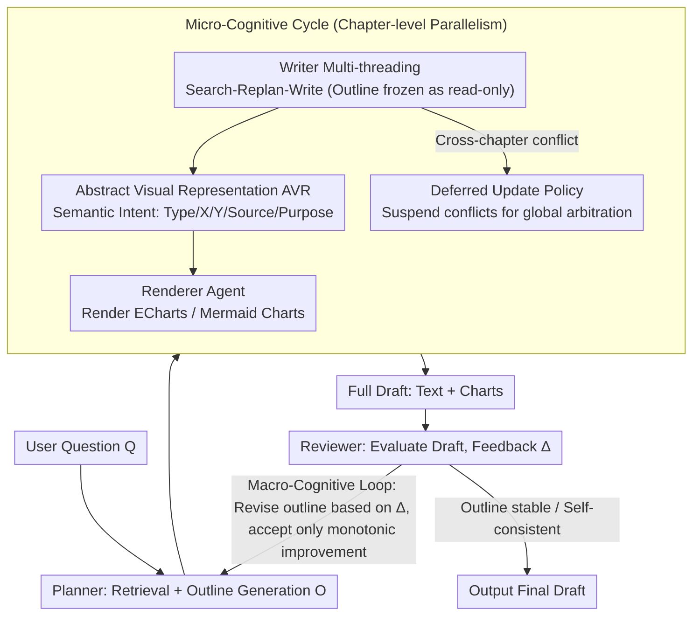

# CogGen: A Cognitively Inspired Recursive Framework for Deep Research Report Generation

**Conference**: ACL 2026 Findings  
**arXiv**: [2604.17072](https://arxiv.org/abs/2604.17072)  
**Code**: [GitHub](https://github.com/NJUNLP/CogGen)  
**Area**: Multimodal VLM  
**Keywords**: Deep research report, recursive writing framework, multimodal fusion, cognitive load assessment, multi-agent

## TL;DR
CogGen proposes a multi-agent recursive framework that simulates the human cognitive writing process. It implements macro-cognitive loops for global restructuring, micro-cognitive loops for parallel chapter refinement, and Abstract Visual Representation (AVR) for semantic-level text-chart synergistic planning, achieving human expert-level performance on the OWID benchmark and surpassing Gemini Deep Research.

## Background & Motivation

**Background**: Automated deep research report generation is a frontier application of LLMs. Existing solutions include single-agent systems (e.g., Gemini Deep Research) and multi-agent frameworks (e.g., STORM, Co-STORM), but they primarily follow linear, predefined workflows.

**Limitations of Prior Work**: Once content is generated in a linear workflow, it cannot be backtracked for modification. When downstream logic contradicts upstream organizational logic, "reverse restructuring" cannot occur. Furthermore, the generation of text and charts is typically asynchronous and decoupled, resulting in charts being mere illustrations rather than organic components of the argument.

**Key Challenge**: Writing by experts is a non-linear recursive process (plan → write → review → restructure → rewrite), whereas existing AI writing frameworks are linear forward processes, failing to achieve cross-chapter global consistency and deep text-chart synergy.

**Goal**: To construct a recursive report generation framework that supports global restructuring and multimodal semantic-level synergy.

**Key Insight**: The framework is designed based on Flower & Hayes’ cognitive process theory of writing and the theory of Cognitive Offloading.

**Core Idea**: A hierarchical recursive architecture (macro loops for global restructuring + micro loops for chapter refinement) combined with Abstract Visual Representation (AVR) to decouple chart generation from reasoning.

## Method

### Overall Architecture
CogGen consists of three peer cognitive agents: the Planner (retrieval and structure planning), the Writer (text writing and visual intent definition), and the Reviewer (real-time monitoring and post-evaluation). The Macro-Cognitive Loop recurses at the global report level: planning → writing → reviewing → feedback → re-planning. The Micro-Cognitive Cycle executes a "Search-Replan-Write" loop in parallel at the chapter level, where each thread treats the global outline as a frozen, read-only constraint. During writing, the Abstract Visual Representation (AVR) produces the semantic intent of charts, which is then rendered into images by the Renderer.

### Key Designs

**1. Macro-Cognitive Loop: Treating the outline as a mutable object to resolve the "locked-in" flaw of linear workflows**

Existing report generation solutions (STORM, Gemini Deep Research, etc.) follow a linear forward flow where the outline and content cannot be revisited once established. However, in real writing, drafting the latter half often reveals that the organizational logic of the first half needs restructuring. CogGen resolves this by treating the outline $\mathcal{O}$ as a mutable object rather than a fixed plan, iterating recursively at the global level: each round, the Planner generates an outline → the Writer drafts chapters in parallel → the Reviewer evaluates the full draft and produces feedback $\Delta^{(t)}$ → the Planner revises the outline accordingly:

$$\mathcal{O}^{(t+1)} = A_p\!\left(Q,\ \{\mathcal{O}^{(t)}, \Delta^{(t)}\}\,\middle|\,K\right)$$

Crucially, a strict monotonic improvement constraint is applied: a new outline is accepted only if the Reviewer verifies a clear improvement in quality; otherwise, the previous version is retained to avoid infinite oscillation between schemes. This "retroactive restructuring" capability enables CogGen to produce global consistency in long documents that linear systems cannot achieve.

**2. Micro-Cognitive Cycle: Parallel chapter writing without falling into the recursive trap of "modifying A triggers B and back to A"**

Parallel generation accelerates the process but introduces a pitfall: modifying Section 1 to adapt to new findings in Section 5 requires Section 5 to update in turn, causing context oscillation during serial revision. CogGen allows multiple threads to run a "Search-Replan-Write" loop in parallel, where each thread treats the global outline $\mathcal{O}^{(t)}$ as a read-only constraint and stores retrieval results in a local thread cache to avoid interference.

The core mechanism is the Deferred Update Policy: cross-chapter conflicts are not resolved locally but are deferred to the Reviewer for unified arbitration during the macro loop. This ensures local threads always write based on the same frozen outline, completely avoiding context oscillation while simultaneously achieving parallel efficiency and global consistency.

**3. Abstract Visual Representation (AVR): Planning charts and text at the semantic level rather than adding figures post-writing**

Traditionally, text and charts are generated asynchronously and decoupled, making charts mere illustrations rather than integral parts of the argument. AVR enables the Writer to produce structured semantic descriptions (Title, Chart_Type, X/Y_Axis, Data_Source, Purpose) rather than raw plotting code. An independent Renderer Agent then translates this semantic intent into ECharts/Mermaid code and renders it in a headless browser.

This allows the Writer to iterate on visual plans as if they were "semantic tokens" without being bogged down by pixel-level details. The theoretical basis is Cognitive Offloading—stripping visual design decisions from writing reasoning to reduce the Writer's cognitive load and allow focus on narrative logic. Since charts are planned from the same source as the text, they achieve true semantic synergy (ablations show AVR significantly improves data accuracy compared to direct code generation).

### A Complete Example: Generating a "Global Energy Transition" Report

Consider a user's question: "How has the global energy structure changed over the past 30 years?" **Macro Loop Round 1**: After retrieval, the Planner provides outline $\mathcal{O}^{(0)}$ = {Background, Fossil Fuel Share, Rise of Renewables, Regional Differences, Conclusion}. The Writer opens 5 parallel threads. During the "Rise of Renewables" chapter (Micro Cycle), the thread discovers key data better suited for "Regional Differences"; it does not change the outline locally but suspends and reports the conflict. Simultaneously, the Writer defines the AVR for that chapter: `{Chart_Type: line, X: year, Y: share%, Data_Source: OWID, Purpose: Show growth of wind/solar from 2000 to 2023}`, which the Renderer uses to generate a line chart.

**The Reviewer evaluates** the full draft, notes that "Regional Differences" is sparse and acknowledges the suspended conflict, generating feedback $\Delta^{(0)}$: suggesting migrating renewable data and adding a section "Catch-up of Developing Countries." **Macro Loop Round 2**: The Planner revises the outline to $\mathcal{O}^{(1)}$ based on $\Delta^{(0)}$, but it is only accepted if the Reviewer confirms higher quality. This recursion continues until the outline stabilizes, chapters are self-consistent, and charts align with the arguments. This three-layered mechanism integrates "retroactive restructuring + deferred conflict arbitration + single-source text-graphics" in a way linear systems cannot.

### Loss & Training
CogGen is a pure inference-time framework and does not involve training. It uses GPT-4.1 as the backbone for each agent and GPT-4.1-Mini for search expansion, with a temperature of 0.5.

## Key Experimental Results

### Main Results

| Dataset | Method | Average | Organization | Depth | Alignment | Synergy |
|--------|------|--------|------|------|------|------|
| OWID | Human Expert (Ref) | 0.4997 | 0.4986 | 0.5000 | 0.5000 | 0.5000 |
| OWID | CogGen | 0.4992 | 0.4972 | 0.5813 | 0.4806 | 0.4326 |
| OWID | WriteHere | 0.4502 | 0.4912 | 0.5503 | 0.3846 | 0.3312 |
| OWID | STORM | 0.3205 | 0.4253 | 0.4443 | 0.1675 | 0.1667 |
| WildSeek | Gemini DR (Ref) | 0.5000 | 0.5000 | 0.5000 | 0.5000 | 0.5000 |
| WildSeek | CogGen | 0.5341 | 0.5389 | 0.5000 | 0.5544 | 0.5437 |

### Ablation Study

| Configuration | Average | Description |
|------|--------|------|
| GPT-4.1 + Search (No Framework) | 0.4119 | Single-agent baseline |
| CogGen w/o Reviewer | 0.4681 | Quality drops significantly without Reviewer |
| CogGen Two-stage (No native multimodal) | 0.4904 | Separate generation of text and charts |
| CogGen Full | 0.4994 | All components synergistic |

### Key Findings
- CogGen reaches human expert levels on OWID (0.4992 vs. 0.4997) and surpasses Gemini Deep Research on WildSeek (0.5341 vs. 0.5000).
- Multimodal alignment and synergy (D4, D5) are core advantages of CogGen over STORM/Co-STORM, with score gaps exceeding 0.3.
- Removing the Reviewer results in the largest performance decline, indicating that the review-feedback loop is central to quality assurance.
- AVR significantly improves data accuracy compared to Fixed Direct Visualization (FDV/direct code generation).

## Highlights & Insights
- The **Macro-Micro dual-layer recursive** design accurately simulates the non-linear characteristics of human writing; the ability to restructure the outline after drafting the full text is the key to surpassing linear systems.
- The **Deferred Update Policy** effectively resolves context oscillation in parallel generation by leaving conflicts to a global reviewer rather than local modifications, avoiding recursive modification pitfalls.
- AVR decouples "what to show" from "how to draw," a principle applicable to any scenario requiring text-code synergistic generation.

## Limitations & Future Work
- Dependency on closed-source models such as GPT-4.1 makes it high-cost and difficult to replicate.
- The convergence speed of recursive loops is not fully analyzed; actual generation time may be long.
- Although theoretically grounded, the evaluation framework CLEF relies on GPT-5 as an evaluator, introducing potential evaluation bias.
- Supports only static text and charts, with no support for interactive visualizations.

## Related Work & Insights
- **vs STORM/Co-STORM**: These use multi-perspective QA and collaborative writing but lack global restructuring capabilities.
- **vs WriteHere**: Supports recursive decomposition but remains a forward-generation process, unable to modify already generated content in reverse.
- **vs Gemini Deep Research**: Commercial systems remain limited by fixed frameworks during the writing execution stage; CogGen surpasses their output quality on WildSeek.

## Rating
- Novelty: ⭐⭐⭐⭐ Systematized application of cognitive writing theory in AI report generation is novel.
- Experimental Thoroughness: ⭐⭐⭐⭐ Two datasets, multi-baseline comparisons, detailed ablations, and manual evaluation verification.
- Writing Quality: ⭐⭐⭐⭐⭐ Clear theoretical motivation, excellent illustrations, and fluent narrative.

<!-- RELATED:START -->

## Related Papers

- [\[ICML 2026\] WeatherSyn: An Instruction Tuning MLLM For Weather Forecasting Report Generation](../../ICML2026/multimodal_vlm/weathersyn_an_instruction_tuning_mllm_for_weather_forecasting_report_generation.md)
- [\[AAAI 2026\] PET2Rep: Towards Vision-Language Model-Driven Automated Radiology Report Generation for Positron Emission Tomography](../../AAAI2026/multimodal_vlm/pet2rep_towards_vision-language_model-drived_automated_radiology_report_generati.md)
- [\[ACL 2025\] MEIT: Multimodal Electrocardiogram Instruction Tuning on Large Language Models for Report Generation](../../ACL2025/multimodal_vlm/meit_multimodal_electrocardiogram_instruction_tuning_on_large_language_models_fo.md)
- [\[ICML 2026\] Deep Pre-Alignment for VLMs](../../ICML2026/multimodal_vlm/deep_pre-alignment_for_vlms.md)
- [\[CVPR 2026\] CAD-Refiner: A Unified Framework for CAD Generation and Iterative Editing](../../CVPR2026/multimodal_vlm/cad-refiner_a_unified_framework_for_cad_generation_and_iterative_editing.md)

<!-- RELATED:END -->
