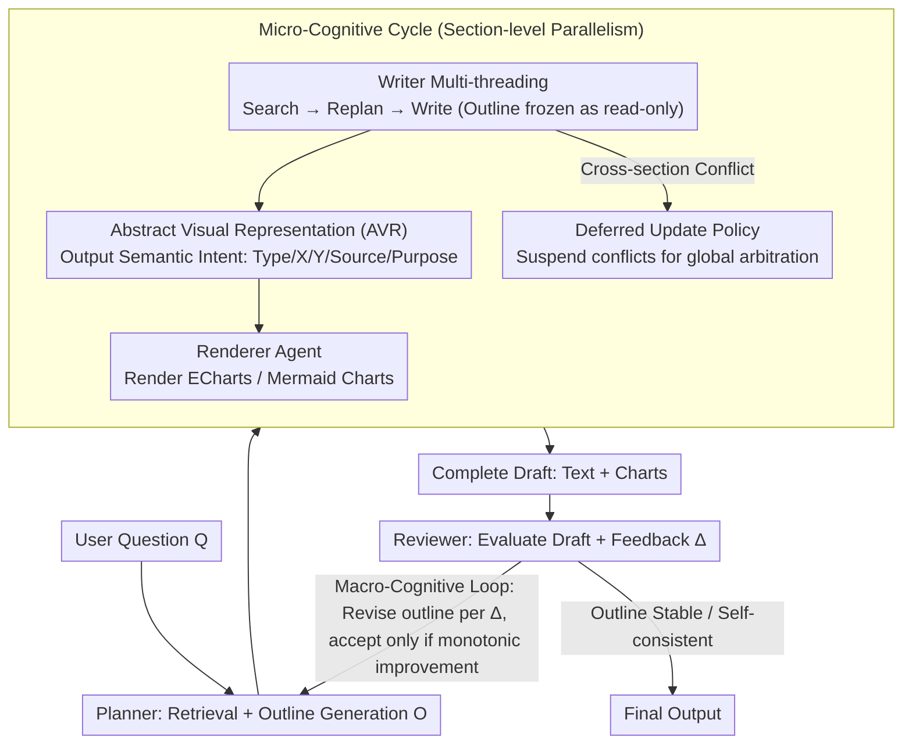

# CogGen: A Cognitively Inspired Recursive Framework for Deep Research Report Generation

**Conference**: ACL 2026 Findings  
**arXiv**: [2604.17072](https://arxiv.org/abs/2604.17072)  
**Code**: [GitHub](https://github.com/NJUNLP/CogGen)  
**Area**: Multimodal VLM  
**Keywords**: Deep Research Report, Recursive Writing Framework, Multimodal Fusion, Cognitive Load Assessment, Multi-agent  

## TL;DR
CogGen proposes a multi-agent recursive framework that simulates the human cognitive writing process. Through a Macro-Cognitive Loop for global restructuring, a Micro-Cognitive Cycle for parallel section refinement, and Abstract Visual Representation (AVR) for semantic-level text-chart coordination, it achieves human-expert performance on the OWID benchmark and outperforms Gemini Deep Research.

## Background & Motivation

**Background**: Automated deep research report generation is a frontier application for LLMs. Existing solutions are categorized into single-agent systems (e.g., Gemini Deep Research) and multi-agent frameworks (e.g., STORM, Co-STORM), all of which typically follow linear predefined workflows.

**Limitations of Prior Work**: Linear workflows cannot backtrack to modify content once generated—if downstream processes discover flaws in the initial organizational logic, "reverse restructuring" is impossible. Furthermore, text and chart generation are usually asynchronous and decoupled, resulting in charts being mere illustrations rather than organic components of the argument.

**Key Challenge**: Expert writing is a non-linear recursive process (plan → write → review → restructure → rewrite), whereas existing AI writing frameworks are linear forward processes, failing to achieve global consistency across sections and deep text-chart synergy.

**Goal**: To build a recursive report generation framework that supports global restructuring and multimodal semantic-level coordination.

**Key Insight**: Design the framework based on Flower & Hayes’ cognitive process theory of writing and the theory of Cognitive Offloading.

**Core Idea**: A hierarchical recursive architecture (Macro loop for global restructuring + Micro loop for section refinement) combined with Abstract Visual Representation to decouple chart generation from reasoning.

## Method

### Overall Architecture
CogGen consists of three peer cognitive agents: Planner (retrieval + structural planning), Writer (text writing + visual intent definition), and Reviewer (real-time monitoring + post-evaluation). The Macro-Cognitive Loop recurses at the global report level: planning → writing → reviewing → feedback → re-planning. The Micro-Cognitive Cycle executes a "Search-Replan-Write" loop in parallel at the section level, where each thread treats the global outline as a read-only constraint; during writing, Abstract Visual Representation (AVR) outputs the semantic intent of charts, which is then rendered by a Renderer.

### Key Designs

**1. Macro-Cognitive Loop: Treating the outline as a mutable object to solve the "locked-in" content issue of linear workflows.**

Existing report generation solutions (STORM, Gemini Deep Research, etc.) use linear forward flows—once an outline is set and content written, there is no going back. In real writing, discoveries made in later stages often necessitate restructuring the earlier parts. CogGen treats the outline $\mathcal{O}$ as a mutable object rather than a fixed plan, allowing global recursive iteration: each round the Planner generates an outline → Writer creates section drafts in parallel → Reviewer evaluates the full draft and produces feedback $\Delta^{(t)}$ → Planner revises the outline accordingly:

$$\mathcal{O}^{(t+1)} = A_p\!\left(Q,\ \{\mathcal{O}^{(t)}, \Delta^{(t)}\}\,\middle|\,K\right)$$

Crucially, a strict monotonic improvement constraint is applied: a new outline is only accepted if the Reviewer verifies a clear improvement in quality; otherwise, the previous version is retained to prevent infinite oscillation between two plans. This reverse restructuring capability enables CogGen to produce global consistency in long documents.

**2. Micro-Cognitive Cycle: Parallel section writing without falling into "recursive traps" of inter-dependent revisions.**

While parallel generation improves speed, it risks "context oscillation" where modifying Section A to fit Section 5 triggers a subsequent update to Section 5. CogGen runs the "Search-Replan-Write" cycle in parallel threads, treating the global outline $\mathcal{O}^{(t)}$ as a read-only constraint and storing retrieval results in local thread caches to avoid interference.

The core innovation is the Deferred Update Policy: cross-section conflicts are not resolved locally but are deferred to the Reviewer for unified arbitration in the Macro-Cognitive Loop. This ensures local threads always write based on the same frozen outline, effectively avoiding context oscillation.

**3. Abstract Visual Representation (AVR): Planning charts and text at the semantic level rather than appending figures post-hoc.**

Unlike traditional methods where text and charts are generated asynchronously, AVR ensures Writer does not output executable drawing code directly. Instead, it generates structured semantic descriptions (Title, Chart_Type, X/Y_Axis, Data_Source, Purpose). A separate Renderer Agent translates this semantic intent into ECharts/Mermaid code and renders it in a headless browser.

This allows the Writer to iterate on visual plans as if they were "semantic tokens," without getting bogged down in pixel-level details. Grounded in Cognitive Offloading theory, this design reduces the Writer's cognitive load, allowing focus on narrative logic while ensuring semantic synergy between text and visual evidence.

### Loss & Training
CogGen is a pure inference-time framework and does not involve training. It uses GPT-4.1 as the backbone for all agents and GPT-4.1-Mini for search expansion, with a temperature of 0.5.

## Key Experimental Results

### Main Results

| Dataset | Method | Avg. | Organization | Depth | Alignment | Synergy |
|--------|------|--------|------|------|------|------|
| OWID | Human Expert (Ref) | 0.4997 | 0.4986 | 0.5000 | 0.5000 | 0.5000 |
| OWID | **Ours (CogGen)** | **0.4992** | 0.4972 | 0.5813 | 0.4806 | 0.4326 |
| OWID | WriteHere | 0.4502 | 0.4912 | 0.5503 | 0.3846 | 0.3312 |
| OWID | STORM | 0.3205 | 0.4253 | 0.4443 | 0.1675 | 0.1667 |
| WildSeek | Gemini DR (Ref) | 0.5000 | 0.5000 | 0.5000 | 0.5000 | 0.5000 |
| WildSeek | **Ours (CogGen)** | **0.5341** | 0.5389 | 0.5000 | 0.5544 | 0.5437 |

### Ablation Study

| Configuration | Avg. Score | Description |
|------|--------|------|
| GPT-4.1 + Search (No Framework) | 0.4119 | Single-agent baseline |
| CogGen w/o Review | 0.4681 | Significant quality drop without Reviewer |
| CogGen Two-stage (No AVR) | 0.4904 | Decoupled text and chart generation |
| **CogGen Full** | **0.4994** | All components synchronized |

### Key Findings
- CogGen reaches human-expert levels on OWID (0.4992 vs 0.4997) and outperforms Gemini Deep Research on WildSeek (0.5341 vs 0.5000).
- Multimodal alignment and synergy (D4, D5) are core advantages over STORM/Co-STORM (score gap > 0.3).
- Removing the Reviewer causes the largest performance drop, indicating that the review-feedback loop is central to quality assurance.
- AVR significantly improves data accuracy compared to direct code generation (FDV).

## Highlights & Insights
- The **Macro-Micro Dual Recursive** design accurately simulates the non-linear nature of human writing—the ability to revisit and restructure the outline after drafting is the key differentiator from linear systems.
- The **Deferred Update Policy** elegantly solves context oscillation in parallel generation by letting a global arbiter handle conflicts instead of local modifications.
- **AVR** decouples "what to show" from "how to draw," a principle that can be generalized to any task requiring text-code collaborative generation.

## Limitations & Future Work
- Dependent on closed-source models like GPT-4.1, leading to high costs and lack of reproducibility.
- The convergence speed of recursive loops is not fully analyzed; actual generation time can be significant.
- The evaluation framework (CLEF) depends on GPT-5 as an evaluator, which may introduce evaluation bias.
- Only supports static text and charts, not interactive visualizations.

## Related Work & Insights
- **vs STORM/Co-STORM**: These use multi-perspective QA and collaborative writing but lack global restructuring capabilities.
- **vs WriteHere**: Supports recursive decomposition but remains a forward-generation process that cannot modify previously generated content.
- **vs Gemini Deep Research**: While powerful, this commercial system is still limited by a fixed framework during execution; CogGen surpasses its output quality on WildSeek.

## Rating
- Novelty: ⭐⭐⭐⭐ Systematizing cognitive writing theory for AI report generation is novel.
- Experimental Thoroughness: ⭐⭐⭐⭐ Two datasets, multiple baselines, detailed ablation, and human evaluation.
- Writing Quality: ⭐⭐⭐⭐⭐ Clear theoretical motivation, excellent diagrams, and smooth narrative.

<!-- RELATED:START -->

## Related Papers

- [\[ICML 2026\] WeatherSyn: An Instruction Tuning MLLM For Weather Forecasting Report Generation](../../ICML2026/multimodal_vlm/weathersyn_an_instruction_tuning_mllm_for_weather_forecasting_report_generation.md)
- [\[AAAI 2026\] PET2Rep: Towards Vision-Language Model-Driven Automated Radiology Report Generation for Positron Emission Tomography](../../AAAI2026/multimodal_vlm/pet2rep_towards_vision-language_model-drived_automated_radiology_report_generati.md)
- [\[ACL 2025\] MEIT: Multimodal Electrocardiogram Instruction Tuning on Large Language Models for Report Generation](../../ACL2025/multimodal_vlm/meit_multimodal_electrocardiogram_instruction_tuning_on_large_language_models_fo.md)
- [\[ICML 2026\] Deep Pre-Alignment for VLMs](../../ICML2026/multimodal_vlm/deep_pre-alignment_for_vlms.md)
- [\[ACL 2026\] Almieyar-Oryx-BloomBench: A Bilingual Multimodal Benchmark for Cognitively Informed Evaluation of Vision-Language Models](almieyar-oryx-bloombench_a_bilingual_multimodal_benchmark_for_cognitively_inform.md)

<!-- RELATED:END -->
