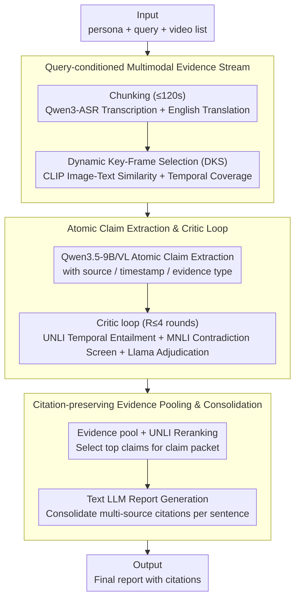

# CRAFT: Critic-Refined Adaptive Key-Frame Targeting for Multimodal Video Question Answering

**Conference**: ACL2026  
**arXiv**: [2605.19075](https://arxiv.org/abs/2605.19075)  
**Code**: https://github.com/bhosalems/CRAFT  
**Area**: Video Understanding / Multi-Video QA  
**Keywords**: Multi-video QA, Evidence Attribution, Key-frame Selection, ASR, critic refinement  

## TL;DR
CRAFT is a claim-centric pipeline for news event multi-video question answering. It combines dynamic key-frame selection, ASR transcription, iterative refinement via UNLI/MNLI/LLM critics, and citation consolidation, achieving a 0.739 macro average, 0.810 reference recall, and 0.635 citation F1 on MAGMaR-Test.

## Background & Motivation
**Background**: Multi-video QA and grounded generation require systems to extract facts from sets of related videos and provide traceable sources for each conclusion. News events are typical scenarios where answers are scattered across multiple clips, reports in different languages, interview audio, and on-screen text.

**Limitations of Prior Work**: Long videos impose severe token/frame budget pressure on VLMs. Uniform sampling often misses sparse but critical frames; visual-only approaches lose audio evidence like interviews, broadcasts, and official statements. Even when relevant frames are provided, VLMs may still generate details unsupported by visual or audio evidence.

**Key Challenge**: A high-performing system must simultaneously achieve "high fact coverage" and "correct citation for every fact." Simply increasing recall introduces unsupported claims, while being overly conservative misses key information from reference answers.

**Goal**: The authors aim to build a multi-video QA system for the MAGMaR 2026 oracle task by using atomic claims as an intermediate layer to extract, verify, and rank evidence before generating a final report with citations.

**Key Insight**: CRAFT avoids treating the initial VLM response as the final answer, instead introducing a critic loop at the claim level. It utilizes UNLI for video-claim temporal entailment, DeBERTa-v3 MNLI to screen for contradictions between claims, and Llama-3.2-3B for adjudication and repair feedback.

**Core Idea**: Decompose multi-video evidence into verifiable atomic claims, use specialized critics to remove weakly supported or contradictory claims, and finally merge duplicate facts into a report with multi-source citations.

## Method
The CRAFT pipeline consists of "multimodal evidence stream construction → atomic claim extraction → iterative critic refinement → claim scoring and selection → citation-preserving generation." It runs for each query and its associated video set, maintaining mapping from chunks to parent videos to ensure citations lead back to original source material.

### Overall Architecture
The input includes a persona, query, and a list of related videos. Long videos are first segmented into chunks of up to 120 seconds, with ASR and translations cached. For each query-video pair, dynamic key-frame selection provides compact visual input. Qwen3.5-9B/VL then extracts atomic claims with sources, timestamps, and evidence types. A critic loop refines claims for up to 4 rounds. Finally, claims are ranked by UNLI support scores, and a text-based LLM generates the final report.

### Key Designs

**1. Query-conditioned Multimodal Evidence Stream: Ensuring no audio or sparse frames are missed**
In multi-video news QA, critical evidence is often hidden in interview audio, on-screen text, or a few specific frames. Uniform sampling and visual-only pipelines tend to miss such evidence. CRAFT explicitly builds a query-conditioned evidence stream: videos are chunked at 120s intervals, and transcription is done once per unique video. Qwen3-ASR-1.7B serves as the primary ASR tool, with Whisper-large-v3 as a fallback for low-resource languages, followed by English translation. Visually, CLIP scores candidate frames, and Dynamic Key-frame Selection (DKS) balances query relevance with temporal coverage. This ensures both spoken content (audio) and key visuals are preserved as a comprehensive evidence base.

**2. Atomic Claim Extraction and Critic Loop: Sinking verification to the single-fact granularity**
Verification solely at the final report level is too coarse to locate specific errors. CRAFT forces the VLM to output individually verifiable atomic claims—each representing a single statement with an associated evidence modality. These are refined by a three-part critic loop: UNLI performs temporal entailment on the cited video segment, labeling claims with scores below $0.05$ as unsupported and those between $0.05$ and $0.5$ as weakly supported; DeBERTa-v3 MNLI identifies candidate contradictions where probability exceeds $0.5$; finally, Llama-3.2-3B confirms the contradictions and provides repair hints. Running for up to $R=4$ rounds, this loop aggressively purges hallucinations, temporal mismatches, and cross-claim contradictions, driving precision from 0.437 to 0.808.

**3. Citation-preserving Evidence Pooling and Consolidation: Deduplication without source loss**
MAGMaR evaluates both information quality and citation correctness; simple deduplication improves conciseness but hurts citation recall. CRAFT addresses this by pooling all refined claims for a query—each retaining its video ID, timestamp, modality, and claim ID. Top claims selected via UNLI scores form a "claim packet." The final text LLM is restricted to the information in this packet but must consolidate multiple source identifiers supporting the same fact into a single sentence. This avoids redundancy while ensuring all supporting sources are credited, balancing conciseness with citation recall.

### Loss & Training
CRAFT is a system pipeline and does not use end-to-end training loss. Key strategies involve inference-time constraints and verification: CLIP-based similarity for DKS, UNLI support scores for temporal grounding and ranking, MNLI for high-recall contradiction screening, and a Llama adjudicator for secondary confirmation.

## Key Experimental Results

### Main Results

| System | MAGMaR Ref-P | MAGMaR Ref-R | MAGMaR Cite-F1 | MAGMaR Avg | WikiVideo Ref-F1 | WikiVideo Cite-F1 | WikiVideo Avg |
|------|--------------|--------------|----------------|------------|------------------|-------------------|---------------|
| Molmo2-8B | 0.623 | 0.541 | 0.457 | 0.518 | 0.661 | 0.552 | 0.607 |
| InternVL-3.5-30B + ASR | 0.761 | 0.722 | 0.600 | 0.672 | 0.831 | 0.727 | 0.779 |
| Gemma-4-31B + ASR | 0.712 | 0.701 | 0.580 | 0.644 | 0.754 | 0.640 | 0.697 |
| CRAFT Baseline | 0.437 | 0.756 | 0.359 | 0.518 | 0.834 | 0.764 | 0.814 |
| + Critic Loop | 0.491 | 0.766 | 0.360 | 0.535 | 0.842 | 0.773 | 0.822 |
| + Atomic Claims | 0.808 | 0.762 | 0.426 | 0.673 | 0.735 | 0.848 | 0.809 |
| + ASR / Full CRAFT | 0.760 | 0.810 | 0.635 | 0.739 | 0.854 | 0.762 | 0.823 |

Full CRAFT achieves the highest overall average of 0.739 on MAGMaR-Test, with a reference recall of 0.810 and citation F1 of 0.635. On WikiVideo, it achieves an average of 0.823, outperforming the baseline and the visual+ASR variants of InternVL/Gemma.

### Ablation Study

| Ablation | Ref-P | Ref-R | Ref-F1 | Cite-P | Cite-R | Cite-F1 | Avg | Conclusion |
|------|-------|-------|--------|--------|--------|---------|-----|------|
| CRAFT full | 0.760 | 0.810 | 0.783 | 0.935 | 0.512 | 0.635 | 0.739 | Full System |
| Qwen3-Omni-30B-A3B instead of ASR-based backbone | 0.745 | 0.761 | 0.735 | 0.878 | 0.346 | 0.471 | 0.656 | Direct audio input is inferior to explicit ASR |
| Qwen replaces UNLI | 0.732 | 0.788 | 0.759 | 0.874 | 0.469 | 0.601 | 0.704 | Specialized temporal entailment is vital for citations |
| Qwen replaces Llama-3.2-3B adjudicator | 0.763 | 0.812 | 0.787 | 0.937 | 0.516 | 0.619 | 0.732 | 3B adjudicator is sufficient |
| Qwen unified critic, no MNLI screen | 0.743 | 0.798 | 0.770 | 0.909 | 0.493 | 0.619 | 0.722 | NLI pre-screening provides signals hard to replicate with prompts |

### Key Findings
- **Atomic claim formatting** is the key to MAGMaR precision, increasing Ref-P from the 0.437 baseline to 0.808.
- **ASR** is the core source for boosting recall and citations. Adding ASR reached a Ref-R of 0.810 and increased Cite-F1 from 0.426 to 0.635.
- Explicit **ASR transcripts** are more suitable for claim-centric verification than direct audio conditioning, as names, dates, and numbers can be directly checked by text verifiers.
- **DKS** improves precision under low frame budgets (e.g., MAGMaR reduced-frame DKS Ref-P of 0.822 vs. uniform 0.775), though recall may drop, indicating coverage trade-offs.
- In terms of generative quality, CRAFT outperforms other VLMs on MAGMaR (ROUGE-L 0.1839, AnsRel 0.6504) and WikiVideo.

## Highlights & Insights
- The primary value of this work lies in treating the intermediate representation of grounded video QA as a set of claims rather than a direct paragraph. Only when claims are small can they be verified fact-by-fact by NLI models and entailment scorers.
- The role of ASR is proven to be dominant. In news videos, many facts originate from speech, which visual-only VLMs frequently miss.
- The critic loop is pragmatically designed. UNLI, MNLI, and small LLMs serve distinct roles rather than forcing a single large model to handle all verification tasks.
- Citation merging is a clever engineering design tailored to specific task metrics, avoiding redundancy while naturally increasing citation recall.

## Limitations & Future Work
- Recall and citation recall remain challenging. Full CRAFT's Cite-R on MAGMaR is only 0.512, indicating that identifying the correct fact and correctly attributing it to the specific video segment is far from solved.
- Low-resource language ASR is a weak point. The system filters noisy or repetitive transcripts, which reduces noise but may discard useful info from low-resource languages.
- DKS boosts precision at low frame counts but can sacrifice recall; future work needs to better balance query relevance with total coverage.
- Future directions include stronger cross-video retrieval, more robust multilingual ASR, and incorporating human feedback into system tuning.

## Related Work & Insights
- **vs uniform frame sampling VLM**: Uniform sampling is simple but misses sparse evidence in long videos; CRAFT uses DKS to select frames by query relevance.
- **vs Video-RAG pipeline**: Many Video-RAG systems rely on a single visual stream or end-of-process aggregation; CRAFT moves verification early to the claim extraction stage.
- **vs critic-driven video QA**: Conventional verifiers often check the final answer; CRAFT refines iteratively on each query-video claim set at a finer granularity.
- **Inspiration**: For multimodal tasks requiring citations, systems should prioritize designing verifiable intermediate objects and restrict generators to verified evidence packets.

## Rating
- Novelty: ⭐⭐⭐⭐ While individual components have precedents, the integration of ASR, DKS, claim critics, and citation merging into a robust system is compelling.
- Experimental Thoroughness: ⭐⭐⭐⭐ Covers MAGMaR and WikiVideo with extensive ablations; human evaluation is present but auxiliary.
- Writing Quality: ⭐⭐⭐⭐ Clear methodology and well-explained metrics, though tables are quite dense.
- Value: ⭐⭐⭐⭐ Highly relevant for video RAG and news analysis systems requiring cited answers, particularly for the claim-centric pipeline.

<!-- RELATED:START -->

## Related Papers

- [\[ICLR 2026\] A.I.R.: Adaptive, Iterative, and Reasoning-based Frame Selection For Video Question Answering](../../ICLR2026/video_understanding/air_enabling_adaptive_iterative_and_reasoning-based_frame_selection_for_video_qu.md)
- [\[CVPR 2026\] GIFT: Global Irreplaceability Frame Targeting for Efficient Video Understanding](../../CVPR2026/video_understanding/gift_global_irreplaceability_frame_targeting_for_efficient_video_understanding.md)
- [\[CVPR 2026\] MovieRecapsQA: A Multimodal Open-Ended Video Question-Answering Benchmark](../../CVPR2026/video_understanding/movierecapsqa_a_multimodal_open-ended_video_question-answering_benchmark.md)
- [\[CVPR 2026\] HERBench: A Benchmark for Multi-Evidence Integration in Video Question Answering](../../CVPR2026/video_understanding/herbench_a_benchmark_for_multi-evidence_integration_in_video_question_answering.md)
- [\[CVPR 2026\] Ego-Grounding for Personalized Question-Answering in Egocentric Videos](../../CVPR2026/video_understanding/ego-grounding_for_personalized_question-answering_in_egocentric_videos.md)

<!-- RELATED:END -->
