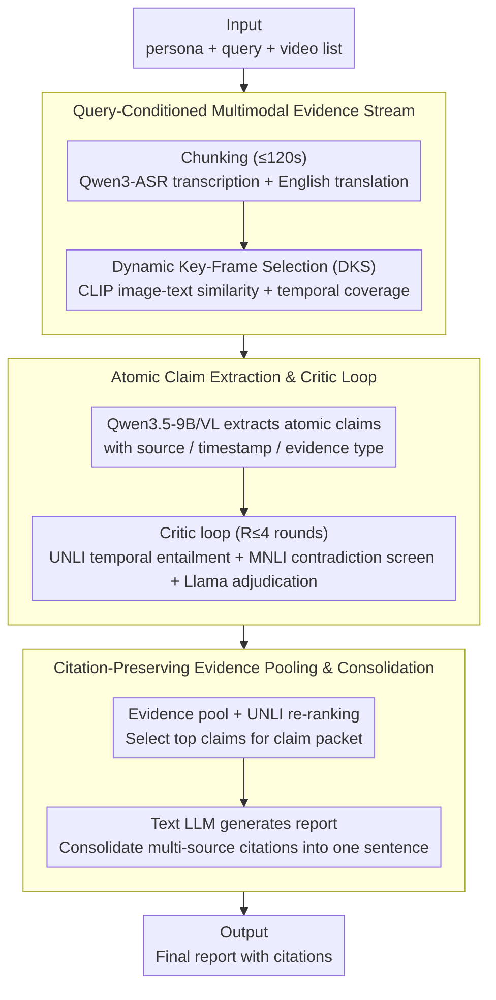

# CRAFT: Critic-Refined Adaptive Key-Frame Targeting for Multimodal Video Question Answering

**Conference**: ACL2026  
**arXiv**: [2605.19075](https://arxiv.org/abs/2605.19075)  
**Code**: https://github.com/bhosalems/CRAFT  
**Area**: Video Understanding / Multi-video QA  
**Keywords**: Multi-video QA, evidence attribution, key-frame selection, ASR, critic refinement  

## TL;DR
CRAFT is a claim-centric pipeline for multi-video question answering in news events. It combines dynamic key-frame selection, ASR transcription, iterative refinement via UNLI/MNLI/LLM critics, and citation consolidation, achieving 0.739 macro average, 0.810 reference recall, and 0.635 citation F1 on MAGMaR-Test.

## Background & Motivation
**Background**: Multi-video QA and grounded generation require systems to extract facts from a set of related videos and provide traceable sources for each conclusion. News events are particularly typical: answers may be scattered across multiple clips, reports in different languages, interview audio, and on-screen text.

**Limitations of Prior Work**: Long videos impose severe token/frame budget pressure on VLMs. Uniform sampling may miss sparse but critical frames; visual-only approaches lose speech evidence such as interviews, broadcasts, and official statements; even when relevant frames are fed into the model, VLMs may still generate details without visual or audio support.

**Key Challenge**: A high-performing system must simultaneously achieve "high fact coverage" and "correct citation for every fact." Simply improving recall introduces unsupported claims, while being overly conservative misses key information from the reference answer.

**Goal**: The authors aim to build a multi-video QA system for the MAGMaR 2026 oracle task that uses atomic claims as an intermediate layer to first extract, verify, and rank evidence, followed by the generation of a final report with citations.

**Key Insight**: Instead of treating the VLM's initial response as the final answer, CRAFT introduces a critic loop at the claim level. It uses UNLI for video-claim temporal entailment, DeBERTa-v3 MNLI to screen for contradictions between claims, and Llama-3.2-3B for adjudication and repair feedback.

**Core Idea**: First decompose multi-video evidence into verifiable atomic claims, then use specialized critics to remove weakly supported or contradictory claims, and finally consolidate duplicate facts into a report with multi-source citations.

## Method
CRAFT’s pipeline follows a sequence of "multimodal evidence stream construction → atomic claim extraction → iterative critic refinement → claim scoring and selection → citation-preserving generation." It runs for each query and its associated video set, maintaining a mapping from chunks to parent videos to ensure citations can be traced back to the source.

### Overall Architecture
The input consists of a persona, a query, and a list of related videos. The system first segments long videos into chunks of up to 120 seconds and caches ASR and translations for each; then, for each query-video pair, dynamic key-frame selection yields compact visual input, allowing Qwen3.5-9B/VL to extract atomic claims with sources, timestamps, and evidence types. The critic loop refines claims for up to 4 rounds. Finally, claims are ranked by UNLI support scores, and a text LLM generates the final report.

### Key Designs

**1. Query-Conditioned Multimodal Evidence Stream: Ensuring both audio and sparse key-frames are not missed**  
In multi-video news QA, critical evidence is often buried in interview audio, on-screen text, or a few specific frames. Both uniform sampling and visual-only pipelines tend to miss such evidence. CRAFT explicitly builds a query-conditioned evidence stream: videos are chunked at 120s, and each unique video is transcribed once using Qwen3-ASR-1.7B (falling back to Whisper-large-v3 for low-resource languages), followed by English translation for non-English transcripts. On the visual side, CLIP similarity scores candidate frames, followed by Dynamic Key-Frame Selection (DKS) to balance query relevance and temporal coverage. This ensures both spoken content (audio) and key visuals are preserved as a comprehensive evidence base.

**2. Atomic Claim Extraction and Critic Loop: Moving verification granularity down to individual facts**  
Checking at the final report level is too coarse to identify exactly which fact is incorrect. CRAFT forces the VLM to output individually verifiable atomic claims—each being a single statement with an evidence modality. These are refined by a three-party critic loop: UNLI evaluates temporal entailment for the cited video segment (claims below $0.05$ are considered unsupported, $0.05$ to $0.5$ weakly supported); DeBERTa-v3 MNLI identifies contradiction candidates where probability exceeds $0.5$; and Llama-3.2-3B confirms contradictions and provides repair hints. The loop runs for up to $R=4$ rounds or until the claim set stabilizes. Addressing hallucinations, temporal mismatches, and cross-claim contradictions at the claim level early on is key to raising precision from 0.437 to 0.808.

**3. Citation-Preserving Evidence Pooling and Consolidation: Deduplication without losing sources**  
MAGMaR evaluates both information quality and citation correctness; simple deduplication improves conciseness but hurts citation recall. CRAFT’s approach is to deposit all refined claims for a query into an evidence pool, maintaining metadata (video ID, timestamp, modality, claim ID). After re-ranking by UNLI, top claims form a "claim packet." The final text LLM is restricted to using information from the packet and must merge multiple source identifiers supporting the same fact into a single sentence. This avoids repetition while anchoring all supporting sources to the conclusion, balancing conciseness and citation recall.

### Loss & Training
CRAFT is a system pipeline and does not involve end-to-end training losses. Its key strategies lie in inference-time constraints and verification: DKS uses image-text similarity for frame selection, UNLI support scores are used for temporal grounding and claim ranking, MNLI serves as a high-recall contradiction candidate filter, and the Llama adjudicator handles secondary confirmation. The critic loop runs for a maximum of $R=4$ rounds.

## Key Experimental Results

### Main Results

| System | MAGMaR Ref-P | MAGMaR Ref-R | MAGMaR Cite-F1 | MAGMaR Avg | WikiVideo Ref-F1 | WikiVideo Cite-F1 | WikiVideo Avg |
|------|--------------|--------------|----------------|------------|------------------|-------------------|---------------|
| Molmo2-8B | 0.623 | 0.541 | 0.457 | 0.518 | 0.661 | 0.552 | 0.607 |
| InternVL-3.5-30B + ASR | 0.761 | 0.722 | 0.600 | 0.672 | 0.831 | 0.727 | 0.779 |
| Gemma-4-31B + ASR | 0.712 | 0.701 | 0.580 | 0.644 | 0.754 | 0.640 | 0.697 |
| CRAFT Baseline | 0.437 | 0.756 | 0.359 | 0.518 | 0.834 | 0.764 | 0.814 |
| + Critic Loop | 0.491 | 0.766 | 0.360 | 0.535 | 0.842 | 0.773 | 0.822 |
| + Atomic Claims | 0.808 | 0.762 | 0.426 | 0.673 | 0.735 | 0.848 | 0.809 |
| + ASR / Full CRAFT | 0.760 | 0.810 | 0.635 | 0.739 | 0.854 | 0.762 | 0.823 |

Full CRAFT achieves the highest overall average of 0.739 on MAGMaR-Test, with a reference recall of 0.810 and citation F1 of 0.635. On WikiVideo, the average is 0.823, slightly higher than the baseline's 0.814 and stronger than InternVL/Gemma visual+ASR variants.

### Ablation Study

| Ablation | Ref-P | Ref-R | Ref-F1 | Cite-P | Cite-R | Cite-F1 | Avg | Conclusion |
|------|-------|-------|--------|--------|--------|---------|-----|------|
| CRAFT full | 0.760 | 0.810 | 0.783 | 0.935 | 0.512 | 0.635 | 0.739 | Full system |
| Qwen3-Omni-30B-A3B replacing ASR backbone | 0.745 | 0.761 | 0.735 | 0.878 | 0.346 | 0.471 | 0.656 | Direct audio input is inferior to explicit ASR |
| Qwen replacing UNLI | 0.732 | 0.788 | 0.759 | 0.874 | 0.469 | 0.601 | 0.704 | Specialized temporal entailment is vital for citations |
| Qwen replacing Llama-3.2-3B adjudicator | 0.763 | 0.812 | 0.787 | 0.937 | 0.516 | 0.619 | 0.732 | 3B adjudicator is sufficient |
| Qwen unified critic, no MNLI screen | 0.743 | 0.798 | 0.770 | 0.909 | 0.493 | 0.619 | 0.722 | NLI pre-screening provides signals hard to replace by prompts |

### Key Findings
- Atomic claim formatting is critical for MAGMaR precision, increasing it from 0.437 in the baseline to 0.808.
- ASR is the core source for supplementing recall and citations. After adding ASR, Ref-R reached 0.810 and Cite-F1 improved from 0.426 to 0.635.
- Explicit ASR transcripts are better suited for claim-centric verification than direct audio conditioning, as names, dates, and numbers can be directly checked by subsequent text verifiers.
- DKS improves precision under low frame budgets. For example, MAGMaR reduced-frame DKS achieved Ref-P of 0.822, higher than the 0.775 of uniform sampling, though recall slightly decreased, indicating key-frame selection still faces coverage issues.
- On auxiliary generation quality, CRAFT achieved ROUGE-L/BERTScore/AnsRel of 0.1839/0.1709/0.6504 on MAGMaR and 0.3014/0.2683/0.6664 on WikiVideo, all higher than compared VLMs.

## Highlights & Insights
- The most valuable aspect of this paper is transforming the intermediate representation of grounded video QA into claims rather than direct paragraphs. Only when claims are small enough can they be verified item-by-item by models, NLI, and entailment scorers.
- The role of ASR is proven to be very strong. In news videos, many facts come from speech; visual-only VLMs easily miss interview and broadcast information.
- The critic loop design is pragmatic. UNLI, MNLI, and the small LLM fulfill their respective roles without forcing a single large model to handle all verification.
- Citation merging is an engineering design highly aligned with task metrics. It avoids repetitive writing while preserving multiple supporting sources, benefiting citation recall.

## Limitations & Future Work
- Recall and citation recall remain difficult. Full CRAFT's Cite-R on MAGMaR is only 0.512, indicating that finding correct facts and attributing them back to the correct video is not fully solved.
- Low-resource language ASR is still a point of failure. The system filters transcripts with low vocabulary diversity or high repetition, which reduces noise but may lose useful information in resource-scarce languages.
- DKS improves precision at low frame budgets but may sacrifice recall; a better balance between query relevance and broad coverage is needed.
- Future directions include stronger cross-video retrieval, more robust multilingual ASR, more precise claim-to-video attribution, and incorporating human evaluation feedback into system tuning.

## Related Work & Insights
- **vs uniform frame sampling VLM**: Uniform sampling is simple, but keyframes in long videos are sparse; CRAFT uses DKS to select keyframes based on the query.
- **vs Video-RAG pipeline**: Many Video-RAG systems rely on a single visual stream or end-of-answer aggregation; CRAFT moves verification up to the claim extraction stage.
- **vs critic-driven video QA**: Previous verifiers often acted as a final role checking the answer; CRAFT iteratively refines each query-video claim set at a finer granularity.
- **Inspiration for future systems**: Multimodal generation tasks requiring citations should prioritize designing verifiable intermediate objects and restrict the final generator to using verified evidence packets.

## Rating
- Novelty: ⭐⭐⭐⭐ While individual components have precedents, combining ASR, DKS, claim critic, and citation merging into a complete system is solid.
- Experimental Thoroughness: ⭐⭐⭐⭐ Coverying MAGMaR and WikiVideo with multiple system ablations; human evaluations are in the appendix, with the main text focusing on automatic metrics.
- Writing Quality: ⭐⭐⭐⭐ Method flow is clear and the metrics are well-explained; tables are dense, requiring attention to the differences between MAGMaR and WikiVideo settings.
- Value: ⭐⭐⭐⭐ Highly relevant for video RAG / news analysis systems requiring "answers + citations," particularly the claim-centric evidence pipeline.

<!-- RELATED:START -->

## Related Papers

- [\[ICLR 2026\] Meta-Adaptive Prompt Distillation for Few-Shot Visual Question Answering](../../ICLR2026/multimodal_vlm/meta-adaptive_prompt_distillation_for_few-shot_visual_question_answering.md)
- [\[AAAI 2026\] MacVQA: Adaptive Memory Allocation and Global Noise Filtering for Continual Visual Question Answering](../../AAAI2026/multimodal_vlm/macvqa_adaptive_memory_allocation_and_global_noise_filtering_for_continual_visua.md)
- [\[ACL 2026\] WikiSeeker: Rethinking the Role of Vision-Language Models in Knowledge-Based Visual Question Answering](wikiseeker_rethinking_the_role_of_vision-language_models_in_knowledge-based_visu.md)
- [\[CVPR 2026\] ReMoRa: Multimodal Large Language Model based on Refined Motion Representation for Long-Video Understanding](../../CVPR2026/multimodal_vlm/remora_multimodal_large_language_model_based_on_refined_motion_representation_fo.md)
- [\[ACL 2025\] WikiMixQA: A Multimodal Benchmark for Question Answering over Tables and Charts](../../ACL2025/multimodal_vlm/wikimixqa_a_multimodal_benchmark_for_question_answering_over_tables_and_charts.md)

<!-- RELATED:END -->
