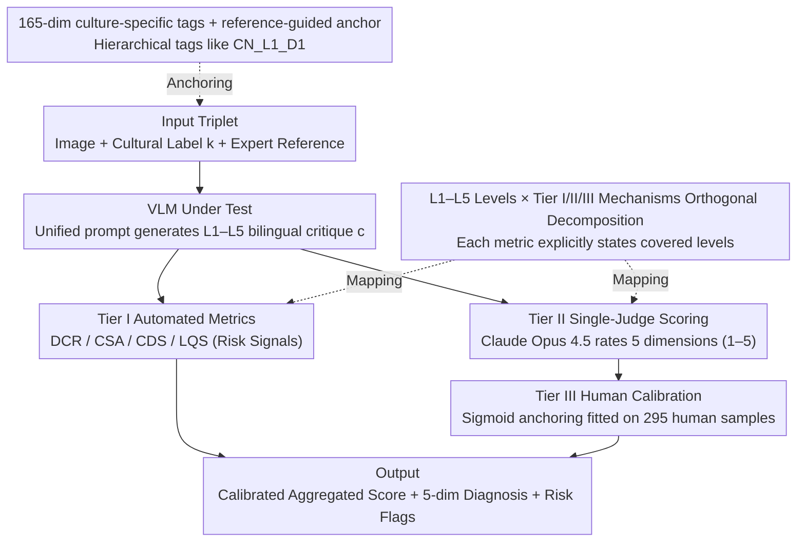

# Cross-Cultural Expert-Level Art Critique Evaluation with Vision-Language Models

**Conference**: ACL 2026  
**arXiv**: [2601.07984](https://arxiv.org/abs/2601.07984)  
**Code**: https://github.com/yha9806/VULCA-Framework  
**Area**: Multimodal VLM / Cultural Evaluation / Art Critique  
**Keywords**: Cross-cultural Evaluation, Art Critique, VLM-as-Judge, Human Calibration, Vulca-Bench

## TL;DR
This paper proposes Vulca-Bench, a three-tier evaluation framework (Automated Metrics + Single-Judge Scoring + Human Sigmoid Calibration) covering 6 major art traditions, 165 cultural dimensions, and an L1–L5 "visual description → cultural interpretation" hierarchy. For the first time, it quantitatively reveals that across 15 VLMs, "model performance drops significantly in deep cultural interpretation, with a systematic bias toward Western art."

## Background & Motivation

**Background**: Current evaluations of VLM cultural capabilities primarily focus on the perception layer (VQAv2, POPE, MME, SEED-Bench). Third-generation cultural probes (CulturalBench, CulturalVQA, GIMMICK), while introducing multi-national backgrounds, remain closed-ended QA, testing whether a model "recognizes a cultural symbol" rather than whether it can "interpret a painting like an art critic."

**Limitations of Prior Work**: When VLMs are applied to **open-ended generation** tasks like art critique, evaluation methods fail entirely. Automated metrics (like BLEU/ROUGE) only match keywords; LLM-as-Judge using dual-judge averaging suffers from severe scale inconsistency (the authors measured a cross-judge ICC(2,1) as low as $-0.50$); and mono-cultural studies (e.g., only evaluating Chinese paintings) cannot isolate "culture-specific difficulty" from "systematic Western bias."

**Key Challenge**: The evaluation **construct** (depth of cultural understanding) and the evaluation **mechanism** (automated metrics / judges / humans) are conflated. Existing studies claim "models understand culture" based on a 0.x score without clarifying the target capability level or validating the reliability of the measurement itself.

**Goal**: (1) Provide a verifiable hierarchical definition of cultural understanding; (2) Validate the reliability of various evaluation proxies (automated metrics / LLM judges) for cultural depth; (3) Use these validated tools to diagnose the true performance of 15 SOTA VLMs across 6 cultures.

**Key Insight**: The authors borrow from classic art theories: Panofsky's three stages of iconology (pre-iconographic description / iconographic analysis / iconological interpretation) and Goodman's theory of symbols. This maps precisely to an **empirically separable** five-level capability hierarchy: "L1 Visual Perception → L2 Technical Analysis → L3 Cultural Symbols → L4 Historical Context → L5 Philosophical Aesthetics"—meaning L1–L2 focus on "whether the VLM can see," while L3–L5 focus on "whether it understands."

**Core Idea**: Strictly distinguish between "Levels (L1–L5, the target construct)" and "Tiers (Tier I/II/III, the measurement mechanism)," explicitly declaring which levels each tier measures. Finally, use expert human scores to anchor the final aggregated score via **sigmoid calibration** on a single judge, avoiding the trap of non-convergent dual-judge averages.

## Method

### Overall Architecture

The input to Vulca-Bench is a triplet: (i) an artwork image, (ii) a cultural label $k$ (chosen from Chinese, Western, Japanese, Korean, Islamic, or Indian), and (iii) a bilingual expert reference critique. The VLM under test receives the image (compressed to $\leq 3.75$MB) and generates an L1–L5 bilingual critique $c$ following a unified prompt. $c$ then enters three parallel/serial tiers:

- **Tier I (Automated Metrics)**: Four metrics (DCR / CSA / CDS / LQS) are calculated on $c$ that do not require a judge, serving as "risk signals" rather than ranking indicators.
- **Tier II (Single-Judge Scoring)**: Claude Opus 4.5 serves as the sole judge, using the expert critique as a reference anchor (rather than a gold answer), to rate five dimensions (Coverage / Alignment / Depth / Accuracy / Quality) on a 1–5 scale.
- **Tier III (Human Calibration)**: A sigmoid function $S_{\text{II}}^{*}=1+4\sigma(a\cdot S_{\text{II}}+b)$ is fitted using 295 human-graded samples to map Tier II aggregated scores back to $[1,5]$, aligning them with human perception.

The pipeline finally outputs: (a) a calibrated aggregated score $S_{\text{II}}^{*}$, (b) a 5-dimension diagnostic breakdown, and (c) Tier I risk flags (e.g., low cultural coverage, weak semantic alignment, high templating risk).

### Key Designs

**1. Orthogonal Decomposition of L1–L5 Levels and Tier I/II/III Mechanisms: Decoupling "What to Measure" from "How to Measure"**

A common pitfall in cultural evaluation is conflating the model's capability level with the measurement method in a single total score. Consequently, high scores in L1–L2 (perception) can mask failures in L3–L5 (interpretation). This work explicitly labels which levels each metric covers (Table 2): Tier I's DCR/CSA use keyword matching and provide signals across L1–L5 but remain superficial; CDS uses hierarchical weighting $w_\ell=\ell/15$ (L1 accounts for $1/15$, L5 for $5/15$) to amplify deep contributions; LQS only reflects linguistic fluency. Similarly, Tier II's Depth and Alignment focus on L3–L5, while Coverage and Accuracy span all levels.  
This decomposition allows for the quantitative diagnosis of the "VLM can see but not understand" phenomenon—perception and interpretation scores are reported separately, making the monotonic performance collapse from L1–L2 to L3–L5 visible.

**2. Single-Judge + Sigmoid Calibration: Anchoring to Humans to Avoid the Non-convergence Trap of Dual Judges**

Standard LLM-as-Judge practices average scores from two judges to reduce variance. However, the authors found this fails in cultural tasks: among 8 candidate judges, OpenAI models (e.g., GPT-4o mean 4.52) were lenient while Anthropic models (e.g., Claude Opus 4.5 mean 3.42) were strict. The cross-judge ICC(2,1) fluctuated between $-0.50$ and $0.12$, all far below the 0.6 reliability threshold. Averaging these produces a systematic shift toward the median rather than a true consensus.  
Ours uses Claude Opus 4.5 as the sole judge (chosen for stable rank discrimination, consistent cultural sensitivity, and lack of self-favoritism) and fits $a,b$ in $S_{\text{II}}^{*}=1+4\sigma(a\cdot S_{\text{II}}+b)$ using 295 human samples to minimize MSE. Sigmoid is a monotonic invertible transform that keeps scores within $[1,5]$ while preserving rankings and, crucially, anchors "model scores" to "expert scores" for an interpretable absolute baseline.

**3. 165 Culture-specific Dimensions + Reference-guided Bilingual Critique: Upgrading from "Mentioning" to "Correct Attribution at the Right Level"**

Early LLM-judges rated free generation, essentially grading fluency. This work provides the judge with both the VLM generation and bilingual expert references for that culture. References act as anchors rather than gold answers; the judge determines if the VLM uses correct cultural terminology at the correct L-level, rather than simple keyword matching.  
This alignment is supported by a granular dataset: 165 culture-specific dimensions across 6 traditions (30 for China, 30 for India, 27 for Japan, etc.), each tagged with hierarchy labels like `CN_L1_D1`. VLMs are required to output in Chinese (preserving untranslatable terms like "Qiyun") and English (ensuring cross-cultural readability). This turns subjective grading into an objective measurement of "alignment with expert interpretation at a specific level."

### Loss & Training

Ours does not train the VLM but only trains the two sigmoid parameters $(a,b)$ in Tier III to minimize $\text{MSE}(S_{\text{II}}^{*}, S_h)$, where $S_h$ is the mean human score of the 295 training samples. Tier II's 5-dimension scores are **not** calibrated to maintain diagnostic granularity. Judge temperature is set to provider defaults ($T=1.0$); while this introduces non-determinism, the JSON-restricted integer grading template suppresses variance.

## Key Experimental Results

### Main Results

15 VLMs × 294 samples × 6 cultures = 4,405 model–sample evaluations (5 excluded due to parsing errors, 0.11%). Lower table shows 5 dimensions + calibrated $S_{\text{II}}^{*}$ total scores (selected top/mid/bottom):

| Model | $S_{\text{II}}^{*}$ | Coverage | Alignment | Depth | Accuracy | Quality |
|------|-----------|----------|-----------|-------|----------|---------|
| **Gemini-2.5-Pro** | **4.27** | 4.49 | 4.26 | 4.38 | 3.56 | 4.55 |
| Qwen3-VL-235B | 4.21 | 4.49 | 4.10 | 4.41 | 3.33 | 4.51 |
| Claude-Sonnet-4.5 | 4.11 | 4.29 | 4.05 | 4.00 | 3.44 | 4.48 |
| GPT-5 | 4.00 | 4.23 | 3.48 | 4.04 | 3.85 | 4.08 |
| Llama4-Scout | 3.67 | 4.21 | 3.48 | 3.36 | 2.96 | 4.10 |
| GPT-4o | 3.57 | 3.88 | 3.38 | 3.21 | 3.09 | 4.10 |
| GPT-4o-mini | 3.24 | 3.76 | 2.94 | 2.93 | 2.90 | 3.76 |
| **DeepSeek-VL2** | **3.01** | 3.50 | 2.74 | 2.64 | 2.72 | 3.78 |
| Dim Variance $\sigma$ | — | 0.33 | 0.48 | **0.56** | 0.35 | 0.24 |

- Top tier (top 3) and bottom tier (bottom 3) do not overlap at 95% bootstrap CI ($p<0.001$); middle rankings should be viewed as performance bands due to CI overlap.
- **Depth** and **Alignment** are the most discriminative dimensions ($\sigma=0.56$ / $0.48$), while Quality has the lowest variance ($\sigma=0.24$), confirming that "fluency is not the bottleneck; deep cultural understanding is."

### Ablation Study

| Configuration | Key Metric | Description |
|------|---------|------|
| Single Judge + Sigmoid (Ours) | MAE 0.446 (held-out $n=155$) | Reduced MAE by 1.7% compared to uncalibrated aggregated score (0.454) |
| Dual-Judge (Claude-Opus + GPT-5) | cross-judge ICC(2,1) = $-0.50$ | Systematic scale inconsistency; scores unreliable |
| Dual-Judge (Claude-Sonnet + GPT-5) | ICC(2,1) = $0.12$ | Still far below the 0.6 threshold |
| DCR$_\text{auto}$ vs Tier II Judge | ICC = 0.02 / Pearson $r=0.53$ | Keyword coverage is nearly uncorrelated with semantic understanding |
| CSA$_\text{auto}$ vs Judge | ICC = 0.17 / $r=0.44$ | Weakly correlated with judge and human gold standards |
| CDS$_\text{auto}$ vs Judge | ICC = 0.18 / $r=0.51$ | Moderately correlated but underestimates true cultural alignment |
| LQS$_\text{auto}$ vs Judge | ICC = $-0.17$ / $r=0.27$ | Fluency moves in the opposite direction of cultural depth |

### Key Findings

- **Monotonic L1–L2 → L3–L5 Performance Collapse**: All 15 VLMs perform well at the perception layer (Coverage, lowest 3.50) but drop significantly in interpretation (Alignment/Depth). The gap between DeepSeek-VL2's Coverage (3.50) and Depth (2.64) is nearly 1 point, confirming that image-caption training grants description capability but lacks cultural grounding.
- **13/15 Models Exhibit Systematic Western Bias**: The mean score difference between Chinese and Western art is $-0.39$ (Cohen's $d=-0.74$, $p<0.001$, 95% bootstrap CI $[-0.44,-0.34]$); GPT-4o-mini is the most biased ($\Delta=-1.08$), while GPT-5.2 is the most neutral ($\Delta=+0.07$).
- **Double Insurance via Control Groups**: The gap widens to $d=-0.93$ in the landscape sub-genre (controlling for subject matter). In a "blind-culture" setting (removing cultural labels), the gap $\Delta_{\text{blind}}=-0.61$ is greater than $\Delta_{\text{std}}=-0.54$. These results prove that Western bias stems from VLM training distribution bias rather than genre distribution or judge leakage.
- **Automated Metrics Measure Different Constructs**: All 4 Tier I metrics show ICC $<0.2$ relative to Tier II (DCR is 0.02), delivering a severe blow to the practice of using BLEU/ROUGE for evaluating cultural generation.

## Highlights & Insights

- **Orthogonal Decomposition as a Methodological Contribution**: In subjective tasks like cultural alignment, "what we want to measure" and "how we measure it" are often conflated. This paper maps every metric across L1–L5 cleanly, providing a roadmap for future VLM cultural evaluations.
- **Single-Judge + Sigmoid Calibration is an Excellent Engineering Trade-off**: While multi-judge averaging theoretically reduces variance, the measured negative ICC proves that scale mismatch outweighs variance gains. Using a single judge and calibrating for bias via human samples preserves scalability while achieving an "absolute scale."
- **"Blind-Culture" as an Intuitive Proof**: A common criticism is that judges are biased by knowing the cultural label. The authors' 50-sample ablation shows that removing labels actually widens the gap, clearly pinning the blame on VLM training distributions rather than evaluation design.
- **165-dim Fine-grained Tagging as Data-level Infrastructure**: Tagging expert critiques with `CN_L1_D1` allows Tier I keyword matching and Tier II alignment scoring. This "schema-driven evaluation data" approach can be transferred to any hierarchical open-ended generation task (e.g., medical diagnosis, legal opinions).

## Limitations & Future Work

- Sample distribution: Chinese and Western art account for 91% of samples. Calibration MAE increases by 6%+ for minority cultures (Korean $n=16$, Islamic $n=18$), suggesting calibration degrades with sparsity.
- Translation loss: The bilingual approach currently only includes Chinese-English. Native terms from Japanese, Korean, Arabic, or Hindi are only partially preserved via romanization; future work should include native language critiques.
- Single point of failure: The framework relies on Claude Opus 4.5 as the sole judge. Moreover, $T=1.0$ leads to $\pm 0.02$ score fluctuations, which may affect rankings for models with small performance gaps.
- Scale granularity: The 1–5 integer rubric limits expressiveness. A retrospective pilot using a 0.5-increment scale increased MAE to 0.4870, indicating rubric design remains an under-explored hyperparameter.
- Reasoning scaffolds: Few-shot experiments adding 1–3 expert critiques as exemplars actually led to performance drops, likely due to attention dilution or style overfitting. This implies simple ICL is insufficient for cultural interpretation; specialized L1→L5 reasoning scaffolds (e.g., retrieval-augmented exemplars) are needed.

## Related Work & Insights

- **vs CulturalBench / CulturalVQA / GIMMICK**: These focus on closed-ended QA ("which country is this symbol from"), while ours evaluates open-ended generation ("critique this like an expert") and is the only work covering cross-culture + L1–L5 layers + human calibration.
- **vs GalleryGPT / Strafforello et al. 2024**: These VLM art works focus on L1–L2 (style classification + Q&A). Ours pushes the evaluation to L3–L5 and quantifies the universal failure to reach L3.
- **vs G-Eval / MT-Bench / Prometheus-Vision**: These LLM-as-Judge papers are validated on generic English tasks; ours reveals that for culture-sensitive tasks, **dual-judge averaging collapses**, necessitating single-judge + human calibration.
- **vs Mono-cultural studies (Yu et al. 2025)**: Previous works only found VLM-expert discrepancies in Chinese paintings or non-Western cultures but could not decouple "culture-specific difficulty" from "systematic Western bias." Ours achieves this through 6-culture design + blind-culture controls, serving as a paradigm for cross-cultural research.

## Rating
- Novelty: ⭐⭐⭐⭐ The combination of cross-culture, L1–L5, and three-tier evaluation is the first of its kind; solid but not a disruptive single-point innovation.
- Experimental Thoroughness: ⭐⭐⭐⭐⭐ 15 VLMs × 6 cultures × 294 samples + 450 human ratings + bootstrap CI + blind control + genre control; metrics are exhaustive.
- Writing Quality: ⭐⭐⭐⭐⭐ Clear RQ–Contribution mapping, strict Tier vs Level distinction, and comprehensive appendices.
- Value: ⭐⭐⭐⭐⭐ Provides highly reusable evaluation protocols, 165-dimensional cultural tags, and hard evidence on judge reliability, offering direct infrastructure value to the AI community.

<!-- RELATED:START -->

## Related Papers

- [\[ACL 2026\] CArtBench: Evaluating Vision-Language Models on Chinese Art Understanding, Interpretation, and Authenticity](cartbench_evaluating_vision-language_models_on_chinese_art_understanding_interpr.md)
- [\[ACL 2026\] Cross-Modal Taxonomic Generalization in (Vision-) Language Models](cross-modal_taxonomic_generalization_in_vision-_language_models.md)
- [\[ACL 2025\] MultiMM: Cultural Bias Matters — Cross-Cultural Benchmark for Multimodal Metaphors](../../ACL2025/multimodal_vlm/multimm_cultural_metaphor.md)
- [\[ACL 2026\] VULCA-Bench: A Multicultural Vision-Language Benchmark for Evaluating Cultural Understanding](vulca-bench_a_multicultural_vision-language_benchmark_for_evaluating_cultural_un.md)
- [\[ACL 2026\] VIGNETTE: Socially Grounded Bias Evaluation for Vision-Language Models](vignette_socially_grounded_bias_evaluation_for_vision-language_models.md)

<!-- RELATED:END -->
