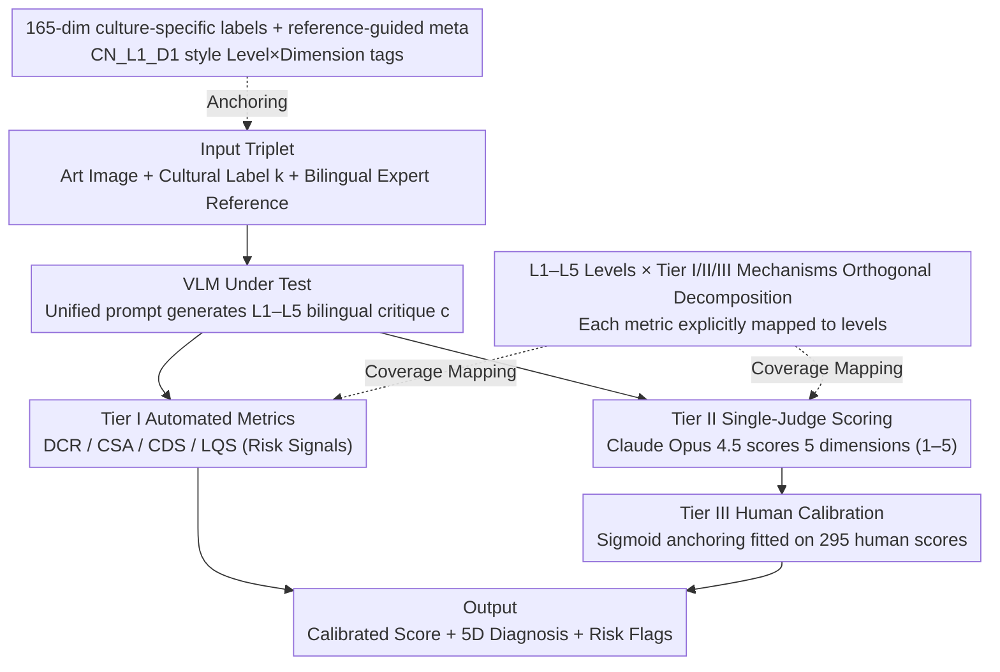

# Cross-Cultural Expert-Level Art Critique Evaluation with Vision-Language Models

**Conference**: ACL 2026  
**arXiv**: [2601.07984](https://arxiv.org/abs/2601.07984)  
**Code**: https://github.com/yha9806/VULCA-Framework  
**Area**: Multimodal VLM / Cultural Evaluation / Art Critique  
**Keywords**: Cross-cultural evaluation, art critique, VLM-as-Judge, human calibration, Vulca-Bench

## TL;DR
The paper proposes Vulca-Bench, a three-tier evaluation framework (automated metrics + single-judge scoring + human sigmoid calibration) covering 6 major art traditions, 165 cultural dimensions, and L1–L5 levels from "visual description" to "cultural interpretation." It quantifies for the first time that 15 VLMs exhibit a significant performance drop in deep cultural interpretation and a systematic preference for Western art.

## Background & Motivation

**Background**: Current evaluations of VLM cultural capabilities mainly focus on the perception layer (VQAv2, POPE, MME, SEED-Bench). Third-generation cultural probes (CulturalBench, CulturalVQA, GIMMICK), while introducing multi-national backgrounds, still utilize closed-set QA, testing "recognition of cultural symbols" rather than "interpreting a painting like an art critic."

**Limitations of Prior Work**: When VLMs are applied to **open-ended generation** tasks like art critique, evaluation methods fail entirely. Automated metrics (like BLEU/ROUGE) only match keywords; LLM-as-Judge using dual-judge averaging suffers from severe scale inconsistency (the authors measured cross-judge ICC(2,1) as low as $-0.50$); and mono-cultural studies (e.g., evaluating only Chinese painting) cannot separate "culture-specific difficulty" from "systematic Western bias."

**Key Challenge**: Evaluation **constructs** (depth of cultural understanding) and evaluation **mechanisms** (automated metrics / judges / humans) are often conflated. Models claiming to "understand culture" based on a 0.x score fail to specify which level is being measured or if the measurement itself is reliable.

**Goal**: (1) Provide a verifiable hierarchical definition of cultural understanding; (2) Validate the reliability of various evaluation proxies (automated metrics / LLM judge) for cultural depth; (3) Use these validated tools to diagnose the true performance of 15 SOTA VLMs across 6 cultures.

**Key Insight**: The authors borrow from classic art theory: Panofsky’s three stages of iconology (pre-iconographic description / iconographic analysis / iconological interpretation) and Goodman’s theory of notation. This corresponds to five **empirically separable** capability levels: "L1 Visual Perception → L2 Technical Analysis → L3 Cultural Symbols → L4 Historical Context → L5 Philosophical Aesthetics." Levels L1–L2 focus on "can the VLM see," while L3–L5 focus on "can it understand."

**Core Idea**: Strictly distinguish between "Levels (L1–L5, the measured construct)" and "Tiers (Tier I/II/III, the measurement mechanism)," explicitly declaring which L-level each Tier measures. A **single-judge anchor** is calibrated via human expert scores using a sigmoid function to avoid the non-convergence trap of dual-judge averaging.

## Method

### Overall Architecture

The input to Vulca-Bench is a triplet: (i) an artwork image, (ii) a cultural label $k$ (one of six: Chinese, Western, Japanese, Korean, Islamic, Indian), and (iii) a bilingual expert reference critique. The VLM under test receives the image (compressed to $\leq 3.75$MB) and generates a bilingual (Chinese/English) L1–L5 critique $c$ using a unified prompt. Then $c$ passes through three parallel/serial Tiers:

- **Tier I (Automated Metrics)**: Four quantitative metrics (DCR / CSA / CDS / LQS) are calculated on $c$ without a judge, serving as "risk signals" rather than ranking indicators.
- **Tier II (Single-Judge Scoring)**: Claude Opus 4.5 serves as the sole judge, using the expert critique as a reference anchor (not a gold answer) to score 5 dimensions (Coverage / Alignment / Depth / Accuracy / Quality) on a 1–5 scale.
- **Tier III (Human Calibration)**: A sigmoid function $S_{\text{II}}^{*}=1+4\sigma(a\cdot S_{\text{II}}+b)$ is fitted using 295 human-graded samples to map Tier II aggregate scores back to $[1,5]$, aligning them with human perception.

The pipeline outputs: (a) calibrated aggregate score $S_{\text{II}}^{*}$, (b) 5-dimensional diagnostic breakdown, and (c) Tier I risk flags (e.g., low cultural coverage, weak semantic alignment, high templating risk).

### Key Designs

**1. Orthogonal Decomposition of L1–L5 Levels and Tier I/II/III Mechanisms: Decoupling "what to measure" from "how to measure"**

A common pitfall in cultural evaluation is conflating the level of capability with the measurement tool. In Vulca-Bench, each metric is explicitly mapped to the L1–L5 levels it covers. Tier I's DCR/CSA are keyword matches providing signals across L1–L5 at a surface level; CDS uses level-weighting ($w_\ell=\ell/15$) to amplify deep-layer contributions. Tier II is similarly specialized: Depth and Alignment target L3–L5, while Accuracy and Coverage span all levels. This allows quantitative diagnosis of the "VLM can see but not understand" phenomenon by separating perception scores from interpretation scores.

**2. Single-Judge + Sigmoid Calibration: Anchoring one judge to humans to avoid the non-convergence trap**

Standard LLM-as-Judge practices use averaging to reduce variance, but the authors found this fails for cultural tasks. In testing 8 candidate judges, OpenAI models (GPT-4o mean 4.52) were lenient, while Anthropic models (Claude Opus 4.5 mean 3.42) were strict. The cross-judge ICC(2,1) ranged from $-0.50$ to $0.12$, all below the 0.6 reliability threshold. Vulca-Bench uses Claude Opus 4.5 as the sole judge (due to its stable rank discrimination and lack of self-favouritism) and fits a sigmoid $S_{\text{II}}^{*}=1+4\sigma(a\cdot S_{\text{II}}+b)$ to minimize MSE against human scores.

**3. 165 Culture-Specific Dimensions + Reference-Guided Bilingual Critique: Upgrading from "mentioning" to "correct attribution at the correct level"**

Rather than scoring free generation, the judge sees both the VLM output and a bilingual reference from an expert. The reference serves as an anchor, allowing the judge to determine if the VLM used the correct cultural terminology at the correct L-level. This is supported by 165 culture-specific dimensions (30 for China, 30 for India, etc.), with each expert critique tagged by level and dimension (e.g., `CN_L1_D1`).

### Loss & Training

Ours does not train the VLM; it only trains the two sigmoid parameters $(a,b)$ in Tier III to minimize $\text{MSE}(S_{\text{II}}^{*}, S_h)$, where $S_h$ is the mean human score for 295 training samples. Tier II's 5-dimensional scores are **not** calibrated to maintain diagnostic granularity. Judge temperature is set to $T=1.0$.

## Key Experimental Results

### Main Results

15 VLMs × 294 evaluation samples × 6 cultures = 4,405 model–sample assessments. The table shows Tier II dimensions and calibrated $S_{\text{II}}^{*}$ scores (top/mid/bottom selection):

| Model | $S_{\text{II}}^{*}$ | Coverage | Alignment | Depth | Accuracy | Quality |
|------|---------------------|----------|-----------|-------|----------|---------|
| **Gemini-2.5-Pro** | **4.27** | 4.49 | 4.26 | 4.38 | 3.56 | 4.55 |
| Qwen3-VL-235B | 4.21 | 4.49 | 4.10 | 4.41 | 3.33 | 4.51 |
| Claude-Sonnet-4.5 | 4.11 | 4.29 | 4.05 | 4.00 | 3.44 | 4.48 |
| GPT-5 | 4.00 | 4.23 | 3.48 | 4.04 | 3.85 | 4.08 |
| Llama4-Scout | 3.67 | 4.21 | 3.48 | 3.36 | 2.96 | 4.10 |
| GPT-4o | 3.57 | 3.88 | 3.38 | 3.21 | 3.09 | 4.10 |
| GPT-4o-mini | 3.24 | 3.76 | 2.94 | 2.93 | 2.90 | 3.76 |
| **DeepSeek-VL2** | **3.01** | 3.50 | 2.74 | 2.64 | 2.72 | 3.78 |
| Variance $\sigma$ | — | 0.33 | 0.48 | **0.56** | 0.35 | 0.24 |

- Top-tier and bottom-tier models show no overlap under bootstrap 95% CI ($p<0.001$).
- **Depth** and **Alignment** are the most discriminative dimensions ($\sigma=0.56$ / $0.48$), while Quality has the lowest variance ($\sigma=0.24$), confirming that fluency is not the bottleneck—deep cultural understanding is.

### Ablation Study

| Configuration | Key Metric | Description |
|------|---------|------|
| Single-Judge + Sigmoid (Ours) | MAE 0.446 (held-out $n=155$) | Reduced MAE by 1.7% compared to uncalibrated. |
| Dual-Judge (Opus + GPT-5) | ICC(2,1) = $-0.50$ | Systematic scale inconsistency; untrustworthy scores. |
| DCR$_\text{auto}$ vs Tier II Judge | Pearson $r=0.53$ | Keyword coverage is weakly related to semantic understanding. |
| CDS$_\text{auto}$ vs Judge | Pearson $r=0.51$ | Moderate correlation but underestimates true alignment. |
| LQS$_\text{auto}$ vs Judge | Pearson $r=0.27$ | Fluency correlates poorly with cultural depth. |

### Key Findings

- **Monotonic collapse from L1–L2 to L3–L5**: All 15 VLMs are strong at the perception level (Coverage $\geq 3.50$) but drop significantly at the interpretation level (Alignment/Depth). For instance, DeepSeek-VL2 drops nearly 1 point from Coverage (3.50) to Depth (2.64).
- **Systematic Western Bias in 13/15 models**: The mean Chinese-Western score difference was $-0.39$ (Cohen's $d=-0.74$, $p<0.001$). GPT-5.2 was the most neutral ($\Delta=+0.07$).
- **Bias Decoupling**: The gap widened to $d=-0.93$ in a landscape-only subset (controlling for genre). In a blind-culture setting (removing labels), the gap $\Delta_{\text{blind}}=-0.61$ was larger than $\Delta_{\text{std}}=-0.54$, proving preference stems from VLM training distributions rather than judge bias.
- **Metric-Judge Disconnect**: Tier I automated metrics showed ICC $< 0.2$ with Tier II scores, highlighting the inadequacy of using BLEU/ROUGE for cultural generation tasks.

## Highlights & Insights

- **Methodological contribution**: The "Construct/Mechanism Orthogonal Decomposition" provides a map for subsequent VLM cultural evaluations by explicitly defining Level coverage.
- **Engineering trade-off**: Single-judge + sigmoid calibration is an excellent compromise, preserving scalability while achieving an "absolute scale" tied to human experts.
- **Blind-culture discovery**: The finding that the gap increases without cultural labels is a clever counter-proof that attributes performance issues to VLM training data plutôt than evaluation design.
- **Data Engineering**: The use of 165-dimensional fine-grained cultural tags transforms subjective scoring into relatively objective alignment with expert interpretation.

## Limitations & Future Work

- Sample imbalance: Chinese and Western art constitute 91% of samples; calibration MAE increases by 6%+ for minority cultures like Korean or Islamic art.
- Language limits: The study is restricted to Chinese-English; future work should incorporate native languages (e.g., Japanese, Arabic) to minimize translation loss.
- Single-judge risk: Reliance on Claude Opus 4.5 creates a single point of failure and potential instability for closely ranked models due to temperature variance.
- ICL Failure: Few-shot experiments with expert exemplars actually degraded performance, suggesting simple ICL is insufficient for cultural interpretation and may require reasoning scaffolds.

## Related Work & Insights

- **vs CulturalBench / CulturalVQA**: These measure closed-set QA; ours measures open-ended generation and covers the full L1–L5 hierarchy with human calibration.
- **vs GalleryGPT**: These focus on L1–L2 (style/history); ours pushes evaluation to L3–L5 and quantifies the universal failure at these levels.
- **vs G-Eval / MT-Bench**: These rely on dual-judge averaging, while ours demonstrates that for culture-sensitive tasks, single-judge + human calibration is superior due to scale mismatch.

## Rating
- Novelty: ⭐⭐⭐⭐ 
- Experimental Thoroughness: ⭐⭐⭐⭐⭐ 
- Writing Quality: ⭐⭐⭐⭐⭐ 
- Value: ⭐⭐⭐⭐⭐ 

<!-- RELATED:START -->

## Related Papers

- [\[ACL 2026\] CArtBench: Evaluating Vision-Language Models on Chinese Art Understanding, Interpretation, and Authenticity](cartbench_evaluating_vision-language_models_on_chinese_art_understanding_interpr.md)
- [\[ACL 2026\] Cross-Modal Taxonomic Generalization in (Vision-) Language Models](cross-modal_taxonomic_generalization_in_vision-_language_models.md)
- [\[ACL 2026\] OMIBench: Benchmarking Olympiad-Level Multi-Image Reasoning in Large Vision-Language Models](omibench_benchmarking_olympiad-level_multi-image_reasoning_in_large_vision-langu.md)
- [\[ACL 2025\] MultiMM: Cultural Bias Matters — Cross-Cultural Benchmark for Multimodal Metaphors](../../ACL2025/multimodal_vlm/multimm_cultural_metaphor.md)
- [\[ACL 2026\] VULCA-Bench: A Multicultural Vision-Language Benchmark for Evaluating Cultural Understanding](vulca-bench_a_multicultural_vision-language_benchmark_for_evaluating_cultural_un.md)

<!-- RELATED:END -->
