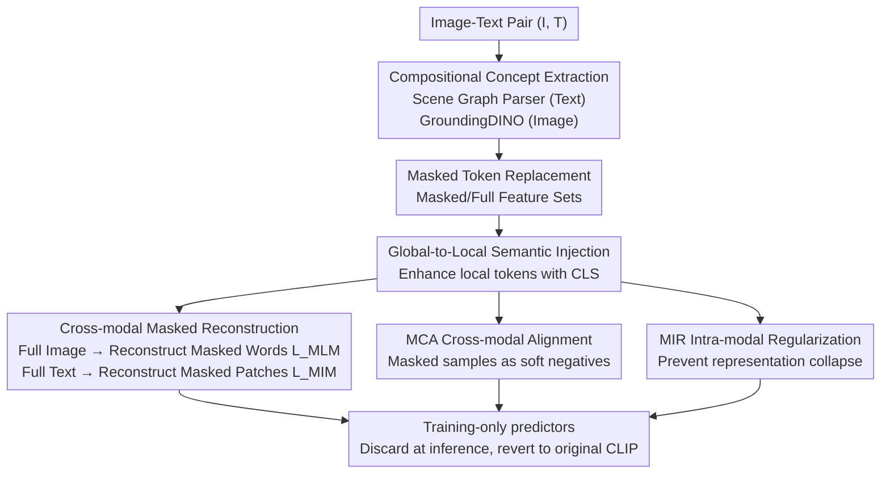

# Cross-Modal Masked Compositional Concept Modeling for Enhancing Visio-Linguistic Compositionality

**Conference**: ACL 2026  
**arXiv**: [2606.13288](https://arxiv.org/abs/2606.13288)  
**Code**: https://github.com/hiker-lw/MACCO  
**Area**: Multimodal VLM / Representation Learning  
**Keywords**: Compositional Understanding, CLIP, Masked Modeling, Cross-Modal Alignment, Vision-Language

## TL;DR
MACCO enables CLIP to mask compositional concepts such as "relations/attributes" in one modality and reconstruct them using complete information from the other modality. Combined with two auxiliary alignment losses, it significantly enhances the compositional understanding of VLMs without generating hard negative samples.

## Background & Motivation
**Background**: Contrastive vision-language models, represented by CLIP, project images and text into the same semantic space. They perform exceptionally well in tasks like retrieval, VQA, and text-to-image generation, serving as the de facto foundation for multimodal learning.

**Limitations of Prior Work**: These models exhibit severe "bag-of-words" behavior—failing to distinguish between "a horse eating grass" and "grass eating a horse," or "a black dog with a white cat" and "a white dog with a black cat." In other words, they recognize objects but fail to capture relationships between objects, attribute-object bindings, and word-order dependencies.

**Key Challenge**: The authors identify two root causes. First, optimization focuses solely on global single-vector representations (cosine similarity of the CLS token), which flattens fine-grained compositional information. Second, while paired image-text data is naturally rich in aligned compositional information, existing training paradigms fail to exploit it. Mainstream remedies—constructing hard negative samples with subtle semantic differences (via rule-based templates, LLM generation, or diffusion synthesis)—are expensive and noisy, and may lead models to learn superficial shortcuts. Recent work even suggests that over-reliance on hard negatives can cause "hypersensitivity," misordering semantically equivalent sentences.

**Goal**: To utilize the naturally occurring, aligned compositional information within image-text pairs to strengthen the text encoder's representation of relations and attribute bindings, without explicitly constructing hard negative samples.

**Core Idea**: Adapt the "mask-and-reconstruct" self-supervised paradigm (proven in BERT/MAE) to a cross-modal setting. By masking compositional concepts in one modality and reconstructing them using the full context of the other, the model is forced to learn cross-modal compositional structure alignment.

## Method

### Overall Architecture
MACCO (MAsked Compositional Concept MOdeling) adds a training-only reconstruction branch on top of CLIP. It first uses parsing tools to locate and mask "compositional concepts" (relational phrases, attribute phrases) in both images and text. It then performs two symmetrical cross-modal reconstructions: using the **complete image** to reconstruct **masked text concept words**, and using the **complete text** to reconstruct **masked image regions**. Reconstruction is a means to an end—the goal is to inject compositional structures into the encoder representations. Therefore, two auxiliary losses (Cross-modal Alignment MCA, Intra-modal Regularization MIR) are applied to the global CLS features to constrain the global semantics of these masked samples. Crucially, the text/image predictors are used only during training; **they are discarded during inference**, reverting the structure to the original CLIP with zero additional overhead. The two image encoders share weights, as do the two text encoders.

### Key Designs

**1. Cross-modal Masked Compositional Concept Reconstruction: Recovering masked relations/attributes using the opposite complete info**

This is the central axis of the paper, directly addressing the "bag-of-words" issue. First, a scene graph parser identifies masks $\mathcal{M}^T$ on the text (marking token positions of compositional phrases), and GroundingDINO locates corresponding regions in the image, mapped to CLIP patch indices $\mathcal{M}^I$. Masked positions are replaced with learnable mask tokens, and the sequences are passed through encoders to obtain full features $f^T, f^I$ and masked features $f^T_m, f^I_m$. Text reconstruction follows a BERT-style approach: a text predictor $D^T$ uses two layers of cross-attention to let masked text tokens attend to full image features, followed by a classification head to predict the masked words. The loss is a cross-entropy calculated only on masked tokens: $L_{MLM}=\mathbf{E}\,\mathcal{H}[D^T(\bar{f^T_m},\text{stopgrad}(\bar{f^I})),T]$. Image reconstruction follows an MAE-style approach: an image predictor $D^I$ uses masked patches as queries and full text as key/values in a three-layer cross-attention to reconstruct patch pixels via MSE. Notably, **stop-gradient is applied to image features** in both tasks because the authors consider the text encoder to be the bottleneck for compositional semantics; stopping image gradients focuses optimization on text representations.

**2. Global-to-Local Semantic Injection: Supplementing weak local tokens with CLS context**

Reconstruction faces two obstacles: the text encoder uses causal attention (masked tokens lack future context), and CLIP pre-training does not strongly constrain image patch tokens, leading to weaker alignment compared to CLS tokens. The authors use a **parameter-free** operation to mitigate both: averaging each local token with its corresponding global CLS feature to inject global semantics: $\bar{f_{m}^{T}}=\frac{1}{2}(f_{m}^{T}+f_{m}^{T|cls})$ and $\bar{f^{I}}=\frac{1}{2}(f^{I}+f^{I|cls})$. This allows masked text tokens to supplement their context for intra-modal reasoning, while image patches gain local supervision lacking in CLIP, stabilizing the grounding of cross-modal reconstruction.

**3. Mask-Enhanced Cross-modal Alignment (MCA): Using "masked samples" as soft negatives in contrastive learning**

Reconstruction alone does not sufficiently constrain global features. The authors incorporate the CLS features of masked text/images into the CLIP contrastive objective. Since a masked text often contains only object-level information and lacks compositional concepts, it naturally serves as a **soft negative sample** for image-to-text contrast. MCA adds similarity terms for masked samples to the denominator of the original contrastive loss. For instance, the image-to-text $L_{i2t}^{MCA}$ constrains pairs like $(I_i, T_j^m)$. This encourages the model to distinguish "full descriptions" from "descriptions lacking compositional concepts," thereby binding compositional information into global representations.

**4. Mask-Enhanced Intra-modal Regularization (MIR): Preventing collapse and stabilizing training**

To prevent masked features of different samples from collapsing into the same subspace or drifting too far from their full counterparts, MIR adds contrastive goals **within the same modality**. On the text side, it pulls masked text closer to its full version while pushing it away from other texts in the batch ($L_{t2t}^{MIR}$); the image side is symmetrical ($L_{i2i}^{MIR}$). This stabilizes training and ensures feature consistency.

### Loss & Training
The total loss is a weighted sum of the reconstruction and auxiliary losses:

$$L_{total}=L_{MCA}+\lambda_1 L_{MIR}+\lambda_2 L_{MLM}+\lambda_3 L_{MIM}$$

Training utilizes approximately 110k high-quality image-text pairs from MSCOCO. Encoders are initialized with pre-trained CLIP, and the predictors are trained from scratch. Using OpenAI CLIP ViT-B/32, the model is fine-tuned for 5 epochs with a batch size of 256, a warmup of 50 steps, a CLIP learning rate of 5e-7, and a predictor learning rate of 1e-3 using AdamW on a single A100.

## Key Experimental Results

### Main Results
MACCO-CLIP leads across five compositional understanding benchmarks: ARO, SugarCrepe, VL-Checklist, VALSE, and What's-up.

| Benchmark / Subtask | CLIP (ViT-B/32) | CLIP-FT | CLIP-CAE | MACCO-CLIP |
|---|---|---|---|---|
| ARO-Relation | 58.7 | 64.3 | 69.5 | **73.1** |
| ARO-Attribute | 62.7 | 66.2 | 65.4 | **68.5** |
| ARO-Order | 54.1 | 49.1 | - | **76.0** |
| SugarCrepe-Relation | 68.8 | 71.1 | 73.0 | **77.1** |
| VL-Checklist-Relation | 63.6 | 60.9 | 65.4 | **70.2** |
| VALSE-Relation | 70.1 | 69.3 | 68.8 | **75.3** |

Compared to original CLIP, gains include +14.4% on ARO-Relation and +21.9% on ARO-Order. Notably, compared to CLIP-FT (contrastive fine-tuning only), it improves ARO-Order by +26.9%, directly solving CLIP's insensitivity to word order.

### Key Findings
- **Reconstruction as the root of improvement**: While methods like CLIP-CAE guide the model to attend to compositional concepts, they don't explicitly model entity-relation dependencies. MACCO's cross-modal reconstruction forces these dependencies into the representation.
- **Attributes are harder than relations**: MACCO and CLIP-CAE show smaller gains on attributes than on relations, confirming that attribute binding is a more difficult challenge in compositional understanding.
- **Text encoder improvement as a byproduct**: Results from STS (SICK-R Pearson +4.8% over CLIP-CAE) and SentEval probing (Depth, TopConstituents, BigramShift, Tense) show the text encoder captures syntactic structure and semantic details better than CLIP-FT, which actually degrades on some probing tasks.

## Highlights & Insights
- **Self-supervised reconstruction instead of hard negatives**: This avoids the cost of generating negatives and the risk of overfitting to shortcuts, instead extracting aligned information inherent in the data.
- **Parameter-free global-to-local injection**: Effectively addresses causal attention limitations and weak patch supervision with zero inference overhead.
- **Zero inference cost**: Predictors exist only during training, meaning weights can be seamlessly replaced in any downstream system using CLIP.
- **Decisive stop-gradient**: Pinpointing the bottleneck in the text encoder and focusing optimization there is a methodical and effective design choice.

## Limitations & Future Work
- **Attribute binding remains a weakness**: The gain in attribute-related tasks is limited, indicating that this remains a core challenge for future research.
- **General vs. Compositional trade-off**: While zero-shot classification and linear probing drops are small, achieving simultaneous enhancement without any degradation remains an open problem.
- **Dependency on external tools**: Reliance on scene graph parsers and GroundingDINO means errors in these tools directly affect mask quality.
- **Scale validation**: While tested on various versions (ViT-B/16, ViT-L/14, SigLIP), the scalability to generative VLMs or massive datasets is yet to be fully explored.

## Related Work & Insights
- **vs. CLIP-CAE**: CLIP-CAE focuses on attention maps; MACCO uses explicit cross-modal masked reconstruction to supervise the dependency between entities and relations/attributes.
- **vs. NegCLIP / CE-CLIP (Hard Negative Route)**: These rely on negative sample construction. MACCO relies on reconstruction. They are orthogonal and can be combined for further gains.
- **vs. MaskVLM**: While MaskVLM performs random masking, MACCO specifically targets compositional concepts using cross-modal context for conditioned reconstruction.

## Rating
- Novelty: ⭐⭐⭐⭐ Targetedly applying masked reconstruction to compositional concepts is novel and self-consistent.
- Experimental Thoroughness: ⭐⭐⭐⭐⭐ Comprehensive evaluation across five benchmarks, multiple backbones, and probing analysis.
- Writing Quality: ⭐⭐⭐⭐ Clear motivation and standardized formulas, despite occasional minor typos.
- Value: ⭐⭐⭐⭐ High practical value for the CLIP ecosystem due to zero inference overhead and plug-and-play nature.

<!-- RELATED:START -->

## Related Papers

- [\[ICLR 2026\] SpectralGCD: Spectral Concept Selection and Cross-modal Representation Learning for Generalized Category Discovery](../../ICLR2026/multimodal_vlm/spectralgcd_spectral_concept_selection_and_cross-modal_representation_learning_f.md)
- [\[CVPR 2026\] Mask to Align, Weight to Disambiguate: Reliable Unsupervised Cross-Modal Hashing with Masked-Weight Contrast](../../CVPR2026/multimodal_vlm/mask_to_align_weight_to_disambiguate_reliable_unsupervised_cross-modal_hashing_w.md)
- [\[ACL 2026\] Cross-Modal Taxonomic Generalization in (Vision-) Language Models](cross-modal_taxonomic_generalization_in_vision-_language_models.md)
- [\[ICLR 2026\] Unified Vision-Language Modeling via Concept Space Alignment](../../ICLR2026/multimodal_vlm/unified_vision-language_modeling_via_concept_space_alignment.md)
- [\[ICLR 2026\] Exploring Cross-Modal Flows for Few-Shot Learning](../../ICLR2026/multimodal_vlm/exploring_cross-modal_flows_for_few-shot_learning.md)

<!-- RELATED:END -->
