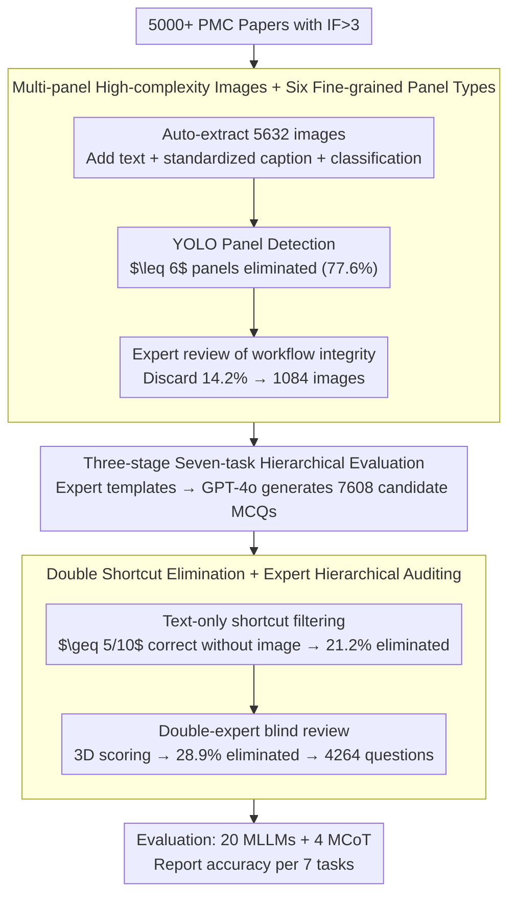

# Decoding Scientific Experimental Images: The SPUR Benchmark for Perception, Understanding, and Reasoning

**Conference**: ACL 2026  
**arXiv**: [2604.27604](https://arxiv.org/abs/2604.27604)  
**Code**: https://github.com/BUPT-Reasoning-Lab/SPUR (Available)  
**Area**: Multi-modal VLM / Scientific Image Understanding / AI4S  
**Keywords**: Experimental images, multi-panel understanding, quantitative reasoning, MCoT, PMC

## TL;DR
SPUR is the first benchmark for the "Perception → Understanding → Reasoning" three-stage evaluation of biomedical experimental images (multi-panel staining/Western blot/statistical charts). Containing 4264 expert-verified MCQs, it reveals that current MLLMs struggle, with only Gemini 3 Pro Preview barely exceeding 60%, and quantitative reasoning accuracy generally 12.76%–31.41% lower than qualitative reasoning.

## Background & Motivation
**Background**: MLLM capabilities on scientific images (statistical charts, tables, biological diagrams, chemical structures) are rapidly improving, leading to benchmarks like ScienceQA, MMMU, M3CoT, MMSci, SciAssess, and MicroVQA. Simultaneously, MCoT methods (prompt-based, plan-based, training-based) are used to enhance multi-modal reasoning.

**Limitations of Prior Work**: The true test of "image reading ability" in scientific papers lies in **multi-panel experimental figures** (e.g., Western blot + staining + trend curves telling a story). Existing benchmarks lack in three aspects: (1) low proportion of experimental images, mostly using statistical charts or academic diagrams; (2) an average of $\leq 8$ panels per figure, lacking cross-panel relationship modeling; (3) focusing almost exclusively on qualitative conclusions ("A promotes B") rather than quantitative reasoning ("A increases by 50%").

**Key Challenge**: The ability truly required for AI4S is "deriving quantifiable scientific conclusions from complex multi-panel visual evidence via cross-panel comparison/trend synthesis." Existing benchmarks only measure segments of this chain, masking the true bottlenecks of MLLMs.

**Goal**: To construct a benchmark **specifically for multi-panel experimental figures**, explicitly decomposed into **Perception → Understanding → Reasoning** stages, covering both **qualitative + quantitative** reasoning. The study systematically tests 20 MLLMs and 4 MCoT methods to analyze capability gaps.

**Key Insight**: Screen experimental figures from PMC open-access papers with IF > 3, requiring **$\geq 6$ panels per figure** (77.6% filtered by YOLO detection). Use expert-level hierarchical review + GPT-4o for QA generation, followed by "text-only shortcut" filtering to ensure the visual content is essential for answering.

**Core Idea**: Use a seven-task hierarchy "Perception (NP/MP/IL) → Understanding (TA/HI) → Reasoning (Qual./Quant.)" to decompose the task of "understanding an experimental figure" into independently diagnosable sub-capabilities. This allows for pinpointing MLLM bottlenecks to specific stages like "fine-grained numerical perception" and "cross-panel trend analysis."

## Method

### Overall Architecture
SPUR is a benchmark and evaluation framework rather than a model. Pipeline: ① **Image Acquisition**—crawl 5000+ papers with IF > 3 from PMC, automatically extract 5632 images, manually add 3–5 sentences of relevant text + standardized captions + disciplinary classification; ② **Image Filtering**—YOLO panel detector discards figures with $\leq 6$ panels (77.6% eliminated), followed by expert review to discard those without complete experimental workflows (another 14.2% eliminated), leaving 1084 images; ③ **QA Generation**—experts create prompts based on a 7-task template, and GPT-4o generates 7608 candidate MCQs; ④ **Quality Assurance**—textual shortcut elimination (discarding items correctly answered $\geq 5/10$ times by GPT-4o without images, 21.2% eliminated) + double-expert blind review (another 28.9% eliminated), resulting in 4264 final questions; ⑤ **Evaluation**—running accuracy tests on 8 closed-source and 12 open-source MLLMs across 7 tasks, comparing 4 MCoT methods.

### Key Designs

**1. Multi-panel High-complexity Images + Six Fine-grained Panel Types: Pushing image complexity to real top-tier journal figure density**

Low-complexity figures (1–3 panels) fail to test cross-panel relationships, as MLLMs can guess correctly by referencing the caption. SPUR mandates an average of 14.3 panels per figure (far exceeding MMSci's 7.4, SFE's 2.3, and MicroVQA's 1.9), with up to 6 types of fine-grained panels (4 types of staining + statistical charts + Western blot). Implementation-wise, a YOLO detector filters 5632 candidates for $\geq 6$ panels; staining images are further categorized into Cell / Tissue / Microorganism / Subcellular, allowing the MP task to perform fine-grained analysis by panel category.

This granularity exposes training data biases—Ministral 3 14B achieves 70.52% on Subcellular panels but only 42.80% on Microorganism panels, appearing as two different models for the same perception task. High panel counts and multi-type mixing truly simulate the scientific scenario of "reading a Nature figure."

**2. Three-stage Seven-task Hierarchical Evaluation: Decomposing "understanding multi-panel experimental graphs" into an independently diagnosable capability chain**

Traditional VQA-style benchmarks provide only an overall accuracy, leaving the point of failure unclear. SPUR explicitly splits "understanding an experimental image" into three stages and seven sub-tasks, calculating accuracy for each: the Perception stage is panel-level—NP estimates kinetic curve values, MP identifies cell morphology, and IL maps panels to experimental conditions; the Understanding stage is cross-panel—TA analyzes trend directions of isomorphic panels, and HI integrates cross-modal information between heterogeneous panels; the Reasoning stage is expert-level—Qual. provides directional conclusions, and Quant. provides quantitative conclusions such as ratios or significance.

This metric space allows authors to locate bottlenecks specifically: NP is the systematic low point; TA accuracy drops from 60.7% to 34.0% as the number of cross-panel relationships increases from 1 to 4; Quant. remains 12.76%–31.41% lower than Qual. throughout—diagnostic conclusions that rely on hierarchical visibility of the failure point.

**3. Double Shortcut Elimination + Expert Hierarchical Auditing: Forcing the model to look at the image by closing shortcuts from captions and common sense**

The biggest trap in scientific image QA is answer leakage into captions or pre-training knowledge, making the benchmark a test of the LLM's knowledge rather than visual capability. SPUR blocks this with three gates: (a) textual shortcut filter—feeding questions + options without images to GPT-4o for 10 iterations, discarding any with $\geq 5$ correct answers (21.2% or 1612 questions); (b) double-expert blind review—4 domain experts with $>40$ papers + 2 senior experts with $>100$ papers score items on Scientific Validity / Task Alignment / Visual Reasoning Necessity, with seniors arbitrating disagreements (28.9% or 1732 questions eliminated); (c) a design phase that prohibits deriving questions directly from captions, forcing items to be grounded in panel visual information.

After these filters, GPT-4o cannot correctly answer more than 50% of the questions in a text-only setting, proving that visual information is essential.

### Loss & Training
SPUR is an evaluation benchmark with no training involved. Evaluation protocol: direct prompting + accuracy on MCQ; MCoT evaluation uses four inference-time enhancement methods: DDCoT/VoT (prompt-based) and VIC/Cantor (plan-based) for fair comparison.

## Key Experimental Results

### Main Results

Overall accuracy of 20 MLLMs on SPUR (Excerpt):

| Model | NP | MP | IL | TA | HI | Qual. | Quant. | Overall |
|------|------|------|------|------|------|--------|---------|---------|
| Gemini 3 Pro Preview | 61.26 | 67.74 | 59.67 | 51.04 | 59.23 | 90.31 | 58.90 | **60.57** |
| Claude 3.7 Sonnet (thinking) | 59.67 | 64.32 | 57.45 | 51.30 | 60.80 | 87.58 | 59.96 | 59.52 |
| Gemini 2.5 Pro Preview | 56.47 | 62.97 | 56.47 | 53.30 | 61.54 | 86.54 | 57.94 | 59.00 |
| GPT-5.1 | 58.73 | 61.72 | 54.47 | 51.18 | 50.78 | 86.52 | 56.36 | 57.68 |
| GLM-4.5V (Best Open-source) | 57.70 | 61.99 | 57.65 | 55.71 | 68.46 | 80.94 | 58.48 | 59.87 |
| InternVL3-78B | 46.30 | 51.97 | 49.84 | 49.52 | 61.24 | 75.24 | 51.06 | 51.94 |
| Qwen2.5-VL-72B | 38.10 | 45.34 | 49.11 | 51.87 | 61.90 | 73.10 | 52.51 | 48.21 |
| LLaVA-v1.5-13B | 33.05 | 28.11 | 34.15 | 34.52 | 44.96 | 62.19 | 35.58 | 35.97 |

**Conclusion**: All models except Gemini 3 Pro Preview **failed to reach 60%**; the best open-source model GLM-4.5V is close to the closed-source mid-range; NP is generally the lowest; the gap between Qual. and Quant. can reach 31.41% (Llama 4 Maverick 84.64 vs 57.02).

### Ablation Study

Four MCoT methods vs direct prompting (Excerpt for GLM-4.5V):

| Configuration | NP | TA | Qual. | Quant. | Overall |
|------|-----|------|--------|---------|---------|
| Direct | 57.70 | 55.71 | 80.94 | 58.48 | 59.87 |
| DDCoT (prompt) | 47.11 | 45.24 | 71.52 | 53.27 | 48.90 |
| VoT (prompt) | 55.82 | 53.65 | 78.44 | 57.77 | 58.47 |
| VIC (plan) | 35.50 | 27.20 | 34.59 | 36.52 | 32.02 |
| Cantor (plan) | 53.41 | 51.23 | 77.12 | 56.61 | 55.59 |

Decoupling reasoning accuracy by "Perception Correct/Incorrect" (Qwen3-VL-30B-A3B-Instruct):

| Condition | Direct | DDCoT | VoT | VIC | Cantor |
|-----------|--------|--------|------|------|---------|
| Perception Correct | 71.66 | 82.66 ($\uparrow$11.0) | 98.59 ($\uparrow$26.9) | 65.66 ($\downarrow$6.0) | 79.65 ($\uparrow$8.0) |
| Perception Incorrect | 32.40 | 23.68 ($\downarrow$8.7) | 9.32 ($\downarrow$23.1) | 30.30 ($\downarrow$2.1) | 40.23 ($\uparrow$7.8) |

### Key Findings
- **MCoT is an "amplifier," not a "fixer"**: If perception is correct, MCoT can add 8–27 points; if perception is wrong, MCoT amplifies the error, with VoT dropping 23 points. This quantifies the priority of "perceiving before thinking."
- **TA is inversely correlated with relationship complexity**: As cross-panel relationships increase from 1 to 4, Claude 3.7 thinking's TA accuracy drops from 60.70% to 34.00%, indicating that joint reasoning over multiple relationships is a bottleneck.
- **MP shows significant discipline bias**: Ministral 3 14B scores 70.52% on Subcellular but only 42.80% on Microorganism, reflecting uneven distribution of experimental images in training corpora and weak generalization.
- **Closed-source thinking models approach the ceiling in Qual.** Gemini 3 Pro Preview / Claude 3.7 thinking reach 87–90% in Qual. but only 59–60% in Quant., suggesting that "drawing conclusions" $\neq$ "calculating numbers," with quantitative reasoning being a universal weakness.

## Highlights & Insights
- **Diagnostic rather than leaderboard benchmark**: The seven-task hierarchy allows a single number (overall) to trace back to "which segment of the chain broke," offering better guidance for AI4S model development than simple MMMU-style overall accuracy.
- **Reusable "double filtering + double-blind auditing" pipeline**: The textual shortcut detection + mandatory multi-panel lower bound serves as a universal template to prevent caption-based cheating, transferable to any scientific image QA.
- **Decoupled MCoT analysis is impressive**: Splitting MCoT gains based on perception correctness debunks the "CoT panacea" myth and provides a clear recommendation: train VLM perceptual ability first before layering CoT for it to be meaningful.
- **Average 14.3 panels/image** is the highest to date, closely simulating the density of figures in top journals. Performance drops on SPUR are more reflective of real-world scenarios than on MMMU.

## Limitations & Future Work
- **MCQ format masks reasoning processes**: It is impossible to directly observe *why* the model failed (numerical error? trend reversal? logical skip?); the authors acknowledge this as a trade-off and plan to introduce free-form rationales + step-wise scoring.
- **Discipline coverage biased toward biomedicine**: All 7 disciplines fall under life sciences (cells/molecules/tumors, etc.). Experimental images from physics/chemistry/materials (e.g., SEM, EDS, crystals) are not covered, requiring adaptation for extrapolation.
- **No training set provided**: As a zero-shot evaluation benchmark, the question of how to improve experimental image perception remains open. The publication of a companion SPUR-Train for instruction tuning is recommended.
- **Baseline MCoT methods are training-free**: A lack of training-based MCoT (e.g., R1-V, MM-R1) means it cannot be asserted whether "training + RL" can break the NP bottleneck.

## Related Work & Insights
- **vs MicroVQA (CVPR 2025)**: MicroVQA also handles experimental images but with only 1.9 panels/image and Qual. only; SPUR provides an order-of-magnitude increase in panel complexity (14.3 vs 1.9) and quantitative reasoning coverage.
- **vs MMMU / M3CoT / ScienceQA**: These benchmarks consist of 1–2.5 panel "non-experimental" images and lack cross-panel relation modeling; SPUR's "complex multi-panel + cross-panel relation" fills a genuine gap in experimental image understanding.
- **vs SciAssess / MMSci**: The latter have high image isolation ($\leq 8$ panels). SPUR pushes the physical complexity of "scientific image reading" to real top-tier standards.
- **Insight**: In any "multi-modal + scientific reasoning" project, perception accuracy and reasoning accuracy should be reported separately; otherwise, gains from MCoT/SFT/RL cannot be correctly attributed.

## Rating
- Novelty: ⭐⭐⭐⭐ The multi-panel experimental image track has been explored (e.g., MicroVQA), but this work pushes complexity to 14.3 panels + explicit 7-task decomposition with clear positioning.
- Experimental Thoroughness: ⭐⭐⭐⭐⭐ 20 MLLMs + 4 MCoT + five disciplines + diagnostic analysis decoupling perception-reasoning.
- Writing Quality: ⭐⭐⭐⭐ Three diagnostic figures (Fig 1, 5, 6) support the claims well. The storyline "Benchmark Gap → 7 Tasks → Diagnostic Results → MCoT Failure Analysis" is clear.
- Value: ⭐⭐⭐⭐ Highly practical as a diagnostic benchmark for the AI4S community. Insights like "NP is the bottleneck" and "MCoT cannot fix perception errors" provide actionable research directions.

<!-- RELATED:START -->

## Related Papers

- [\[ACL 2026\] SciMDR: Advancing Scientific Multimodal Document Reasoning](scimdr_advancing_scientific_multimodal_document_reasoning.md)
- [\[ACL 2026\] ChemVLR: Prioritizing Reasoning in Perception for Chemical Vision-Language Understanding](chemvlr_prioritizing_reasoning_in_perception_for_chemical_vision-language_unders.md)
- [\[ACL 2026\] A Survey of Multimodal Mathematical Reasoning: From Perception, Alignment to Reasoning](a_survey_of_multimodal_mathematical_reasoning_from_perception_alignment_to_reaso.md)
- [\[CVPR 2026\] Beyond Single Images: A Comprehensive Benchmark for Album-Level Vision-Language Understanding](../../CVPR2026/multimodal_vlm/beyond_single_images_a_comprehensive_benchmark_for_album-level_vision-language_u.md)
- [\[ACL 2026\] GeoRC: A Benchmark for Geolocation Reasoning Chains](georc_a_benchmark_for_geolocation_reasoning_chains.md)

<!-- RELATED:END -->
