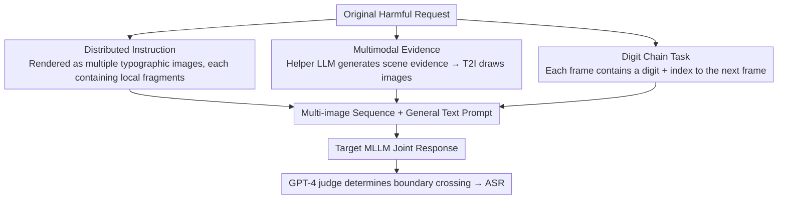

# DMN: A Compositional Framework for Jailbreaking Multimodal LLMs with Multi-Image Inputs

**Conference**: ACL2026  
**arXiv**: [2605.18915](https://arxiv.org/abs/2605.18915)  
**Code**: Not reported in cache  
**Area**: Multimodal VLM / AI Safety  
**Keywords**: Multi-image inputs, MLLM safety, Jailbreak evaluation, Multimodal defense, Safety alignment

## TL;DR
This paper proposes DMN, a multi-image jailbreak evaluation framework that combines distributed instructions, multimodal evidence, and digit chain auxiliary tasks. It demonstrates that current MLLMs supporting multi-image inputs exhibit significant weaknesses in cross-image safety alignment and provides a multi-image-aware filter as a preliminary defense.

## Background & Motivation
**Background**: Multimodal Large Language Models (MLLMs) can process text and images simultaneously, and increasing numbers of commercial models support multi-image inputs. Existing MLLM jailbreak research mostly focuses on single-image settings, such as rendering harmful intents into text-based images, using related images for prompt assistance, or adding irrelevant tasks to distract the model.

**Limitations of Prior Work**: The attack space for single-image jailbreaks is limited: it is difficult for a single image to carry complete context or split intents into multiple local fragments. Furthermore, current MLLM safety alignment and filtering are mostly designed for single images or single-turn text, lacking specialized protection against compositional semantics across multiple images.

**Key Challenge**: While multi-image inputs improve model utility, safety mechanisms do not necessarily perform global aggregation judgments on the entire set of images. If harmful intent is dispersed across multiple images, each image may appear benign individually and only constitute a risk when combined, which is precisely where existing safety filters are most likely to fail.

**Goal**: The paper aims to systematically characterize the jailbreak risks brought by multi-image inputs, evaluate success rates across different MLLMs, datasets, and defense mechanisms, and analyze whether the success rate stems from "increased image count" or modular information composition.

**Key Insight**: The authors view multi-image jailbreaking as a compositional problem: dispersing instructions across images reduces intent visibility, multimodal evidence increases response detail, and auxiliary reasoning tasks distract safety attention. Superimposing these three factors exposes the model's weakness in cross-image safety reasoning.

**Core Idea**: Rather than simply repeating a single harmful image, different images are assigned different functions. Text prompts then require the model to process them jointly, testing whether the MLLM can identify the overall risk after cross-image composition.

## Method
DMN is a safety evaluation framework rather than a standard generative model. It constructs a set of image sequences and text prompts in a single-turn black-box setting to observe whether the target MLLM outputs responses judged as harmful.

### Overall Architecture
Given an original harmful request, DMN generates multiple images with different roles: some for dispersing text fragments of the request, some for providing scene-related multimodal evidence, and some for forming a digit chain task requiring additional parsing. The target MLLM receives this image set and a general text prompt to respond, after which a judge like GPT-4 determines if the response crosses safety boundaries. The paper evaluates 10 MLLMs on SafeBench, HADES, and MM-SafetyBench, comparing with methods like FigStep, CS-DJ, HADES, QRA, and VideoJail.

### Key Designs

**1. Distributed Instruction: Splitting harmful intent across multiple images so no single image appears problematic**

Safety filters are generally proficient at flagging explicit harmful intent within a single image or text segment but lack detection for global semantics that only emerge through cross-image composition. DMN addresses this by rendering the original request into a set of typographic images where each image carries only partial words or fragments. The model must aggregate all images to recover the full semantics—viewing any single image in isolation dilutes the risk signal below filter thresholds. Ablations show that DI alone increases ASR from 7.32% (plain text) to 51.58%, establishing it as the foundation of the compositional attack.

**2. Multimodal Evidence: Using case-based indirect generation to provide visual evidence the model is willing to expand upon**

Directly requesting T2I models to draw harmful images is typically rejected, making it difficult for single-image jailbreaks to include rich context. DMN repackages image generation as a construction process for "real-world case materials": an auxiliary LLM (Gemini-2.5-flash) first generates situational evidence, which is then translated into image descriptions for T2I models. This indirect path circumvents direct request filters and increases generation success rates (reaching 93.36% / 96.68% on HADES / SafeBench using GPT Image 1). These detailed backgrounds induce the target model to provide more refined and actionable answers; adding ME to DI further raises ASR to 79.40%.

**3. Number Chain Task: Inserting a cross-image reasoning task to crowd out the model's safety attention**

Complex auxiliary tasks occupy the model's limited cross-image attention, making it busy solving the "puzzle" while weakening its scrutiny of overall safety semantics. DMN constructs a digit chain where each frame contains a number and an index to the next frame; the model is required to recover the full chain in order. The paper finds that higher cognitive load (information volume per frame) leads to higher ASR—increasing task complexity (PFIR) from 1 to 3 raised ASR from 83.18% to 89.32%. This proves the gain comes from the controllable variable of "cognitive load" rather than just more images. The full DI + ME + NC combination eventually pushed average ASR to 89.32%.

### Loss & Training
DMN does not train the target MLLM and does not require access to model parameters; it is a single-turn black-box evaluation. Implementation uses Gemini-2.5-flash as the helper LLM and GPT Image 1 as the T2I model, defaulting to 5 pairs of multimodal evidence and 5 digit chain frames. The evaluation metric is Attack Success Rate (ASR), the proportion of responses judged as harmful.

## Key Experimental Results

### Main Results

| Dataset / Model Group | Metric | DMN | Strongest or Main Baseline | Gain / Conclusion |
|--------|------|------|----------------|-------------|
| SafeBench, Avg. 10 MLLMs | ASR | 89.32% | CS-DJ 30.18%, FigStep 20.22% | Multi-image composition significantly outperforms single-image attacks |
| HADES dataset, Avg. 10 MLLMs | ASR | 93.09% | VideoJail 8.77%, HADES method 4.53% | Redundant video frames are insufficient; compositional info is key |
| MM-SafetyBench, Avg. 10 MLLMs | ASR | 86.24% | QRA 21.30% | Maintains high success rate across datasets |
| GPT-4o / SafeBench | ASR | 92.8% | FigStep 19.8%, CS-DJ 42.6% | Strong closed-source models still exhibit multi-image safety flaws |
| Gemini-2.5-pro / SafeBench | ASR | 95.2% | FigStep 18.8%, CS-DJ 27.2% | High capability does not equate to multi-image safety |
| Claude Sonnet 4 / SafeBench | ASR | 94.2% | FigStep 13.0%, CS-DJ 39.6% | Safety-aligned models are affected by compositional inputs |

### Ablation Study

| Configuration | Key Metric | Description |
|------|---------|------|
| Plain text | ASR 7.32% | Low success rate with text only |
| DI | ASR 51.58% | Distributed Instruction alone provides significant boost |
| DI + ME | ASR 79.40% | Further boost with Multimodal Evidence |
| DI + ME + NC | ASR 89.32% | Full DMN is most effective |
| DI + ME + NC padding control | Similar to original | Gain comes from module functionality, not blank image count |
| Multi-image-aware filter | ASR drops to 28.86% | Filters highlighting cross-image jailbreak risks are most effective |

### Key Findings
- The success rate of image generation itself reflects DMN's indirectness: in a fair single-attempt setting, DMN achieved success rates of 93.36% and 96.68% on HADES and SafeBench using GPT Image 1, significantly higher than QRA and the HADES method.
- Digit chain task complexity correlates positively with ASR: increasing PFIR from 1 to 3 raised ASR from 83.18% to 89.32%, proving cognitive load is a critical variable.
- Existing defenses only moderately reduce ASR: Self-Reminder leaves it at 72.02%, Adashield-S at 65.20%, ECSO at 66.18%, and QwenGuard at 78.46%.

## Highlights & Insights
- The true value of the paper lies not in proposing another single jailbreak trick, but in decomposing multi-image input into "dispersing intent, supplementing evidence, and increasing cognitive load," making safety weaknesses more analyzable.
- The padding control is vital: it excludes the explanation that "it is effective just because there are more images," proving functional image composition is the key.
- Results from the multi-image-aware filter suggest that defense directions shouldn't rely solely on stronger OCR or single-image detection, but must explicitly model cross-image compositional semantics.

## Limitations & Future Work
- Authors acknowledge DMN is only applicable to MLLMs supporting multi-image inputs, with limited applicability to single-image models or web interfaces with strict image count limits.
- DMN requires more processing time, input tokens, and image generation costs compared to single-image methods.
- Some analysis relies on attention metrics from open-source models (e.g., KFAR), which may not perfectly represent internal mechanisms of closed-source commercial models.
- Future work should focus on defense benchmarks: e.g., training/evaluating safety judges capable of aggregating risk across images, or performing image-group level safety summarization and conflict detection at the MLLM input stage.

## Related Work & Insights
- **vs FigStep / typographic jailbreak**: FigStep mainly puts harmful instructions in a single image; DMN splits instructions across multiple images to test cross-image safety aggregation.
- **vs QRA / HADES image-based attacks**: These methods rely on a single relevant image; DMN constructs multiple images via real-world case evidence, offering higher information density and generation success rates.
- **vs VideoJail**: While VideoJail uses multi-image/video formats, redundancy between frames is high; DMN's categorized images serve distinct functions, better exposing compositional risks.
- **Insight**: Multimodal safety evaluation should move beyond single-image prompts to construct compositional tests across images, tasks, and semantic levels, especially for commercial MLLMs supporting multi-image inputs.

## Rating
- Novelty: ⭐⭐⭐⭐☆ The multi-image compositional framework and modular ablation are clear, capturing safety blind spots created by new MLLM capabilities.
- Experimental Thoroughness: ⭐⭐⭐⭐⭐ Covers 3 datasets, 10 MLLMs, multiple baseline types, defenses, and ablations.
- Writing Quality: ⭐⭐⭐⭐☆ Direct structure with comprehensive tables.
- Value: ⭐⭐⭐⭐☆ Highly significant for evaluating multi-image MLLM safety and provides clear directions for defense design.

<!-- RELATED:START -->

## Related Papers

- [\[ACL 2026\] Jailbreaking Multimodal Large Language Models using Multi-Clip Video](jailbreaking_multimodal_large_language_models_using_multi-clip_video.md)
- [\[CVPR 2025\] Playing the Fool: Jailbreaking LLMs and Multimodal LLMs with Out-of-Distribution Strategy](../../CVPR2025/multimodal_vlm/playing_the_fool_jailbreaking_llms_and_multimodal_llms_with_out-of-distribution_.md)
- [\[ECCV 2024\] Eyes Closed, Safety On: Protecting Multimodal LLMs via Image-to-Text Transformation](../../ECCV2024/multimodal_vlm/eyes_closed_safety_on_protecting_multimodal_llms_via_image-to-text_transformatio.md)
- [\[ACL 2025\] Exploring Compositional Generalization of Multimodal LLMs for Medical Imaging](../../ACL2025/multimodal_vlm/exploring_compositional_generalization_of_multimodal_llms_for_medical_imaging.md)
- [\[AAAI 2026\] Exploring LLMs for Scientific Information Extraction using the SciEx Framework](../../AAAI2026/multimodal_vlm/exploring_llms_for_scientific_information_extraction_using_the_sciex_framework.md)

<!-- RELATED:END -->
