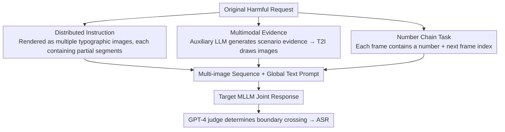

# DMN: A Compositional Framework for Jailbreaking Multimodal LLMs with Multi-Image Inputs

**Conference**: ACL2026  
**arXiv**: [2605.18915](https://arxiv.org/abs/2605.18915)  
**Code**: Not reported in cache  
**Area**: Multimodal VLM / AI Safety  
**Keywords**: Multi-image input, MLLM safety, Jailbreak evaluation, Multimodal defense, Safety alignment

## TL;DR
This paper proposes DMN, a multi-image jailbreak evaluation framework that combines distributed instructions, multimodal evidence, and digital chain auxiliary tasks. It demonstrates that current MLLMs supporting multi-image inputs have significant weaknesses in cross-image safety alignment and provides a multi-image-aware filter as a preliminary defense.

## Background & Motivation
**Background**: Multimodal Large Language Models (MLLMs) can simultaneously process text and images, and an increasing number of commercial models support the input of multiple images at once. Existing MLLM jailbreak research has mostly focused on single-image settings, such as rendering harmful intentions into typographic images, using relevant images for auxiliary prompting, or adding irrelevant tasks to distract the model's attention.

**Limitations of Prior Work**: The attack space for single-image jailbreaking is limited: a single image struggle to carry complete context or split intentions into multiple local segments. Meanwhile, current safety alignment and filtering for MLLMs are mostly designed for single images or single-turn text, lacking specialized protection against the combined semantics across multiple images.

**Key Challenge**: While multi-image inputs improve model utility, safety mechanisms may not perform global aggregation judgments on the entire set of images. If dangerous intentions are scattered across multiple images, each image may appear innocuous on its own, with risks only emerging upon combination. This is precisely where existing safety filters are most likely to fail.

**Goal**: The paper aims to systematically characterize the jailbreak risks brought by multi-image inputs, evaluate success rates across different MLLMs, datasets, and defense mechanisms, and analyze whether success stems from the "increase in the number of images" or "modular information composition."

**Key Insight**: The authors treat multi-image jailbreaking as a compositional problem: cross-image distributed instructions reduce intent visibility, multimodal evidence increases response detail, and auxiliary reasoning tasks distract safety attention. The superposition of these three factors exposes the vulnerabilities of cross-image safety reasoning in models.

**Core Idea**: Instead of simply repeating single dangerous images, different images are assigned different functions. Then, text prompts are used to require the model to process them jointly, thereby testing whether the MLLM can recognize the overall risk after cross-image combination.

## Method
DMN is a safety evaluation framework rather than a conventional generative model. It constructs a sequence of images and text prompts in a single-turn black-box setting and observes whether the target MLLM outputs responses judged as harmful. To avoid describing the method as an executable operation, only the research-level modular mechanisms and evaluation logic are retained.

### Overall Architecture
Given an original harmful request, DMN generates multiple images serving different roles: some images are used to dispersedly present textual fragments of the request, some provide multimodal evidence relevant to the scenario, and others compose a digital chain task requiring additional model parsing. The target MLLM receives this set of images and a global text prompt to respond, after which researchers use a judge like GPT-4 to determine if the response crosses safety boundaries. The paper evaluates 10 MLLMs supporting multi-image inputs on SafeBench, HADES, and MM-SafetyBench, comparing with methods like FigStep, CS-DJ, HADES, QRA, and VideoJail.

### Key Designs

**1. Distributed Instruction: Splitting dangerous intent across multiple images so no single image appears problematic**

Safety filters are generally adept at identifying explicit harmful intents within a single image or text segment but lack the capability to detect global semantics that "only hold true after cross-image combination." Targeting this, DMN renders the original request into a set of typographic images, where each image carries only local words or fragments of the instruction. The model must aggregate all images to recover the full semantics—viewed individually, risk signals are diluted below the filter's threshold. The paper specifically compares this with single-image instructions to verify if "distributed presentation" is systematically more effective than "single-image presentation" at bypassing alignment; in ablations, DI alone increased ASR from 7.32% (plain text) to 51.58%, establishing it as the foundation of the compositional attack.

**2. Multimodal Evidence: Using case-based indirect generation to provide visual evidence that the model is willing to expand upon**

Directly asking a T2I model to draw images related to danger is usually rejected, making it difficult for single-image jailbreaks to include rich context, often resulting in vague responses. DMN repackages image generation as a construction process for "real-world case materials": an auxiliary LLM (Gemini-2.5-flash) first generates scenario-based evidence, which is then translated into image descriptions suitable for T2I models. This indirect path bypassing direct requests improves image generation success rates (reaching 93.36% / 96.68% on HADES / SafeBench using GPT Image 1 in a fair single-attempt setting) and allows multi-image inputs to carry more detailed backgrounds, inducing the target model to provide more refined and operational answers. In ablations, adding ME to DI further increased ASR to 79.40%.

**3. Number Chain Task: Inserting a cross-image reasoning task to crowd out the model's safety attention**

Complex auxiliary tasks occupy a model's limited cross-image attention, causing it to focus on problem-solving while weakening its scrutiny of overall safety semantics. DMN constructs a number chain for this purpose: each frame contains a number and an index pointing to the next frame, and the model is required to recover the full chain in the specified order. The paper compares three forms: blank frame indexing, cat/dog frame indexing, and number chain. It found that the higher the information density and cognitive load per frame, the higher the ASR—increasing task complexity (PFIR) from 1 to 3 raised ASR from 83.18% to 89.32%. This evidence suggests that the attack Gain comes from the controllable variable of "cognitive load" rather than simply adding more images; the complete DI + ME + NC combination eventually pushed average ASR to 89.32%.

### Loss & Training
DMN itself does not train the target MLLM nor does it require access to model parameters; it is a single-turn black-box evaluation. The implementation uses Gemini-2.5-flash as the auxiliary LLM and GPT Image 1 as the T2I model, default generating 5 pairs of multimodal evidence and inserting 5 number chain frames. The evaluation metric is Attack Success Rate (ASR), defined as the proportion of responses judged harmful; the paper also uses other evaluation methods for bias checking.

## Key Experimental Results

### Main Results

| Dataset / Model Group | Metric | DMN | Strongest or Main Baseline | Gain / Conclusion |
|--------|------|------|----------------|-------------|
| SafeBench, Avg. of 10 MLLMs | ASR | 89.32% | CS-DJ 30.18%, FigStep 20.22% | Multi-image composition is significantly higher than single-image structural attacks |
| HADES dataset, Avg. of 10 MLLMs | ASR | 93.09% | VideoJail 8.77%, HADES method 4.53% | Multi-image but redundant video frames are insufficient; compositional information is key |
| MM-SafetyBench, Avg. of 10 MLLMs | ASR | 86.24% | QRA 21.30% | High success rate maintained across datasets |
| GPT-4o / SafeBench | ASR | 92.8% | FigStep 19.8%, CS-DJ 42.6% | Strong closed-source models still expose multi-image safety weaknesses |
| Gemini-2.5-pro / SafeBench | ASR | 95.2% | FigStep 18.8%, CS-DJ 27.2% | High-capability models do not equal multi-image safety |
| Claude Sonnet 4 / SafeBench | ASR | 94.2% | FigStep 13.0%, CS-DJ 39.6% | Safe models are also affected by compositional inputs |

### Ablation Study

| Configuration | Key Metric | Description |
|------|---------|------|
| Plain text | ASR 7.32% | Low success rate with text only |
| DI | ASR 51.58% | Distributed instructions alone provide significant improvement |
| DI + ME | ASR 79.40% | Further improvement after adding multimodal evidence |
| DI + ME + NC | ASR 89.32% | Full DMN is the strongest |
| DI + ME + NC padding control | Close to original version | Gain comes from modular functionality rather than the number of blank images |
| Multi-image-aware filter | ASR reduced to 28.86% | Filters explicitly reminding of cross-image jailbreak risks are most effective |

### Key Findings
- The image generation success rate itself reflects the indirectness of DMN: in a fair single-attempt setting, DMN's success rates using GPT Image 1 on HADES and SafeBench were 93.36% and 96.68%, respectively, significantly higher than QRA and the HADES method.
- Number chain task complexity is positively correlated with ASR: as PFIR increased from 1 to 3, ASR rose from 83.18% to 89.32%, indicating cognitive load is an important variable.
- Existing defenses only moderately reduce ASR: after Self-Reminder it remains 72.02%, Adashield-S is 65.20%, ECSO is 66.18%, and QwenGuard is 78.46%.

## Highlights & Insights
- The true value of the paper lies not in proposing another single-point jailbreak trick, but in decomposing multi-image input into three ablatable modules: "scattering intent, supplementing evidence, and increasing cognitive load," making safety weaknesses more analyzable.
- The padding control is crucial: it rules out the explanation that "it is more effective simply because there are more images," proving that functional image composition is the key.
- The results of the multi-image-aware filter suggest that defense should not rely solely on stronger OCR or single-image detection, but must explicitly model cross-image compositional semantics within the model or a pre-filter.

## Limitations & Future Work
- The authors acknowledge that DMN is only applicable to MLLMs supporting multi-image inputs and has limited applicability to single-image models or web scenarios that strictly limit the number of uploaded images.
- DMN requires more processing time, input tokens, and image generation costs than single-image methods, leading to higher practical evaluation overhead.
- Parts of the analysis rely on attention metrics of open-source models, such as KFAR, which may not fully represent the internal attention mechanisms of closed-source commercial models.
- Future work worth pursuing includes defense benchmarks: for instance, training/evaluating safety judges capable of aggregating risks across images, or performing image-group level safety summarization and conflict detection at the MLLM input stage.

## Related Work & Insights
- **vs FigStep / typographic jailbreak**: FigStep mainly places dangerous instructions in one image; DMN splits instructions across multiple images to test cross-image safety aggregation.
- **vs QRA / HADES image-based attacks**: These methods rely on a single relevant image; DMN constructs multiple images through real-world case-based evidence, providing more information and higher generation success rates.
- **vs VideoJail**: While VideoJail uses multi-image/video formats, redundancy between frames is high; each type of image in DMN serves a different function, thus better exposing multi-image compositional risks.
- **Insight**: Multimodal safety evaluation should not just look at single-image prompts but should construct compositional tests across images, tasks, and semantic levels, especially for commercial MLLMs that support multi-image inputs.

## Rating
- Novelty: ⭐⭐⭐⭐☆ The multi-image compositional framework and modular ablation are clear, and the research problem targets safety blind spots brought by new MLLM capabilities.
- Experimental Thoroughness: ⭐⭐⭐⭐⭐ Covers 3 datasets, 10 MLLMs, multiple categories of baselines, defenses, and ablations; the evidence is complete.
- Writing Quality: ⭐⭐⭐⭐☆ Structure is direct with sufficient experimental tables; contains many safety-sensitive topics, requiring a distinction between research evaluation and operational details during reading.
- Value: ⭐⭐⭐⭐☆ Highly significant for the safety assessment of multi-image MLLMs and provides clear directions for defense design.

<!-- RELATED:START -->

## Related Papers

- [\[ACL 2026\] Jailbreaking Multimodal Large Language Models using Multi-Clip Video](jailbreaking_multimodal_large_language_models_using_multi-clip_video.md)
- [\[CVPR 2025\] Playing the Fool: Jailbreaking LLMs and Multimodal LLMs with Out-of-Distribution Strategy](../../CVPR2025/multimodal_vlm/playing_the_fool_jailbreaking_llms_and_multimodal_llms_with_out-of-distribution_.md)
- [\[ECCV 2024\] Eyes Closed, Safety On: Protecting Multimodal LLMs via Image-to-Text Transformation](../../ECCV2024/multimodal_vlm/eyes_closed_safety_on_protecting_multimodal_llms_via_image-to-text_transformatio.md)
- [\[ACL 2025\] Exploring Compositional Generalization of Multimodal LLMs for Medical Imaging](../../ACL2025/multimodal_vlm/exploring_compositional_generalization_of_multimodal_llms_for_medical_imaging.md)
- [\[ACL 2026\] SlideAgent: Hierarchical Agentic Framework for Multi-Page Visual Document Understanding](slideagent_hierarchical_agentic_framework_for_multi-page_visual_document_underst.md)

<!-- RELATED:END -->
