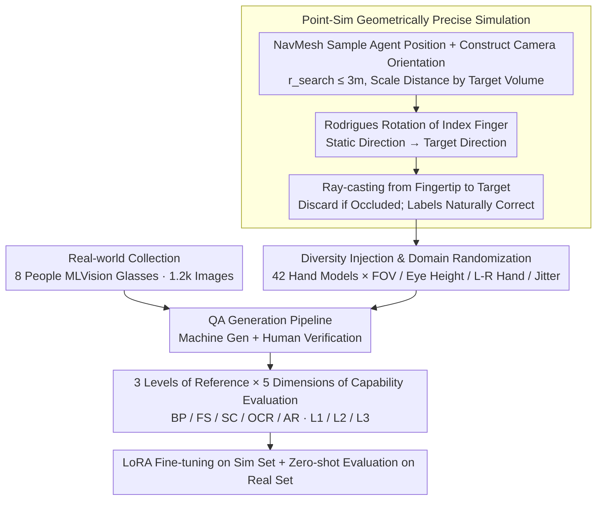

# Do MLLMs Understand Pointing? Benchmarking and Enhancing Referential Reasoning in Egocentric Vision

**Conference**: ACL 2026  
**arXiv**: [2604.21461](https://arxiv.org/abs/2604.21461)  
**Code**: https://guyyyug.github.io/EgoPoint-Bench/ (Project Page)  
**Area**: Multimodal VLM / Egocentric Vision / Pointing Understanding  
**Keywords**: Egocentric Pointing, Referential Hallucination, Sim-to-Real, MLLM Benchmark, LoRA Fine-tuning

## TL;DR
The authors construct EgoPoint-Bench (11.7k QA / 5 dimensions / 3-level semantic reference), the first hybrid real-physical simulation benchmark for first-person "finger pointing" QA. It confirms that current SOTA MLLMs generally rely on "visual proximity/saliency" pseudo-correlations rather than truly parsing fingertip rays. By performing LoRA fine-tuning on simulated data, they achieve an average improvement of up to +25 points and robust sim-to-real generalization.

## Background & Motivation

**Background**: Wearable devices like smart glasses have catalyzed egocentric agent scenarios, where natural user interaction relies heavily on demonstrative pronouns like "that/this" combined with pointing gestures. While MLLMs such as GPT-5, Gemini 3, and Qwen3-VL perform well on general image QA, their capabilities in this specific context remain untested.

**Limitations of Prior Work**: Empirical testing by the authors reveals that when processing first-person images with pointing gestures, models do not truly project rays along the index finger to find the target. Instead, they pick the "nearest object to the hand" or the "most salient object in the frame." The paper names this phenomenon **Referential Hallucination**.

**Key Challenge**: There is a scarcity of high-quality "Vision-Language-Space" aligned data. RefCOCO and Visual Genome are third-person; Ego4D and EPIC-KITCHENS lack pointing QA annotations; Ges3ViG uses synthetic avatars instead of real hands; and YouRefIt is not first-person. Models have never seen dense supervision for "fingertip geometry $\rightarrow$ target object," and thus fail to learn it.

**Goal**: (1) Provide a benchmark for quantitatively evaluating MLLM first-person pointing understanding; (2) Create a scalable synthetic pipeline for generating geometrically precise data; (3) Verify if simulation data is sufficient for models to "learn pointing" and transfer to real-world scenarios.

**Key Insight**: Utilize Habitat-Sim + ray-casting to generate geometrically rigorous pointing samples in 3D scenes (ensuring rays reach targets without occlusion), complemented by 1.2k human-collected samples for zero-shot cross-domain testing.

**Core Idea**: Use a scalable simulation with "physical ray-casting + diverse hand models" to create 10k+ geometrically unambiguous first-person pointing QA data. This allows small models, after LoRA fine-tuning, to outperform closed-source large models like GPT-5 and Gemini 3.

## Method

### Overall Architecture
EgoPoint-Bench consists of two data collection pipelines, one QA generation pipeline, and a five-dimensional evaluation system. On the simulation side, Point-Sim generates 10,567 samples using 42 hand models across 1,838 high-fidelity 3D scenes. On the real-world side, 8 volunteers wearing MLVision smart glasses collected 1,162 images in indoor/outdoor scenes. All images undergo a "machine generation + human verification" QA pipeline, outputting samples with three question types (Selection / Judgment / Open-ended) and three levels of referential language (L1 Explicit Action Description / L2 Visual Localization / L3 Implicit Pronouns), split into training, validation, and test sets based on five capability categories.

### Key Designs

**1. Point-Sim Geometrically Precise Simulation: Downgrading "Correct Pointing" from a Learning Goal to an Uncheatable Geometric Constraint**

The biggest issue with first-person pointing data is annotation noise—manually bounding "which object the index finger is pointing at" is expensive and prone to subjective error. If models train on dirty labels, they learn biases. Point-Sim replaces human judgment with ray geometry to force label correctness. It samples agent positions $P_{agent}$ on NavMesh with $r_{search}\leq 3.0\text{m}$ (minimum obstacle avoidance 0.4 m, with distance dynamically scaled by target volume to prevent targets from being too large or too small). Camera rotation $R_{cam}\in SO(3)$ is constructed according to $\mathbf{f}=(P_{obj}-P_{agent})/\|P_{obj}-P_{agent}\|$, ensuring the target falls within the field of view.

Next, the Rodrigues formula rotates the static index finger direction $\mathbf{u}_{rest}$ to the target direction $\mathbf{u}_{target}$, with the rotation angle and axis defined as:

$$\theta=\arccos(\mathbf{u}_{rest}\cdot\mathbf{u}_{target}),\quad \mathbf{k}=\frac{\mathbf{u}_{rest}\times\mathbf{u}_{target}}{\|\mathbf{u}_{rest}\times\mathbf{u}_{target}\|}$$

Finally, a ray is projected from the fingertip to $P_{obj}$. If intercepted by any obstacle, the sample is discarded. The fact that the "ray hits without occlusion" is equivalent to "correct label," fundamentally eliminating annotation noise. Furthermore, the simulation naturally provides multimodal aligned data (RGB / Depth / Semantic / BBox / 2D projection coordinates), offering dense supervision for grounding tasks. 1,162 high-fidelity 3D scenes yielded 10,567 samples.

**2. Diversity Injection and Domain Randomization: Forcing Models back to Geometric Directions using Irrelevant Variables**

If the hand models and viewpoints in the simulation are homogeneous, models easily bind "hand texture" to "pointing intent," which fails on real smart glasses—the root of the sim-to-real gap. The authors counter this by injecting noise into the visual signals: camera FOV is uniformly sampled in $[100^\circ, 115^\circ]$ to simulate wide-angle glasses; viewpoint height $h_{eye}\sim\mathcal{U}(1.45, 1.70)$ meters; and left/right hands are randomized. 3D arm models from ArtStation are parametrically stretched and joint-adjusted in Blender, combining 3 skin tones × 7 sleeves × Left/Right for a total of 42 hand models. Finally, small perturbations are added to camera pitch/yaw to simulate human jitter. These low-cost variations break correlations with appearance features like skin tone or sleeves, forcing the model to rely on the only stable cue: the geometric direction of the fingertip.

**3. 3-Level Reference × 5-Dimension Capability Taxonomy: Decoupling "Pointing Understanding" into Scorable Sub-tasks**

"Pointing understanding" is a vague ability. The authors slice it along two axes. Referential language is divided into three levels: L1 "This X I'm pointing at" (with category), L2 "The one on the left I'm pointing at" (with spatial terms), and L3 "How to use this?" (pure demonstrative pronoun, requiring true ray parsing). Capability dimensions are categorized as: BP Basic Perception (Category / Color / Material), FS Function & State (Edible / Operable), SC Spatial Context (Reachability / Scene Consistency), OCR (Brand / Slogan), and AR Adversarial Robustness (Counterfactual / Empty Reference). This split reveals that models scoring high on BP but extremely low on AR are relying on visual proximity/saliency rather than true understanding.

### Loss & Training
The evaluation is zero-shot direct inference. For enhancement, open-source MLLMs are fine-tuned using LoRA exclusively on the Point-Sim training set (~10k samples), using standard language modeling objectives for QA pairs. The real-world test set is kept entirely zero-shot to test sim-to-real generalization.

## Key Experimental Results

### Main Results
Comparison between 4 closed-source models and 5 open-source models (Direct vs. LoRA) on Sim and Real test sets. Metrics represent accuracy (%) across capability dimensions.

| Model | Method | Sim Mean | Real Mean | Overall Avg | LoRA Gain |
|------|------|----------|-----------|-------------|-----------|
| Random | - | 31.14 | 28.94 | 30.24 | - |
| Human | - | 95.80 | 96.00 | 95.90 | - |
| Gemini 3 Pro | Direct | 56.44 | 72.00 | 62.29 | - |
| Gemini 3 Flash | Direct | 57.21 | 71.84 | 62.71 | - |
| GPT-5.2 Instant | Direct | 54.80 | 66.76 | 59.29 | - |
| GPT-5 mini | Direct | 57.66 | 60.57 | 58.75 | - |
| LLaVA-1.5-7B | Direct / LoRA | 48.82 / **73.18** | 47.19 / **54.54** | 48.21 / **66.17** | **+17.96** |
| LLaVA-NeXT-7B | Direct / LoRA | 48.17 / **80.93** | 46.44 / **59.64** | 47.52 / **72.93** | **+25.41** |
| GLM-4.6V-Flash | Direct / LoRA | 53.29 / 74.86 | 56.42 / 61.26 | 54.47 / 69.74 | +15.27 |
| InternVL3.5-2B | Direct / LoRA | 51.74 / 75.43 | 53.73 / 62.03 | 52.49 / 70.39 | +17.90 |
| InternVL3.5-8B | Direct | 52.62 | 57.09 | 54.30 | - |

The strongest closed-source model, Gemini 3 Pro, only scored 62.3%, which is ~34 points below the human level (95.9%). Meanwhile, LLaVA-NeXT-7B with LoRA reached 72.93%, outperforming all closed-source models and proving that the issue is the lack of specific supervision rather than model size.

### Ablation Study
Comparing different architectures and scales.

| Configuration | Overall Avg | Description |
|------|-----------------|------|
| LLaVA-1.5-7B Direct | 48.21 | Old architecture without pointing training |
| LLaVA-NeXT-7B Direct | 47.52 | Upgraded vision encoder but no supervision; almost no gain |
| InternVL3.5-2B Direct | 52.49 | Small model but stronger general VLM |
| InternVL3.5-8B Direct | 54.30 | 8B vs 2B only adds 1.8 points → Scaling has low returns |
| LLaVA-1.5-7B + LoRA | 66.17 | +17.96; supervision signal is effective |
| LLaVA-NeXT-7B + LoRA | **72.93** | +25.41; better backbone × better data → Max gain |
| InternVL3.5-2B + LoRA | 70.39 | 2B model can approach GPT-5 performance |

### Key Findings
- **Referential Hallucination is Universal**: All Direct models score poorly (30–60) in the AR (Adversarial Robustness) dimension, indicating they guess even when no valid target exists.
- **Supervision Over Scale**: Moving from InternVL3.5 2B to 8B only gained 1.8 points, whereas LoRA-tuning a 7B model provided a 25-point jump, proving pointing is a data-driven capability.
- **Significant Sim-to-Real**: LoRA tuning on pure simulation data led to consistent gains (+7 to +13) on the real test set, validating Point-Sim's geometric precision and domain randomization.
- **Closed-source $\neq$ Stronger**: Gemini 3 Pro performs well on the real set (72%) but poorly on simulation (56%), suggesting it relies on "loose matching" rather than strict geometric alignment.

## Highlights & Insights
- **Geometric Constraints for Labeling**: Using ray-casting + hit verification to ensure label accuracy bypasses the costs and subjectivity of manual annotation.
- **42 Hand Models × Domain Randomization**: Injecting "irrelevant variables" (skin tone, sleeves, jitter) forces the model to prioritize geometric direction over appearance, a technique transferable to any "pose-to-object" alignment task.
- **Defining "Referential Hallucination"**: Conceptualizing a vague failure mode into a quantifiable diagnostic framework (via the AR dimension) is a high-value contribution.
- **LoRA 7B > GPT-5 mini**: Achieving superiority over closed-source giants through lightweight fine-tuning on vertical data demonstrates a cost-effective paradigm for narrow capabilities.

## Limitations & Future Work
- **Small Real Set**: The real-world evaluation set (1.2k) is relatively small, and potential collection biases from the 8 volunteers were not fully discussed.
- **Single-frame focus**: The benchmark uses image QA, whereas real smart glasses involve a temporal process (reaching out $\rightarrow$ locking $\rightarrow$ retracting).
- **Static Scenes**: 3D scenes are from static indoor datasets, lacking dynamic crowds or moving targets.
- **Underutilized Grounding**: The dataset includes BBoxes and 2D coordinates, but the paper focuses on QA, leaving the potential for direct 3D hit-point regression untapped.

## Related Work & Insights
- **vs. YouRefIt**: YouRefIt uses third-person real gestures; this work pivots to first-person geometrically precise simulation.
- **vs. Ges3ViG**: Ges3ViG uses synthetic avatars; this work upgrades to real-world collection + physical simulation and focuses on QA over pure coordinate regression.
- **vs. RefEgo**: RefEgo is first-person video grounding but entirely textual; this work adds the gesture modality.
- **vs. EOC-Bench / ECBench**: These rely on human-drawn visual prompts; this work replaces them with natural gestures, fitting AR terminal inputs.

## Rating
- Novelty: ⭐⭐⭐⭐ First first-person benchmark treating "pointing geometry" as a first-class citizen; "Referential Hallucination" is a catchy and useful concept.
- Experimental Thoroughness: ⭐⭐⭐⭐ Covers 4 closed + 5 open models with dual-axis evaluation, though fine-grained ablation on specific randomization parameters is light.
- Writing Quality: ⭐⭐⭐⭐ High clarity from motivation to failure diagnosis to results; excellent use of Figure 1 and formal derivations.
- Value: ⭐⭐⭐⭐⭐ Directly addresses a core bottleneck for AR assistants; demonstrates that small models with high-quality task data can crush closed-source models for industrial deployment.

<!-- RELATED:START -->

## Related Papers

- [\[ACL 2026\] How Do LLMs and VLMs Understand Viewpoint Rotation Without Vision? An Interpretability Study](how_do_llms_and_vlms_understand_viewpoint_rotation_without_vision_an_interpretab.md)
- [\[NeurIPS 2025\] MMPerspective: Do MLLMs Understand Perspective? A Comprehensive Benchmark for Perspective Perception, Reasoning, and Robustness](../../NeurIPS2025/multimodal_vlm/mmperspective_do_mllms_understand_perspective_a_comprehensive_benchmark_for_pers.md)
- [\[ACL 2026\] MathFlow: Enhancing the Perceptual Flow of MLLMs for Visual Mathematical Problems](mathflow_enhancing_the_perceptual_flow_of_mllms_for_visual_mathematical_problems.md)
- [\[CVPR 2025\] Vision-Language Models Do Not Understand Negation](../../CVPR2025/multimodal_vlm/vision-language_models_do_not_understand_negation.md)
- [\[CVPR 2026\] EgoSound: Benchmarking Sound Understanding in Egocentric Videos](../../CVPR2026/multimodal_vlm/egosound_benchmarking_sound_understanding_in_egocentric_videos.md)

<!-- RELATED:END -->
