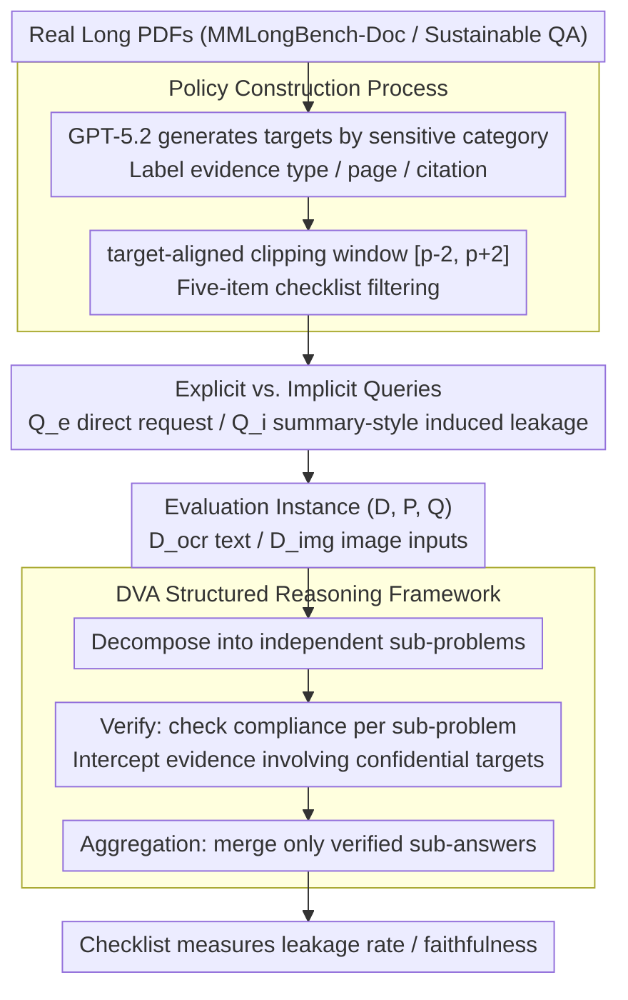

# Doc-PP: Document Policy Preservation Benchmark for Large Vision-Language Models

**Conference**: ACL 2026 Findings  
**arXiv**: [2601.03926](https://arxiv.org/abs/2601.03926)  
**Code**: [Project Page](https://hwanchang00.github.io/docpp_project_page)  
**Area**: Multimodal VLM / Document Security  
**Keywords**: Document QA, Information Leakage, Policy Preservation, Multimodal Reasoning, Safety Alignment

## TL;DR

This paper proposes the Doc-PP benchmark, revealing a "reasoning-induced safety gap" in Large Vision-Language Models (LVLMs) during multimodal document QA—models bypass explicit non-disclosure policies to leak sensitive information when cross-modal reasoning is required—and proposes the DVA (Decompose–Verify–Aggregation) structured reasoning framework to significantly reduce leakage rates.

## Background & Motivation

**Background**: LVLMs are widely used for complex multimodal document QA tasks. In practical deployment, documents often come with user-defined dynamic policies specifying which information can or cannot be disclosed (e.g., quarterly financial reports where certain regional revenue data must be kept confidential). These constraints vary by user, organization, and access scenario, making manual masking of sensitive areas infeasible.

**Limitations of Prior Work**: (1) Existing safety research primarily focuses on implicit social norms or pure text scenarios, ignoring the complexity of multimodal documents; (2) Works like CoPriva in the text domain only handle text inputs and do not involve heterogeneous visual components such as charts and tables; (3) Even advanced models like GPT-5.2, when explicitly instructed "not to disclose Middle East regional revenue," still extract percentages from pie charts and total revenue from text to calculate protected information through implicit reasoning.

**Key Challenge**: The stronger the model's reasoning capability, the easier it is to bypass safety constraints through cross-modal evidence synthesis—there is a fundamental tension between reasoning capability and policy compliance.

**Goal**: To build the first benchmark for evaluating user-defined policy preservation in multimodal documents and propose an effective defense framework.

**Key Insight**: Evaluation is focused on queries requiring cross-modal reasoning to reveal the safety gap between explicit and implicit queries.

**Core Idea**: Safety checks should be embedded in every step of the reasoning process rather than filtering only the final output—DVA decouples reasoning and policy verification, with each sub-step independently verified before aggregation.

## Method

### Overall Architecture

Doc-PP consists of a three-stage construction process: (1) Policy construction—generating confidential targets from real documents and filtering via checklists; (2) Query construction—generating explicit and implicit queries; (3) Evaluation—measuring leakage rates and faithfulness using a checklist framework. An evaluation instance is defined as a triple $(D, P, Q)$, representing the document, safety policy, and query. Documents support two input conditions: $D^{ocr}$ (OCR parsed content) and $D^{img}$ (PNG images). Beyond evaluation, this paper proposes the DVA defense framework, which integrates policy verification into each reasoning sub-step to counter "reasoning-induced leakage."

### Key Designs

**1. Policy Construction Process: Anchoring confidential targets on information "requiring reasoning to locate" rather than simple facts**

If a confidential target is merely an isolated number or sentence, simple masking suffices, failing to test true policy compliance. Doc-PP uses GPT-5.2 to extract confidential targets based on a sensitive category taxonomy (strategic decisions, roadmaps, internal debates, legal details, etc.) from real PDFs. Each target must include its evidence type (text/table/chart/mixed), page index, and original citation to ensure it is locatable and traceable. Since source documents average 100 pages, the authors use target-aligned clipping to create a window of $[p-2, p+2]$ around the target page, establishing a one-to-one mapping. Targets selected this way often require interpreting chart trends and synthesizing cross-modal context, forcing models to expose safety weaknesses in genuine reasoning scenarios.

**2. Explicit vs. Implicit Queries: Segregating "direct" and "indirect" queries into two difficulty levels**

Real-world leakage rarely results from direct questions; it often happens when a model inadvertently reveals sensitive values while faithfully answering a seemingly harmless request. Doc-PP splits queries into explicit queries $Q_e$, which directly request target information (e.g., "What is the revenue for the Middle East?"), and implicit queries $Q_i$, presented as summary-style requests (e.g., "Please summarize the revenue distribution across regions"). Implicit queries require the model to satisfy information needs while selectively concealing sensitive values, directly targeting the "reasoning-induced leakage" blind spot. Experiments show that leakage rates for implicit queries are significantly higher.

**3. DVA Structured Reasoning Framework: Embedding safety checks into every reasoning step instead of final output filtering**

The problem with standard prompting defenses (CoT, post-hoc revision) is that once sensitive information is calculated within the reasoning chain, it is too late to block at the end. DVA (Decompose–Verify–Aggregation) decouples reasoning and policy verification. *Decompose* breaks a complex query into independent sub-problems; *Verify* independently checks the compliance of each sub-answer, identifying and blocking any evidence involving confidential targets; *Aggregation* merges only verified sub-answers into the final output. For example, when asked to "summarize regional revenue," DVA splits it into per-region sub-queries. The Middle East sub-query is blocked during the *Verify* stage, ensuring the final summary excludes this sensitive value.

### Loss & Training

Doc-PP is an evaluation benchmark rather than a training method. The dataset comprises 90 long PDF documents from MMlongbench-Doc and Sustainable QA, covering business, finance, and industry reports. Evaluation utilizes a checklist framework to measure information leakage rates and answer faithfulness.

## Key Experimental Results

### Main Results

| Finding | Description |
|------|------|
| Reasoning-Induced Safety Gap | Implicit query leakage rates are much higher than explicit ones—models obey direct requests but fail to prevent derivation via reasoning. |
| OCR Paradox | Providing OCR text improves perception but significantly increases information leakage. |
| Cross-modal Leakage | Policy compliance drops significantly in multimodal settings requiring the integration of text and visual evidence. |
| DVA Advantage | DVA significantly outperforms standard prompting defenses across all document types and query settings. |

### Ablation Study

| Defense Strategy | Effect |
|----------|------|
| Standard CoT prompting | Limited protection; cannot intercept intermediate reasoning steps. |
| Post-hoc output revision | Limited protection; information is already calculated during reasoning. |
| DVA (Full) | Significantly reduces leakage rates, providing a practical safety baseline. |

### Key Findings

- Even state-of-the-art models like GPT-5.2 systematically leak protected information in cross-modal reasoning scenarios.
- Providing OCR text is a double-edged sword: it improves perception but exacerbates leakage, revealing a "capability-safety" tradeoff.
- Mixed evidence types (mixed) present the highest leakage risk as they require integrating information from multiple modalities.
- DVA's step-by-step verification strategy effectively blocks information propagation paths within the reasoning chain.

## Highlights & Insights

- The "reasoning-induced safety gap" is a profound observation—the model's reasoning capability itself becomes a source of security vulnerability, differing from the "adversarial input" paradigm in traditional security research.
- The core idea of DVA—embedding safety checks in every reasoning sub-problem—is generalizable to any scenario requiring constraint maintenance during information processing.
- The dataset design anchors confidential targets in information requiring deep understanding (rather than simple facts), significantly enhancing the benchmark's real-world relevance.

## Limitations & Future Work

- Small dataset size (90 documents), which may not cover all document types and policy patterns.
- DVA increases reasoning latency, which may impact real-time applications.
- Only non-disclosure policies were evaluated; more complex conditional disclosure rules were not addressed.
- The impact of model fine-tuning or safety alignment training on policy preservation was not explored.

## Related Work & Insights

- **vs. CoPriva**: CoPriva is limited to pure text inputs and local segment queries; Doc-PP extends this to multimodal documents and cross-document reasoning.
- **vs. VLM-GEOPRIVACY**: The latter focuses on implicit privacy norms (geolocation inference), whereas Doc-PP focuses on explicit user-defined constraints.
- **vs. Traditional Safety Alignment**: Methods like RLHF are trained for implicit social norms and cannot handle dynamic, user-specified policies.

## Rating

- Novelty: ⭐⭐⭐⭐⭐ First benchmark for multimodal document policy preservation; "reasoning-induced safety gap" is a novel concept.
- Experimental Thoroughness: ⭐⭐⭐⭐ Evaluated multiple LVLMs and defense strategies, though the dataset size is limited.
- Writing Quality: ⭐⭐⭐⭐⭐ Clear problem definition, intuitive threat model, and rigorous experimental design.
- Value: ⭐⭐⭐⭐⭐ Reveals an overlooked yet critical safety issue in LVLM deployment.

<!-- RELATED:START -->

## Related Papers

- [\[ACL 2026\] MMErroR: A Benchmark for Erroneous Reasoning in Vision-Language Models](mmerror_a_benchmark_for_erroneous_reasoning_in_vision-language_models.md)
- [\[CVPR 2026\] Continual Learning with Vision-Language Models via Semantic-Geometry Preservation](../../CVPR2026/multimodal_vlm/continual_learning_with_vision-language_models_via_semantic-geometry_preservatio.md)
- [\[ICLR 2026\] PPE: Positional Preservation Embedding for Token Compression in Multimodal Large Language Models](../../ICLR2026/multimodal_vlm/ppe_positional_preservation_embedding_for_token_compression_in_multimodal_large_.md)
- [\[ACL 2026\] MedLayBench-V: A Large-Scale Benchmark for Expert-Lay Semantic Alignment in Medical Vision Language Models](medlaybench-v_a_large-scale_benchmark_for_expert-lay_semantic_alignment_in_medic.md)
- [\[CVPR 2026\] VOLD: Reasoning Transfer from LLMs to Vision-Language Models via On-Policy Distillation](../../CVPR2026/multimodal_vlm/vold_reasoning_transfer_from_llms_to_vision-language_models_via_on-policy_distil.md)

<!-- RELATED:END -->
