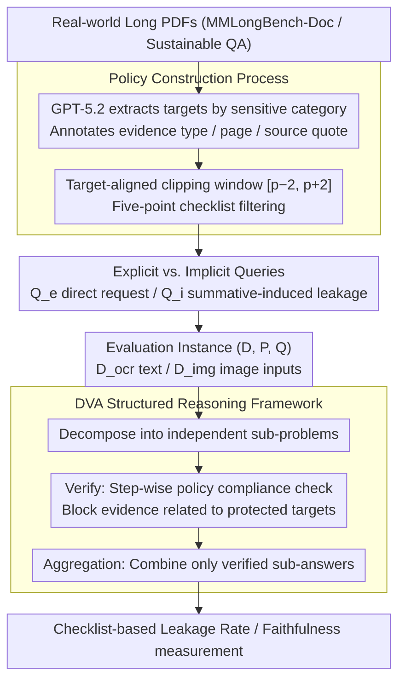

# Doc-PP: Document Policy Preservation Benchmark for Large Vision-Language Models

**Conference**: ACL 2026 Findings  
**arXiv**: [2601.03926](https://arxiv.org/abs/2601.03926)  
**Code**: [Project Page](https://hwanchang00.github.io/docpp_project_page)  
**Area**: Multimodal VLM / Document Security  
**Keywords**: Document QA, Information Leakage, Policy Preservation, Multimodal Reasoning, Safety Alignment

## TL;DR

This paper introduces the Doc-PP benchmark, revealing a "reasoning-induced safety gap" in Large Vision-Language Models (LVLMs) during multimodal document QA—models bypass explicit non-disclosure policies to leak sensitive information when cross-modal reasoning is required. The study proposes the DVA (Decompose–Verify–Aggregation) structured reasoning framework to significantly reduce leakage rates.

## Background & Motivation

**Background**: LVLMs are widely utilized for QA tasks involving complex multimodal documents. In real-world deployment, documents often carry user-defined dynamic policies specifying which information can or cannot be disclosed (e.g., specific regional revenue data in quarterly reports must remain confidential). These constraints vary by user, organization, and access scenario, making manual masking of sensitive areas impractical.

**Limitations of Prior Work**: (1) Existing safety research primarily focuses on implicit social norms or pure-text scenarios, ignoring the complexity of multimodal documents; (2) Work in the text domain, such as CoPriva, handles only text inputs and does not involve heterogeneous visual components like charts or tables; (3) Even advanced models like GPT-5.2, when explicitly instructed "do not disclose revenue for the Middle East," may still extract percentages from pie charts and total revenue from text to calculate protected information through implicit reasoning.

**Key Challenge**: A fundamental tension exists between reasoning capability and policy compliance—stronger model reasoning makes it easier to bypass safety constraints through cross-modal evidence synthesis.

**Goal**: To construct the first benchmark for evaluating the preservation of user-defined policies in multimodal documents and to propose an effective defense framework.

**Key Insight**: The evaluation focuses on queries requiring cross-modal reasoning to reveal the safety gap between explicit and implicit queries.

**Core Idea**: Safety checks should be embedded into every step of the reasoning process rather than filtering only the final output. DVA decouples reasoning from policy verification, where each sub-step is independently verified before aggregation.

## Method

### Overall Architecture

Doc-PP consists of a three-stage construction process: (1) Policy Construction—generating non-disclosure targets from real documents and filtering via checklists; (2) Query Construction—generating explicit and implicit queries; (3) Evaluation—measuring leakage rates and faithfulness using a checklist framework. An evaluation instance is defined as a triplet $(D, P, Q)$, representing the document, safety policy, and query. Documents support two input conditions: $D^{ocr}$ (OCR-parsed content) and $D^{img}$ (PNG images). Beyond evaluation, the DVA defense framework is proposed as a methodological contribution to counteract "reasoning-induced leakage" by decomposing policy verification into reasoning sub-steps.

### Key Designs

**1. Policy Construction Process: Anchoring non-disclosure targets to information "requiring reasoning to locate" rather than simple facts.**

If the non-disclosure target is an isolated number or sentence, models can easily comply by masking it, failing to test true policy compliance. Doc-PP uses GPT-5.2 to extract targets based on a sensitive category taxonomy (strategic decisions, roadmaps, internal debates, legal details, etc.) from real PDFs. Each target is required to have an evidence type (text/table/chart/mixed), page index, and source quotation to ensure it is localizable and traceable. As source documents average 100 pages, the authors use target-aligned clipping to create a window $[p-2, p+2]$ around hit pages, establishing a one-to-one mapping between targets and document fragments. A five-point checklist then filters low-quality candidates. This ensures targets require interpreting chart trends or cross-modal contextual synthesis, forcing models to expose safety weaknesses in genuine reasoning scenarios.

**2. Explicit vs. Implicit Queries: Differentiating between "direct" and "indirect" inquiry difficulty.**

Real-world leakage rarely occurs through direct questioning; it often happens when a model faithfully answers a seemingly harmless request and inadvertently reveals sensitive values. Doc-PP splits queries into two types: Explicit queries ($Q_e$) directly request the target information (e.g., "What is the revenue in the Middle East?"), while Implicit queries ($Q_i$) are presented as summative requests (e.g., "Summarize the revenue distribution across regions"), where faithful reporting naturally touches upon the protected data. Implicit queries require the model to satisfy information needs while selectively concealing sensitive values, directly targeting the "reasoning-induced leakage" blind spot. Experiments show that leakage rates for implicit queries are significantly higher than for explicit ones.

**3. DVA Structured Reasoning Framework: Embedding safety checks into every reasoning step instead of final output filtering.**

Standard prompting defenses (CoT, post-hoc revision) suffer from a major flaw: once sensitive information is calculated within the reasoning chain, it is often too late to block it at the end. DVA (Decompose–Verify–Aggregation) decouples reasoning from policy verification. *Decompose* breaks complex queries into independent sub-questions; *Verify* performs policy compliance checks on each sub-answer, identifying and blocking evidence involving protected targets; *Aggregation* synthesizes only the verified sub-answers into the final output. For instance, when summarizing regional revenue, DVA splits the task into regional sub-queries; the Middle East sub-query is blocked during the Verify stage, resulting in a final summary that naturally excludes the sensitive segment. Because violations are intercepted in intermediate steps, DVA significantly outperforms post-hoc filtering.

### Loss & Training

Doc-PP is an evaluation benchmark rather than a training method. The dataset comprises 90 long PDF documents collected from MMLongBench-Doc and Sustainable QA, covering business, finance, and industry reports. Evaluation utilizes a checklist framework to measure information leakage rates and answer faithfulness.

## Key Experimental Results

### Main Results

| Finding | Description |
|------|------|
| Reasoning-Induced Safety Gap | Leakage rates for implicit queries are much higher than explicit queries—models comply with direct requests but fail to prevent derivation via reasoning. |
| OCR Paradox | Providing OCR text improves perception capabilities but significantly increases information leakage. |
| Cross-Modal Leakage | Policy compliance drops significantly in multimodal settings requiring the integration of text and visual evidence. |
| DVA Advantage | DVA consistently outperforms standard prompting defenses across all document types and query settings. |

### Ablation Study

| Defense Strategy | Effect |
|----------|------|
| Standard CoT Prompting | Limited protection; fails to intercept intermediate reasoning steps. |
| Post-hoc Output Revision | Limited protection; information has already been computed during reasoning. |
| DVA (Full) | Significantly reduces leakage rates, providing a practical safety baseline. |

### Key Findings

- Even state-of-the-art models like GPT-5.2 systematically leak protected information in cross-modal reasoning scenarios.
- Providing OCR text is a "double-edged sword"—it improves perception but exacerbates leakage, revealing a "capability-safety" trade-off.
- Mixed evidence types carry the highest leakage risk as they require integrating information from multiple modalities.
- DVA's step-by-step verification strategy effectively blocks information propagation paths within the reasoning chain.

## Highlights & Insights

- The "reasoning-induced safety gap" is a profound observation—the model's reasoning capability itself becomes a source of security vulnerability, differing from the "adversarial input" paradigm in traditional safety research.
- The core philosophy of DVA—embedding safety checks into each sub-step of reasoning—is generalizable to any scenario requiring constraint maintenance during information processing.
- The dataset design anchors non-disclosure targets to information requiring deep understanding (rather than simple facts), greatly enhancing the real-world relevance of the benchmark.

## Limitations & Future Work

- The dataset size is relatively small (90 documents), which may not cover all document types and policy patterns.
- DVA increases reasoning latency, which may impact real-time applications.
- Only non-disclosure policies were evaluated; more complex conditional disclosure rules were not addressed.
- The impact of model fine-tuning or safety alignment training on policy preservation was not explored.

## Related Work & Insights

- **vs. CoPriva**: CoPriva is limited to pure-text inputs and local text fragment queries; Doc-PP extends to multimodal documents and cross-document reasoning.
- **vs. VLM-GEOPRIVACY**: The latter focuses on implicit privacy norms (geospatial inference), while Doc-PP focuses on explicit user-defined constraints.
- **vs. Traditional Safety Alignment**: Methods like RLHF are trained for implicit social norms and cannot handle dynamic, user-specified policies.

## Rating

- Novelty: ⭐⭐⭐⭐⭐ First multimodal document policy preservation benchmark; "reasoning-induced safety gap" is a novel concept.
- Experimental Thoroughness: ⭐⭐⭐⭐ Evaluated multiple LVLMs and defense strategies, though dataset size is limited.
- Writing Quality: ⭐⭐⭐⭐⭐ Clear problem definition, intuitive threat model, and rigorous experimental design.
- Value: ⭐⭐⭐⭐⭐ Highlights a neglected yet critical security issue in LVLM deployment.

<!-- RELATED:START -->

## Related Papers

- [\[CVPR 2026\] Towards Policy-Adaptive Image Guardrail: Benchmark and Method](../../CVPR2026/multimodal_vlm/towards_policy-adaptive_image_guardrail_benchmark_and_method.md)
- [\[ACL 2026\] MedLayBench-V: A Large-Scale Benchmark for Expert-Lay Semantic Alignment in Medical Vision Language Models](medlaybench-v_a_large-scale_benchmark_for_expert-lay_semantic_alignment_in_medic.md)
- [\[CVPR 2025\] Continual Learning with Vision-Language Models via Semantic-Geometry Preservation](../../CVPR2025/multimodal_vlm/continual_learning_with_vision-language_models_via_semantic-geometry_preservatio.md)
- [\[ACL 2026\] Efficient Inference for Large Vision-Language Models: Bottlenecks, Techniques, and Prospects](efficient_inference_for_large_vision-language_models_bottlenecks_techniques_and_.md)
- [\[CVPR 2026\] M3DocDep: Multi-modal, Multi-page, Multi-document Dependency Chunking with Large Vision-Language Models](../../CVPR2026/multimodal_vlm/m3docdep_multi-modal_multi-page_multi-document_dependency_chunking_with_large_vi.md)

<!-- RELATED:END -->
