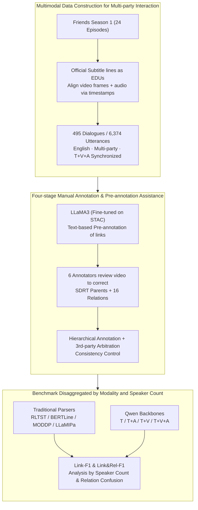

# DraDDP: A Multimodal Multi-Party Dialogue Discourse Parsing Dataset

**Conference**: ACL 2026 Findings  
**arXiv**: [2606.00012](https://arxiv.org/abs/2606.00012)  
**Code**: https://github.com/DraDDP  
**Area**: Multimodal Dialogue Understanding / Discourse Parsing  
**Keywords**: Multi-party dialogue, discourse parsing, multimodal dataset, audio-visual cues, SDRT

## TL;DR
DraDDP constructs the first publicly available English multimodal multi-party dialogue discourse parsing dataset and systematically evaluates the varying contributions of text, audio, and video cues to dependency link and discourse relation identification using traditional parsers, LLMs, and multimodal LLMs.

## Background & Motivation
**Background**: Multi-party dialogue discourse parsing aims to identify dependency structures and relation types (e.g., Comment, Background, Question-Answer Pair) between elementary discourse units (EDUs). Prevailing datasets and methods have largely focused on textual data. Representative datasets include STAC, Molweni, DialogueDSA, and MSDC, while models rely on BERT, structural Transformers, incremental LLaMA-based parsers, or specialized multi-task learning frameworks.

**Limitations of Prior Work**: Real-world multi-party dialogues convey semantics through more than just text. Interactions involve parallel topics, gaze shifts, intonation variations, and physical actions. Relying solely on text often leads to misattaching responses to incorrect contexts. Existing multimodal discourse parsing resources are insufficient: JDDC 2.1 and MODDP are predominantly dyadic (two-party) and primarily Chinese-based, which fails to support research into English multi-party multimodal dialogues.

**Key Challenge**: Multi-party dialogues introduce topic branching and long-distance dependencies, while multimodal information may provide critical cues yet introduce scene noise. The research community lacks a benchmark that simultaneously features English text, multi-party interactions, synchronized audio-video, and manual discourse structure annotations, making it impossible to systematically determine where specific modalities are beneficial.

**Goal**: This work aims to fill the gap at the data level and establish a reproducible experimental benchmark. The objective is to construct an English multi-party dialogue discourse parsing dataset containing text, video, and audio, and to evaluate Link-F1 and Link&Rel-F1 using multiple traditional models, LLMs, and MLLMs to analyze the utility of audio and video across different speaker counts and relation types.

**Key Insight**: The Sitcom *Friends* (Season 1) is selected as the data source due to its stable subtitles and timestamps, as well as rich multi-party interactions, emotional expressions, body movements, and scene transitions. This choice ensures alignment quality while capturing dialogue structures closer to real face-to-face communication compared to forum-based texts.

**Core Idea**: Build an aligned text, video, and audio discourse parsing dataset using timestamped multi-party dialogues from television series, then decompose the question of "whether multimodality is useful" into quantifiable metrics across dependency links, relation types, speaker counts, and modality combinations.

## Method
DraDDP is essentially a dataset and benchmark paper. Its technical contribution lies in framing multi-party multimodal discourse parsing into a pipeline of annotation, training, and comparison: extracting EDUs from sitcom subtitles, annotating dependency graphs and 16 discourse relations according to the SDRT framework, and finally comparing text, audio, video, and their combinations under a unified evaluation protocol.

### Overall Architecture
The overall pipeline consists of four steps. First, Data Preparation: dialogue segments are extracted from 24 episodes of *Friends* Season 1, using official subtitle lines as elementary discourse units (EDUs) and aligning video frames and audio segments via timestamps. Second, Manual Annotation: based on the Segmented Discourse Representation Theory (SDRT) framework, each EDU is annotated with its parent node and one of 16 discourse relations. Third, Quality Control: a pre-annotation model assists without determining final labels; consistency is maintained through hierarchical annotation, discussion, and third-party arbitration. Fourth, Benchmark: evaluation of traditional parsers (RLTST, BERTLine, MODDP, LLaMIPa) and MLLM models (replacing LLaMIPa backbones with the Qwen series) on DraDDP and MODDP across various modality combinations.

### Key Designs
**1. Multimodal Data Construction for Multi-party Interaction: Converting English Sitcom Dialogues into Synchronized T/V/A Samples**

Forum or gaming text data lack interactive cues like facial expressions, gaze, and intonation, while existing dyadic multimodal data fail to cover multi-party topic branching. The authors utilized television dialogues which, though scripted, provide stable and dense synchronized interactions. Official subtitle lines serve as EDUs because their length typically corresponds to a single turn or semantic boundary, and their timestamps facilitate precise alignment with video frames and audio clips. The resulting dataset yields 495 dialogue segments, 6,374 utterances, and 9.1 hours of parallel video.

**2. Four-stage Manual Annotation & Pre-annotation Assistance: Obtaining Reliable Links and Relations in Complex Multi-party Scenarios**

Annotating multi-party overlapping topics from scratch is costly, yet relying solely on models risks entrenching biases. The authors first used LLaMA3 fine-tuned on STAC for textual pre-annotation (achieving 72.69% Link-F1 and 41.31% Relation-F1), which reduced repetitive labor for short-distance dependencies. Six annotators then corrected these labels by reviewing the video. Consistency was ensured through a hierarchical process: collaborative annotation of 1/6 of the data to unify standards, independent double-annotation of 1/3 with conflict resolution, and third-party arbitration for the remainder.

**3. Benchmark Disaggregated by Modality and Speaker Count: Quantifying Modality Utility**

Multimodality is not universally beneficial—video may capture gaze but also introduce scene noise. To clarify conditionality, evaluation uses micro F1 for Link-F1 (structure only) and Link&Rel-F1 (structure and relation). In addition to traditional baselines, the authors adapted the LLaMIPa framework using Qwen2.5, Qwen2.5-VL, Qwen2-Audio, and Qwen2.5-Omni. Analyzing results by speaker count and relation confusion reveals respective gains for audio in multi-party settings and video in dyadic settings.

### Loss & Training
The paper adopts training strategies from existing baselines. LLM-based models were fine-tuned with LoRA using LLaMA-Factory: rank 8, scaling 16, AdamW optimizer with $1\times10^{-4}$ learning rate, batch size 1, gradient accumulation 8, trained for 3 epochs. Video was sampled at 1 fps (max 16 frames), and audio was converted to 16 kHz, 80-channel Mel spectrograms. Checkpoints were selected based on the best Link&Rel-F1 on the development set.

## Key Experimental Results

### Main Results

| Dataset / Setting | Metric | Ours | Compared Baseline | Description |
|--------|------|------|----------|------|
| DraDDP Scale | Dialogues / Utterances / Video | 495 / 6,374 / 9.1h | MODDP: 864 / 18K / Chinese Dyadic | DraDDP is smaller but covers English multi-party T+V+A |
| DraDDP | Link-F1 / Link&Rel-F1 | LLaMIPa†: 85.03 / 54.58 | LLaMIPa: 84.71 / 53.39 | Removing historical structure concatenation improved Rel-F1 by 1.19 |
| DraDDP | Link-F1 / Link&Rel-F1 | Qwen2-Audio: 84.90 / 55.09 | Qwen2.5 text: 84.14 / 53.55 | Audio provides a 1.54 Link&Rel-F1 gain |
| MODDP | Link-F1 / Link&Rel-F1 | Qwen2-Audio: 92.43 / 54.88 | Qwen2.5 text: 91.26 / 52.82 | Audio also yields a 2.06 Rel-F1 gain on Chinese dyadic data |
| DraDDP | Link-F1 / Link&Rel-F1 | Qwen2.5-Omni: 84.55 / 53.34 | Qwen2-Audio: 84.90 / 55.09 | Full modality fusion underperforms T+A, indicating video noise offsets gains |

### Ablation Study

| Configuration | Link-F1 | Link&Rel-F1 | Description |
|------|---------|------|------|
| T | 84.67 | 53.69 | Text is the strongest single-modality baseline |
| V | 43.38 | 22.21 | Pure visual info is insufficient for parsing discourse relations |
| A | 47.39 | 38.83 | Pure audio is closer to relation discrimination than pure vision |
| T+V | 83.61 | 52.97 | Video inclusion results in lower performance than Text-only |
| T+A | 84.83 | 54.76 | Best dual-modality combination (+1.07 Link&Rel-F1 over Text) |
| V+A | 50.12 | 40.39 | Difficult to parse dependency structures reliably without text |
| T+A+V | 84.55 | 53.34 | Triple-modality fusion is hampered by visual noise |

### Key Findings
- Multi-party attributes increase difficulty: the Qwen2.5 text model's Link-F1 on DraDDP is 84.14, which is 7.12 lower than on MODDP.
- Audio becomes more critical as the number of speakers increases. In scenarios with $s>6$, Qwen2-Audio improves Link-F1 by 7.69 and Link&Rel-F1 by 5.77 over the text model.
- Video is better suited for dyadic or few-speaker scenarios. In $s\leq2$, Qwen2.5-VL’s Link&Rel-F1 is 2.08 higher than the text model; however, in complex multi-party scenes, background and movement noise interfere.
- Error analysis shows audio significantly reduces confusions related to emotion and questions, such as a 71.4% reduction in `{Comt -> Clafi}` errors and 75% in `{QAP -> Comt}` errors.

## Highlights & Insights
- The dataset positioning is precise: it addresses the specific intersection of "English + Multi-party + T/V/A + Discourse Structure," where public resources were previously non-existent.
- A key insight is the "conditional utility" of modalities: audio is more reliable in complex multi-party interactions, while video is more effective in dyadic focuses. Full modality fusion can hurt relation identification due to noise.
- Pre-annotation was used cautiously. The authors did not treat LLaMA3 outputs as gold labels but as a means to reduce manual labor on structure, while relying on human visual review for relation types.
- Future multi-party dialogue models should explore dynamic weighting of modalities based on participant count, relation type, and scene noise rather than simple concatenation.

## Limitations & Future Work
- Data scale remains relatively small; 6,374 utterances are limited for training large models, leading to potential data sparsity for long-tail relations.
- The use of a single sitcom may introduce biases related to the specific comedic style, scripted pacing, and cultural background of *Friends*.
- Coarse video processing (1 fps, max 16 frames) may fail to capture micro-expressions or the precise temporal boundaries of actions, potentially underestimating the ceiling of visual information.
- Current fusion relies on existing MLLM capacities. Future work should explore modality gating, character tracking, and temporal visual encoding specifically for discourse relations.

## Related Work & Insights
- **vs STAC / Molweni**: These provide multi-party text discourse resources. DraDDP introduces audio/video and face-to-face interaction, though at a smaller scale.
- **vs MODDP**: MODDP is Chinese and dyadic. DraDDP focuses on English and multi-party scenarios with more topic branching.
- **vs LLaMIPa**: Using the LLaMIPa incremental parser as a baseline reveals that historical structure concatenation can propagate early errors, suggesting a need for better confidence control in multi-party history dependencies.
- **Insights for MLLMs**: General multimodal models cannot perform fine-grained discourse parsing out of the box. This dataset serves as a diagnostic benchmark for whether models truly understand "who is responding to whom and why."

## Rating
- Novelty: ⭐⭐⭐⭐☆ First English multimodal multi-party dataset; the task combination is novel, though model innovation is not the focus.
- Experimental Thoroughness: ⭐⭐⭐⭐☆ Comprehensive benchmarks and disaggregated analyses, though limited by data scale.
- Writing Quality: ⭐⭐⭐⭐☆ Clear motivation and pipeline explanation; high information density in tables.
- Value: ⭐⭐⭐⭐⭐ High utility for multimodal dialogue understanding, meeting parsing, and MLLM diagnostics.

<!-- RELATED:START -->

## Related Papers

- [\[ACL 2025\] AkaCE: A Multimodal Multi-party Dataset for Emotion Recognition in Movie Dialogues](../../ACL2025/multimodal_vlm/akan_cinematic_emotions_ace_a_multimodal_multi-party_dataset_for_emotion_recogni.md)
- [\[ACL 2026\] GuideDog: A Real-World Egocentric Multimodal Dataset for Blind and Low-Vision Accessibility-Aware Guidance](guidedog_a_real-world_egocentric_multimodal_dataset_for_blind_and_low-vision_acc.md)
- [\[ACL 2026\] OMHBench: Benchmarking Balanced and Grounded Omni-Modal Multi-Hop Reasoning](omhbench_benchmarking_balanced_and_grounded_omni-modal_multi-hop_reasoning.md)
- [\[ACL 2026\] From Heads to Neurons: Causal Attribution and Steering in Multi-Task Vision-Language Models](from_heads_to_neurons_causal_attribution_and_steering_in_multi-task_vision-langu.md)
- [\[NeurIPS 2025\] SmartWilds: Multimodal Wildlife Monitoring Dataset](../../NeurIPS2025/multimodal_vlm/smartwilds_multimodal_wildlife_monitoring_dataset.md)

<!-- RELATED:END -->
