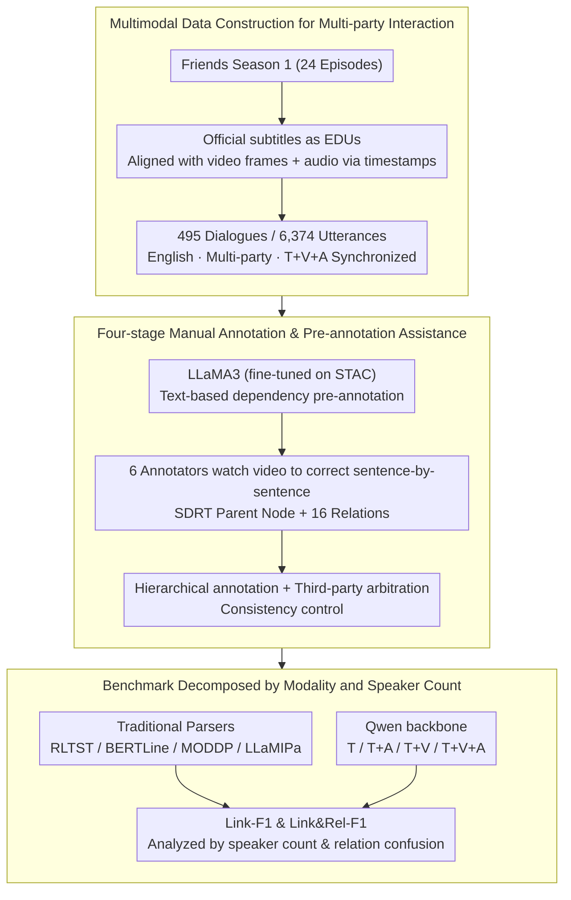

# DraDDP: A Multimodal Multi-Party Dialogue Discourse Parsing Dataset

**Conference**: ACL 2026 Findings  
**arXiv**: [2606.00012](https://arxiv.org/abs/2606.00012)  
**Code**: https://github.com/DraDDP  
**Area**: Multimodal Dialogue Understanding / Discourse Parsing  
**Keywords**: Multi-party dialogue, Discourse parsing, Multimodal dataset, Audio-visual cues, SDRT

## TL;DR
DraDDP constructs the first publicly available English multimodal multi-party dialogue discourse parsing dataset. Using traditional parsers, LLMs, and multimodal LLMs, it systematically evaluates the varying contributions of text, audio, and video cues to dependency edge and discourse relation recognition.

## Background & Motivation
**Background**: Multi-party dialogue discourse parsing aims to identify the dependency structure and relation types (e.g., Comment, Background, Question-Answer Pair) between elementary discourse units (EDUs). Previously, mainstream datasets and methods (STAC, Molweni, DialogueDSA, MSDC) primarily focused on text, with models relying on BERT, structural Transformers, incremental LLaMA parsers, or specialized multi-task learning frameworks.

**Limitations of Prior Work**: Real-world multi-party dialogues do not convey semantics solely through text. Speakers utilize parallel topics, gaze shifts, intonation changes, and scene actions. Relying only on text often leads to misconnecting irrelevant responses to the wrong context. Existing multimodal discourse parsing resources are insufficient: JDDC 2.1 and MODDP focus on dyadic dialogues and are primarily Chinese-language resources, failing to support research on English multi-party multimodal dialogues.

**Key Challenge**: Multi-party dialogues introduce topic branching and long-distance dependencies, while multimodal information may provide critical cues or introduce scene noise. The research community lacks a benchmark featuring English, multi-party interactions, synchronized audio/video, and manual discourse structure annotations to systematically determine where different modalities are truly beneficial.

**Goal**: Ours aims to fill the data gap and establish a reproducible experimental benchmark. This involves constructing an English multi-party dialogue discourse parsing dataset containing text, video, and audio, and evaluating Link-F1 and Link&Rel-F1 using traditional models, LLMs, and MLLMs to analyze the roles of audio and video across different speaker counts and relation types.

**Key Insight**: The paper selects the first season of the American TV show *Friends* as the data source due to its stable subtitles and timestamps, as well as its rich multi-party interactions, emotional expressions, body movements, and scene transitions. This choice allows for the collection of dialogue structures closer to real face-to-face communication while ensuring alignment quality.

**Core Idea**: Construct an aligned text, video, and audio discourse parsing dataset using timestamped multi-party dialogues from TV shows. A systematic benchmark then deconstructs "the utility of multimodality" into quantifiable questions regarding dependency edges, relation types, speaker counts, and modality combinations.

## Method
DraDDP is essentially a dataset and benchmark paper. Its technical contribution lies in decomposing multimodal multi-party discourse parsing into a processable pipeline: extracting EDUs from subtitles, annotating dependency graphs and 16 discourse relations according to the SDRT framework, and comparing text, audio, video, and their combinations under a unified evaluation protocol.

### Overall Architecture
The overall pipeline is divided into four steps. The first is data preparation: extracting dialogue segments from 24 episodes of *Friends* Season 1, using official subtitle lines as elementary discourse units (EDUs), and aligning video frames and audio snippets using subtitle timestamps. The second is manual annotation: based on the SDRT (Segmented Discourse Representation Theory) relation system, each EDU is annotated with its parent node and one of 16 discourse relations. The third is quality control: pre-trained models assist but do not determine final labels, with consistency controlled through hierarchical annotation, discussion, and third-party arbitration. The fourth is the benchmark: evaluating traditional parsers such as RLTST, BERTLine, MODDP, and LLaMIPa on DraDDP and MODDP, as well as text, text+audio, text+video, and all-modality models by replacing the backbone of the LLaMIPa framework with the Qwen series.

### Key Designs
**1. Multimodal Data Construction for Multi-party Interaction: Converting English TV Multi-party Dialogues into Synchronized T/V/A Samples**

Forum or gaming text data lacks interactive cues like facial expressions, gaze, and tone, while existing dyadic multimodal data cannot cover multi-party topic branching. The authors return to TV dialogue—which, though scripted, provides stable, dense, and aligned multi-party interactions. Official subtitle lines are used directly as EDUs because they are of moderate length, typically correspond to a single turn and semantic boundary, and include timestamps for precise alignment with video frames and audio. The final dataset consists of 495 dialogue segments, 6,374 utterances, and 9.1 hours of parallel video, forming a synchronized English, multi-party, tri-modal resource for discourse parsing.

**2. Four-stage Manual Annotation with Pre-annotation Assistance: Obtaining Reliable Dependency Edges and Relation Types in Complex Scenarios**

The cost of purely manual annotation for dialogues with interleaved multi-party topics is extremely high, while relying solely on models can solidify model bias into labels. The authors first use LLaMA3 fine-tuned on STAC to perform text pre-annotation on DraDDP. Then, 2 PhD students and 4 Master's students correct the annotations sentence-by-sentence while watching the video. Pre-annotation achieved 72.69% F1 on dependency structures and 41.31% F1 on relation types, which reduced repetitive labor for short-distance dependencies while leaving final relation judgments to humans combining text and audio-visual cues. Consistency was ensured via a hierarchical process: collaborative annotation of 1/6 of the data to unify standards, independent dual-annotation of 1/3 of the data with discussion of discrepancies, and initial annotation of the remainder by two people with arbitration by a third.

**3. Benchmarking Decomposed by Modality and Speaker Count: Quantifying "Whether Multimodality is Useful"**

Multimodality is not universally beneficial—video may capture gaze and action but can also introduce scene noise; audio may be more sensitive to tone and emotion. To clarify the conditionality of modal effects, the evaluation uses micro F1 and distinguishes between Link-F1 (requiring only correct dependency edges) and Link&Rel-F1 (requiring both correct edges and relations). Besides traditional models (RLTST, BERTLine, MODDP, LLaMIPa), the authors replace the LLaMIPa backbone with Qwen2.5, Qwen2.5-VL, Qwen2-Audio, and Qwen2.5-Omni, corresponding to text-only, text+video, text+audio, and text+video+audio. Expanding results by speaker count and relation confusion reveals the performance boundaries of audio in multi-party scenarios and video in dyadic scenarios.

### Loss & Training
The paper does not propose a new loss function; the training strategy follows existing baselines. LLM-related models use LLaMA-Factory for LoRA fine-tuning, with rank 8, scaling 16, and an AdamW learning rate of $1\times10^{-4}$. The batch size is 1 per GPU with 8 gradient accumulation steps, trained for 3 epochs using mixed precision. Video is sampled at 1 fps (max 16 frames), and audio is converted to 16 kHz, 80-channel Mel spectrograms. Checkpoints are selected based on the best Link&Rel-F1 on the development set.

## Key Experimental Results

### Main Results

| Dataset / Setting | Metric | Key Result (Ours) | Comparison Object | Note |
|--------|------|------|----------|------|
| DraDDP Scale | Dialogues / Utterances / Video | 495 / 6,374 / 9.1h | MODDP: 864 / 18K / Chinese Dyadic | DraDDP is smaller but covers English multi-party T+V+A |
| DraDDP | Link-F1 / Link&Rel-F1 | LLaMIPa†: 85.03 / 54.58 | LLaMIPa: 84.71 / 53.39 | Relation F1 increased by 1.19 after removing historical structure concatenation |
| DraDDP | Link-F1 / Link&Rel-F1 | Qwen2-Audio: 84.90 / 55.09 | Qwen2.5 text: 84.14 / 53.55 | Audio provides a 1.54 Link&Rel-F1 gain |
| MODDP | Link-F1 / Link&Rel-F1 | Qwen2-Audio: 92.43 / 54.88 | Qwen2.5 text: 91.26 / 52.82 | Audio also yields 2.06 Link&Rel-F1 gain on Chinese dyadic data |
| DraDDP | Link-F1 / Link&Rel-F1 | Qwen2.5-Omni: 84.55 / 53.34 | Qwen2-Audio: 84.90 / 55.09 | Full modality fusion is inferior to T+A, indicating video noise offsets gains |

### Ablation Study

| Configuration | Link-F1 | Link&Rel-F1 | Note |
|------|---------|------|------|
| T | 84.67 | 53.69 | Text is the strongest single-modality baseline |
| V | 43.38 | 22.21 | Pure visual information is insufficient for discourse parsing |
| A | 47.39 | 38.83 | Pure audio is closer to relation discrimination than pure visual |
| T+V | 83.61 | 52.97 | Performance drops below pure text when video is added |
| T+A | 84.83 | 54.76 | Optimal dual-modality combination, +1.07 Link&Rel-F1 over pure T |
| V+A | 50.12 | 40.39 | Dependency structure parsing remains difficult without text |
| T+A+V | 84.55 | 53.34 | Tri-modal fusion is negatively impacted by visual noise |

### Key Findings
- The multi-party nature of DraDDP increases difficulty: The Qwen2.5 text model's Link-F1 on DraDDP is 84.14, which is 7.12 lower than on MODDP.
- Audio becomes more important as the number of speakers increases. In scenarios where $s>6$, Qwen2-Audio improves Link-F1 by 7.69 and Link&Rel-F1 by 5.77 compared to the text model.
- Video is better suited for dyadic or few-speaker scenarios. At $s\leq2$, Qwen2.5-VL's Link&Rel-F1 is 2.08 higher than the text model; however, in complex multi-party scenarios, background and motion noise interfere with relation classification.
- Error analysis shows that audio significantly reduces confusion related to emotions and queries; for example, `{Comt -> Clafi}` errors decreased by 71.4%, and `{QAP -> Comt}` errors decreased by 75%.

## Highlights & Insights
- The dataset positioning is precise: it does not aim to be a general chat dataset but specifically targets the "English + Multi-party + T/V/A + Discourse Structure" gap, where public resources were previously non-existent.
- The most valuable insight is that "multimodality is useful conditionally." Audio is more reliable in complex multi-party interactions, while video is more focused in dyadic interactions. All-modality fusion may actually harm relation recognition due to noise.
- The use of pre-annotation is restrained. The authors did not treat LLaMA3 outputs as silver labels but used them to reduce repetitive work for short-distance dependencies, relying on human review of video to correct relation types.
- The implication for future tasks is that multimodal dialogue models should not simply concatenate all modalities but should dynamically weight them based on participation count, relation type, and scene noise.

## Limitations & Future Work
- The dataset scale is still relatively small. 495 segments and 6,374 utterances are insufficient for training large models, especially for fine-grained, long-tail discourse relations.
- The data source is a single sitcom, which may carry the humor style, scripted pacing, and specific cultural background of *Friends*, and may not directly represent meetings, customer service, or natural social scenarios.
- Video processing is coarse; 1 fps and a maximum of 16 frames make it difficult to capture micro-expressions, action boundaries, and multi-party gaze flow, likely underestimating the potential of visual information.
- Current fusion relies on existing MLLM capabilities, and results show that full modality fusion introduces interference. Future work should explore modality gating, speaker tracking, and temporal visual encoding specialized for discourse relations.

## Related Work & Insights
- **vs STAC / Molweni**: These provide multi-party text discourse parsing resources; DraDDP adds audio and video and uses face-to-face multi-party interaction as the source, offering the advantage of studying non-verbal cues at the cost of smaller scale.
- **vs MODDP**: MODDP is a Chinese dyadic multimodal discourse parsing dataset; DraDDP's core difference is its English language and multi-party scenarios, covering more topic branching and long-distance dependencies.
- **vs LLaMIPa**: LLaMIPa is an incremental parser; DraDDP uses it as a strong baseline and finds that historical structure concatenation may propagate early errors, suggesting that historical dependencies in multi-party parsing require more cautious confidence control.
- **Insight for Multimodal VLMs**: General VLMs/MLLMs may not perform precise discourse parsing even if they can "see" and "hear." This dataset serves as a diagnostic benchmark for whether multimodal models truly understand "who is responding to whom and why."

## Rating
- Novelty: ⭐⭐⭐⭐☆ First public English multimodal multi-party discourse parsing dataset; the task-data combination is novel, though model innovation is not the focus.
- Experimental Thoroughness: ⭐⭐⭐⭐☆ Benchmark, modality ablation, speaker count analysis, and error type analysis are comprehensive, though limited by data scale and single source.
- Writing Quality: ⭐⭐⭐⭐☆ Motivation, construction process, and experimental explanations are clear with high-density tables.
- Value: ⭐⭐⭐⭐⭐ Highly useful for multimodal dialogue understanding, meeting parsing, social scenario modeling, and MLLM diagnostics; sits at the high-value end of resource-oriented papers.

<!-- RELATED:START -->

## Related Papers

- [\[ACL 2025\] AkaCE: A Multimodal Multi-party Dataset for Emotion Recognition in Movie Dialogues](../../ACL2025/multimodal_vlm/akan_cinematic_emotions_ace_a_multimodal_multi-party_dataset_for_emotion_recogni.md)
- [\[CVPR 2026\] ChartNet: A Million-Scale, High-Quality Multimodal Dataset for Robust Chart Understanding](../../CVPR2026/multimodal_vlm/chartnet_a_million-scale_high-quality_multimodal_dataset_for_robust_chart_unders.md)
- [\[ICLR 2026\] ChartGalaxy: A Dataset for Infographic Chart Understanding and Generation](../../ICLR2026/multimodal_vlm/chartgalaxy_a_dataset_for_infographic_chart_understanding_and_generation.md)
- [\[ACL 2026\] GuideDog: A Real-World Egocentric Multimodal Dataset for Blind and Low-Vision Accessibility-Aware Guidance](guidedog_a_real-world_egocentric_multimodal_dataset_for_blind_and_low-vision_acc.md)
- [\[ACL 2026\] Prune-then-Merge: Towards Efficient Multi-Vector Visual Document Retrieval](sculpting_the_vector_space_towards_efficient_multi-vector_visual_document_retrie.md)

<!-- RELATED:END -->
## Related Papers

- [\[ACL 2025\] AkaCE: A Multimodal Multi-party Dataset for Emotion Recognition in Movie Dialogues](../../ACL2025/multimodal_vlm/akan_cinematic_emotions_ace_a_multimodal_multi-party_dataset_for_emotion_recogni.md)
- [\[CVPR 2026\] ChartNet: A Million-Scale, High-Quality Multimodal Dataset for Robust Chart Understanding](../../CVPR2026/multimodal_vlm/chartnet_a_million-scale_high-quality_multimodal_dataset_for_robust_chart_unders.md)
- [\[ACL 2026\] GuideDog: A Real-World Egocentric Multimodal Dataset for Blind and Low-Vision Accessibility-Aware Guidance](guidedog_a_real-world_egocentric_multimodal_dataset_for_blind_and_low-vision_acc.md)
- [\[ACL 2026\] From Heads to Neurons: Causal Attribution and Steering in Multi-Task Vision-Language Models](from_heads_to_neurons_causal_attribution_and_steering_in_multi-task_vision-langu.md)
- [\[NeurIPS 2025\] SmartWilds: Multimodal Wildlife Monitoring Dataset](../../NeurIPS2025/multimodal_vlm/smartwilds_multimodal_wildlife_monitoring_dataset.md)

<!-- RELATED:END -->
