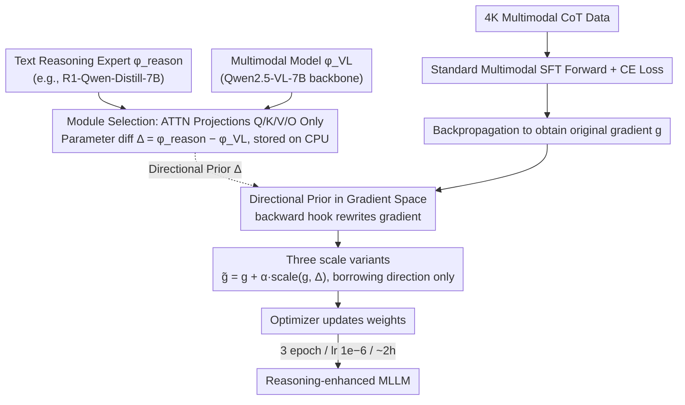

# DRIFT: Transferring Reasoning Priors for Efficient MLLM Fine-Tuning

**Conference**: ACL 2026  
**arXiv**: [2510.15050](https://arxiv.org/abs/2510.15050)  
**Code**: https://wikichao.github.io/DRIFT/ (Project Page available)  
**Area**: Multimodal VLM / Fine-tuning / Reasoning Transfer  
**Keywords**: MLLM, Reasoning Transfer, Gradient Prior, SFT, Model Merging

## TL;DR
DRIFT treats the "parameter difference between a text reasoning expert and a multimodal model" as a directional prior, applying lightweight bias to gradients (without altering weights) during multimodal SFT backpropagation. Using ~4K multimodal CoT data and approximately 2 hours of training, it consistently enables Qwen2.5-VL-7B to outperform parameter merging baselines and heavy SFT/RL methods on benchmarks such as MathVista, MathVerse, and WeMath.

## Background & Motivation

**Background**: The current mainstream approaches to enhancing MLLM reasoning capabilities follow two paths: large-scale multimodal CoT SFT (e.g., R1-OneVision, OpenVLThinker) or reinforcement learning on multimodal data (e.g., R1-VL). Both rely on expensive multimodal reasoning data and multi-day training. Meanwhile, pure-text reasoning models (e.g., DeepSeek-R1-Distill series, Qwen-Math) are readily available due to the abundance of text-based CoT data.

**Limitations of Prior Work**: MLLMs generally "perceive clearly but reason poorly"—sensing is adequate, but multi-step reasoning deviates. Conversely, text reasoning experts are powerful but lack vision. Merging their parameters at the weight level (BR2V, Task Arithmetic, TIES, DARE, Layer Swap) appears to be a "free lunch," but the authors' evaluation in Tab. 1 across four backbones reveals that while LLaMA/Mistral families (with closer parameter spaces) show small gains of +1~2 points, the Qwen family (Qwen2-VL, Qwen2.5-VL) suffers from large parameter space distribution shifts, causing merging to degrade performance (Qwen2.5-VL+R1 drops by -8.2 on MathVerse).

**Key Challenge**: The success of parameter space merging depends entirely on the alignment of the two experts' distributions on the backbone. Once magnitude or direction deviates significantly, linear interpolation destroys multimodal alignment, causing instability or even gradient explosion. Finding an optimal interpolation coefficient $\beta$ is extremely costly, as it requires loading all candidate models into VRAM simultaneously.

**Goal**: To find a lightweight mechanism that can stably "borrow" capabilities from text reasoning experts for MLLMs without relying on massive multimodal CoT data.

**Key Insight**: The authors observe that the parameter difference between the expert and the base essentially encodes the "domain knowledge direction." Rather than direct interpolation in weight space (which breaks alignment), this directional prior can be injected into the **gradients** during SFT. This allows the optimization trajectory to be "gently pulled" towards the reasoning direction without forcefully altering parameters.

**Core Idea**: By using $\Delta = \phi_{\text{reason}} - \phi_{\text{VL}}$ as a directional prior, gradients are biased during backpropagation via $\tilde{g} = g + \alpha \cdot \text{scale}(g, \Delta)$. This maintains the standard SFT pipeline while stably transferring text reasoning capabilities to the multimodal domain.

## Method

### Overall Architecture
DRIFT embeds "reasoning injection" into the backpropagation of standard multimodal SFT through a three-stage process:

1.  **Offline Calculation of Reasoning Prior**: A text reasoning expert $\phi_{\text{reason}}$ (e.g., DeepSeek-R1-Qwen-Distill-7B) and a multimodal variant $\phi_{\text{VL}}$ (e.g., the LLM backbone of Qwen2.5-VL-7B) derived from the same base LLM are used to compute the parameter difference $\Delta = \phi_{\text{reason}} - \phi_{\text{VL}}$ layer-by-layer and module-by-module. $\Delta$ is kept only for selected "reasoning-related" modules (defaulting to ATTN projections Q/K/V/O) and **stored on the CPU**, being moved to the GPU as needed.
2.  **Conventional Multimodal SFT Forward Pass**: Qwen2.5-VL-7B-Instruct is trained using 4K high-quality multimodal CoT data (distilled via ThinkLiteVL-11K with error filtering, CoT wrapped in `<think></think>`). The forward pass, loss, and autograd remain unchanged.
3.  **Directional Prior Injection via Gradient Hooks**: Hooks are registered during `backward()`. For each selected parameter $w$, the original gradient $g$ is rewritten as the guided gradient $\tilde{g} = g + \alpha \cdot \text{scale}(g, \Delta)$ before being passed to the optimizer. Training involves 3 epochs with a learning rate of $1\times 10^{-6}$ and $\alpha=-1$, completing in about 2 hours.

### Key Designs

**1. Directional Prior in Gradient Space: Using the expert-to-VL parameter difference as a compass to nudge gradient direction without direct weight modification**

The failure of parameter-level merging in the Qwen family is rooted in its "one-step leap." Original BR2V calculates $\phi_{\text{VL}\oplus\text{reason}} = \phi_{\text{base}} + \beta(\phi_{\text{VL}}-\phi_{\text{base}}) + (1-\beta)(\phi_{\text{reason}}-\phi_{\text{base}})$, which is extremely sensitive to the interpolation coefficient $\beta$. Distribution shifts break multimodal alignment during linear interpolation. DRIFT moves $\Delta$ from weight space to gradient space: at each SFT step, gradients of selected modules aremodified via $\tilde{g} = g + \alpha \cdot \text{scale}(g, \Delta)$. This ensures weights still originate from $\phi_{\text{VL}}$ and are dominated by multimodal loss, being only gently pulled by $\Delta$. This "incremental nudge" replaces the "one-step leap," and when coupled with multimodal CoT data that naturally links perception and reasoning, it avoids $\beta$ tuning and avoids destroying visual alignment.

**2. Three Scale Variants: Borrowing the direction of $\Delta$ without its magnitude is key to stability**

Directly adding the absolute magnitude of $\Delta$ to the gradient is equivalent to forcefully pulling weights toward the reasoning expert. The authors verified this with three formulas: (i) Absolute $\tilde{g} = g + \alpha \Delta$ (direct addition); (ii) Grad-Norm $\tilde{g} = g + \alpha \|g\| \frac{\Delta}{\|\Delta\|}$ (takes the direction of $\Delta$ but retains the norm of $g$); (iii) Grad-Norm w/ Adaptive $\alpha$, where $\alpha' = \alpha \cdot \frac{1 + \cos(g, \Delta)}{2}$ (pushes more when the gradient and prior are aligned, and less when they conflict). Results showed Absolute dropped by 3 on MathVista and crashed by 19.7 on LogicVista, confirming absolute magnitude destroys alignment. Grad-Norm provides stability by scaling the prior to the current gradient, and Adaptive $\alpha$ proves most robust—confirming the core insight of "borrowing direction, not magnitude."

**3. Module Selection: Injection into Attention Projections is most stable**

Which sub-modules $\Delta$ is injected into also determines success. Ablations on ATTN(Q/K/V/O), MLP, Norm, and LM Head showed that selecting only {ATTN} was most stable (LogicVista +3.8, MathVerse +2.4). Adding MLP reduced gains, adding Norm introduced noise, and extending to the LM Head led to inconsistent results. Attention projections are central to "deciding where to look" (token-to-token), carrying the long-range dependency routing required for reasoning chains. MLP is more like "local knowledge retrieval" with higher cross-domain variance; Norm parameters are sensitive to scale and easily derail training. Thus, the reasoning prior is applied only to attention projections by default.

### Loss & Training
- **Training Objective**: Standard multimodal SFT cross-entropy loss, without auxiliary losses or new parameters.
- **Data**: 4K multimodal CoT (ThinkLiteVL-11K → ThinkLite distill CoT → error filtering → `<think></think>` wrapping).
- **Optimization**: 3 epochs, lr $1\times10^{-6}$, $\alpha=-1$ (meaning $g$ is slightly biased in the $-\Delta$ direction; since $\Delta = \phi_{\text{reason}} - \phi_{\text{VL}}$, the weight update moves toward the reasoning expert).
- **Engineering**: Based on LLaMAFactory, $\Delta$ resides on CPU with on-demand GPU transfer, modifying only backpropagation hooks with zero additional trainable parameters.

## Key Experimental Results

### Main Results

DeepSeek-R1-Qwen-Distill-7B → Qwen2.5-VL-7B-Instruct, compared against 5 parameter merging and 4 reasoning SFT methods (Combined Tab. 2 + Tab. 3):

| Method | MathVista | MathVision | MathVerse | WeMath-strict | LogicVista | Avg |
|------|-----------|-----------|-----------|---------------|-----------|------|
| Qwen2.5-VL-7B (baseline) | 67.9 | 25.0 | 41.4 | 34.3 | 46.7 | 44.7 |
| Task Arithmetic | 65.8 (−2.1) | 22.7 (−2.3) | 33.2 (−8.2) | 30.1 (−4.2) | 42.0 (−4.7) | 40.8 |
| TIES | 63.6 | 23.1 | 39.5 | 33.4 | 42.1 | 42.2 |
| DARE-TIES | 66.3 | 23.6 | 38.3 | 33.7 | 42.0 | 42.8 |
| Layer Swap | 63.6 | 22.9 | 37.9 | 32.1 | 35.1 | 40.3 |
| Pure SFT (4K) | 68.7 | 25.1 | 42.0 | 33.3 | 45.6 | — |
| **DRIFT (Ours)** | **69.9 (+2.0)** | **26.6 (+1.6)** | **43.9 (+2.5)** | **38.5 (+4.2)** | **47.2 (+0.5)** | **47.7 (+3.0)** |

DRIFT is the only method to achieve gains across all 5 benchmarks, slightly outperforming much heavier methods like OpenVLThinker, R1-OneVision, and X-Reasoner despite using only 4K data and ~2 hours of training.

### Ablation Study

Tab. 4 showing scale strategy × merge module combinations (SFT baseline: MathVista 68.7 / MathVerse 42.0 / LogicVista 45.6):

| Configuration | MathVista | MathVerse | LogicVista | Description |
|------|-----------|-----------|-----------|------|
| Absolute @ {ATTN, MLP} | 65.7 (−3.0) | 39.5 (−2.5) | 25.9 (**−19.7**) | Direct weight拉取, destroys alignment |
| Grad-Norm @ {ATTN, MLP} | 68.8 (+0.1) | 43.9 (+1.9) | 46.1 (+0.5) | Stable |
| Grad-Norm + Adaptive $\alpha$ @ {ATTN, MLP} | 69.9 (+1.2) | 43.9 (+1.9) | 47.2 (+1.6) | **Full Model** |
| Grad-Norm @ {ATTN only} | 68.8 | 44.4 (+2.4) | **49.4 (+3.8)** | Best for MathVerse/LogicVista |
| Grad-Norm @ {MLP only} | 68.5 (−0.5) | 42.6 (+0.6) | 46.3 (+0.7) | Minimal gain |
| Grad-Norm @ {ATTN, MLP, Norm} | 68.6 (−0.1) | 43.0 (+1.0) | 46.8 (+1.2) | Adding Norm dilutes gain |

### Key Findings
- **Direction vs. Magnitude**: The 19.7 point crash of Absolute on LogicVista proves that pulling weights directly shatters multimodal alignment. Grad-Norm (borrowing only direction) is stable. Adaptive $\alpha$ further leverages $\cos(g, \Delta)$ for a robust "directional push" strategy.
- **Module Sensitivity**: Attention projections are the best carriers for reasoning transfer. Injecting ATTN alone is more stable than full injection (ATTN+MLP+Norm+Head), suggesting reasoning resides in "attention routing" rather than "FFN knowledge storage."
- **Perception Preservation**: Tab. 6 shows DRIFT maintains or slightly improves performance on HallusionBench, RealWorldQA, and MMStar (RWQA 68.6→69.2, MMStar 64.7→65.6), whereas Pure SFT drops on RWQA/MMStar by 1.83/1.90 points—proving gradient injection is "lossless" for original visual capabilities.
- **Cross-family Generalization**: Tab. 5 shows DRIFT generalizes to LLaVA-Next-8B + DART and Qwen2.5-VL + Qwen2.5-Math, consistently outperforming SFT.

## Highlights & Insights
- **Perspective Shift**: Shifting from "weight space merging" to "gradient space injection" is a clean conceptual change. It addresses the root cause of merging failures—that a "one-step leap" destroys the manifold—by replacing it with incremental nudges toward the reasoning direction.
- **Engineering Efficiency**: Storing $\Delta$ on the CPU and using backward hooks makes this "merging" process entirely external to the forward pass, requiring no changes to loss or trainable parameters.
- **Adaptive Formula**: The $\alpha \cdot \frac{1+\cos(g,\Delta)}{2}$ formula elegantly quantifies the geometric relationship between the "prior" and "current task gradient" to modulate intensity. This trick is applicable to any scenario involving prior vectors and gradients (e.g., Continual Learning, task vector distillation).
- **Module Insight**: The empirical finding that "attention projections best carry reasoning" has independent value for guiding future target module selection in LoRA, DoRA, or selective fine-tuning.

## Limitations & Future Work
- **Domain Scope**: Evaluation was limited to mathematical reasoning (MathVista/MathVerse, etc.). Effectiveness in science reasoning, coding, or agentic planning remains unknown.
- **Backbone Dependency**: It relies on "expert/VL pairs derived from the same base LLM." The meaning of $\Delta$ becomes unclear if the backbones are not related (e.g., LLaVA coupled with DeepSeek).
- **Hyperparameter Tuning**: $\alpha=-1$ is an empirical value. No scanning curves were provided, and it is unclear if $\alpha$ needs re-tuning across different backbones.
- **RL Comparison**: While results match "heavy training" SFT baselines, direct comparisons with RL paths (GRPO/RLOO) are missing.
- **Future Directions**: Extending $\Delta$ to multi-expert weighting (reasoning + code + tool-use) or decaying the directional prior during training are natural next steps.

## Related Work & Insights
- **vs. BR2V (Chen et al. 2025a)**: BR2V operates in weight space and fails on the Qwen family; DRIFT moves to gradient space and uses Adaptive scaling for stability.
- **vs. Task Arithmetic / TIES / DARE**: These are "post-training one-time merges" sensitive to distribution shifts; DRIFT is a "continuous small-step nudge" during SFT, making it more robust.
- **vs. LoRA / DoRA**: While LoRA introduces new parameters, DRIFT modifies gradient directions without adding any. They are orthogonal and can be combined.
- **vs. Training-heavy methods**: Compared to methods using 59K+ CoT data and multi-day RL, DRIFT achieves parity with just 4K data and a 2-hour SFT, highlighting the potential of "prior injection" for low-resource transfer.
- **Insight**: Treating a pre-trained expert as a directional prior to guide optimization can be generalized to cross-lingual transfer, cross-modal transfer, and anti-forgetting in continual learning.

## Rating
- Novelty: ⭐⭐⭐⭐ Shifting model merging from weight space to gradient space is a clear and underexplored angle.
- Experimental Thoroughness: ⭐⭐⭐⭐ Strong main results, ablations, cross-backbone tests, and perception checks; lacks RL comparison.
- Writing Quality: ⭐⭐⭐⭐ The Tab. 1 motivational example is highly convincing, and the method formulas are elegant.
- Value: ⭐⭐⭐⭐ A low-resource reasoning transfer paradigm with minimal engineering overhead, immediately usable for the community.

<!-- RELATED:START -->

## Related Papers

- [\[NeurIPS 2025\] Guiding Cross-Modal Representations with MLLM Priors via Preference Alignment](../../NeurIPS2025/multimodal_vlm/guiding_cross-modal_representations_with_mllm_priors_via_preference_alignment.md)
- [\[NeurIPS 2025\] FOCUS: Internal MLLM Representations for Efficient Fine-Grained Visual Question Answering](../../NeurIPS2025/multimodal_vlm/focus_internal_mllm_representations_for_efficient_fine-grained_visual_question_a.md)
- [\[NeurIPS 2025\] Advancing Compositional Awareness in CLIP with Efficient Fine-Tuning](../../NeurIPS2025/multimodal_vlm/advancing_compositional_awareness_in_clip_with_efficient_fin.md)
- [\[ACL 2026\] Enhancing Multimodal Large Language Models for Ancient Chinese Character Evolution Analysis via Glyph-Driven Fine-Tuning](enhancing_multimodal_large_language_models_for_ancient_chinese_character_evoluti.md)
- [\[ACL 2026\] Forest Before Trees: Latent Superposition for Efficient Visual Reasoning](forest_before_trees_latent_superposition_for_efficient_visual_reasoning.md)

<!-- RELATED:END -->
