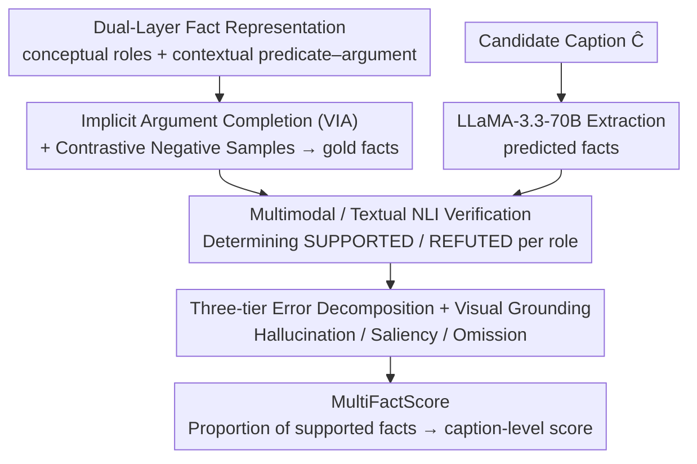

# DualFact: A Multimodal Fact Verification Framework for Procedural Video Understanding

**Conference**: ACL 2026 Findings  
**arXiv**: [2604.25584](https://arxiv.org/abs/2604.25584)  
**Code**: https://github.com/OguzCennet/DualFact (Available)  
**Area**: Video Understanding / Fact Verification / Evaluation  
**Keywords**: Procedural video captioning, dual-layer facts, implicit argument completion, multimodal NLI, Hallucination/Saliency/Omission

## TL;DR
The authors decompose the factual evaluation of procedural video captions (e.g., cooking, furniture making) into **dual-layer facts**: conceptual facts (abstract roles like Action/Ingredient/Tool/Location) and contextual facts (observable predicate–argument relations in the video, such as stir(soup, pot)). They construct two benchmarks, YouCook3-Fact and CraftBench-Fact, which include annotations for Verifiable Implicit Argument (VIA) completion and contrastive facts. Additionally, they propose MultiFactScore, which utilizes multimodal/textual NLI to verify facts at the role level, further classifying errors into Hallucination, Saliency, and Omission. Experiments reveal that SOTA MLLM captions are "fluent but factually incomplete"; evaluating captions alone overestimates Hallucination by approximately half, and only video-grounded evaluation can distinguish saliency from true hallucination.

## Background & Motivation

**Background**: Evaluation of procedural video captioning (cooking, woodworking, furniture assembly) primarily relies on two types of metrics: **lexical** (BLEU / ROUGE / METEOR / SPICE) and **vision–language** (CLIPScore / EMScore / PACScore / UniEval). A few fact-based evaluation methods (FaithScore / CapMAS / FactVC / FIFA) exist that perform "atomic proposition extraction + verification."

**Limitations of Prior Work**: (i) Lexical metrics only consider surface overlap; for instance, "add salt to bowl" vs. "add salt to pot" yields a high BLEU but involves incorrect roles. (ii) Embedding metrics focus on global similarity and fail to capture predicate–argument structures. (iii) Existing fact-based evaluations flatten facts into untyped propositions, failing to distinguish between "missing ingredient" vs. "missing tool" vs. "action role swap," and they cannot handle "implicit arguments" (e.g., the "it" in "stir it" is visually observable but linguistically omitted) unique to procedural videos.

**Key Challenge**: "Facts" in procedural videos are inherently **dual-layered**: one layer consists of abstract task semantics (what this step is, what roles are needed), and the other consists of grounded predicate–argument structures (how it is actually executed in the video). Mixing these during evaluation prevents the localization of error sources and fails to distinguish between "fluent but missing key entities" and "complete hallucinations."

**Goal**: (i) Define a role-aware, interpretable fact evaluation framework for procedural video captioning; (ii) Explicitly model implicit arguments; (iii) Decompose errors into Hallucination / Saliency / Omission categories, distinguishable through video grounding to separate "visually present but task-irrelevant (saliency)" from "never appeared (hallucination)."

**Key Insight**: Borrowing the conceptual–contextual dichotomy from semantics—the former standardizes paraphrases like "cut / slice / chop," while the latter preserves the actual predicate–argument relations seen in the video. By separating these layers, error types can be refined to the role level.

**Core Idea**: Dual-layer fact representation + Verifiable Implicit Argument (VIA) completion + contrastive negative facts + multimodal NLI verification + three-tier error decomposition.

## Method

### Overall Architecture
DualFact aims to objectively evaluate the degree of factual accuracy in procedural video captions. The MultiFactScore evaluation pipeline is composed of four sequential steps: first, dataset construction (re-segmenting YouCook2 into atomic clauses, completing implicit arguments, manually annotating dual-layer facts, and automatically generating contrastive negative samples, alongside the creation of CraftBench for woodworking/metalworking); second, extracting predicted facts $\mathcal{F}_p = \text{LLM}_{\text{extract}}(\hat{C}; \Phi)$ from the candidate caption $\hat{C}$ using LLaMA-3.3-70B-Instruct; third, an NLI verifier determines SUPPORTED/REFUTED status per role; finally, PaliGemma2-10B determines if each fact has visual grounding $G(f_i)$. Errors are categorized into Hallucination/Saliency/Omission based on grounding $\times$ verifier labels, culminating in a caption-level score: $\text{MultiFactScore} = |\{f_i \in F : \hat{y}_i = \text{SUPPORTED}\}| / |F|$. The core of the design is "dual-layer facts + visual error source differentiation."

### Key Designs

**1. Dual-Layer Fact Representation: Decoupling "Semantics" and "Execution" for Independent Verification**

Existing fact-based evaluations flatten facts into untyped propositions, failing to distinguish between "missing ingredient" and "tool mismatch." DualFact splits the facts of each instruction step into two layers: **Conceptual facts** $\mathcal{F}^{con}$ are abstract role–value assignments (e.g., Action=cut / Ingredient=tomato / Tool=knife / Location=board), intentionally ignoring literal paraphrases (e.g., "cut/slice/chop" are unified as Action=cut). **Contextual facts** $\mathcal{F}^{ctx}$ preserve predicate–argument relations, such as cut(tomato, board) or stir(mixture, bowl), requiring entities to appear in the video with the correct semantic roles. 

With this separation, a caption might be conceptually correct but contextually wrong—for example, "pour water into flour" vs. "pour flour into water." Both have correct role types, but the argument order is wrong. Since the underlying structure of procedural captions is stable despite surface variations, this layered approach allows for precise localization of whether an error stems from "role type," "role content," or "argument order."

**2. VIA Completion + Contrastive Negative Fact Construction: Distinguishing Omission from Hallucination**

Procedural instructions are riddled with implicit arguments—the "it" in "stir it" is visually present but linguistically omitted. Without completion, evaluators might misclassify "omitted" as "hallucinated." VIA directs annotators to fill in missing parameters (e.g., "stir it" → "stir the soup with a spoon in the pot") based on the patient/tool/location roles actually appearing in the video. The resulting YouCook3-VIA and CraftBench-VIA variants contain over 7K annotated implicit arguments (Tab.2: YouCook3 test set 2914; CraftBench test set 1888).

Negative samples are constructed using a few-shot LLM to replace tool/object/location roles with plausible alternatives (e.g., "add salt to bowl" → "add pepper to bowl") while maintaining syntax. Plausible "incorrect" negatives are essential for truly testing the NLI verifier, as trivial counterexamples provide little discriminative value. Notably, Tab.3 shows that adding VIA improves lexical metrics (e.g., YouCook3 BLEU increases from 5.87 to 6.51), proving that completion makes the captions themselves more comprehensive.

**3. Hallucination / Saliency / Omission Error Decomposition + Visual Grounding: Differentiating "True Errors" from "Distractions"**

Evaluating captions in isolation often results in any mention of an irrelevant object from the video being labeled as a hallucination, masking true failure modes. DualFact introduces $G(f_i) \in \{0,1\}$ to indicate if a fact is visually grounded (determined by PaliGemma2), leading to a three-way decomposition: **Hallucination** $= \neg G(f_i) \land f_i \in \mathcal{F}^R$ (not in video and refuted); **Saliency** $= G(f_i) \land f_i \in \mathcal{F}^R$ (visually present but not a gold fact); **Omission** $= e_i \in \mathcal{F}_g^+ \land e_i \notin \mathcal{F}_p$ (required gold fact missing from the caption).

Three evaluation modes incorporate visual information incrementally: cap-only (caption only), text-grounded (checking visual after a caption error), and mm-grounded (checking visual after a multimodal verifier error). Tab.7 shows that ingredient Hallucination drops from 34.57% (cap-only) to 16.89% (cap-grounded); the 17.68% stripped away is actually saliency—proving that omitting grounding systematically overestimates hallucination.

### Loss & Training
- **NLI Training**: Multimodal NLI is trained on $(V, f_i)$ pairs (positive: SUPPORTED, negative: REFUTED); textual NLI uses pre-trained LLM prompting without further training.
- **Fact Extractor**: LLaMA-3.3-70B-Instruct (via Unsloth interface) with few-shot prompts.
- **Grounding**: PaliGemma2-10B-PT-448 for visual grounding judgment.
- **Per-Video Accuracy**: $\text{Acc}(v) = \frac{1}{|T(v)|}\sum_{t \in T(v)}(\frac{1}{|t|}\sum_{i \in t} \mathbb{I}[\hat{y}_i = y_i])$, averaged within roles and then across roles.
- **MultiFactScore**: Calculated at the caption level as $\text{MultiFactScore} = |\{f_i \in F : \hat{y}_i = \text{SUPPORTED}\}| / |F|$.

## Key Experimental Results

### Main Results
NLI verification accuracy on YouCook3-Fact (Tab.6) for Qwen2.5-VL captions:

| Mode | Input | Action | Object | Location | Tool | Avg (Concept) |
|------|------|--------|--------|----------|------|----------------|
| Multimodal | $\mathcal{F}_g^+, \mathcal{F}_g^-, V$ | 92.50 | 81.53 | 90.50 | 86.30 | **88.07** |
| Multimodal | $\mathcal{F}_p, V$ | 94.27 | 93.15 | 92.58 | 94.04 | 93.41 (model-model bias) |
| Textual | $\mathcal{F}_g^+, \mathcal{F}_g^-, C$ | 98.81 | 99.06 | 99.02 | 98.77 | 98.92 |
| Textual | $\mathcal{F}_p, C$ | 55.06 | 27.01 | 40.48 | 35.32 | **39.47** |

| Mode | Input | act/ing | act/in | act/on | act/to | act/with | Avg (Ctx) |
|------|------|---------|--------|--------|--------|----------|------------|
| Multimodal | $\mathcal{F}_g, V$ | 78.68 | 83.43 | 80.35 | 82.67 | 77.80 | 79.89 |
| Textual | $\mathcal{F}_p, C$ | 16.72 | 20.52 | 19.76 | 29.21 | 21.92 | **21.23** |

> Qwen2.5-VL captions achieve only **39.47%** accuracy for conceptual facts and **21.23%** for contextual facts when compared to gold references, indicating that MLLM captions frequently omit critical roles.

### Ablation Study
Error Decomposition (Tab.7 YouCook3-Fact):

| Fact Type | Eval Mode | Omission | Hallucination | Saliency |
|-----------|-----------|----------|---------------|----------|
| Ingredient | cap-only | 65.43 | 34.57 | – |
| Ingredient | cap-grounded | 65.43 | **16.89 (−17.68)** | 17.68 |
| Ingredient | mm-grounded | – | 100.0 | 0.0 |
| Tool | cap-only | 49.80 | 50.20 | – |
| Tool | text-grounded | 53.83 | 37.85 | 8.31 |
| Location | cap-only | 40.03 | 59.97 | – |
| Location | text-grounded | 44.72 | 54.17 | 1.11 |

> "Cap-only" labels any inconsistency with gold facts as hallucination. Introducing visual grounding nearly halves ingredient hallucination (17% shifts to saliency). However, action errors remain 100% hallucination under mm-grounding, identifying action semantic errors as a more profound failure.

### Key Findings
- **MLLM captions are "fluent but factually incomplete"**: Qwen2.5-VL's accuracy on contextual facts is only ~21%, significantly lower than the verifier's performance on gold facts (~94%), proving the issue lies in caption content rather than verifier capability.
- **Cap-only evaluation overestimates hallucination by ~50%**: Grounding is necessary to distinguish "hallucination" from "grounded but irrelevant saliency" for Ingredient/Tool/Location roles. Human evaluation (Tab.10) confirms that caption-based metrics misclassify 78% of contextual errors, whereas video-based metrics only misclassify 21%.
- **Conceptual and Contextual errors exhibit different failure modes**: Conceptual errors are usually "omitted entities" or "incorrect types," while contextual errors are often "argument swaps." Action errors are the hardest—under mm-grounding, 100% are true hallucinations, indicating that action semantic understanding remains a significant challenge.
- **Model–model consistency bias**: Verifiers achieve higher accuracy when checking facts derived from captions generated by the same model family than when checking gold facts (Multimodal Concept 88.07 → 93.41), alerting to systematic biases in LLM-as-judge frameworks.
- **Caption-based conceptual facts correlate highest with human judgment**: Tab.11 shows a Spearman ρ = 0.429 (vs. CIDEr 0.140 / BERTScore −0.05), suggesting the dual-layer design effectively reflects human perception.
- **Video verification faces ceiling effects**: Video-based automated scores tend to saturate (high absolute values but low variance), leading to lower rank correlation compared to caption-based scores.

## Highlights & Insights
- **Conceptual vs. Contextual Dichotomy**: This is the primary conceptual contribution, applicable to all "procedural tasks" (cooking, crafting, surgery, lab protocols). Separating "semantics" from "execution" is a universal perspective.
- **VIA as an independent annotation resource**: Prior video caption datasets lacked systematic handling of implicit arguments; the 7K+ annotated arguments provided are a reusable asset for the community.
- **Three-tier Error Decomposition + Grounding Modes**: This methodology is a best practice—fact-based metrics should report these three categories separately rather than as a monolithic score.
- **Empirical Warning on Model–Model Bias**: When the verifier and captioner are related, accuracy is inflated by 5–10%, a critical reminder for LLM-as-judge research.
- **The Trade-off between "Strict" Caption-based and "Broad" Video-based evaluation**: Caption-based evaluation is rigorous, while video-based is inclusive but prone to saturation. Designers must consider both modalities.

## Limitations & Future Work
- **Limited domain coverage**: Currently limited to cooking and furniture crafting; generalizability to surgery, labs, or industrial assembly remains unverified.
- **Dependence on fact extraction accuracy**: Sensitivity analysis shows extraction noise (<1.2 points) has limited impact, but LLaMA-3.3-70B may still introduce its own systematic biases.
- **Missing attributes**: Facts focus on action/object, ignoring attributes like size, color, or spatial relationships, which are critical for "quality" in tasks (e.g., thickness of a slice).
- **Video grounding degradation**: In complex scenes with occlusion or fine-grained spatial relations, PaliGemma2 grounding becomes less reliable, blurring error boundaries.
- **Coarse hallucination types**: Does not distinguish between "minor" vs. "severe" or "conceptual" vs. "object-recognition" hallucinations.
- **Future Directions**: Extending dual-layer mapping to attributes; mitigating ceiling effects using hard-negative mining; upgrading to more robust spatial grounding models like Florence-2.

## Related Work & Insights
- **vs. FaithScore / CapMAS / FactVC / FIFA**: Unlike these flat-proposition metrics, DualFact uses role-aware labels and dual-layering to precisely pinpoint errors like "missing ingredient."
- **vs. CLIPScore / EMScore / PACScore / UniEval**: Embedding-based metrics miss predicate structures; DualFact explicitly identifies role swaps (e.g., "water into flour" vs. "flour into water").
- **vs. BLEU / ROUGE / SPICE**: Lexical metrics are role-agnostic. DualFact-Caption-Con shows a ρ=0.43 correlation with human judgment, far exceeding CIDEr (0.14).
- **vs. HallusionBench**: While HallusionBench focuses on visual hallucinations in VQA, DualFact is the first to address procedural captions, implicit arguments, and role-aware factuality.
- **Insight**: The dual-layer fact representation is transferable to any roles-based narrative evaluation—medical summaries (symptom/treatment), legal facts (party/action), or scientific protocols (reagent/instrument).

## Rating
- Novelty: ⭐⭐⭐⭐ "Conceptual + Contextual layers + VIA + Three-tier decomposition" is a clear innovative combination for evaluation methodology.
- Experimental Thoroughness: ⭐⭐⭐⭐ Two datasets + Multi-modal vs. Textual NLI + Error decomposition + Human Eval + 7 baseline metrics.
- Writing Quality: ⭐⭐⭐⭐ The error taxonomy is intuitive; equations and tables are well-organized.
- Value: ⭐⭐⭐⭐ Provides a role-aware, interpretable framework and high-quality datasets for procedural video evaluation.

<!-- RELATED:START -->

## Related Papers

- [\[ACL 2026\] GameplayQA: A Benchmarking Framework for Decision-Dense POV-Synced Multi-Video Understanding of 3D Virtual Agents](gameplayqa_a_benchmarking_framework_for_decision-dense_pov-synced_multi-video_un.md)
- [\[ACL 2026\] SlideAgent: Hierarchical Agentic Framework for Multi-Page Visual Document Understanding](slideagent_hierarchical_agentic_framework_for_multi-page_visual_document_underst.md)
- [\[ACL 2025\] SciVer: Evaluating Foundation Models for Multimodal Scientific Claim Verification](../../ACL2025/multimodal_vlm/sciver_evaluating_foundation_models_for_multimodal_scientific_claim_verification.md)
- [\[ICLR 2026\] Procedural Mistake Detection via Action Effect Modeling](../../ICLR2026/multimodal_vlm/procedural_mistake_detection_via_action_effect_modeling.md)
- [\[ACL 2026\] TRACE: Evidence Localization-based Multi-video Event Understanding and Claim Generation](trace_evidence_grounding-guided_multi-video_event_understanding_and_claim_genera.md)

<!-- RELATED:END -->
