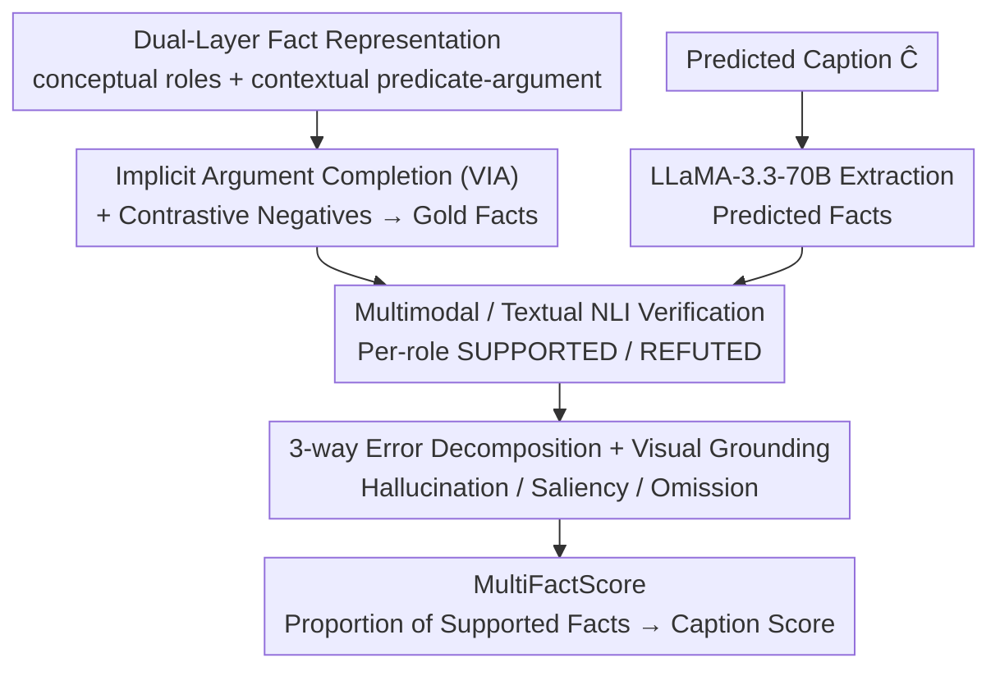

# DualFact: A Multimodal Fact Verification Framework for Procedural Video Understanding

**Conference**: ACL 2026 Findings  
**arXiv**: [2604.25584](https://arxiv.org/abs/2604.25584)  
**Code**: https://github.com/OguzCennet/DualFact (Available)  
**Area**: Video Understanding / Fact Verification / Evaluation  
**Keywords**: Procedural Video Captioning, Dual-layer Facts, Implicit Argument Completion, Multimodal NLI, Hallucination/Saliency/Omission

## TL;DR
Authors decompose the factual evaluation of procedural video captions (e.g., "cooking," "furniture assembly") into **dual-layer facts**: conceptual facts (abstract roles such as Action/Ingredient/Tool/Location) + contextual facts (observable predicate–argument relations in video, e.g., stir(soup, pot)). They construct two benchmarks, YouCook3-Fact and CraftBench-Fact, which annotate Video Implicit Argument (VIA) completion and contrastive facts. The proposed MultiFactScore utilizes multimodal/textual NLI to verify facts at the role level, further categorizing errors into Hallucination / Saliency / Omission. Experiments reveal that SOTA MLLM captions are "fluent but factually incomplete"; evaluating captions in isolation overestimates Hallucination by approximately half, while only video-grounded evaluation can effectively distinguish saliency from true hallucination.

## Background & Motivation

**Background**: Evaluation of procedural video captioning (cooking, woodworking, furniture assembly) primarily relies on two types of metrics: **lexical** (BLEU / ROUGE / METEOR / SPICE) and **vision–language** (CLIPScore / EMScore / PACScore / UniEval). A few fact-based metrics (FaithScore / CapMAS / FactVC / FIFA) utilize "atomic proposition extraction + verification."

**Limitations of Prior Work**: (i) Lexical metrics only measure surface overlap; e.g., "add salt to bowl" vs. "add salt to pot" yields high BLEU despite role errors. (ii) Embedding metrics compute global similarity and fail to capture predicate–argument structures. (iii) Existing fact-based evaluations flatten facts into untyped propositions, failing to distinguish between "missing ingredient" vs. "missing tool" vs. "role swap," and cannot handle "implicit arguments" (e.g., "it" in "stir it" is visually grounded but linguistically unstated) unique to procedural videos.

**Key Challenge**: Facts in procedural videos are essentially **dual-layered**: abstract task semantics (what is being done, what roles are needed) and grounded predicate–argument structures (how it is actually executed in the video). Conflating these prevents precise error localization and the differentiation between "fluent but missing key entities" and "complete hallucinations."

**Goal**: (i) Define a role-aware, interpretable factual evaluation framework for procedural video captioning. (ii) Explicitly model implicit arguments. (iii) Decompose errors into Hallucination / Saliency / Omission, distinguishing "visually present but task-irrelevant (saliency)" from "completely absent (hallucination)" via video grounding.

**Key Insight**: Drawing from semantics, the authors propose a conceptual–contextual dichotomy: the former standardizes paraphrases like "cut / slice / chop"; the latter preserves the actual predicate–argument relations seen in the video. Separating these layers allows for fine-grained error analysis at the role level.

**Core Idea**: Dual-layer fact representation + Video Implicit Argument (VIA) completion + contrastive negative facts + multimodal NLI verification + three-way error decomposition.

## Method

### Overall Architecture
DualFact addresses how to objectively judge the factual accuracy of procedural video captions. The MultiFactScore evaluation pipeline consists of four sequential steps: First, dataset construction (re-segmenting YouCook2 into atomic clauses, completing implicit arguments, annotating dual-layer facts, and generating contrastive negatives; plus creating CraftBench for woodworking/metalworking). Second, using LLaMA-3.3-70B-Instruct to extract predicted facts $\mathcal{F}_p = \text{LLM}_{\text{extract}}(\hat{C}; \Phi)$ from the test caption $\hat{C}$. Third, an NLI verifier determines SUPPORTED/REFUTED status per role. Finally, PaliGemma2-10B determines visual grounding $G(f_i)$ for each fact; based on the grounding $\times$ verifier labels, errors are categorized into Hallucination/Saliency/Omission, forming the caption-level $\text{MultiFactScore} = |\{f_i \in F : \hat{y}_i = \text{SUPPORTED}\}| / |F|$. The core design utilizes dual-layer facts and visual grounding to distinguish error sources.

### Key Designs

**1. Dual-Layer Fact Representation: Separating "Semantics" and "Execution"**

Existing fact-based evaluations treat facts as flat propositions, unable to distinguish between a "missing ingredient" and a "mismatched tool." DualFact splits instruction facts into two layers: **Conceptual facts** $\mathcal{F}^{con}$ are abstract role–value assignments (e.g., Action=cut / Ingredient=tomato / Tool=knife) that ignore surface paraphrasing. **Contextual facts** $\mathcal{F}^{ctx}$ preserve predicate–argument relationships (e.g., cut(tomato, board)), requiring entities to appear in the correct semantic roles. This allows for cases where conceptual roles are correct but contextual relationships are wrong (e.g., "pour water into flour" vs. "pour flour into water"), providing diagnostic signals for role types, content, and argument order.

**2. VIA Completion + Contrastive Negative Fact Construction: Distinguishing Omission from Hallucination**

Procedural instructions are rife with implicit arguments; if not completed, evaluations might misclassify "omitted" info as "hallucinated." VIA labels (Video Implicit Arguments) fill in missing parameters based on visual evidence (e.g., "stir it" → "stir the soup with a spoon in the pot"), yielding YouCook3-VIA and CraftBench-VIA variants with 7K+ annotated arguments. Negative samples are generated by substitution (e.g., "add salt" → "add pepper") using few-shot LLMs while maintaining syntax, ensuring that NLI verifiers are tested on plausible but incorrect facts rather than trivial ones.

**3. Three-way Error Decomposition + Visual Grounding: Resolving "True Errors" vs. "Other Visuals"**

Caption-only evaluation often mislabels task-irrelevant visual entities as hallucinations. DualFact introduces $G(f_i) \in \{0,1\}$ representing whether a fact is visually grounded in the video (via PaliGemma2), leading to three error categories: **Hallucination** $= \neg G(f_i) \land f_i \in \mathcal{F}^R$ (absent from video and refuted by verifier); **Saliency** $= G(f_i) \land f_i \in \mathcal{F}^R$ (present in video but not in gold facts); and **Omission** $= e_i \in \mathcal{F}_g^+ \land e_i \notin \mathcal{F}_p$ (required by gold but missing from caption). Three eval modes (cap-only, text-grounded, mm-grounded) incrementally add visual information. Data shows that for ingredients, Hallucination drops from 34.57% (cap-only) to 16.89% once grounding is introduced, proving that isolation evaluations systematically overestimate hallucination.

### Loss & Training
- **NLI Training**: Multimodal NLI is trained on $(V, f_i)$ pairs (SUPPORTED vs. REFUTED); textual NLI uses zero/few-shot prompts with pretrained LLMs.
- **Fact Extractor**: LLaMA-3.3-70B-Instruct (Unsloth interface) with few-shot prompts.
- **Grounding**: PaliGemma2-10B-PT-448 for visual grounding judgment.
- **Per-Video Accuracy**: $\text{Acc}(v) = \frac{1}{|T(v)|}\sum_{t \in T(v)}(\frac{1}{|t|}\sum_{i \in t} \mathbb{I}[\hat{y}_i = y_i])$, averaged within and across roles.
- **MultiFactScore**: Caption-level score defined as $\text{MultiFactScore} = |\{f_i \in F : \hat{y}_i = \text{SUPPORTED}\}| / |F|$.

## Key Experimental Results

### Main Results
NLI verification accuracy on Qwen2.5-VL captions for YouCook3-Fact (Tab.6):

| Mode | Input | Action | Object | Location | Tool | Avg (Concept) |
|------|------|--------|--------|----------|------|----------------|
| Multimodal | $\mathcal{F}_g^+, \mathcal{F}_g^-, V$ | 92.50 | 81.53 | 90.50 | 86.30 | **88.07** |
| Multimodal | $\mathcal{F}_p, V$ | 94.27 | 93.15 | 92.58 | 94.04 | 93.41 (model-model bias) |
| Textual | $\mathcal{F}_g^+, \mathcal{F}_g^-, C$ | 98.81 | 99.06 | 99.02 | 98.77 | 98.92 |
| Textual | $\mathcal{F}_p, C$ | 55.06 | 27.01 | 40.48 | 35.32 | **39.47** |

| Mode | Input | act/ing | act/in | act/on | act/to | act/with | Avg (Ctx) |
|------|------|---------|--------|--------|--------|----------|------------|
| Multimodal | $\mathcal{F}_g, V$ | 78.68 | 83.43 | 80.35 | 82.67 | 77.80 | 79.89 |
| Textual | $\mathcal{F}_p, C$ | 16.72 | 20.52 | 19.76 | 29.21 | 21.92 | **21.23** |

> Qwen2.5-VL captions achieve only **39.47%** conceptual accuracy and **21.23%** contextual accuracy relative to gold facts, indicating that MLLM captions frequently miss critical roles.

### Ablation Study
Error Decomposition (Tab.7 YouCook3-Fact):

| Fact Type | Eval Mode | Omission | Hallucination | Saliency |
|-----------|-----------|----------|---------------|----------|
| Ingredient | cap-only | 65.43 | 34.57 | – |
| Ingredient | cap-grounded | 65.43 | **16.89 (−17.68)** | 17.68 |
| Ingredient | mm-grounded | – | 100.0 | 0.0 |
| Tool | cap-only | 49.80 | 50.20 | – |
| Tool | text-grounded | 53.83 | 37.85 | 8.31 |
| Location | cap-only | 40.03 | 59.97 | – |
| Location | text-grounded | 44.72 | 54.17 | 1.11 |

> "Cap-only" modes categorize any gold inconsistency as hallucination; introducing visual grounding halves ingredient hallucinations. However, action errors remain 100% hallucinations under mm-grounded evaluation, indicating deeper failures in action semantics.

### Key Findings
- **MLLM captions are "fluent but factually incomplete"**: Qwen2.5-VL accuracy on contextual facts is only ~21%, significantly lower than its verifier performance on gold facts (~94%), suggesting the captioner is the bottleneck.
- **Cap-only evaluation overestimates hallucination**: Distinguishing "hallucination" from "saliency" is impossible without grounding. Human evaluation confirms that caption-based metrics incorrectly penalize 78% of contextual facts, whereas video-based evaluation drops this to 21%.
- **Different failure modes for Conceptual and Contextual facts**: Conceptual errors involve missing entities or type errors; contextual errors involve argument swaps or role mismatches.
- **Model–model consistency bias**: Verifiers are 5–10% more accurate when checking captions derived from the same or similar models compared to gold facts, warning against biases in LLM-as-judge frameworks.
- **Highest human correlation with caption-based conceptual facts**: Tab.11 shows Spearman $\rho=0.429$ (vs. CIDEr 0.140), proving the dual-layer design reflects human judgment.
- **Ceiling effect in video verification**: Video-based automated scores show high absolute values but low variance, leading to lower rank correlation compared to caption-based metrics.

## Highlights & Insights
- **Conceptual vs. Contextual Dichotomy**: This is a major conceptual contribution applicable to all procedural task evaluations (cooking, crafting, surgery), providing a universal perspective on task semantics vs. execution.
- **VIA as an Independent Resource**: Systematic treatment of implicit parameters is missing in previous datasets; the 7K+ annotated arguments provide a reusable asset.
- **Fine-grained Error Decomposition**: Any fact-based metric should ideally report Hallucination, Saliency, and Omission separately rather than as a single aggregate score.
- **Empirical Warning on Consistency Bias**: When the verifier and captioner are related, accuracy metrics are inflated, a critical insight for current LLM-as-judge research.

## Limitations & Future Work
- **Domain Coverage**: Limited to cooking and furniture crafting; generalizability to surgery, scientific labs, or industrial assembly remains untested.
- **Pipeline Dependency**: Reliability depends on the fact extraction accuracy of LLaMA-3.3-70B.
- **Attribute Modeling**: Currently ignores size, color, or spatial attributes, which are critical "quality" facts in procedural tasks (e.g., thickness of a slice).
- **Grounding Decay**: PaliGemma2 performance degrades in complex scenes with occlusions or fine-grained spatial relations.
- **Future Directions**: Extending the dual-layer model to attributes; mitigating the ceiling effect through hard-negative mining; and utilizing stronger spatial grounding models like Florence-2.

## Related Work & Insights
- **vs. FaithScore / CapMAS / FactVC / FIFA**: Unlike these flat untyped proposition metrics, DualFact uses role-aware labels to locate specific errors like "tool mismatch."
- **vs. CLIPScore / EMScore / PACScore / UniEval**: These global similarity metrics fail on role swaps (e.g., "water into flour" vs. "flour into water"), which DualFact handles explicitly.
- **vs. Lexical Metrics**: CIDEr correlation with human judgment is low ($\rho=0.14$) compared to DualFact-Caption-Con ($\rho=0.43$).
- **Insight**: The dual-layer fact representation is transferable to any role-based narrative evaluation, such as medical summaries (symptom/treatment), legal facts (party/action), or scientific protocols (reagent/instrument).

## Rating
- Novelty: ⭐⭐⭐⭐ The "Conceptual + Contextual dual-layer + VIA + 3-way error decomposition" is a clean and innovative combination, especially the explicit modeling of saliency.
- Experimental Thoroughness: ⭐⭐⭐⭐ Comprehensive coverage across two datasets, multimodal vs. textual NLI comparison, and human correlation; however, testing on more captioning models would be beneficial.
- Writing Quality: ⭐⭐⭐⭐ Error taxonomy and formulas are organized logically and clearly.
- Value: ⭐⭐⭐⭐ Provides an interpretable, role-aware framework and high-quality datasets for the procedural video community.

<!-- RELATED:START -->

## Related Papers

- [\[ACL 2026\] VISTA: Verification In Sequential Turn-based Assessment](vista_verification_in_sequential_turn-based_assessment.md)
- [\[CVPR 2026\] DarkAct: A RGB-Thermal Dataset and Fusion Framework for Multimodal Low-Light Action Recognition](../../CVPR2026/video_understanding/darkact_a_rgb-thermal_dataset_and_fusion_framework_for_multimodal_low-light_acti.md)
- [\[CVPR 2026\] VideoITG: Multimodal Video Understanding with Instructed Temporal Grounding](../../CVPR2026/video_understanding/videoitg_multimodal_video_understanding_with_instructed_temporal_grounding.md)
- [\[ACL 2026\] GameplayQA: A Benchmarking Framework for Decision-Dense POV-Synced Multi-Video Understanding of 3D Virtual Agents](gameplayqa_a_benchmarking_framework_for_decision-dense_pov-synced_multi-video_un.md)
- [\[AAAI 2026\] EmoVid: A Multimodal Emotion Video Dataset for Emotion-Centric Video Understanding and Generation](../../AAAI2026/video_understanding/emovid_a_multimodal_emotion_video_dataset_for_emotion-centric_video_understandin.md)

<!-- RELATED:END -->
