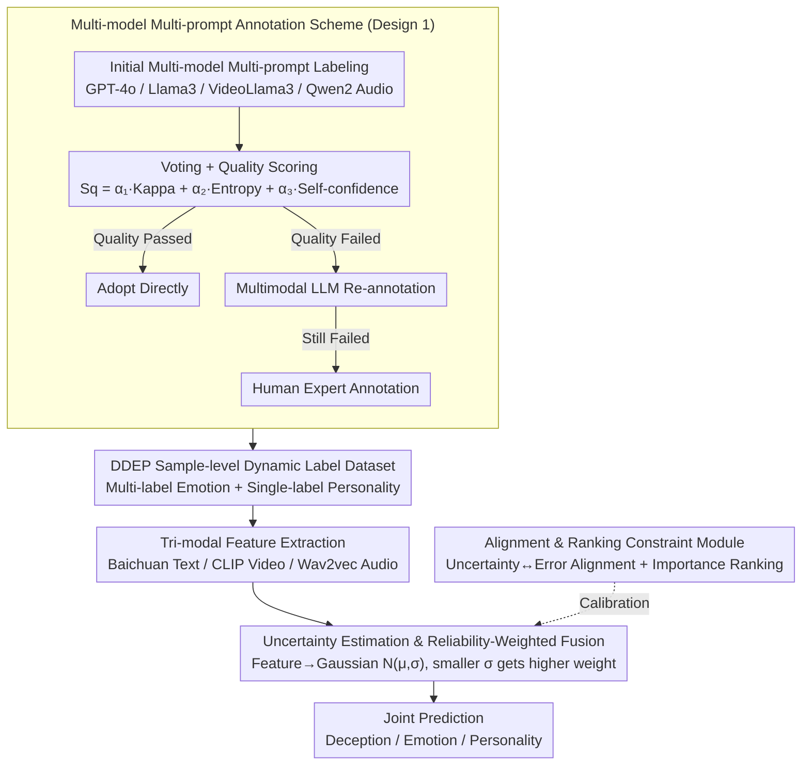

# Dynamic Emotion and Personality Profiling for Multimodal Deception Detection

**Conference**: ACL 2026  
**arXiv**: [2604.17037](https://arxiv.org/abs/2604.17037)  
**Code**: None  
**Area**: Multimodal Analysis / Affective Computing  
**Keywords**: Deception detection, dynamic emotion labeling, personality traits, reliability-weighted fusion, multimodal

## TL;DR
This paper points out that existing deception detection datasets only provide participant-level emotion/personality labels (shared labels for all samples of the same person). It proposes a sample-level dynamic annotation scheme and a reliability-weighted multimodal fusion framework, Rel-DDEP, achieving a 2.53% gain in deception detection F1, 2.66% in emotion detection, and 9.30% in personality detection.

## Background & Motivation

**Background**: Multimodal deception detection utilizes text, video, and audio signals to identify deceptive behavior. Existing works (such as the MDPE dataset) integrate personality and emotion information to assist detection but only provide static labels at the per-participant level.

**Limitations of Prior Work**: Emotional and personality expressions of the same individual vary significantly across different contexts—deception might involve mixed emotions like "fake happiness + fear of exposure," while perfunctory behavior might manifest as "sadness + disgust." Participant-level labels flatten these differences, losing contextual signals crucial for deception detection.

**Key Challenge**: While personality and emotion are key cues for deception detection, existing annotation granularity is too coarse (participant-level rather than sample-level), causing blurred boundaries between deceptive and honest samples in the feature space.

**Goal**: Construct a sample-level dynamic emotion (multi-label) and personality (single-label) annotated dataset, and design an adaptive reliability-weighted multimodal fusion framework.

**Key Insight**: Visualization experiments intuitively demonstrate that participant-level labels only correctly detect 32/200 samples, whereas sample-level single-label emotion improves this to 85/200, and sample-level multi-label emotion combined with single-label personality reaches 141/200.

**Core Idea**: Sample-level dynamic annotation + uncertainty-driven reliability-weighted fusion.

## Method

### Overall Architecture
The framework consists of two parts: (1) Data Annotation: A multi-model multi-prompt annotation scheme → voting and quality scoring → high-level re-annotation → human annotation → generation of the DDEP dataset; (2) Model: Rel-DDEP framework → feature extraction (Baichuan/CLIP/Wav2vec) → uncertainty estimation (mapping to Gaussian distributions) → reliability-weighted fusion → joint prediction of deception, emotion, and personality.

### Key Designs

**1. Multi-model Multi-prompt Annotation Scheme: Refining "one set of labels per participant" into reliable dynamic labels per sample.**

The deadlock in data arises because participant-level labels flatten emotional differences across scenarios. Relying on a single LLM for re-annotation introduces single-perspective bias. Ours employs a group of complementary models—GPT-4o, Llama3, VideoLlama3, and Qwen2 Audio—each handling a modal perspective. Each model uses multiple prompts (e.g., "judging emotion from overall atmosphere" vs. "judging emotion from specific behaviors") to obtain initial labels via voting.

Beyond voting, a quality score is calculated for each annotation: $S_q = \alpha_1 k + \alpha_2 u_i + \alpha_3 s_c$, integrating inter-model consistency (Kappa $k$), uncertainty (entropy $u_i$), and self-assessed confidence $s_c$. This drives a three-tier dispatch: labels passing the threshold are adopted, those failing are re-annotated by a multimodal LLM, and only the remainder are sent to human experts. This suppresses bias through multi-model prompting while focusing expensive human labor on truly difficult samples, achieving a final Kappa of 0.85.

**2. Uncertainty Estimation and Reliability-Weighted Fusion: Giving the "more certain modality" a louder voice during fusion.**

Multimodal signals naturally vary in quality—audio may have noise, and video may have occlusions. Simple concatenation or averaging allows a corrupted modality to degrade the overall judgment. The framework avoids using modal features directly; instead, it maps each modal feature $\mathbf{h}_m$ to a high-dimensional Gaussian distribution $N(\mu_m, \sigma_m)$. The variance $\sigma_m$ quantifies the current reliability of the modality. Both the mean $\mu_m$ and variance $\sigma_m$ are predicted from modal features via a GRU.

During fusion, modalities with smaller variance (higher certainty) automatically receive higher weights. Thus, clear speech in a video can override blurry frames and vice-versa. Compared to fixed weights or pure attention, this uncertainty-driven dynamic adjustment aligns better with the intuition of trusting the most reliable modality at any given moment.

**3. Alignment and Ranking Constraint Module: Calibrating uncertainty estimation to prevent "confident but wrong" modalities from hijacking weights.**

Reliability weighting depends entirely on the accuracy of uncertainty estimation. An uncalibrated estimate can be counterproductive—if a modality is wrong but appears confident, it will receive an erroneously high fusion weight. The alignment module couples uncertainty with the actual prediction error: samples with large prediction errors should have high uncertainty, and mismatches are penalized.

The ranking constraint module ensures that the relative magnitude of uncertainty reflects the true importance of each modality in joint detection, rather than just matching absolute values. Together, they transform the choice of which modality to trust from an arbitrary weight into a calibrated decision.

### Loss & Training
Joint training of three tasks is performed using weighted cross-entropy. Uncertainty calibration is achieved through alignment loss and ranking constraint loss.

## Key Experimental Results

### Main Results

| Task | Dataset | Model | Baseline F1 | Rel-DDEP F1 | Gain |
|------|--------|------|--------|------------|------|
| Deception Detection | DDEP | CLB-HBB-Bai | 58.30% | 61.49% | +2.53% |
| Emotion Detection | DDEP | - | - | - | +2.66% |
| Personality Detection | DDEP | - | - | - | +9.30% |

### Ablation Study

| Configuration | Deception Detection | Description |
|------|---------|------|
| Participant-level labels (MDPE) | ~50% | Samples mixed in feature space |
| Sample-level labels (DDEP) | ~58% | Significant improvement in feature separability |
| DDEP + Rel-DDEP | ~61% | Reliability fusion provides further improvement |

### Key Findings
- Moving from participant-level to sample-level annotation improves deception detection accuracy from 32/200 to 141/200 (using multi-label emotion + single-label personality), proving the necessity of dynamic annotation.
- Reliability-weighted fusion consistently outperforms simple concatenation and mean fusion.
- Personality detection shows the largest gain (+9.30%) because participant-level labels completely ignore context changes.
- A Kappa score of 0.85 ensures high annotation quality.

## Highlights & Insights
- The comparative experiments between **sample-level vs. participant-level annotation** are intuitive and convincing—visualizations clearly show how annotation granularity affects feature space separability.
- The multi-model multi-prompt annotation workflow is a generalizable methodology, particularly suitable for highly subjective annotation tasks.
- The uncertainty-driven modality fusion approach can be applied to any multimodal task.

## Limitations & Future Work
- The DDEP dataset is limited in scale; generalization needs more experimental verification.
- The accuracy of LLMs in annotating emotion/personality is inherently questionable—especially when inferring visual emotional cues through text.
- Using GRU to predict Gaussian parameters for reliability estimation may lead to model overconfidence.
- Interaction between tasks in joint training might have negative effects.

## Related Work & Insights
- **vs. Cai et al. (2024) MDPE**: MDPE only provides participant-level labels; Ours extends to sample-level dynamic annotation and proves its necessity.
- **vs. DDPM**: DDPM only performs the single task of deception detection; Ours performs joint detection across three tasks.
- **vs. Standard Multimodal Fusion**: Simple concatenation or attention fusion ignores modality reliability; Ours’ uncertainty-driven fusion is more rational.

## Rating
- Novelty: ⭐⭐⭐⭐ Combination of sample-level dynamic annotation and uncertainty fusion is contributory.
- Experimental Thoroughness: ⭐⭐⭐⭐ Two datasets, multiple feature extractor combinations, and detailed visualization analysis.
- Writing Quality: ⭐⭐⭐ Structurally sound, though some formalizations (e.g., Theorem 1, 2) feel slightly forced.

<!-- RELATED:START -->

## Related Papers

- [\[ACL 2025\] Hidden in Plain Sight: Evaluation of the Deception Detection Capabilities of LLMs in Multimodal Settings](../../ACL2025/multimodal_vlm/hidden_in_plain_sight_evaluation_of_the_deception_detection_capabilities_of_llms.md)
- [\[CVPR 2026\] Unbiased Dynamic Multimodal Fusion](../../CVPR2026/multimodal_vlm/unbiased_dynamic_multimodal_fusion.md)
- [\[ICCV 2025\] Dynamic Group Detection using VLM-augmented Temporal Groupness Graph](../../ICCV2025/multimodal_vlm/dynamic_group_detection_using_vlm-augmented_temporal_groupness_graph.md)
- [\[CVPR 2026\] Beyond Missing Modalities: Hypergraph Guided Diffusion for Uncertainty-Aware Multimodal Emotion Recognition](../../CVPR2026/multimodal_vlm/beyond_missing_modalities_hypergraph_conditioned_diffusion_for_uncertainty-aware.md)
- [\[ACL 2026\] ErrorRadar: Benchmarking Complex Mathematical Reasoning of Multimodal Large Language Models Via Error Detection](errorradar_benchmarking_complex_mathematical_reasoning_of_multimodal_large_langu.md)

<!-- RELATED:END -->
