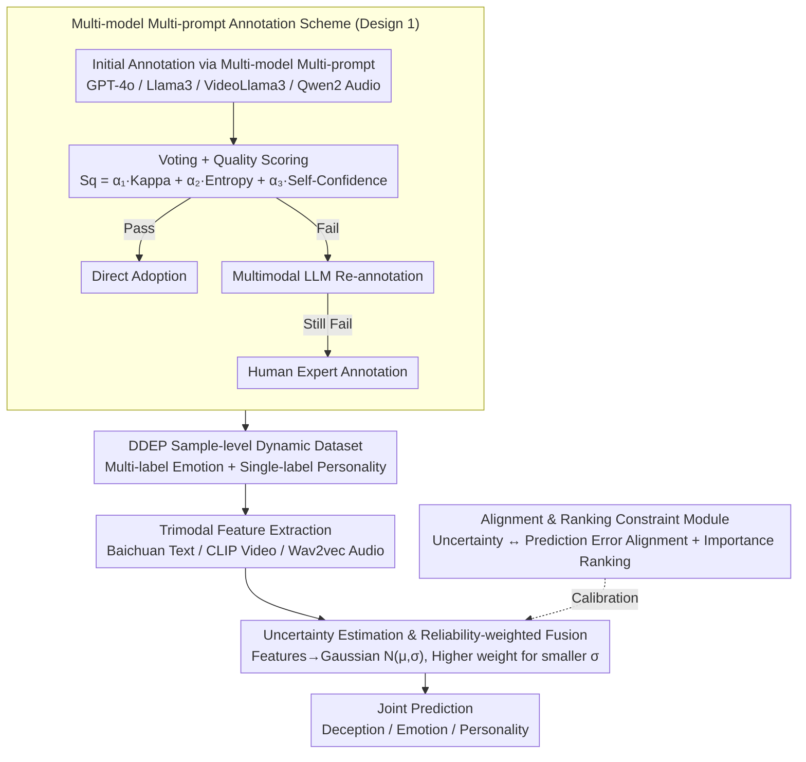

# Dynamic Emotion and Personality Profiling for Multimodal Deception Detection

**Conference**: ACL 2026  
**arXiv**: [2604.17037](https://arxiv.org/abs/2604.17037)  
**Code**: None  
**Area**: Multimodal Analysis / Affective Computing  
**Keywords**: Deception Detection, Dynamic Emotion Labeling, Personality Traits, Reliability-weighted Fusion, Multimodal

## TL;DR
This paper highlights that existing deception detection datasets only provide participant-level emotion/personality labels (shared across all samples from the same person). It proposes a sample-level dynamic annotation scheme and a reliability-weighted multimodal fusion framework, Rel-DDEP. This approach achieves gains of 2.53% in deception detection F1, 2.66% in emotion detection, and 9.30% in personality detection.

## Background & Motivation

**Background**: Multimodal deception detection utilizes text, video, and audio signals to identify deceptive behavior. Existing works (such as the MDPE dataset) integrate personality and emotion information to assist in deception detection but only provide participant-level static labels.

**Limitations of Prior Work**: Emotional and personality manifestations of the same individual vary significantly across different contexts. For instance, lying might involve mixed emotions like "fake happiness + fear of exposure," while perfunctory behavior might show "sadness + disgust." Participant-level labels smooth over these differences, losing contextual signals crucial for deception detection.

**Key Challenge**: While personality and emotion are critical cues for deception detection, current annotation granularity is too coarse (participant-level rather than sample-level), resulting in blurred boundaries between deceptive and honest samples in the feature space.

**Goal**: To construct a dataset with sample-level dynamic emotion (multi-label) and personality (single-label) annotations, and to design an adaptive reliability-weighted multimodal fusion framework.

**Key Insight**: Visualization experiments intuitively demonstrate that participant-level labels correctly detect only 32/200 samples; sample-level single-label emotion improves this to 85/200, while sample-level multi-label emotion plus personality reaches 141/200.

**Core Idea**: Sample-level dynamic annotation combined with uncertainty-driven reliability-weighted fusion.

## Method

### Overall Architecture
The approach consists of two parts: (1) Data Annotation: A multi-model multi-prompt annotation scheme → Voting + Quality Scoring → Advanced Re-annotation → Human Annotation → DDEP Dataset. (2) Model: Rel-DDEP Framework → Feature Extraction (Baichuan/CLIP/Wav2vec) → Uncertainty Estimation (Mapping to Gaussian distributions) → Reliability-weighted Fusion → Joint Prediction of Deception/Emotion/Personality.

### Key Designs

**1. Multi-model Multi-prompt Annotation Scheme: Refining "One Label per Participant" into Reliable Dynamic Labels**

The bottleneck in the data is that participant-level labels erase emotional variances across contexts. Relying on a single LLM for re-annotation risks introducing single-perspective bias. Ours adopts a set of complementary models—GPT-4o, Llama3, VideoLlama3, and Qwen2 Audio—each handling a specific modal perspective. Each model uses multiple prompts (e.g., judging emotion from "overall atmosphere" vs. "specific behaviors") to obtain initial labels via voting.

Crucially, a quality score is calculated for each annotation: $S_q = \alpha_1 k + \alpha_2 u_i + \alpha_3 s_c$, which integrates inter-model consistency (Kappa coefficient $k$), uncertainty (entropy $u_i$), and self-rated confidence $s_c$. This score drives a three-tier triage: high-quality annotations are adopted directly, subpar ones are re-annotated by a multimodal LLM, and only the most difficult samples are sent to human experts. This method suppresses bias via multi-model collaboration and saves expensive human labor for truly challenging samples, reaching a Kappa of 0.85.

**2. Uncertainty Estimation & Reliability-weighted Fusion: Giving "More Certain Modalities" a Louder Voice**

Multimodal signals inherently vary in quality—audio may have noise, and video may have occlusions. Simple concatenation or averaging allows a degraded modality to compromise the overall judgment. The framework maps each modal feature $\mathbf{h}_m$ into a high-dimensional Gaussian distribution $N(\mu_m, \sigma_m)$, using the variance $\sigma_m$ to quantify the reliability of the modality at that moment. Both the mean $\mu_m$ and variance $\sigma_m$ are predicted from modal features via a GRU.

During fusion, modalities with smaller variance (higher certainty) automatically receive higher weights. Thus, clear speech can override a blurry video frame and vice versa. Compared to fixed weights or pure attention, this dynamic adjustment based on uncertainty aligns with the intuition of trusting the most reliable modality at any given time.

**3. Alignment & Ranking Constraint Module: Calibrating Uncertainty to Prevent "Confident but Wrong" Weights**

Reliability weighting depends entirely on the accuracy of uncertainty estimation. An uncalibrated estimate can be detrimental—if a modality makes an incorrect prediction but appears highly confident, it will wrongly seize high fusion weight. The alignment module binds uncertainty with the actual prediction error: samples with large prediction errors must have high uncertainty.

The ranking constraint module ensures that the relative magnitude of uncertainty reflects the actual importance of each modality in the joint detection task, rather than just matching absolute values. Together, these modules turn modal selection from a heuristic into a calibrated decision.

### Loss & Training
The model is trained jointly for three tasks using weighted cross-entropy. Uncertainty calibration is achieved through alignment loss and ranking constraint loss.

## Key Experimental Results

### Main Results

| Task | Dataset | Model | Baseline F1 | Rel-DDEP F1 | Gain |
|------|--------|------|--------|------------|------|
| Deception Detection | DDEP | CLB-HBB-Bai | 58.30% | 61.49% | +2.53% |
| Emotion Detection | DDEP | - | - | - | +2.66% |
| Personality Detection | DDEP | - | - | - | +9.30% |

### Ablation Study

| Configuration | Deception Detection | Description |
|------|---------|------|
| Participant-level Labels (MDPE) | ~50% | Samples mixed in feature space |
| Sample-level Labels (DDEP) | ~58% | Significant improvement in feature separability |
| DDEP + Rel-DDEP | ~61% | Reliability fusion provides further gains |

### Key Findings
- Moving from participant-level to sample-level annotation improved deception detection accuracy from 32/200 to 141/200 (using multi-label emotion + single-label personality), proving the necessity of dynamic labeling.
- Reliability-weighted fusion consistently outperforms simple concatenation and average fusion.
- Personality detection saw the largest gain (+9.30%), as participant-level labels completely ignored situational variations.
- The annotation quality is guaranteed with a Kappa score of 0.85.

## Highlights & Insights
- The comparative experiment between **sample-level and participant-level annotation** is intuitive and convincing, as the visualizations clearly show how annotation granularity affects feature space separability.
- The multi-model multi-prompt annotation workflow serves as a generalizable methodology for subjective annotation tasks.
- The uncertainty-driven modal fusion approach can be applied to various multimodal tasks beyond deception detection.

## Limitations & Future Work
- The DDEP dataset size is limited; its generalizability requires further experimental validation.
- The accuracy of LLMs in annotating emotion/personality is naturally subject to scrutiny, especially when inferring visual emotional cues from text.
- Using GRU to predict Gaussian parameters for reliability estimation might lead to model overconfidence.
- Interactions between the three joint training tasks might result in negative interference.

## Related Work & Insights
- **vs. Cai et al. (2024) MDPE**: MDPE only provides participant-level labels; Ours extends this to sample-level dynamic labeling and proves its necessity.
- **vs. DDPM**: While DDPM focuses only on deception detection, Ours performs joint detection across three tasks.
- **vs. Standard Multimodal Fusion**: Standard concatenation or attention fusion ignores modal reliability; the uncertainty-driven fusion in Ours is more theoretically sound.

## Rating
- Novelty: ⭐⭐⭐⭐ The combination of sample-level dynamic annotation and uncertainty fusion is a valuable contribution.
- Experimental Thoroughness: ⭐⭐⭐⭐ Tested on two datasets with multiple feature extractor combinations and detailed visualization.
- Writing Quality: ⭐⭐⭐ Well-structured, though some formalizations (e.g., Theorem 1, 2) seem slightly forced.

<!-- RELATED:START -->

## Related Papers

- [\[ACL 2025\] Hidden in Plain Sight: Evaluation of the Deception Detection Capabilities of LLMs in Multimodal Settings](../../ACL2025/multimodal_vlm/hidden_in_plain_sight_evaluation_of_the_deception_detection_capabilities_of_llms.md)
- [\[ICLR 2026\] Seeing Through Deception: Uncovering Misleading Creator Intent in Multimodal News with Vision-Language Models](../../ICLR2026/multimodal_vlm/seeing_through_deception_uncovering_misleading_creator_intent_in_multimodal_news.md)
- [\[ICCV 2025\] Dynamic Group Detection using VLM-augmented Temporal Groupness Graph](../../ICCV2025/multimodal_vlm/dynamic_group_detection_using_vlm-augmented_temporal_groupness_graph.md)
- [\[ACL 2026\] UniversalRAG: Retrieval-Augmented Generation for Multimodal Corpora](universalrag_retrieval-augmented_generation_over_corpora_of_diverse_modalities_a.md)
- [\[ICML 2026\] VisionPulse: Dynamic Visual Sparsification in Multimodal Reasoning](../../ICML2026/multimodal_vlm/visionpulse_dynamic_visual_sparsity_for_efficient_multimodal_reasoning.md)

<!-- RELATED:END -->
