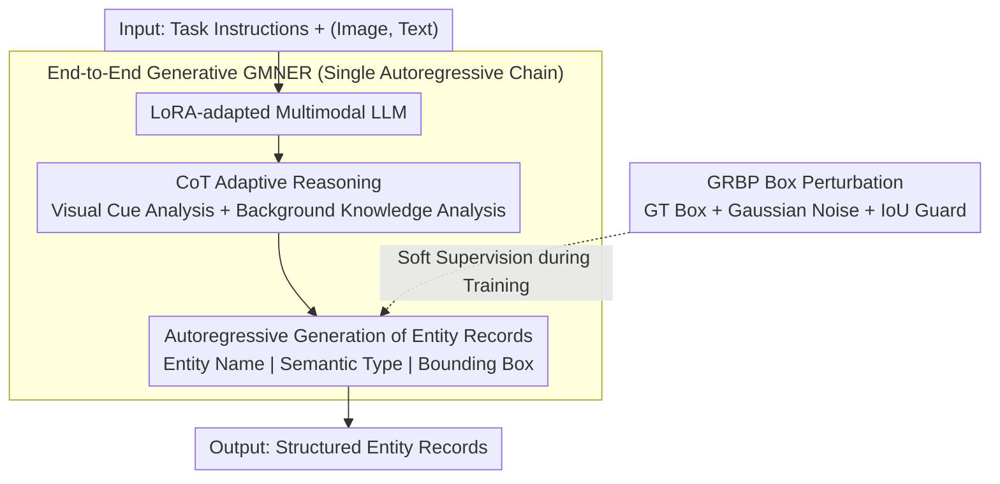

# E2E-GMNER: End-to-End Generative Grounded Multimodal Named Entity Recognition

**Conference**: ACL 2026 Findings  
**arXiv**: [2604.17319](https://arxiv.org/abs/2604.17319)  
**Code**: [https://github.com/Finch-coder/E2E-GMNER](https://github.com/Finch-coder/E2E-GMNER)  
**Area**: Object Detection  
**Keywords**: Multimodal Named Entity Recognition, End-to-End Generation, Visual Grounding, Gaussian Perturbation, CoT Reasoning

## TL;DR

Ours proposes E2E-GMNER, the first end-to-end GMNER framework that unifies entity recognition, semantic classification, visual grounding, and implicit knowledge reasoning within a single multimodal large language model. This framework adaptively determines the availability of visual/knowledge cues through CoT reasoning and introduces Gaussian Risk-aware Box Perturbation (GRBP) to enhance the robustness of generative bounding box prediction.

## Background & Motivation

**Background**: Grounded Multimodal Named Entity Recognition (GMNER) requires the joint identification of entities in text, the prediction of semantic types, and the grounding of each entity to its corresponding visual region in an image. Existing methods such as H-Index, TIGER, and RiVEG primarily adopt pipeline architectures.

**Limitations of Prior Work**: (1) Pipeline architectures decouple textual entity recognition and visual grounding into independent modules (e.g., separate NER taggers and external object detectors), leading to error accumulation and the inability to perform joint optimization; (2) Existing methods address text-visual ambiguity through implicit cross-modal alignment but lack an explicit mechanism to judge when visual evidence or external knowledge is truly useful, causing noisy visual cues to degrade performance; (3) In generative box prediction, single hard target supervision is sensitive to annotation noise and coordinate discretization errors.

**Key Challenge**: End-to-end unification vs. the specific requirements of sub-tasks—how can entity recognition, semantic classification, and visual grounding, which are inherently different tasks, be optimized simultaneously within a single model?

**Goal**: To design the first end-to-end GMNER framework to eliminate error accumulation inherent in pipeline-based methods.

**Key Insight**: Model GMNER as an instruction-tuned conditional generation task, leveraging the unified generative capabilities of multimodal large language models (MLLMs).

**Core Idea**: End-to-end generation + CoT adaptive reasoning + Gaussian soft supervision work synergistically to address the three core problems of GMNER.

## Method

### Overall Architecture

Given an image-text pair and task instructions, an MLLM adapted with LoRA first performs CoT reasoning (visual cue analysis + background knowledge analysis). It then autoregressively generates structured entity records (Entity Name|Semantic Type|Bounding Box Coordinates). During training, GRBP is used instead of hard box supervision.

### Key Designs

**1. End-to-End Generative GMNER: Integrating recognition and grounding into a single generation process to eliminate pipeline error accumulation.**

Pipeline architectures split textual entity recognition and visual grounding into independent modules—an independent NER tagger followed by an external object detector. Errors from the first stage propagate to the next, and these modules cannot be jointly optimized. Ours models the entire task as a conditional generation problem: the input is $[\text{Instruction}; (\text{Image}, \text{Text})]$, and the output is $[\text{Reasoning Sequence} R; \{(e_i, c_i, b_i)\}]$. Each entity record is serialized into a string like "Entity Name|Type|$[x_1, y_1, x_2, y_2]$," and all records are concatenated for the final prediction.

The entire process is trained using a standard autoregressive MLE loss. Since recognition and grounding occur on the same generation chain, entity names, semantic types, and bounding box coordinates can freely cross-reference each other. When the model generates a box, it can see the entity name it just recognized, and vice versa—an information flow that is severed in pipeline approaches.

**2. CoT Instruction-Tuning for Adaptive Reasoning: Allowing the model to first "think" whether it should trust a visual/knowledge cue before acting.**

Existing methods rely on implicit cross-modal alignment for disambiguation but lack an explicit mechanism to determine if visual evidence or external knowledge is actually useful. Consequently, noisy visual cues can degrade performance. The strategy here is to output a reasoning sequence $R$ before generating entity records, which includes visual cue analysis (checking if visual evidence corresponds to textual entities) and background knowledge analysis (determining if external knowledge is needed for disambiguation).

During training, this reasoning sequence is generated by a stronger external LLM via API to serve as supervision. However, during inference, the model generates $R$ autonomously without relying on external models. This acts as an "attention gate" for multimodal fusion: the model evaluates a signal's reliability before utilizing it, proving more robust than simple cross-attention and allowing it to ignore noisy visual cues.

**3. Gaussian Risk-Aware Box Perturbation (GRBP): Using soft supervision instead of hard box labels to tolerate annotation noise and coordinate discretization errors.**

Generative box prediction discretizes coordinates into token sequences, where a tiny geometric deviation can result in disproportionately large training losses. Single hard target supervision is sensitive to both annotation noise and discretization errors. GRBP addresses this by applying probabilistic perturbations to the ground truth (GT) boxes during training: Gaussian noise $\delta_x, \delta_y \sim \mathcal{N}(0, \beta^2)$ is added to the center position, and width/height are multiplied by Gaussian scaling factors. This replaces the "one point to one label" hard supervision with a Gaussian-weighted soft target—where larger perturbations correspond to lower probabilities.

To prevent uncontrolled perturbation, an IoU guard is added, requiring the perturbed box to maintain $\text{IoU} \geq \tau$ with the original box. This maintains the direction of empirical risk minimization while allowing the model to tolerate minor geometric deviations. Essentially, this moves the concept of data augmentation from the input to the label.

### Loss & Training

A standard autoregressive MLE loss is employed: $$\mathcal{L} = -\sum_t \log p_\theta(y_t | y_{<t}, \text{Instruction}, I, T)$$, where bounding box coordinates participate in training as soft targets following GRBP perturbation.

## Key Experimental Results

### Main Results

On the Twitter-GMNER and Twitter-FMNERG benchmarks:

| Method | Twitter-GMNER (GMNER) | Twitter-GMNER (MNER) |
|------|----------------------|---------------------|
| GMDA (Pipeline) | 58.61 | - |
| GEM (Pipeline + MLLM) | 59.83 | 83.15 |
| **E2E-GMNER** | **Most Competitive** | **Most Competitive** |

### Ablation Study

| Configuration | Effect | Description |
|------|------|------|
| w/o CoT Reasoning | Decrease | Adaptive visual/knowledge utilization is critical |
| w/o GRBP | Decrease | Box prediction robustness is compromised |
| Hard Box vs. GRBP Soft | GRBP Better | Tolerates annotation noise |
| End-to-End vs. Pipeline | End-to-End Better | Eliminates error accumulation |

### Key Findings

- The end-to-end framework achieves highly competitive performance on the main GMNER task, validating the effectiveness of unified optimization.
- CoT reasoning allows the model to actively ignore noisy visual cues rather than being misled, which is crucial for improving entity grounding accuracy.
- The IoU guard mechanism in GRBP ensures that perturbations do not become excessive, balancing the flexibility and accuracy of soft supervision.
- At inference time, the model does not depend on external models, maintaining efficient end-to-end inference.

## Highlights & Insights

- The significance of the first end-to-end GMNER framework lies not only in performance gains but also in proving that entity recognition and visual grounding can collaborate effectively within a unified generative framework rather than requiring step-by-step processing.
- GRBP introduces data augmentation logic into the design of supervision targets: instead of augmenting input data, it "augments" the labels—generating soft supervision signals via probabilistic perturbations of GT boxes. This concept is transferable to other generative grounding tasks.
- CoT reasoning serves as an "attention gate" mechanism: letting the model evaluate the reliability of visual/knowledge signals before usage is a more intelligent multimodal fusion strategy than simple cross-attention.

## Limitations & Future Work

- It may still underperform compared to specialized pipeline methods in certain categories (especially those using powerful external detectors).
- CoT training depends on external LLMs (e.g., GPT-4o) to generate reasoning sequences, introducing extra data preparation costs.
- Hyperparameters for GRBP ($\beta, \gamma, \tau$) require tuning, and different datasets might need different settings.
- Current validation is limited to Twitter image-text pairs; generalization to other domains (News, E-commerce) remains unknown.

## Related Work & Insights

- **vs. RiVEG (Li et al., 2024)**: RiVEG uses MLLMs as assistants but remains a pipeline architecture; E2E-GMNER achieves true end-to-end processing.
- **vs. MAKAR (Lin et al., 2025)**: MAKAR uses an MLLM multi-agent system to resolve semantic ambiguity but still contains pipeline components; E2E-GMNER is more streamlined.
- **vs. MQSPN (Tang et al., 2025)**: MQSPN uses set prediction to mitigate exposure bias but does not address the noise sensitivity of box prediction; GRBP in E2E-GMNER directly challenges this issue.

## Rating
- Novelty: ⭐⭐⭐⭐ First end-to-end GMNER + GRBP soft supervision innovation.
- Experimental Thoroughness: ⭐⭐⭐⭐ Two benchmarks + complete ablation studies.
- Writing Quality: ⭐⭐⭐⭐ Clear problem definitions and detailed method descriptions.
- Value: ⭐⭐⭐⭐ Provides an effective demonstration of the end-to-end paradigm for multimodal NER.

<!-- RELATED:START -->

## Related Papers

- [\[CVPR 2026\] MarkushGrapher-2: End-to-end Multimodal Recognition of Chemical Structures](../../CVPR2026/multimodal_vlm/markushgrapher-2_end-to-end_multimodal_recognition_of_chemical_structures.md)
- [\[ICLR 2026\] WebDS: An End-to-End Benchmark for Web-based Data Science](../../ICLR2026/multimodal_vlm/webds_an_end-to-end_benchmark_for_web-based_data_science.md)
- [\[AAAI 2026\] SpeakerLM: End-to-End Versatile Speaker Diarization and Recognition with Multimodal Large Language Models](../../AAAI2026/multimodal_vlm/speakerlm_end-to-end_versatile_speaker_diarization_and_recognition_with_multimod.md)
- [\[CVPR 2026\] WikiCLIP: An Efficient Contrastive Baseline for Open-domain Visual Entity Recognition](../../CVPR2026/multimodal_vlm/wikiclip_an_efficient_contrastive_baseline_for_open-domain_visual_entity_recogni.md)
- [\[ACL 2026\] Towards Visually Grounded Multimodal Summarization via Cross-Modal Transformer and Gated Attention](towards_visually_grounded_multimodal_summarization_via_cross-modal_transformer_a.md)

<!-- RELATED:END -->
