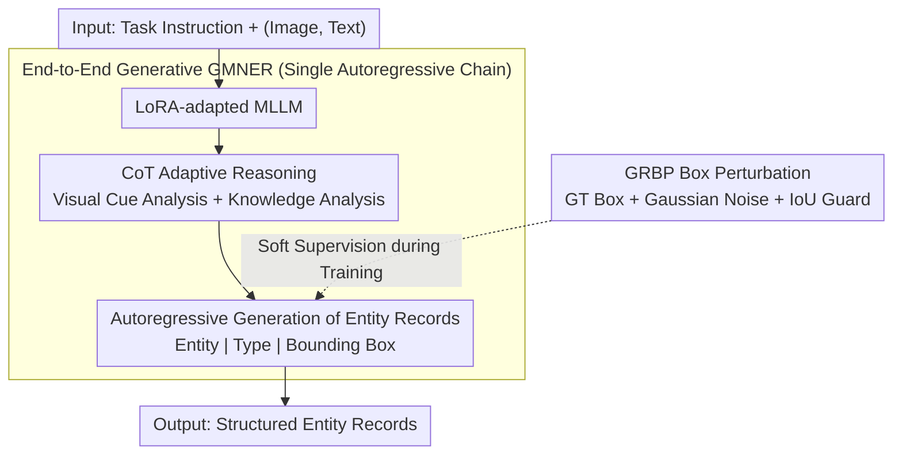

# E2E-GMNER: End-to-End Generative Grounded Multimodal Named Entity Recognition

**Conference**: ACL 2026 Findings  
**arXiv**: [2604.17319](https://arxiv.org/abs/2604.17319)  
**Code**: [https://github.com/Finch-coder/E2E-GMNER](https://github.com/Finch-coder/E2E-GMNER)  
**Area**: Object Detection  
**Keywords**: Multimodal Named Entity Recognition, End-to-End Generation, Visual Grounding, Gaussian Perturbation, CoT Reasoning

## TL;DR

This paper proposes E2E-GMNER, the first end-to-end GMNER framework that unifies entity recognition, semantic classification, visual grounding, and implicit knowledge reasoning within a single multimodal large language model (MLLM). It adaptively determines the utility of visual/knowledge cues through Chain-of-Thought (CoT) reasoning and introduces Gaussian Risk-aware Box Perturbation (GRBP) to enhance the robustness of generative bounding box prediction.

## Background & Motivation

**Background**: Grounded Multimodal Named Entity Recognition (GMNER) requires jointly identifying entities in text, predicting their semantic types, and localizing each entity to the corresponding visual region in an image. Existing methods such as H-Index, TIGER, and RiVEG primarily adopt pipeline architectures.

**Limitations of Prior Work**: (1) Pipeline architectures decouple textual entity recognition and visual grounding into independent modules (e.g., separate NER taggers and external object detectors), leading to error propagation and the inability to perform joint optimization. (2) Existing methods resolve text-visual ambiguity through implicit cross-modal alignment but lack explicit mechanisms to judge when visual evidence or external knowledge is truly useful, causing noisy visual cues to degrade performance. (3) In generative box prediction, single hard-target supervision is sensitive to annotation noise and coordinate discretization errors.

**Key Challenge**: End-to-end unification vs. task-specific requirements—how to simultaneously optimize entity recognition, semantic classification, and visual grounding, which are three fundamentally different tasks, within a single model?

**Goal**: To design the first end-to-end GMNER framework to eliminate error accumulation in pipelines.

**Key Insight**: Model GMNER as an instruction-tuned conditional generation task, leveraging the unified generation capabilities of MLLMs.

**Core Idea**: A synergy of end-to-end generation, CoT adaptive reasoning, and Gaussian soft supervision to address the three core problems of GMNER.

## Method

### Overall Architecture

Given an image-text pair and task instructions, a LoRA-adapted MLLM first performs CoT reasoning (visual cue analysis + background knowledge analysis) and then autoregressively generates structured entity records (Entity Name | Semantic Type | Bounding Box Coordinates). During training, GRBP is used to replace hard box supervision.

### Key Designs

**1. End-to-End Generative GMNER: Incorporating recognition and grounding into a single generation process to prevent error accumulation**

Pipeline architectures split textual entity recognition and visual grounding into independent modules—a separate NER tagger followed by an external object detector—where errors from the first stage propagate downstream, and modules cannot be jointly optimized. This work models the entire task as a conditional generation problem: the input is $[\text{Instruction}; (\text{Image}, \text{Text})]$, and the output is $[\text{Reasoning Sequence } R; \{(e_i, c_i, b_i)\}]$, where each entity record is serialized into a string like "Entity Name | Type | $[x_1, y_1, x_2, y_2]$".

The entire process is trained using the standard autoregressive MLE loss. Recognition and grounding are completed on the same generation chain. The advantage is that entity names, semantic types, and bounding box coordinates can freely refer to each other—the model sees the entity name it just recognized when generating the box, and vice-versa, restoring the information flow severed in pipelines.

**2. CoT Instruction-Tuning for Adaptive Reasoning: Deciding whether to trust visual/knowledge cues before acting**

Existing methods rely on implicit alignment for disambiguation but lack an explicit mechanism to determine if visual evidence or external knowledge is actually helpful, often allowing noisy cues to drag down performance. The strategy here is to output a reasoning sequence $R$ before generating entity records, containing visual cue analysis (whether there is visual evidence matching the textual entity) and background knowledge analysis (whether external knowledge is needed for disambiguation).

During training, this reasoning sequence is generated by a stronger external LLM via API to serve as supervision. However, during inference, the model autonomously produces $R$ without external dependencies. This acts as an "attention gate" for multimodal fusion: the model evaluates signals before using them, which is more intelligent than mindless cross-attention and allows the model to ignore noisy visual cues.

**3. Gaussian Risk-aware Box Perturbation (GRBP): Replacing hard labels with soft supervision to tolerate noise and discretization errors**

Generative box prediction discretizes coordinates into token sequences; a tiny geometric deviation can result in disproportionately large training losses. Single hard target supervision is sensitive to both annotation noise and discretization errors. GRBP applies probabilistic perturbations to Ground Truth (GT) boxes during training: adding Gaussian noise $\delta_x, \delta_y \sim \mathcal{N}(0, \beta^2)$ to the center and multiplying width/height by Gaussian scaling factors. This replaces "one-to-one" hard supervision with Gaussian-weighted soft targets, where larger perturbations correspond to lower probabilities.

To prevent perturbations from going out of control, an IoU guard is added, requiring the perturbed box to satisfy $\text{IoU} \geq \tau$ with the original box. This maintains the direction of empirical risk minimization while allowing the model to tolerate small geometric deviations, essentially moving the data augmentation concept from "input augmentation" to "label augmentation."

### Loss & Training

Standard autoregressive MLE loss is used: $\mathcal{L} = -\sum_t \log p_\theta(y_t | y_{<t}, \text{Instruction}, I, T)$, where box coordinates serve as soft targets after GRBP perturbation.

## Key Experimental Results

### Main Results

On Twitter-GMNER and Twitter-FMNERG benchmarks:

| Method | Twitter-GMNER (GMNER) | Twitter-GMNER (MNER) |
|------|----------------------|---------------------|
| GMDA (Pipeline) | 58.61 | - |
| GEM (Pipeline + MLLM) | 59.83 | 83.15 |
| **E2E-GMNER** | **Most Competitive** | **Most Competitive** |

### Ablation Study

| Configuration | Effect | Description |
|------|------|------|
| w/o CoT Reasoning | Decrease | Adaptive visual/knowledge utilization is crucial |
| w/o GRBP | Decrease | Box prediction robustness is compromised |
| Hard Box vs. GRBP Soft | GRBP Better | Tolerates annotation noise |
| E2E vs. Pipeline | E2E Better | Eliminates error propagation |

### Key Findings

- The end-to-end framework achieves highly competitive performance on the main GMNER task, validating the effectiveness of unified optimization.
- CoT reasoning allows the model to actively ignore noisy visual cues rather than being misled, which is vital for improving entity grounding accuracy.
- The IoU guard mechanism in GRBP ensures that perturbations are not excessive, balancing the flexibility and accuracy of soft supervision.
- Inference does not rely on external models, maintaining efficient end-to-end execution.

## Highlights & Insights

- The significance of the first end-to-end GMNER framework lies not only in performance gains but also in proving that entity recognition and visual grounding can effectively collaborate in a unified generative framework rather than requiring separate steps.
- GRBP introduces the idea of data augmentation into supervision target design: instead of augmenting input data, it "augments" the labels by generating soft supervision signals through probabilistic GT box perturbations. This concept is transferable to other generative localization tasks.
- CoT reasoning acts as an "attention gating" mechanism: allowing the model to evaluate the reliability of visual/knowledge signals before use is a smarter multimodal fusion strategy than simple cross-attention.

## Limitations & Future Work

- Performance on specific categories might still lag behind specialized pipeline methods (especially those using powerful external detectors).
- Training for CoT reasoning depends on external LLMs (like GPT-4o) to generate reasoning sequences, introducing additional data preparation costs.
- Hyperparameters for GRBP ($\beta, \gamma, \tau$) require tuning; different datasets might need different settings.
- Currently only validated on Twitter image-text pairs; generalizability to other domains (news, e-commerce) remains unknown.

## Related Work & Insights

- **vs. RiVEG (Li et al., 2024)**: Uses MLLM as an assistant but remains a pipeline; E2E-GMNER achieves true end-to-end processing.
- **vs. MAKAR (Lin et al., 2025)**: Uses an MLLM multi-agent system to resolve semantic ambiguity but still contains pipeline components; E2E-GMNER is more concise.
- **vs. MQSPN (Tang et al., 2025)**: Uses set prediction to alleviate exposure bias but does not address noise sensitivity in box prediction; E2E-GMNER’s GRBP directly tackles this challenge.

## Rating
- Novelty: ⭐⭐⭐⭐ First end-to-end GMNER + GRBP soft supervision innovation
- Experimental Thoroughness: ⭐⭐⭐⭐ Two benchmarks + complete ablation
- Writing Quality: ⭐⭐⭐⭐ Clear problem definition, detailed methodology
- Value: ⭐⭐⭐⭐ Provides an effective demonstration of the end-to-end paradigm for multimodal NER

<!-- RELATED:START -->

## Related Papers

- [\[CVPR 2026\] MarkushGrapher-2: End-to-end Multimodal Recognition of Chemical Structures](../../CVPR2026/multimodal_vlm/markushgrapher-2_end-to-end_multimodal_recognition_of_chemical_structures.md)
- [\[ICLR 2026\] WebDS: An End-to-End Benchmark for Web-based Data Science](../../ICLR2026/multimodal_vlm/webds_an_end-to-end_benchmark_for_web-based_data_science.md)
- [\[AAAI 2026\] SpeakerLM: End-to-End Versatile Speaker Diarization and Recognition with Multimodal Large Language Models](../../AAAI2026/multimodal_vlm/speakerlm_end-to-end_versatile_speaker_diarization_and_recognition_with_multimod.md)
- [\[ACL 2026\] OMHBench: Benchmarking Balanced and Grounded Omni-Modal Multi-Hop Reasoning](omhbench_benchmarking_balanced_and_grounded_omni-modal_multi-hop_reasoning.md)
- [\[CVPR 2026\] WikiCLIP: An Efficient Contrastive Baseline for Open-domain Visual Entity Recognition](../../CVPR2026/multimodal_vlm/wikiclip_an_efficient_contrastive_baseline_for_open-domain_visual_entity_recogni.md)

<!-- RELATED:END -->
