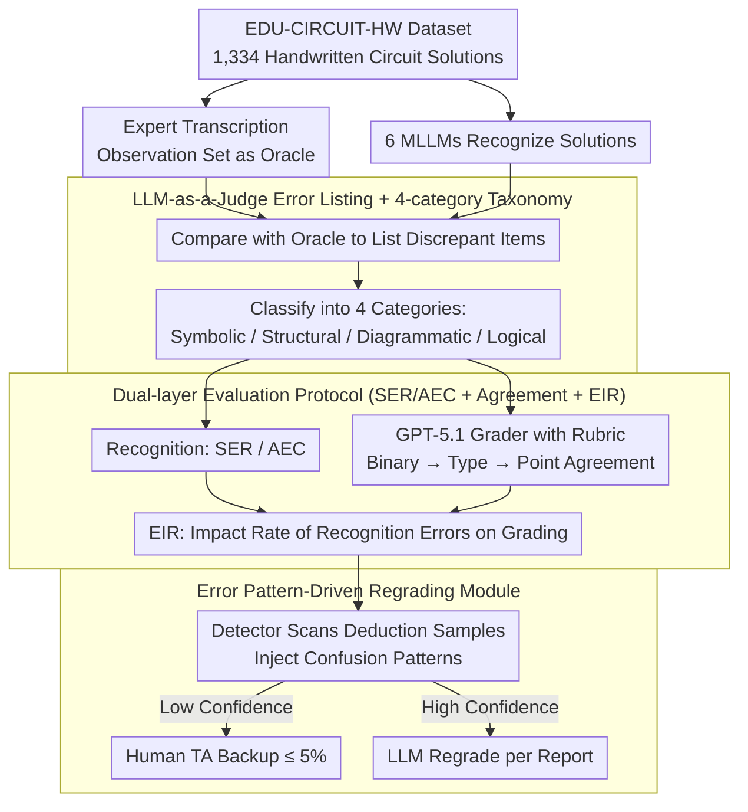

# EDU-CIRCUIT-HW: Evaluating Multimodal Large Language Models on Real-World University-Level STEM Student Handwritten Solutions

**Conference**: ACL 2026 Findings  
**arXiv**: [2602.00095](https://arxiv.org/abs/2602.00095)  
**Code**: Project Website / GitHub Repository (Link provided in paper)  
**Area**: Multimodal VLM / Educational Evaluation  
**Keywords**: STEM Handwritten Understanding, MLLM Evaluation, auto-grading, recognition error propagation, human-in-the-loop

## TL;DR
The authors release the EDU-CIRCUIT-HW dataset containing 1,334 real-world handwritten university circuit homework samples and propose an "upstream recognition + downstream grading" dual-layer evaluation protocol. They find that even the strongest MLLMs (GPT-5.1 / Gemini-3-Preview) have recognition errors in 37–85% of samples, but only 7–20% propagate to grading. A regrading module using LLM-judge error patterns with only 3.3% human-in-the-loop backup improves point-agreement from 70% to 76%.

## Background & Motivation

**Background**: Utilizing MLLMs as "auto-grading TAs" has become a new trend in AI education: models like Gemini, GPT, and Claude first recognize handwritten assignments, and then an LLM performs grading based on a rubric (Kortemeyer 2024, Liu 2024, Yang 2025, etc.). However, most existing evaluations focus on simple K-12 mathematics (DrawEduMath) or isolated formulas (CROHME, MathWriting), failing to reflect the complex handwritten text of university STEM subjects which intertwine formulas, derivations, and hand-drawn circuit diagrams.

**Limitations of Prior Work**: The authors identify two fundamental issues: (1) **Data Scarcity**: A lack of benchmarks featuring "mixed text/images + university-level difficulty + real student handwriting." (2) **Misaligned Evaluation Paradigms**: Current work often evaluates only the downstream task (mostly via coarse-grained binary auto-grading). This "shields" recognition errors that fall outside the rubric, leading developers to overestimate the visual understanding capabilities of MLLMs. For example, in Figure 1, recognition errors in points ① and ② are masked because they are not part of the rubric grading points.

**Key Challenge**: The "latency rate" of recognition errors is significantly higher than their "manifestation rate." Once rubrics are tightened or downstream tasks such as circuit-to-netlist conversion are required, these latent errors become critical. Traditional "grading agreement only" protocols fail to detect them.

**Goal**: To establish a dual-metric system for "upstream recognition fidelity + downstream grading" to quantitatively answer: (i) how many recognition errors exist, (ii) which types are most fatal, and (iii) whether error patterns can be used for defense.

**Key Insight**: The dataset is split into an "observation set" (513 expert-transcribed solutions for training and analysis) and a "test set" (821 samples with ground-truth scores only, for simulating generalization in deployment). An LLM-as-a-judge is utilized to automatically list and classify recognition errors.

**Core Idea**: Use "expert verbatim transcription" as an oracle to calculate recognition errors. Define Error Impact Rate (EIR) to map recognition errors to grading discrepancies. Finally, implement a regrading pipeline guided by "error patterns → low-confidence routing → human backup" to transform recognition vulnerability into controlled costs.

## Method

### Overall Architecture
The benchmark and diagnostic pipeline are structured as follows: (1) **Data Collection**: Handwritten solutions from a Spring 2025 undergraduate circuits course at a US research university, involving 29 students and 62 textbook problems for a total of 1,334 samples. Experts provided 5-dimensional rubric scores (E / M / U / C / NC). The observation set (11 students, 513 samples) includes expert verbatim markdown transcriptions and natural language descriptions of diagrams; the test set (18 students, 821 samples) contains only ground-truth scores. (2) **Recognition Evaluation**: Six MLLMs (Gemini-3-Pro-Preview, Gemini-2.5-Pro, GPT-5.1, Claude-4.5-Sonnet, Qwen3-VL-Plus/8B-Thinking) perform recognition. Gemini-2.5-Pro serves as the LLM-judge to list discrepant items against the oracle, which are then classified by another LLM into four categories (Symbolic & Character / Structural & Notational / Diagrammatic / Textual & Logical). (3) **Downstream Grading**: GPT-5.1 is fixed as the grader to output deductions across 5 categories given the problem, reference, and rubric. Agreements (Binary / Type / Point) are calculated against expert reports. (4) **Impact Analysis**: EIR is defined as (Recognition errors causing grading discrepancies) / (Total recognition errors). (5) **Regrading Case**: Error patterns summarized from the observation set are injected into prompts to detect potential recognition errors in the test set and provide high/low confidence; low-confidence samples are routed to humans, while the rest are regraded by the LLM.

### Key Designs

**1. Dual-layer Evaluation Protocol (SER / AEC + EIR + Binary/Type/Point Agreement): Decoupling "Recognition" and "Grading" capabilities to quantify error propagation.**

Relying solely on task-centric metrics like auto-grading accuracy allows many "silent errors" to escape—cases where recognition is incorrect, but because the error is not on a rubric point, the downstream score remains unaffected. This lead developers to overestimate MLLM visual understanding. This work measures the recognition end via Sentence Error Rate $\text{SER}=\frac{\#\{s: \text{errors}(s)>0\}}{|S|}$ and Average Error Count $\text{AEC}=\frac{1}{|S|}\sum_s \#\text{errors}(s)$, and the grading end via a three-level progressive agreement (Binary $\to$ Type $\to$ Point), where higher levels are stricter and better at exposing fine-grained errors.

The bridge between these two is the Error Impact Rate $\text{EIR}=\frac{\text{Number of recognition errors causing grading discrepancies}}{\text{Total number of recognition errors}}$. This quantitatively answers how severe recognition errors must be to impact downstream grading—a metric lacking in most vision-to-reasoning pipelines.

**2. LLM-as-a-Judge recognition error listing + 4-category taxonomy: Automated discrepancy listing and classification.**

Manual annotation of discrepancies between MLLM results and expert transcriptions is unscalable. This work splits the task into "Listing Discrepancies" and "Classification." Oracle markdown and the target markdown are fed to Gemini-2.5-Pro to list all sentence/formula-level discrepant items, while semantically equivalent variations (e.g., `KCL: out` ≡ `KCL: @ out`) are ignored. A second LLM then categorizes each discrepancy into Symbolic & Character (characters/operators/units), Structural & Notational (layout/variable consistency), Diagrammatic (topology/label misreading), or Textual & Logical (context/derivation steps).

By using an oracle for comparison, the judge only performs "standardized discrepancy checking" rather than "open-ended scoring," minimizing hallucination. Human verification on 186 samples and 5,000+ items yielded a sample-level accuracy $\geq 0.95$ and an item-level F1 $\geq 0.90$.

**3. Error pattern-driven human-in-the-loop Regrading: Reducing human effort to ≤ 5% by using statistical error patterns as risk features.**

In high-stakes educational grading, full automation is unacceptable, yet full manual grading is too expensive. This module assumes recognition error patterns are statistical and human costs are controllable. Common confusion patterns (e.g., $-V\to V$, $\frac{1/8}{1/8+1/16}\to \frac{8}{8+16}$, incorrect KCL node connections) are extracted from the observation set and injected into the detector's prompt.

The detector scans only those samples with deductions in the first round for suspicious recognition items and provides high/low confidence flags—recognition errors primarily cause false-positive deductions. Low-confidence samples are handled by TAs, while high-confidence samples are regraded by the LLM based on the detector's report. This routing reduces manual effort to ≤ 5% while achieving point-agreement levels close to the upper bound of expert-driven OCR.

## Key Experimental Results

### Main Results
Recognition quality and its impact on the 5-dimensional rubric grading in the observation set (GPT-5.1 as grader; Graduate TA baseline; Human Expert row indicates oracle grader using expert transcriptions):

| Recognizer | SER ↓ | AEC ↓ | Binary ↑ | Type ↑ | Point ↑ | EIR ↓ |
|------------|-------|-------|----------|--------|---------|-------|
| Graduate (Human) | – | – | 83.63 | 82.46 | 81.29 | – |
| Human Expert (Oracle) | – | – | **89.47** | 78.36 | 74.46 | – |
| Gemini-3-Preview | **37.62** | **0.61** | 87.91 | **78.17** | **74.27** | **7.60** |
| Gemini-2.5-Pro | 53.52 | 1.23 | 85.58 | 73.68 | 69.40 | 14.72 |
| Qwen3-VL-Plus | 61.72 | 1.38 | 80.90 | 68.62 | 65.11 | 16.67 |
| GPT-5.1 | 71.54 | 2.05 | 77.78 | 65.50 | 61.99 | 17.89 |
| Claude-4.5-Sonnet | 80.70 | 2.76 | 77.58 | 63.16 | 59.84 | 18.05 |
| Qwen3-VL-8B-Thinking | 85.43 | 2.79 | 75.05 | 61.01 | 56.92 | 19.60 |

Key points: (1) Even the strongest Gemini-3-Preview has recognition errors in 37.6% of samples, but the EIR is only 7.6%, suggesting downstream grading masks many recognition errors. (2) From Gemini-3-Preview to Qwen3-VL-8B-Thinking, stricter rubrics lead to larger performance gaps (12.86% difference in Binary vs. 17.35% in Point), confirming that rubric tightening manifests recognition errors. (3) MLLMs can outperform graduate TAs in Binary agreement but still lag in Type/Point agreement, as LLMs tend to be more lenient than human graders.

### Ablation Study
Comparison of vanilla pipeline vs. regrading module on the test set (Higher agreement is better; LLM/Human columns show regrading ratio):

| Workflow | Visual Recognizer | Binary | Type | Point | LLM regrade | Human regrade |
|----------|-------------------|--------|------|-------|-------------|---------------|
| Vanilla | Gemini-2.5-Pro | 85.02 | 74.91 | 69.91 | – | – |
| Vanilla | GPT-5.1 | 82.34 | 72.23 | 66.87 | – | – |
| **+ Regrading** | Gemini-2.5-Pro | **86.48** | **77.34** | **74.42** | 20.6% | 3.3% |
| **+ Regrading** | GPT-5.1 | **86.60** | **78.93** | **75.76** | 25.1% | 4.4% |

Key points: With ≤ 5% human backup, Point agreement improved from ~70% to 76%, reaching the ceiling of the "expert-recognition" oracle (74.46%).

### Key Findings
- **Symbolic & Character errors are most frequent** and have the highest EIR (≈20%), as graders rely heavily on symbol matching. Diagrammatic and Textual & Logical errors, despite being higher-level, have EIR < 10% because current rubrics barely cover them—a "survivor bias" in auto-grading.
- **Finer rubrics better differentiate models**: The performance gap between models widens from ~13% to ~17% across Binary, Type, and Point levels, indicating that future AI education evaluations must use point-level rubrics for diagnostic value.
- **Small models are competitive in diagrams**: Qwen3-VL-8B-Thinking performed better than Gemini-2.5-Pro in the Diagrammatic error count (98 vs. 103), suggesting commercial models excel in textual reasoning rather than graphical understanding.
- **Regrading works without the strongest MLLMs**: Even using Gemini-2.5-Pro as the recognizer, the detector + 3.3% human effort improved Point agreement by +4.5%, proving high ROI for "error patterns + human-AI collaboration."

## Highlights & Insights
- **Dual-layer evaluation in high-stakes scenarios**: Unlike previous OCR-focused benchmarks, this work positions recognition fidelity as the bottleneck for reliability and quantifies silent errors via EIR. This "decouple then bridge" philosophy is applicable to any perception-to-reasoning pipeline.
- **Observation/Test split data design**: Balances cost and information density by performing deep diagnostics on 40% of the data (expert verbatim check) and measuring deployment effects on the remaining 60%.
- **LLM-as-a-Judge "discrepancy listing" mode**: Defining the task as listing and classifying differences rather than scoring restricts the LLM's freedom and stabilizes F1 scores above 0.9.
- **3-stage deployment framework**: Converts recognition reliability issues into a controllable human effort ratio, providing a blueprint for the practical deployment of AI grading.

## Limitations & Future Work
- The dataset is limited to one course (Circuit Analysis) and circuit diagrams; geometry, chemistry, and flowcharts are not covered.
- Downstream tasks are limited to auto-grading; tasks like VQA or circuit-to-netlist might have different sensitivities to recognition errors.
- Rubrics and ground-truth are provided by a small number of experts; open-ended STEM grading is inherently subjective.
- The detector, regrader, and grader use the same model (GPT-5.1), potentially introducing bias; future work should validate using heterogeneous models.

## Related Work & Insights
- **vs DrawEduMath (Baral 2025)**: They focus on K-12 math VQA; this work addresses university-level STEM with much higher complexity and point-level rubrics.
- **vs CROHME / MathWriting**: These evaluate isolated formula OCR; this work evaluates intertwined "formula + derivation + diagram" text.
- **vs Pensieve Grader (Yang 2025)**: They perform end-to-end grading; this work additionally evaluates the recognition layer and provides EIR to explain error sources.
- **Insight**: Any "visual perception → high-level reasoning" task can adopt this SER/AEC/EIR + observation/test split + discrepancy listing approach, particularly in high-stakes fields like medical imaging or legal OCR.

## Rating
- Novelty: ⭐⭐⭐⭐ The combination of dual-layer evaluation, EIR, and error pattern routing is effective for addressing practical pain points.
- Experimental Thoroughness: ⭐⭐⭐⭐⭐ Coverage of 6 MLLMs, 4 error types, 3 rubric levels, and real deployment case studies.
- Writing Quality: ⭐⭐⭐⭐ Clear progression from argument to evidence to solution; some sections are slightly verbose.
- Value: ⭐⭐⭐⭐⭐ Directly addresses the reliability pain point of AI grading in education with a deployable engineering solution.

<!-- RELATED:START -->

## Related Papers

- [\[ICLR 2026\] WorldSense: Evaluating Real-World Omnimodal Understanding for Multimodal LLMs](../../ICLR2026/multimodal_vlm/worldsense_evaluating_real-world_omnimodal_understanding_for_multimodal_llms.md)
- [\[ACL 2026\] GuideDog: A Real-World Egocentric Multimodal Dataset for Blind and Low-Vision Accessibility-Aware Guidance](guidedog_a_real-world_egocentric_multimodal_dataset_for_blind_and_low-vision_acc.md)
- [\[ICLR 2026\] Can Vision-Language Models Answer Face to Face Questions in the Real-World?](../../ICLR2026/multimodal_vlm/can_vision-language_models_answer_face_to_face_questions_in_the_real-world.md)
- [\[ACL 2026\] Jailbreaking Multimodal Large Language Models using Multi-Clip Video](jailbreaking_multimodal_large_language_models_using_multi-clip_video.md)
- [\[ICML 2026\] TimeSpot: Benchmarking Geo-Temporal Understanding in Vision-Language Models in Real-World Settings](../../ICML2026/multimodal_vlm/timespot_benchmarking_geo-temporal_understanding_in_vision-language_models_in_re.md)

<!-- RELATED:END -->
