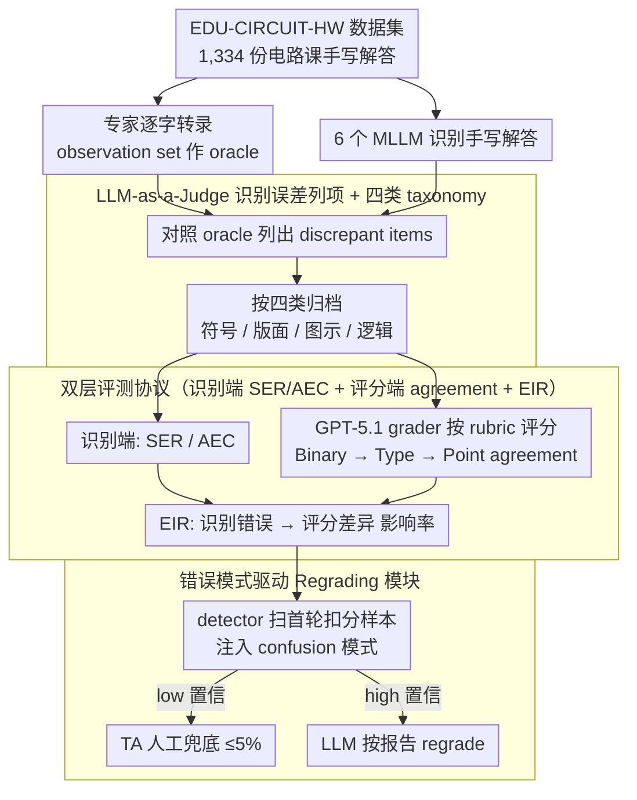

# EDU-CIRCUIT-HW: Evaluating Multimodal Large Language Models on Real-World University-Level STEM Student Handwritten Solutions

**Conference**: ACL 2026 Findings  
**arXiv**: [2602.00095](https://arxiv.org/abs/2602.00095)  
**Code**: Project Website / GitHub (Links provided in the paper)  
**Area**: Multimodal VLM / Educational Evaluation  
**Keywords**: STEM Handwritten Understanding, MLLM Evaluation, auto-grading, recognition error propagation, human-in-the-loop

## TL;DR
The authors release the EDU-CIRCUIT-HW dataset, consisting of 1,334 real-world handwritten assignments from university circuit courses. They propose a dual-layer evaluation protocol of "upstream recognition + downstream grading," finding that while the strongest MLLMs (GPT-5.1 / Gemini-3-Preview) exhibit recognition errors in 37–85% of samples, only 7–20% propagate to grading. By utilizing LLM-judge error patterns and a regrading module with only 3.3% human-in-the-loop backup, point-agreement can be improved from 70% to 76%.

## Background & Motivation

**Background**: Utilizing MLLMs as "auto-grading TAs" has become a new trend in AI education: letting Gemini/GPT/Claude recognize handwritten assignments before having an LLM grade them based on a rubric (Kortemeyer 2024, Liu 2024, Yang 2025, etc.). However, most evaluations focus on simple K-12 mathematics (DrawEduMath) or isolated formulas (CROHME, MathWriting), failing to reflect the complex handwritten text in university STEM that intertwines "formulas + derivations + hand-drawn circuit diagrams."

**Limitations of Prior Work**: The authors identify two fundamental issues: (1) **Data scarcity**: A lack of benchmarks featuring "mixed text-image + university difficulty + real student handwriting"; (2) **Mismatched evaluation paradigms**: Existing works only examine the downstream (mostly coarse-grained binary auto-grading), which "masks" recognition errors outside the rubric, leading developers to overestimate the visual understanding capabilities of MLLMs. For example, in Figure 1, errors in recognizing ① and ② are hidden because they are not part of the grading points.

**Key Challenge**: The "latency rate" of recognition errors is much higher than the "manifestation rate"—once rubrics are tightened or downstream tasks like circuit-to-netlist are performed, these latent errors will explode; however, traditional "grading agreement only" evaluation protocols fail to detect them.

**Goal**: To establish a dual-metric system for "upstream recognition fidelity + downstream grading" to quantitatively answer (i) how many recognition errors exist, (ii) which types are most critical, and (iii) whether error patterns can be used for defense.

**Key Insight**: Implementing a double split of an "observation set" (513 samples with word-for-word expert verification for training/analysis) and a "test set" (821 samples with only ground-truth scores for generalization deployment simulation); utilizing LLM-as-a-judge to automatically list and classify recognition errors.

**Core Idea**: First, use "expert verbatim transcription" as an oracle to calculate recognition errors, then define Error Impact Rate (EIR) to map recognition errors to grading errors, and finally implement a regrading pipeline with "error patterns → low-confidence routing → human backup" to transform recognition vulnerability into a controllable cost.

## Method

### Overall Architecture
The entire benchmark and diagnostic pipeline are as follows: (1) **Data Collection**: 1,334 handwritten solutions from 29 students and 62 textbook problems from an undergraduate circuit course at a US research university in Spring 2025, with 5-dimensional rubric scores (E / M / U / C / NC) provided by experts. The observation set (11 students, 513 samples) also includes verbatim markdown transcriptions and natural language descriptions of diagrams; the test set (18 students, 821 samples) only contains ground-truth scores. (2) **Recognition Evaluation**: 6 MLLMs (Gemini-3-Pro-Preview, Gemini-2.5-Pro, GPT-5.1, Claude-4.5-Sonnet, Qwen3-VL-Plus/8B-Thinking) perform recognition, with Gemini-2.5-Pro acting as an LLM-judge to list discrepant items compared to the oracle; another LLM then categorizes each item into four types (Symbolic & Character / Structural & Notational / Diagrammatic / Textual & Logical). (3) **Downstream Grading**: GPT-5.1 is fixed as the grader, outputting 5 types of deductions given problem + reference + rubric; comparison with expert reports yields Binary / Type / Point agreement. (4) **Impact Analysis**: Define $EIR = \frac{\text{number of recognition errors causing grading discrepancy}}{\text{total recognition errors}}$. (5) **Regrading Case**: Inject error patterns summarized from the observation set into the prompt, letting the LLM detect potential recognition errors in the test set and output high/low confidence; low-confidence samples go to humans, while the rest are regraded by the LLM.

### Key Designs

**1. Dual-layer Evaluation Protocol (SER / AEC + EIR + Binary/Type/Point Agreement): Separating the mixed abilities of "recognition" and "grading" to evaluate them individually, and then quantifying how errors propagate.**

Focusing solely on task-centric metrics like auto-grading accuracy allows many "silent errors" to escape—recognition errors that do not affect the grading points result in no downstream score anomalies, leading developers to overestimate MLLM visual understanding. This paper measures recognition and grading separately: the recognition-end uses sample error rate $SER = \frac{\#\{s: errors(s) > 0\}}{|S|}$ and average error count $AEC = \frac{1}{|S|} \sum_s \#errors(s)$, while the grading-end uses a three-level progressive agreement (Binary $\to$ Type $\to$ Point), which becomes stricter and forces out fine-grained errors.

The Error Impact Rate $EIR = \frac{\text{number of recognition errors causing grading discrepancy}}{\text{total recognition errors}}$ bridges the two ends. It allows for a quantitative answer to "how poor must recognition be to actually hurt downstream grading"—a yardstick missing from all vision-to-reasoning pipelines, not just in educational scenarios.

**2. LLM-as-a-Judge for automated error listing + four-category taxonomy: Letting the model perform a "comparative check" to automatically list and then categorize recognition discrepancies.**

Manual annotation of discrepancies between MLLM recognition results and expert transcriptions is unscalable. This paper splits the judge task into "list discrepancies + classify": the oracle markdown and the target markdown are fed to Gemini-2.5-Pro to list all sentence/expression-level discrepant items, while semantically equivalent variations (e.g., `KCL: out` ≡ `KCL: @ out`) are marked as aligned rather than errors; then another LLM categorizes each discrepancy into Symbolic & Character (characters/operators/units), Structural & Notational (formula layout/variable consistency), Diagrammatic (circuit topology/annotation misreading), or Textual & Logical (context/derivation steps).

The key is the oracle backup throughout the process; the judge only "picks discrepancies according to the gold standard" rather than "open grading," minimizing freedom and suppressing hallucinations. In manual verification of 186 samples and 5000+ items, sample-level accuracy is $\geq 0.95$ and item-level F1 is $\geq 0.90$, providing a solid foundation for subsequent EIR analysis.

**3. Error pattern-driven human-in-the-loop Regrading module: Using statistical error patterns as risk features to scan samples, compressing human labor to ≤5%.**

In high-stakes educational grading, full automation is unacceptable, and full manual grading is too expensive. This module leverages the hypothesis that recognition error patterns are statistical and human costs are controllable: common confusion patterns (e.g., $-V \to V$, $\frac{1/8}{1/8+1/16} \to \frac{8}{8+16}$, KCL node misconnections) are extracted from the observation set and placed into the detector's prompt.

The detector only scans suspicious recognition items in samples that were penalized in the first round—since recognition errors primarily cause false-positive deductions, samples with no deductions in the first round are bypassed. Low-confidence items are sent to TAs, while high-confidence items are regraded by the LLM based on the detector's report. Through this routing, the human share is compressed to ≤5%, while point-agreement is pushed close to the ceiling of "experts performing OCR."

### Loss & Training
This work involves no model training and is a **prompt-only evaluation + LLM-judge pipeline**. GPT-5.1 is used uniformly as the Grader; the recognition-end covers 5 commercial models and 1 open-source 8B model; in regrading, the detector, regrader, and grader all use GPT-5.1 to exclude heterogeneous model interference. For LLM-judge thresholds, "semantic equivalence" judgment is assigned to the same model with manual reverse-checks preserved.

## Key Experimental Results

### Main Results
Recognition quality of six MLLMs on the observation set and its impact on 5D rubric grading (GPT-5.1 as grader; Graduate TA baseline; Human Expert row indicates oracle grader using expert transcription as input):

| Recognizer | SER ↓ | AEC ↓ | Binary ↑ | Type ↑ | Point ↑ | EIR ↓ |
| :--- | :--- | :--- | :--- | :--- | :--- | :--- |
| Graduate (Human) | – | – | 83.63 | 82.46 | 81.29 | – |
| Human Expert (oracle) | – | – | **89.47** | 78.36 | 74.46 | – |
| Gemini-3-Preview | **37.62** | **0.61** | 87.91 | **78.17** | **74.27** | **7.60** |
| Gemini-2.5-Pro | 53.52 | 1.23 | 85.58 | 73.68 | 69.40 | 14.72 |
| Qwen3-VL-Plus | 61.72 | 1.38 | 80.90 | 68.62 | 65.11 | 16.67 |
| GPT-5.1 | 71.54 | 2.05 | 77.78 | 65.50 | 61.99 | 17.89 |
| Claude-4.5-Sonnet | 80.70 | 2.76 | 77.58 | 63.16 | 59.84 | 18.05 |
| Qwen3-VL-8B-Thinking | 85.43 | 2.79 | 75.05 | 61.01 | 56.92 | 19.60 |

Key points: (1) Even the strongest Gemini-3-Preview has recognition errors in 37.6% of samples, yet the EIR is only 7.6%, indicating that downstream grading masks a large amount of recognition errors; (2) From Gemini-3-Preview to Qwen3-VL-8B-Thinking, stricter rubrics lead to larger performance gaps (12.86% in Binary, 17.35% in Point), confirming the core argument that "rubric tightening manifests recognition errors"; (3) MLLMs can surpass graduate TAs on Binary, but still lag behind on Type / Point, suggesting LLMs are more lenient while humans are more precise.

### Ablation Study
Comparison between the vanilla pipeline and the regrading module on the test set (higher agreement is better; LLM/Human columns denote regrading proportions):

| Workflow | Visual Recognizer | Binary | Type | Point | LLM regrade | Human regrade |
| :--- | :--- | :--- | :--- | :--- | :--- | :--- |
| Vanilla | Gemini-2.5-Pro | 85.02 | 74.91 | 69.91 | – | – |
| Vanilla | GPT-5.1 | 82.34 | 72.23 | 66.87 | – | – |
| **+ Regrading** | Gemini-2.5-Pro | **86.48** | **77.34** | **74.42** | 20.6% | 3.3% |
| **+ Regrading** | GPT-5.1 | **86.60** | **78.93** | **75.76** | 25.1% | 4.4% |

Key points: With ≤5% human backup, Point agreement improves from ~70% to 76%, approaching the ceiling of 74.46% for "expert recognition" (or even slightly exceeding it because the detector helps the grader proactively avoid pitfalls).

### Key Findings
- **Symbolic & Character errors are most common**, and their EIR is also the highest (≈20%), as graders rely heavily on symbol matching; Diagrammatic and Textual & Logical errors, despite being at a higher cognitive level, are rarely covered by current rubrics, resulting in EIR < 10%—a "survivor bias" in auto-grading.
- **Specifying rubrics better differentiates models**: Across Binary→Type→Point levels, the gap between models expands from ~13% to ~17%, suggesting that future AI education evaluations must use Point-level rubrics for diagnostic value.
- **Small models are not necessarily worse at diagrams**: Qwen3-VL-8B-Thinking had 98 Diagrammatic errors, performing better than Gemini-2.5-Pro's 103, reflecting that commercial models primarily excel in textual reasoning rather than graphical understanding.
- **Regrading improves results even without strong MLLMs**: Even with Gemini-2.5-Pro as the recognizer, using a detector + 3.3% human backup improved the Point score by +4.5%, proving high ROI for using "recognition error patterns + human-AI collaboration."

## Highlights & Insights
- **Dual-layer evaluation in 'high-stakes' scenarios**: Previous handwritten understanding evaluations often stopped at OCRing digits; this paper repositions "recognition fidelity" as the bottleneck for downstream reliability and uses EIR to quantify "silent errors." This "decouple then bridge" evaluation philosophy can be applied to any perception-to-reasoning pipeline (e.g., medical imaging to diagnosis, documents to compliance).
- **Data design via Observation/Test splitting**: Pressing the cost of "verbatim expert verification" on ~40% of the data for diagnosis and pattern learning, while evaluating deployment effects on the remaining 60% with score oracles, is a well-balanced benchmark construction paradigm for cost and information density.
- **LLM-as-a-Judge "List Discrepancy" mode**: The authors define the judge task as "listing + classifying discrepancies" rather than "scoring," restricting LLM freedom from the source and stabilizing F1 above 0.9—a valuable lesson for any work using LLMs for large-scale annotation.
- **Three-stage deployment framework of Error Pattern → Routing → Backup**: This transforms the "recognition reliability" problem into a "controllable human proportion" problem, providing a directly replicable engineering blueprint for schools intending to deploy AI grading.

## Limitations & Future Work
- The dataset only covers one circuit analysis course, and diagram patterns are circuit-centric; geometry, chemical structures, and flowcharts remain uncovered, so care should be taken when generalizing to other STEM disciplines.
- Downstream tasks are limited to auto-grading; tasks like VQA, circuit-to-netlist, and tutoring may have entirely different sensitivities to recognition errors, changing the EIR values.
- Rubrics and ground-truth were provided by a few PhD experts; open-ended STEM grading is inherently subjective and may contain systematic biases.
- Detector, regrader, and grader all use GPT-5.1 for regrading, which might involve a "same model as examiner and judge" circularity; this needs verification with heterogeneous models in the future.
- Future work could extend to multi-disciplinary, multi-downstream tasks and include a "continuous learning of error patterns" module to evolve the detector with new errors.

## Related Work & Insights
- **vs DrawEduMath (Baral 2025)**: They perform VQA on K-12 hand-drawn math; this work elevates the scenario to university STEM with far more complex solutions and explicitly provides Point-level rubrics.
- **vs CROHME / MathWriting**: These evaluate only isolated formula OCR; this paper evaluates "formulas + derivations + diagrams" intertwined text, covering the "long tail" of recognition failure.
- **vs Pensieve Grader (Yang 2025), GPT-4 grading (Liu 2024)**: These perform end-to-end grading; this paper additionally evaluates the recognition layer separately and provides EIR to explain sources of downstream error, making the methodology more comprehensive.
- **vs HTR Correction (Pavlopoulos 2023, Chen 2023)**: They perform post-hoc error correction; this paper uses "recognition error patterns" for proactive filtering and routing, which is lighter engineered and naturally fits LLM-only deployment.
- **Insight**: Any "visual perception → high-level reasoning" task can adopt this SER/AEC/EIR + observation/test split + LLM-judge discrepancy listing + error pattern routing framework; it is nearly plug-and-play for high-stakes scenarios like medical imaging, legal OCR, or automated compliance auditing.

## Rating
- Novelty: ⭐⭐⭐⭐ The combination of dual-layer evaluation protocol + EIR + error pattern routing is new; individual technologies are not overly flashy, but together they address a real pain point.
- Experimental Thoroughness: ⭐⭐⭐⭐⭐ 6 MLLMs × 4 error types × 3 rubric levels + real-world deployment case study represents comprehensive coverage.
- Writing Quality: ⭐⭐⭐⭐ Clear progression from arguments to evidence to countermeasures; Figure 1 + Table 5 + Table 6 form the backbone, though some sections are slightly wordy.
- Value: ⭐⭐⭐⭐⭐ Directly addresses the industrial pain point of "grading reliability" in AI education and provides a deployable engineering solution.

<!-- RELATED:START -->

## Related Papers

- [\[ACL 2026\] GeoArena: Evaluating Open-World Geographic Reasoning in Large Vision-Language Models](geoarena_evaluating_open-world_geographic_reasoning_in_large_vision-language_mod.md)
- [\[ACL 2026\] GuideDog: A Real-World Egocentric Multimodal Dataset for Blind and Low-Vision Accessibility-Aware Guidance](guidedog_a_real-world_egocentric_multimodal_dataset_for_blind_and_low-vision_acc.md)
- [\[ICLR 2026\] Can Vision-Language Models Answer Face to Face Questions in the Real-World?](../../ICLR2026/multimodal_vlm/can_vision-language_models_answer_face_to_face_questions_in_the_real-world.md)
- [\[CVPR 2026\] MMSD3.0: A Multi-Image Benchmark for Real-World Multimodal Sarcasm Detection](../../CVPR2026/multimodal_vlm/mmsd30_a_multi-image_benchmark_for_real-world_multimodal_sarcasm_detection.md)
- [\[ICML 2026\] TimeSpot: Benchmarking Geo-Temporal Understanding in Vision-Language Models in Real-World Settings](../../ICML2026/multimodal_vlm/timespot_benchmarking_geo-temporal_understanding_in_vision-language_models_in_re.md)

<!-- RELATED:END -->
