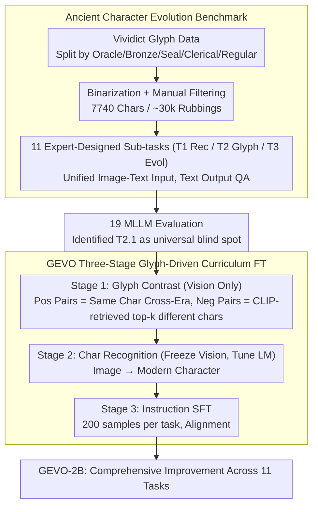

# Enhancing Multimodal Large Language Models for Ancient Chinese Character Evolution Analysis via Glyph-Driven Fine-Tuning

**Conference**: ACL 2026  
**arXiv**: [2604.11299](https://arxiv.org/abs/2604.11299)  
**Code**: [https://github.com/songruiecho/GEVO](https://github.com/songruiecho/GEVO)  
**Area**: Multimodal VLM / Digital Humanities  
**Keywords**: Ancient Chinese Character Evolution, MLLMs, Glyph Contrastive Fine-Tuning, Oracle Bone Script, Curriculum Learning

## TL;DR
This paper constructs a benchmark for ancient Chinese character evolution analysis containing 11 tasks and over 130,000 instances. After evaluating 19 MLLMs, it is observed that existing models have limited capabilities in glyph-level recognition and evolutionary reasoning. Consequently, the authors propose GEVO, a glyph-driven contrastive fine-tuning framework, achieving full-task improvements on a 2B model.

## Background & Motivation

**Background**: With the rapid development of MLLMs, an increasing number of studies have begun to leverage them for analyzing ancient scripts (e.g., Oracle Bone Script, Bronze Script), showing potential from character recognition to cultural relic interpretation. The analysis of ancient character evolution (from Oracle Bone Script to Regular Script) is a foundational path for understanding cultural shifts and historical inheritance.

**Limitations of Prior Work**: (1) There is a lack of systematic benchmarks to evaluate the capabilities of MLLMs in ancient character evolution analysis; (2) existing MLLMs perform poorly in cross-era recognition of font styles and ancient script recognition; (3) although some studies explore ancient scripts, how to systematically enhance MLLM capabilities in evolution analysis tasks remains an open problem.

**Key Challenge**: Ancient character evolution involves subtle glyph differences and cross-era structural changes. Existing MLLMs are primarily trained on modern data and lack an understanding of ancient glyph features. However, the observation that minor fine-tuning can significantly improve era attribution capabilities suggests that MLLMs have potential but require targeted guidance.

**Goal**: (1) Construct a comprehensive benchmark for ancient Chinese character evolution analysis; (2) systematically evaluate the capability boundaries of existing MLLMs; (3) propose an effective fine-tuning method to enhance evolution analysis capabilities.

**Key Insight**: It is observed that MLLMs can significantly improve era attribution capabilities after minor fine-tuning. This inspires the design of a glyph-contrastive fine-tuning method, enabling the model to learn to distinguish subtle differences in glyph changes caused by eras versus character identity.

**Core Idea**: Utilizing curriculum learning principles, positive and negative glyph pairs are constructed to guide the model in capturing glyph transformation patterns within evolutionary consistency through contrastive learning.

## Method

### Overall Architecture
The work of GEVO consists of two parts: first, constructing an evaluation benchmark covering the complete evolution chain; second, training a 2B small model to lead in all tasks using a three-stage glyph-driven fine-tuning approach. On the benchmark side, rubbings are extracted from the glyph resource *Vividict* across five stages: Oracle Bone $\to$ Bronze $\to$ Seal $\to$ Clerical $\to$ Regular scripts. After binarization and manual filtering, 7,740 characters and nearly 30,000 rubbing images are obtained. Ancient script experts then abstracted the evaluation into three categories with a total of 11 sub-tasks (T1 Basic Recognition / T2 Glyph Understanding / T3 Evolution Analysis), unified into a QA format with image-text input and text output. After evaluating 19 MLLMs on this benchmark, the authors found that character-level recognition (T2.1) is a common blind spot for almost all models. Thus, a three-stage fine-tuning based on curriculum learning was designed: first, using glyph contrast to tune only the vision module; second, tuning the language model to restore image-to-modern-character recognition; and finally, performing lightweight SFT with task instructions.

### Key Designs

**1. Ancient Character Evolution Benchmark: Upgrading scattered Oracle Bone studies into an 11-task evaluation covering the full evolution chain + 19-model capability map**

Most existing ancient script benchmarks focus on a single stage like Oracle Bone Script or single tasks, failing to measure which specific capabilities MLLMs lack in "evolution analysis." This paper segments Chinese characters into five stages (Oracle Bone, Bronze, Seal, Clerical, Regular) according to glyph development, collecting 7,740 characters with complete evolutionary records and nearly 30,000 rubbing images. Assisted by domain experts, three categories comprising 11 sub-tasks were designed: T1 Basic Recognition (font style recognition, era judgment), T2 Glyph Understanding (image-level character recognition, structural analysis), and T3 Evolution Analysis (cross-era comparison, evolution path reasoning). All are unified as image-text input and text output QAs (split 9:1 for training/testing), with candidate instructions generated by ChatGPT and verified by experts and multiple MLLMs.

The value of this multi-dimensional slicing lies in distributing the evaluation across 11 granular levels—testing visual understanding, knowledge reasoning, or cross-era association. A single accuracy metric cannot clarify whether a model "cannot see the character clearly" or "cannot reason the evolution." Consequently, the evaluation of 19 MLLMs (1B–72B, including closed-source models like GPT-4o-mini, Gemini-1.5-Flash) yields fine-grained conclusions: character-level recognition (T2.1) is a universal blind spot, and open-source models often outperform closed-source counterparts (the latter often refuse to answer non-standard tasks), precisely pinpointing weaknesses and directing fine-tuning efforts.

**2. GEVO Three-Stage Glyph-Driven Curriculum Fine-Tuning: Aligning glyphs first, then recognition, then instructions**

Glyph differences in ancient character evolution often occur at the stroke level. Directly performing recognition SFT causes models to easily learn surface textures or even suffer catastrophic forgetting of existing recognition capabilities when samples are insufficient (in preliminary experiments, naive SFT with 200 samples/task gained 30% on average but dropped performance on T2.1 and T3.1). GEVO breaks this by splitting fine-tuning into three stages from easy to difficult following curriculum learning:

- **Stage 1 · Glyph Contrast (Vision Only)**: Rubbings of the same character from different eras are treated as the positive sample set $\mathcal{P}$. CLIP is used to retrieve top-$k$ rubbings that are visually most similar but belong to **different characters** as the negative sample set $\mathcal{N}$ (e.g., certain writings of "sun" and "eye" are extremely similar and must be pushed apart). Only the vision encoder and cross-modal projection modules are updated to make representations "glyph-sensitive and semantic-consistent."
- **Stage 2 · Character Recognition (Freeze Vision, Tune LM)**: Given a glyph image from any era, the model predicts the corresponding modern Chinese character, specifically restoring the image-to-text mapping and recognition capabilities not addressed in Stage 1.
- **Stage 3 · Instruction SFT**: The language model is lightly fine-tuned using only 200 instruction data points per task to align the glyph and recognition capabilities acquired in the previous stages with the output formats of the 11 evaluation tasks.

Ablations confirm that each sequence is indispensable: skipping to Stage 1 (no recognition) causes T2.1/T3.1 to collapse below 10%, while skipping Stage 1 (no glyph contrast) leads to a total failure in glyph comparison tasks. Only the three stages combined allow GEVO to balance glyph discrimination and character recognition, achieving improvements across all 11 tasks with an average score of 83.54.

### Loss & Training
The contrastive loss for Stage 1 is shown in Equation (1): $\mathcal{L}_{con}=-\frac{1}{|\mathcal{P}|}\sum_{I_i\in\mathcal{P}}\log\frac{\mathcal{S}_i^+}{\mathcal{S}_i^++\mathcal{S}_i^-}$, where the positive term $\mathcal{S}_i^+$ aggregates cosine similarities of positive pairs (same character) and the negative term $\mathcal{S}_i^-$ aggregates CLIP-retrieved negative samples (different characters), scaled by temperature $\tau$. Stages 2 and 3 use standard cross-entropy for character recognition and instruction SFT, respectively. The curriculum learning is reflected in the progression from easy (glyph contrast) to difficult (task instructions) across three stages, rather than ordering individual sample batches. Fine-tuning was conducted on a 2B scale (Qwen2-VL-2B).

## Key Experimental Results

### Main Results (Evaluation of 19 MLLMs)

| Model | Avg Score | Style Rec (T1) | Char Rec (T2) | Evol Analysis (T3) |
|-------|-----------|----------------|---------------|-------------------|
| GPT-4o-mini | 24.88 | Low | Extremely Low (0.07) | Low |
| Gemini-1.5-Flash | 27.89 | Low | Extremely Low | Low |
| Qwen2.5-VL-7B | **47.65** | Medium | 23.51 | Medium |
| Qwen2.5-VL-72B | 46.30+ | Medium | 24.45 | Medium |
| GEVO-2B (Ours) | Overall Gain | Significant Gain | Significant Gain | Significant Gain |

### Ablation Study

| Configuration | Effect | Description |
|---------------|--------|-------------|
| GEVO Full | Improvement in all 11 tasks | Contrastive + Curriculum Learning |
| w/o Curriculum Learning | Reduced gains in some tasks | Simple-to-hard order is beneficial |
| w/o Contrastive Learning | Limited improvement | Recognition training alone is insufficient |
| Recognition-only FT | Era attribution improved but reasoning weak | Validates necessity of contrastive learning |

### Key Findings
- All existing MLLMs (including GPT-4o-mini) perform poorly in ancient character evolution analysis, with average scores not exceeding 50.
- Character-level recognition (T2.1) is the biggest bottleneck for all models—nearly all approach 0%.
- Unexpected discovery: Minor fine-tuning can significantly improve era attribution capabilities, but reasoning tasks require contrastive learning support.
- GEVO achieves consistent improvements across all 11 tasks on a 2B model.
- Open-source 7B models (e.g., Qwen2.5-VL-7B) actually outperform closed-source large models, possibly because the safety constraints of the latter affect non-standard tasks.

## Highlights & Insights
- **Cultural Value of the Benchmark**: An AI evaluation benchmark covering the full evolution chain from Oracle Bone Script to Regular Script is itself a major contribution to digital humanities, promoting the development of computational paleography.
- **Capturing Evolutionary Consistency via Contrastive Learning**: Using variants of the same character across different eras as positive pairs to learn evolutionary patterns is an approach that can be generalized to any visual task requiring cross-time/style understanding.
- **Potential of Small Models**: A 2B model can improve across all tasks after targeted fine-tuning, suggesting that the injection of domain knowledge is more important than model size.

## Limitations & Future Work
- The dataset only covers approximately 7,740 characters with evolutionary records; many characters have incomplete evolutionary paths.
- The absolute performance of the 2B model remains limited and needs validation on larger models.
- The benchmark is primarily based on rubbing images (not actual photographs of artifacts), which may differ from real-world ancient script recognition scenarios.
- The use of evolutionary knowledge to assist in deciphering undeciphered characters has not yet been explored.

## Related Work & Insights
- **vs TongGu-VL**: A VLM specifically designed for ancient scripts, but only at a 2B scale with weak evolution analysis capabilities. GEVO is more effective through its fine-tuning strategy.
- **vs Traditional Ancient Script OCR**: Specialized recognition models based on CNNs lack reasoning and association capabilities. MLLMs possess this potential but require guidance.
- **vs General VLM Fine-tuning**: Standard SFT can improve recognition but is insufficient to support evolutionary reasoning. Contrastive learning provides additional structural learning signals.

## Rating
- Novelty: ⭐⭐⭐⭐ The first systematic MLLM benchmark for ancient character evolution; the glyph-contrastive fine-tuning approach is novel.
- Experimental Thoroughness: ⭐⭐⭐⭐⭐ Comprehensive evaluation of 19 models, 11 sub-tasks, and sufficient ablations.
- Writing Quality: ⭐⭐⭐⭐ Benchmark construction process is clear, and evaluation results are analyzed in depth.
- Value: ⭐⭐⭐⭐ Unique contribution to digital humanities and ancient script research.

<!-- RELATED:START -->

## Related Papers

- [\[CVPR 2026\] DiG: Differential Grounding for Enhancing Fine-Grained Perception in Multimodal Large Language Models](../../CVPR2026/multimodal_vlm/dig_differential_grounding_for_enhancing_fine-grained_perception_in_multimodal_l.md)
- [\[ACL 2026\] CharTide: Data-Centric Chart-to-Code Generation via Tri-Perspective Tuning and Inquiry-Driven Evolution](chartide_data-centric_chart-to-code_generation_via_tri-perspective_tuning_and_in.md)
- [\[CVPR 2026\] DEVA: Fine-tuning Multimodal Large Language Models for Visual Perception Tasks](../../CVPR2026/multimodal_vlm/deva_fine-tuning_multimodal_large_language_models_for_visual_perception_tasks.md)
- [\[CVPR 2026\] CoVFT: Context-aware Visual Fine-tuning for Multimodal Large Language Models](../../CVPR2026/multimodal_vlm/covft_context-aware_visual_fine-tuning_for_multimodal_large_language_models.md)
- [\[CVPR 2026\] Language-driven Fine-grained Retrieval](../../CVPR2026/multimodal_vlm/language-driven_fine-grained_retrieval.md)

<!-- RELATED:END -->
