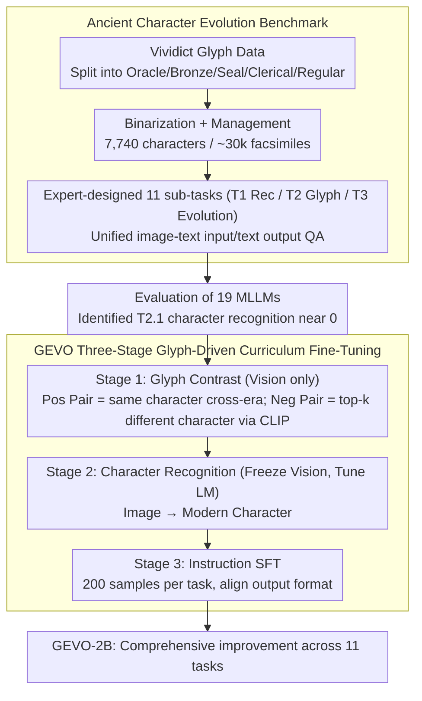

# Enhancing Multimodal Large Language Models for Ancient Chinese Character Evolution Analysis via Glyph-Driven Fine-Tuning

**Conference**: ACL 2026  
**arXiv**: [2604.11299](https://arxiv.org/abs/2604.11299)  
**Code**: [https://github.com/songruiecho/GEVO](https://github.com/songruiecho/GEVO)  
**Area**: Multimodal VLM / Digital Humanities  
**Keywords**: Ancient Chinese Evolution, Multimodal Large Language Models, Glyph-Driven Contrastive Fine-Tuning, Oracle Bone Inscriptions, Curriculum Learning

## TL;DR
This paper constructs a benchmark for ancient Chinese character evolution analysis containing 11 tasks and over 130,000 instances. After evaluating 19 MLLMs, it was found that existing models have limited capabilities in glyph-level recognition and evolutionary reasoning. The authors propose GEVO, a glyph-driven contrastive fine-tuning framework, achieving comprehensive improvements across all tasks on a 2B model.

## Background & Motivation

**Background**: With the rapid development of MLLMs, increasing research has begun to utilize them for analyzing ancient scripts (e.g., Oracle Bone and Bronze inscriptions), demonstrating potential in character recognition and cultural artifact interpretation. The analysis of ancient character evolution (from Oracle Bone to Regular script) is a fundamental path for understanding cultural changes and historical transitions.

**Limitations of Prior Work**: (1) There is a lack of systematic benchmarks for evaluating MLLM capabilities in ancient character evolution analysis; (2) existing MLLMs perform poorly in cross-era font style identification and ancient script recognition; (3) although some studies explore ancient scripts, how to systematically enhance MLLM capabilities in evolution analysis tasks remains an open problem.

**Key Challenge**: Ancient character evolution involves subtle glyph differences and cross-era structural changes. Existing MLLMs are primarily trained on modern data and lack an understanding of ancient glyph features. However, the fact that a small amount of fine-tuning can significantly improve era attribution capability suggests that MLLMs have potential but require targeted guidance.

**Goal**: (1) Construct a comprehensive benchmark for ancient Chinese character evolution analysis; (2) systematically evaluate the capability boundaries of existing MLLMs; (3) propose an effective fine-tuning method to improve evolution analysis capabilities.

**Key Insight**: It was observed that MLLMs can significantly improve era attribution after minimal fine-tuning, which inspired the design of a glyph-based contrastive fine-tuning method—enabling the model to learn to distinguish subtle differences in glyph variations caused by era and character identity.

**Core Idea**: Utilizing the concept of curriculum learning, positive and negative glyph pairs are constructed to guide the model in capturing glyph transformation patterns within evolutionary consistency through contrastive learning.

## Method

### Overall Architecture
The workflow of GEVO consists of two parts: first building an evaluation benchmark covering the full evolution chain, and then using a three-stage glyph-driven fine-tuning process to train a small 2B model to lead in all tasks. On the benchmark side, facsimiles were extracted from the glyph resource Vividict across five stages (Oracle Bone $\to$ Bronze $\to$ Seal $\to$ Clerical $\to$ Regular). After binarization and manual filtering, nearly 30,000 facsimile images of 7,740 characters were obtained. Ancient script experts then abstracted the evaluation into three categories with 11 sub-tasks (T1 Basic Recognition / T2 Glyph Understanding / T3 Evolution Analysis), unified as QA with image-text input and text output. After evaluating 19 MLLMs on this benchmark, the authors found that character-level recognition (T2.1) is a common blind spot for almost all models. Consequently, a three-stage fine-tuning process was designed following curriculum learning: first, glyph contrastive learning is used to tune only the vision module; second, the language model is tuned to restore image-to-modern-character recognition; finally, task instructions are used for lightweight SFT.

### Key Designs

**1. Ancient Chinese Character Evolution Benchmark: Upgrading fragmented Oracle Bone research into an 11-task evaluation covering the full evolution chain + a map of 19 model capabilities.**

Existing ancient script benchmarks mostly focus only on the Oracle Bone stage or single tasks, failing to measure which specific capabilities MLLMs lack in "evolution analysis." This paper divides characters into five stages (Oracle Bone, Bronze, Seal, Clerical, and Regular) based on glyph development, collecting nearly 30,000 facsimile images for ,7740 characters with complete evolution records. With expert assistance, 11 sub-tasks in three categories were designed: T1 Basic Recognition (font style identification, era judgment), T2 Glyph Understanding (image-level character recognition, structural analysis), and T3 Evolution Analysis (cross-era comparison, evolution path reasoning). All are unified into QA formats with mixed image-text input and text output (split 9:1 for train/test). ChatGPT was used to generate candidate instructions, which were then validated by experts and multiple MLLMs to ensure effectiveness.

The value of this multi-dimensional segmentation lies in spreading the evaluation across 11 levels of granularity—testing visual understanding, knowledge reasoning, and cross-era correlation. A single accuracy metric cannot distinguish whether a model "cannot see the character" or "cannot deduce the evolution." Consequently, the evaluation of 19 MLLMs (ranging from 1B to 72B, including closed-source models like GPT-5-mini and Gemini-3-Flash) led to fine-grained conclusions: character-level recognition (T2.1) is a common blind spot for almost all models, and open-source models often outperform closed-source counterparts (which often refuse to answer non-standard tasks). This accurately located the weaknesses of each model and pointed the way for fine-tuning.

**2. GEVO Three-Stage Glyph-Driven Curriculum Fine-Tuning: Aligning glyphs first, then supplementing recognition, finally following instructions.**

Glyph differences in ancient character evolution often occur at the stroke level. Directly performing recognition SFT can cause the model to learn surface textures or even suffer catastrophic forgetting of existing recognition capabilities when samples are insufficient (in preliminary experiments, naive SFT with 200 samples/task improved by 30% on average but dropped performance in T2.1 and T3.1). GEVO breaks this by splitting fine-tuning into three stages of increasing difficulty based on curriculum learning:

- **Stage 1 · Glyph Contrastive Learning (Vision-only tuning)**: Facsimiles of the same character from different eras are treated as the positive sample set $\mathcal{P}$. CLIP retrieval is used to find the top-$k$ facsimiles that are visually most similar but belong to **different characters** as the negative sample set $\mathcal{N}$ (e.g., certain writings of "sun" and "eye" are extremely similar and must be pushed apart). Only the vision encoder and cross-modal projection modules are updated to make representations "glyph-sensitive and semantically consistent."
- **Stage 2 · Character Recognition (Freeze vision, tune language model)**: Given a glyph image from any era, the model is tasked with predicting the corresponding modern character, specifically restoring the image-text mapping and recognition capabilities not touched in Stage 1.
- **Stage 3 · Instruction SFT**: The language model is lightly fine-tuned using task instruction data (only 200 items per task) to align the glyph and recognition capabilities learned in previous stages with the output formats of the 11 evaluation tasks.

Ablations confirmed that this sequence is indispensable: performing only Stage 1 (skipping recognition) causes performance on T2.1/T3.1 to collapse to below 10%, while performing only Stage 2 (removing glyph contrast) results in a total failure in glyph comparison tasks. Only the three-stage combination allows GEVO to achieve a balance between glyph discrimination and character recognition, resulting in improvements across all 11 tasks with an average score of 83.54.

### Loss & Training
The contrastive loss for Stage 1 is shown in Equation (1): $\mathcal{L}_{con}=-\frac{1}{|\mathcal{P}|}\sum_{I_i\in\mathcal{P}}\log\frac{\mathcal{S}_i^+}{\mathcal{S}_i^++\mathcal{S}_i^-}$, where the positive term $\mathcal{S}_i^+$ aggregates the cosine similarity of same-character positive pairs, and the negative term $\mathcal{S}_i^-$ aggregates different-character negative samples retrieved by CLIP, scaled by temperature $\tau$. Stages 2 and 3 use standard cross-entropy for character recognition and instruction SFT, respectively. Curriculum learning here is reflected in the progression from easy (glyph contrast) to difficult (task instructions) across three stages, rather than ordering individual sample batches. Fine-tuning was conducted entirely on a 2B scale (Qwen3-VL-2B).

## Key Experimental Results

### Main Results (19 MLLM Evaluations)

| Model | Avg. Score | Font Recognition (T1) | Character Recognition (T2) | Evolution Analysis (T3) |
| :--- | :--- | :--- | :--- | :--- |
| GPT-5-mini | 24.88 | Low | Extremely Low (0.07) | Low |
| Gemini-3-Flash | 27.89 | Low | Extremely Low | Low |
| Qwen2.5-VL-7B | **47.65** | Medium | 23.51 | Medium |
| Qwen2.5-VL-72B | 46.30+ | Medium | 24.45 | Medium |
| GEVO-2B | Overall Gain | Significant Gain | Significant Gain | Significant Gain |

### Ablation Study

| Configuration | Effect | Description |
| :--- | :--- | :--- |
| GEVO Full | Improvement across 11 tasks | Contrastive + Curriculum Learning |
| w/o Curriculum | Some improvements weakened | Sequence from easy to hard is beneficial |
| w/o Contrastive | Limited improvement | Recognition training alone is insufficient |
| Recognition Only | Era attribution gain but weak reasoning | Validates necessity of contrastive learning |

### Key Findings
- All existing MLLMs (including GPT-5-mini) perform poorly in ancient character evolution analysis, with average scores not exceeding 50.
- Character-level recognition (T2.1) is the biggest bottleneck for all models—almost all are near 0%.
- Unexpected finding: A small amount of fine-tuning can significantly improve era attribution, but reasoning tasks require the support of contrastive learning.
- GEVO achieved consistent improvements across all 11 tasks on a 2B model.
- Open-source 7B models (e.g., Qwen2.5-VL-7B) actually outperformed closed-source large models, possibly because the safety restrictions of the latter affect non-standard tasks.

## Highlights & Insights
- **Cultural Value of the Benchmark**: An AI evaluation benchmark covering the full evolution chain from Oracle Bone to Regular script is a significant digital humanities contribution that can drive the development of computational paleography.
- **Capturing Evolutionary Consistency through Contrastive Learning**: Using variants of the same character from different eras as positive pairs to learn evolutionary patterns is an idea that can be generalized to any visual task requiring cross-temporal or cross-style understanding.
- **Potential of Small Models**: A 2B model can significantly improve across all tasks after targeted fine-tuning, indicating that the injection of domain knowledge is more important than model size alone.

## Limitations & Future Work
- The dataset only covers approximately 7,740 characters with evolution records; the evolutionary paths for many characters remain incomplete.
- The absolute performance of the 2B model is still limited and needs to be validated on larger models.
- The benchmark is primarily based on facsimile images (not actual photos of artifacts), which may differ from real-world ancient script recognition scenarios.
- The use of evolutionary knowledge to assist in deciphering undeciphered characters has not yet been explored.

## Related Work & Insights
- **vs TongGu-VL**: A VLM specifically designed for ancient characters, but limited to a 2B scale with weak evolution analysis capabilities. GEVO is more effective through its fine-tuning strategy.
- **vs Traditional Ancient Script OCR**: Specialized recognition models based on CNNs lack reasoning and association capabilities. MLLMs possess this potential but require guidance.
- **vs General VLM Fine-tuning**: Standard SFT can improve recognition but is insufficient for supporting evolutionary reasoning. Contrastive learning provides additional structural learning signals.

## Rating
- Novelty: ⭐⭐⭐⭐ First systematic MLLM benchmark for ancient character evolution; glyph contrastive fine-tuning approach is novel.
- Experimental Thoroughness: ⭐⭐⭐⭐⭐ Comprehensive evaluation of 19 models, 11 sub-tasks, and thorough ablations.
- Writing Quality: ⭐⭐⭐⭐ Clear benchmark construction process and in-depth analysis of evaluation results.
- Value: ⭐⭐⭐⭐ Unique contribution to digital humanities and ancient script research.

<!-- RELATED:START -->

## Related Papers

- [\[CVPR 2026\] CoVFT: Context-aware Visual Fine-tuning for Multimodal Large Language Models](../../CVPR2026/multimodal_vlm/covft_context-aware_visual_fine-tuning_for_multimodal_large_language_models.md)
- [\[CVPR 2026\] DiG: Differential Grounding for Enhancing Fine-Grained Perception in Multimodal Large Language Models](../../CVPR2026/multimodal_vlm/dig_differential_grounding_for_enhancing_fine-grained_perception_in_multimodal_l.md)
- [\[ACL 2026\] DRIFT: Transferring Reasoning Priors for Efficient MLLM Fine-Tuning](drift_transferring_reasoning_priors_for_efficient_mllm_fine-tuning.md)
- [\[ACL 2026\] CArtBench: Evaluating Vision-Language Models on Chinese Art Understanding, Interpretation, and Authenticity](cartbench_evaluating_vision-language_models_on_chinese_art_understanding_interpr.md)
- [\[ACL 2025\] Error-driven Data-efficient Large Multimodal Model Tuning](../../ACL2025/multimodal_vlm/error-driven_data-efficient_large_multimodal_model_tuning.md)

<!-- RELATED:END -->
