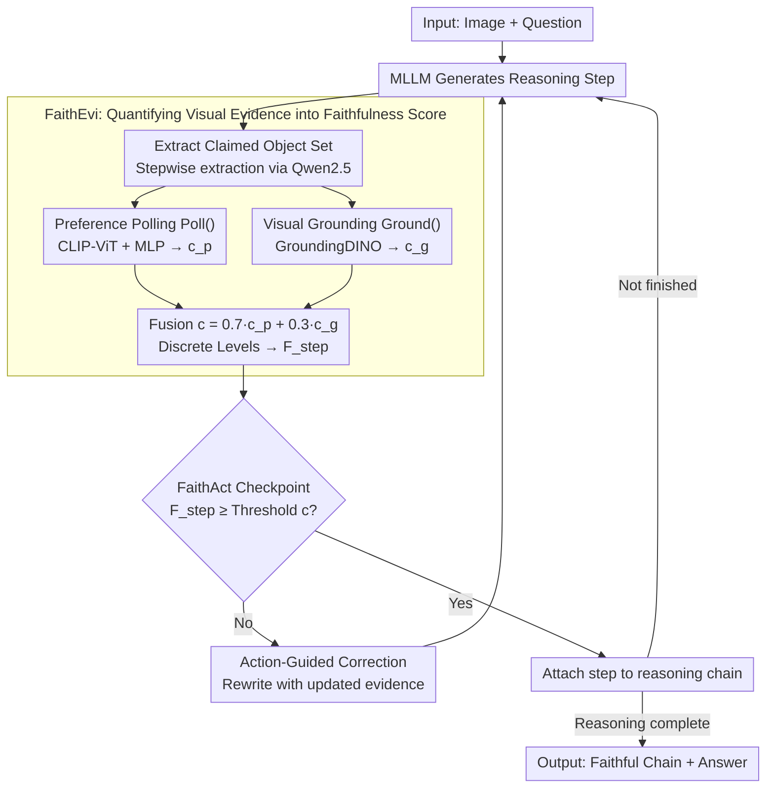

# Faithful-First Reasoning, Planning, and Acting for Multimodal LLMs

**Conference**: ACL 2026 Findings  
**arXiv**: [2511.08409](https://arxiv.org/abs/2511.08409)  
**Code**: [GitHub](https://github.com/lijunxian111/Faithful-First-RPA)  
**Area**: Multimodal VLM / Reasoning Faithfulness  
**Keywords**: Perceptual Faithfulness, Reasoning Planning and Execution, Multimodal Hallucination, Visual Evidence Verification, Step-by-step Reasoning

## TL;DR

This paper proposes the Faithful-First RPA framework, which evaluates perceptual faithfulness (whether claimed objects truly exist in the image) at each reasoning step via the FaithEvi pipeline. The FaithAct mechanism enforces evidence-based planning and action during the reasoning generation process, improving perceptual faithfulness by up to 24% without compromising task accuracy.

## Background & Motivation

**Background**: Multimodal Large Language Models (MLLMs) have achieved significant progress in tasks such as VQA and visual reasoning. However, their reasoning trajectories often exhibit "unfaithfulness"—where generated explanations do not match visual evidence or post-hoc rationalizations occur.

**Limitations of Prior Work**: (1) Existing works focus primarily on behavioral faithfulness (whether the reasoning chain reflects the decision process), ignoring perceptual faithfulness (whether reasoning steps are grounded in verifiable visual input). (2) Reasoning frameworks like CoT and ReAct do not verify the perceptual foundation of intermediate steps. (3) Models may depend on incorrect visual descriptions (e.g., describing a black bicycle as yellow) even when the final answer is correct.

**Key Challenge**: Current reasoning frameworks adopt a "generate-then-verify" paradigm, where perceptual errors are only discovered after the entire reasoning chain is generated, making correction costly and limited in effectiveness. Faithfulness should be a design principle rather than a post-hoc evaluation metric.

**Goal**: Establish a unified framework that can both quantitatively evaluate the perceptual faithfulness of reasoning chains and actively enforce evidence verification during the reasoning process.

**Key Insight**: Based on the principle that "a perceptually faithful model only reasons about visually observable content," the reasoning process is formalized as a faithfulness-constrained planning problem.

**Core Idea**: At each step of reasoning, claimed objects are extracted, their existence is verified via preference polling and visual grounding, and a faithfulness score is calculated. Steps that do not meet a threshold must be corrected before being added to the reasoning chain.

## Method

### Overall Architecture

Faithful-First RPA aims to solve the problem of steps in MLLM reasoning chains that "seem plausible but lack visual evidence." Unlike CoT/ReAct, which check the entire chain after completion, this method integrates verification into the generation loop. After inputting an image and a question, for each step generated by the MLLM, FaithEvi first evaluates whether the claimed objects are actually in the image and provides a faithfulness score. If the score is substandard, FaithAct returns the step along with updated evidence to the MLLM for rewriting. Only when the score is sufficient is the step added to the reasoning chain.

### Key Designs

**1. FaithEvi: Quantifying Perceptual Evidence into a Comparable Score**

The root of unfaithful reasoning chains is the lack of step-by-step verification of whether "claimed objects are actually in the image." FaithEvi calculates this in three stages. First, Qwen2.5-7B-Instruct extracts the set of objects $O_t = \{O_t^1, \dots, O_t^{m_t}\}$ claimed to exist in each reasoning step. Second, dual independent verification is performed for each object: one path uses a frozen CLIP-ViT-Large to encode the image and object text, passing it through a two-layer MLP trained on POPE to predict existence probability $c_p$ (preference polling); the other path uses a frozen GroundingDINO to locate the object in the image and obtain detection confidence $c_g$. Third, the two paths are fused into $c_t^i = 0.7 \cdot c_p + 0.3 \cdot c_g$ and compressed into a three-level discrete score ($<0.4\to0$, $0.4\text{-}0.6\to c_t^i$, $>0.6\to1$). These are aggregated into a step-level score $F_{\text{step},t} = \frac{1}{m_t}\sum f_t^i$ and a chain-level score $F_{\text{chain}} = \frac{1}{n}\sum F_{\text{step},t}$. Both paths are used because detector confidence is unreliable under weak visual cues; polling provides global existence judgment while grounding provides region-level spatial evidence.

**2. FaithAct: Reformulating Reasoning as Planning with Faithfulness Constraints**

FaithEvi alone is insufficient; FaithAct uses the score to intercept faulty steps. FaithAct formalizes the reasoning process as a constrained planning objective:

$$S^* = \arg\max F_{\text{step}}(s_t) \quad \text{s.t.} \quad \forall t,\; F_{\text{step}}(s_t) \geq c,$$

Each generated step is immediately sent to FaithEvi for verification. Steps below threshold $c$ are returned to the MLLM for regeneration along with updated evidence (existence labels, bounding boxes, counts). To support this loop, it exposes an extensible set of function interfaces: `Poll()` for existence probability, `Ground()` for bounding box detection, `Select()` to confirm existence, `Abstain()` to confirm absence, and `Count()` for counting reasoning. This differs from "verify-after-generation" by moving the correction point to each step, stopping perceptual errors before they propagate.

**3. Action-Guided Reasoning Correction: Rewriting Instead of Discarding**

How to handle an intercepted step is crucial—simply deleting it would break the logical coherence of the chain. The approach here is to feed the failed step back into the model along with updated visual evidence, using a correction prompt to guide the model to modify only the perceptual description while maintaining logical continuity. This correction is particularly beneficial in the later stages of the reasoning chain, aligning with observations that longer CoT is more likely to be misled by noise in later steps.

### Loss & Training

This is an inference-time framework and does not involve model training. The preference polling head is trained on the POPE dataset (two-layer MLP), while GroundingDINO and CLIP are used frozen. GroundingDINO uses box threshold=0.35 and text threshold=0.25.

## Key Experimental Results

### Main Results

**Perceptual Faithfulness Evaluation ($F_{\text{chain}}$, %)**

| Model + Method | LLaVA-bench | RealWorldQA | POPE | MMHal | Average |
|------------|-------------|-------------|------|-------|------|
| Qwen + CoT | 46.05 | 48.11 | 45.21 | 53.34 | 48.18 |
| Qwen + ReAct | 54.82 | 56.82 | 45.02 | 33.76 | 47.61 |
| **Qwen + FaithAct (Ours)** | **55.10** | **57.22** | **56.87** | **66.45** | **58.91** |
| InternVL + CoT | 45.63 | 44.23 | 43.25 | 53.17 | 46.57 |
| **InternVL + FaithAct (Ours)** | **52.64** | **57.35** | **56.01** | **61.71** | **56.93** |
| LLaVA + CoT | 47.56 | 52.31 | 52.28 | 30.63 | 45.70 |
| **LLaVA + FaithAct (Ours)** | **52.82** | **58.11** | **56.09** | **39.91** | **51.73** |

**Task Accuracy Maintenance**

| Model | Method | RealWorldQA(%) | MMHal(rating) |
|------|------|---------------|---------------|
| Qwen | CoT | 70.1 | 3.40 |
| Qwen | FaithAct | **74.5** | **3.48** |
| InternVL | CoT | 70.8 | 3.61 |
| InternVL | FaithAct | 71.2 | 3.58 |

### Ablation Study

**Core Component Ablation (Qwen, RealWorldQA / MMHal)**

| Configuration | RealWorldQA(%) | MMHal(%) |
|------|---------------|----------|
| FaithAct (Full) | 57.22 | 66.45 |
| w/o Poll() | 54.24 (-3.0) | 63.25 (-3.2) |
| w/o Ground() | 53.16 (-4.1) | 62.47 (-4.0) |

### Key Findings

- FaithAct achieves an average perceptual faithfulness of 55.86%, a 7.76 percentage point improvement over the strongest baseline ReAct (48.10%).
- The largest improvement occurs on the hallucination-sensitive benchmark MMHal: an average increase of 21.99% over CoT and 9.81% over tool-augmented methods.
- Faithfulness improvements do not hurt task accuracy—Qwen's accuracy on RealWorldQA even increased from 70.1% to 74.5%.
- The contribution of Ground() is slightly larger than Poll(), indicating that spatial localization provides more critical visual evidence.
- Replacing GroundingDINO with SAM3 led to a performance drop of ~5%, suggesting the framework requires a localization-specialized model.
- FaithAct gains are more significant in later steps of the reasoning chain, validating the hypothesis that later steps are more prone to hallucination.
- Manual verification of LLM object extraction precision reached 99.42% (across 7,550 object-level labels), with a fragment validity of 0.968.
- Inference time increases by approximately 2-3 times (FaithAct 14-19s vs CoT 3-11s).

## Highlights & Insights

- The philosophy that "faithfulness should be a design principle rather than a post-hoc metric" is compelling—embedding faithfulness constraints into the reasoning loop ensures every step is supported by evidence.
- The distinction between perceptual faithfulness and behavioral faithfulness holds theoretical value—a model can be "correct but for the wrong reasons" (behaviorally faithful but perceptually unfaithful) or "reasoning correctly but answering wrongly" (perceptually faithful but behaviorally unfaithful).
- The extensible function interface design (Poll/Ground/Select/Abstain/Count) allows the framework to easily scale to attribute (color, size) and relationship (spatial, action) verification.

## Limitations & Future Work

- Currently, faithfulness is only verified at the object existence level, excluding attributes (color, size) and relationships (spatial relations, actions).
- Inference time increases by approximately 2-3 times.
- Behavioral faithfulness is not directly evaluated; it is only assumed that perceptual faithfulness promotes behavioral consistency.
- Advantages are less pronounced on benchmarks with weak perceptual requirements (e.g., MathVista).

## Related Work & Insights

- **vs Grounded-CoT (Wu et al., 2025)**: The latter attaches localization info after reasoning; this work verifies in real-time during reasoning—FaithAct outperforms Grounded-CoT in 11/12 settings.
- **vs ReAct (Yao et al., 2022)**: ReAct allows tool calls but does not enforce faithfulness constraints; this work proves that the $F_{\text{chain}}$ of ReAct is theoretically bounded by FaithAct.
- **vs VAT (Liu et al., 2025)**: Visual Abstract Thinking degrades significantly on POPE (21.46%), suggesting that abstraction may exacerbate perceptual decoupling.

## Rating

- Novelty: ⭐⭐⭐⭐ The formal definition of perceptual faithfulness and the "verify-while-generating" paradigm are innovative.
- Experimental Thoroughness: ⭐⭐⭐⭐ Tested across 3 models, 4 benchmarks, with complete ablation and manual verification.
- Writing Quality: ⭐⭐⭐⭐ Clear distinction between perceptual/behavioral faithfulness; rigorous framework design logic.
- Value: ⭐⭐⭐⭐ Provides a practical framework for the trustworthiness of multimodal reasoning; extensible function interfaces.

<!-- RELATED:START -->

## Related Papers

- [\[ACL 2026\] Tree-of-Evidence: Efficient "System 2" Search for Faithful Multimodal Grounding](tree-of-evidence_efficient_34system_234_search_for_faithful_multimodal_grounding.md)
- [\[CVPR 2026\] CodeV: Code with Images for Faithful Visual Reasoning via Tool-Aware Policy Optimization](../../CVPR2026/multimodal_vlm/codev_code_with_images_for_faithful_visual_reasoning_via_tool-aware_policy_optim.md)
- [\[ACL 2026\] ShredBench: Evaluating the Semantic Reasoning Capabilities of Multimodal LLMs in Document Reconstruction](shredbench_evaluating_the_semantic_reasoning_capabilities_of_multimodal_llms_in_.md)
- [\[CVPR 2026\] When Visualizing is the First Step to Reasoning: MIRA, a Benchmark for Visual Chain-of-Thought](../../CVPR2026/multimodal_vlm/when_visualizing_is_the_first_step_to_reasoning_mira_a_benchmark_for_visual_chai.md)
- [\[CVPR 2026\] VisionLeaf: Entropy-Guided Leaf-First Reasoning for Efficient and Accurate Think-with-Image](../../CVPR2026/multimodal_vlm/visionleaf_entropy-guided_leaf-first_reasoning_for_efficient_and_accurate_think-.md)

<!-- RELATED:END -->
