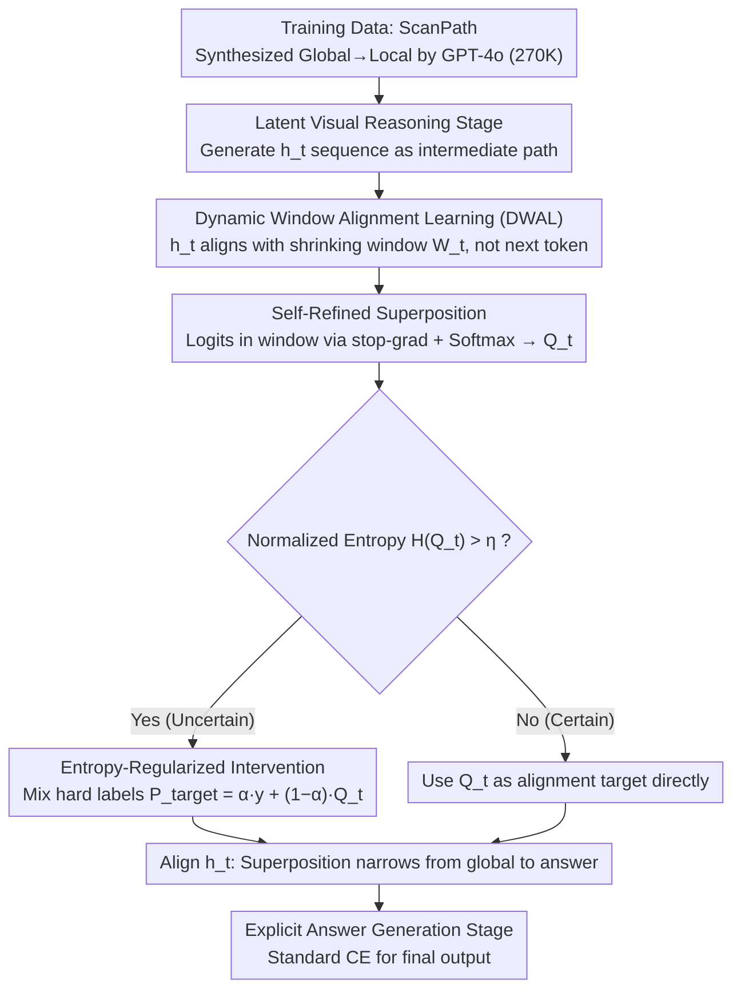

# Forest Before Trees: Latent Superposition for Efficient Visual Reasoning

**Conference**: ACL 2026  
**arXiv**: [2601.06803](https://arxiv.org/abs/2601.06803)  
**Code**: [GitHub](https://github.com/Laser-VLM/Laser)  
**Area**: Interpretability  
**Keywords**: Latent Reasoning, Dynamic Window Alignment, Semantic Superposition, Visual Reasoning, Token Efficiency

## TL;DR

This paper proposes Laser, which performs visual reasoning in latent space via Dynamic Window Alignment Learning (DWAL). It enables the model to maintain a "probabilistic superposition" of future semantics during reasoning rather than precise token-by-token prediction, achieving a "global-to-local" cognitive hierarchy. Laser achieves SOTA among latent reasoning methods on 6 benchmarks with only 6 reasoning tokens (a 97%+ reduction), outperforming Monet by an average of 5.03%.

## Background & Motivation

**Background**: Vision-Language Models (VLMs) have achieved powerful visual understanding by integrating LLMs with vision encoders, with Chain-of-Thought (CoT) introduced for multi-step reasoning. Simultaneously, latent space reasoning methods (e.g., Coconut, SoftCoT, Monet) attempt to reason within high-dimensional hidden states to avoid information loss from explicit tokenization.

**Limitations of Prior Work**: (1) Explicit textual reasoning suffers from an information bandwidth bottleneck—continuous visual details are lost during discrete tokenization. (2) Existing latent reasoning methods still follow standard autoregressive objectives, forcing each hidden state to strictly minimize prediction error for the next token, leading to "premature semantic collapse"—being forced to focus on a single specific token before grasping the global context. (3) This point-to-point mapping is inconsistent with the hierarchical nature of visual perception, which progresses from global semantics to local features.

**Key Challenge**: The strict token-by-token prediction objective fundamentally mismatches the hierarchical nature of visual reasoning—early reasoning stages should maintain openness to global semantics, gradually narrowing down to specific answers.

**Goal**: Design a latent reasoning paradigm that allows reasoning states to encode a "superposition" of global semantics early on and progressively narrow down to local precise information as reasoning proceeds.

**Key Insight**: Inspired by the Global Precedence Hypothesis—human visual perception processes global structures before local details—the reasoning objective is redefined from point-wise prediction to dynamic window alignment.

**Core Idea**: Replace token-by-token prediction with a dynamic semantic window: each hidden state does not need to predict the next token but instead aligns with a dynamic window encompassing all remaining reasoning steps. The window naturally shrinks as reasoning progresses, realizing a gradual transition from global exploration to local precision.

## Method

### Overall Architecture

Laser addresses the issue where prior latent reasoning methods (like Coconut and Monet), despite reasoning in latent space, still apply standard autoregressive objectives that force early hidden states to prematurely collapse into single semantics. Laser's reasoning involves two stages: first, a latent visual reasoning stage where the model generates a sequence of high-dimensional hidden states $h_t$ as an intermediate path, trained with DWAL to align $h_t$ with a dynamic semantic window rather than a single token; second, an explicit answer generation stage where the final answer is produced via standard cross-entropy based on the evolved visual understanding. Training data consists of cognitive ScanPaths (270K samples) synthesized by GPT-4o in a global-to-local sequence.

### Key Designs

**1. Dynamic Window Alignment Learning (DWAL): Replacing "Next-Token Prediction" with "Remaining Semantic Alignment"**

Standard autoregressive objectives force early hidden states to collapse prematurely. DWAL defines a dynamic semantic window $W_t = \{c_k \mid t \leq k \leq T\}$ for reasoning step $t$, encompassing all remaining tokens. The hidden state $h_t$ aligns with the entire window $W_t$. As $t$ increases, the window naturally shrinks ($|W_t| \to 1$), allowing early states to maintain a "superposition" of global semantics for exploration while late states converge to specific answers.

**2. Self-Refined Superposition: Creating Stable Supervision without External Soft Labels**

Dynamic window alignment requires a reference distribution for "what semantics look like in the window." Since external soft labels are unavailable and pure soft targets can lead to high-entropy divergence, Laser extracts logits for tokens within $W_t$. By applying stop-gradient and temperature-scaled Softmax, a reference superposition distribution $Q_t$ is constructed. Stop-gradient prevents divergent loops, using the model's own estimation of future semantics as a soft target.

**3. Entropy-Regularized Intervention: Injecting Hard Labels based on Uncertainty**

Latent spaces risk diverging into meaningless high-entropy distributions. Laser calculates the normalized entropy $H(Q_t)$ of the reference distribution. When $H(Q_t) > \eta$ (high uncertainty), it blends hard labels with the soft distribution:

$$P^{target}_t = \alpha \cdot \mathbf{y}_{hard} + (1-\alpha) \cdot Q_t,$$

otherwise, it uses $Q_t$ directly. This creates an implicit curriculum: forcing alignment to correct tokens when the model is uncertain, but allowing free exploration of superpositions when certain.

### Loss & Training

The total loss is $\mathcal{L}_{Total} = \mathcal{L}_{DWAL} + \mathcal{L}_{CE}$, where DWAL alignment is applied to the reasoning chain and CE loss is used during answer generation. The base model is Qwen2.5-VL-7B-Instruct, with the vision tower frozen and only LLM parameters optimized. $\eta=0.6$, $\alpha=0.8$.

## Key Experimental Results

### Main Results

| Method | Type | MMVP | BLINK | SEED2+ | MMStar | Hallusion | HRBench | Overall |
|------|------|------|-------|--------|--------|-----------|---------|---------|
| Qwen2.5-VL-7B | Zero-shot | 65.67 | 53.60 | 65.31 | 59.70 | 56.57 | 68.25 | 61.52 |
| Vision-R1 | RL | 72.67 | 52.71 | 68.95 | 62.67 | 63.83 | 75.12 | 65.99 |
| VL-Rethinker | RL | 72.67 | 55.55 | 70.27 | 63.20 | 71.08 | 63.50 | 66.05 |
| Monet | Latent | 68.00 | 50.71 | 65.88 | 60.33 | 56.36 | 68.00 | 61.55 |
| LVR | Latent | 64.00 | 53.60 | 47.39 | 57.93 | 65.19 | 53.62 | 56.96 |
| **Ours (Laser)** | Latent | **72.00** | **56.92** | **70.05** | **60.27** | **67.72** | **72.50** | **66.58** |

### Ablation Study

**Efficiency Comparison (Avg. Reasoning Tokens)**

| Method | BLINK Avg Tokens | HRBench Avg Tokens | Gain (Reduction) |
|------|-----------------|-------------------|---------|
| Qwen2.5-VL-7B | 223.5 | 55.9 | — |
| VL-Rethinker | 207.0 | 143.8 | +157.2% (HRBench) |
| Monet | 118.3 | 86.8 | — |
| LVR | 8.0 | 8.0 | -96.4% |
| **Ours (Laser)** | **6.0** | **5.7** | **-97.3%** |

### Key Findings

- Laser outperforms all latent reasoning baselines by an average of 5.03% and even surpasses compute-intensive RL methods like Vision-R1 and VL-Rethinker.
- It requires only 6 reasoning tokens (97.3% reduction) while improving performance, proving that latent superposition states can encode rich semantics in extremely compact spaces.
- Ablations show that removing DWAL (falling back to token prediction) primarily hurts fine-grained perception, while removing dynamic windows (using fixed windows) hurts complex reasoning.
- Significant improvements on out-of-domain tasks (Web +8.03%, Chart +5.18%) without catastrophic forgetting.
- Latent trajectories decoded via the LM head visualize a multi-hop process: "entity grounding → spatial analysis → semantic inference."

## Highlights & Insights

- The "semantic superposition" concept is elegant—introducing quantum-inspired intuition into visual reasoning to allow states to maintain multiple possibilities before collapsing into an answer.
- 97%+ token reduction with performance gains challenges the assumption that reasoning requires lengthy thought chains.
- The implicit curriculum design is clever—entropy thresholds automatically control the switch between forced alignment and free exploration.

## Limitations & Future Work

- Performance is slightly lower on absolute pixel-level localization tasks (e.g., Object Localization, Jigsaw)—the "global-to-local" strategy naturally favors semantic understanding over precise metrology.
- Dependency on GPT-4o for synthetic data may inherit its biases.
- Validated only on 7B models; performance on larger models is unknown.
- The window shrinking strategy (linear) might be sub-optimal; adaptive shrinking could be more effective.

## Related Work & Insights

- **vs Monet**: Monet reasons in latent space but generates dense sequences (118 tokens); Laser compresses this to 6 tokens via superpositions.
- **vs LVR**: LVR's strict autoregressive reconstruction leads to semantic degradation (-9.62%); Laser avoids this via flexible window alignment.
- **vs Vision-R1/VL-Rethinker**: These methods use RL and long-form reasoning with high computational overhead; Laser is more efficient through latent space reasoning.
- **vs CoT**: Explicit CoT is limited by the information bottleneck of discrete tokens; Laser bypasses this in continuous space.

## Rating

- Novelty: ⭐⭐⭐⭐⭐ The idea of dynamic window alignment and semantic superposition is highly novel.
- Experimental Thoroughness: ⭐⭐⭐⭐⭐ Extensive benchmarks, efficiency analysis, OOD transfer, and interpretability.
- Writing Quality: ⭐⭐⭐⭐⭐ Concepts are clearly explained; the "Forest Before Trees" metaphor is effective.
- Value: ⭐⭐⭐⭐⭐ 97% token reduction + performance gain is highly significant for VLM deployment.

<!-- RELATED:START -->

## Related Papers

- [\[ACL 2025\] Don't Miss the Forest for the Trees: Attentional Vision Calibration for Large Vision Language Models](../../ACL2025/multimodal_vlm/dont_miss_the_forest_for_the_trees_attentional_vision_calibration_for_large_visi.md)
- [\[ACL 2025\] MMSafeAware: Can't See the Forest for the Trees: Benchmarking Multimodal Safety Awareness for Multimodal LLMs](../../ACL2025/multimodal_vlm/cant_see_the_forest_for_the.md)
- [\[CVPR 2026\] Monet: Reasoning in Latent Visual Space Beyond Image and Language](../../CVPR2026/multimodal_vlm/monet_reasoning_in_latent_visual_space_beyond_image_and_language.md)
- [\[ACL 2026\] DRIFT: Transferring Reasoning Priors for Efficient MLLM Fine-Tuning](drift_transferring_reasoning_priors_for_efficient_mllm_fine-tuning.md)
- [\[CVPR 2026\] Reasoning Palette: Modulating Reasoning via Latent Contextualization for Controllable Exploration for (V)LMs](../../CVPR2026/multimodal_vlm/reasoning_palette_modulating_reasoning_via_latent_contextualization_for_controll.md)

<!-- RELATED:END -->
