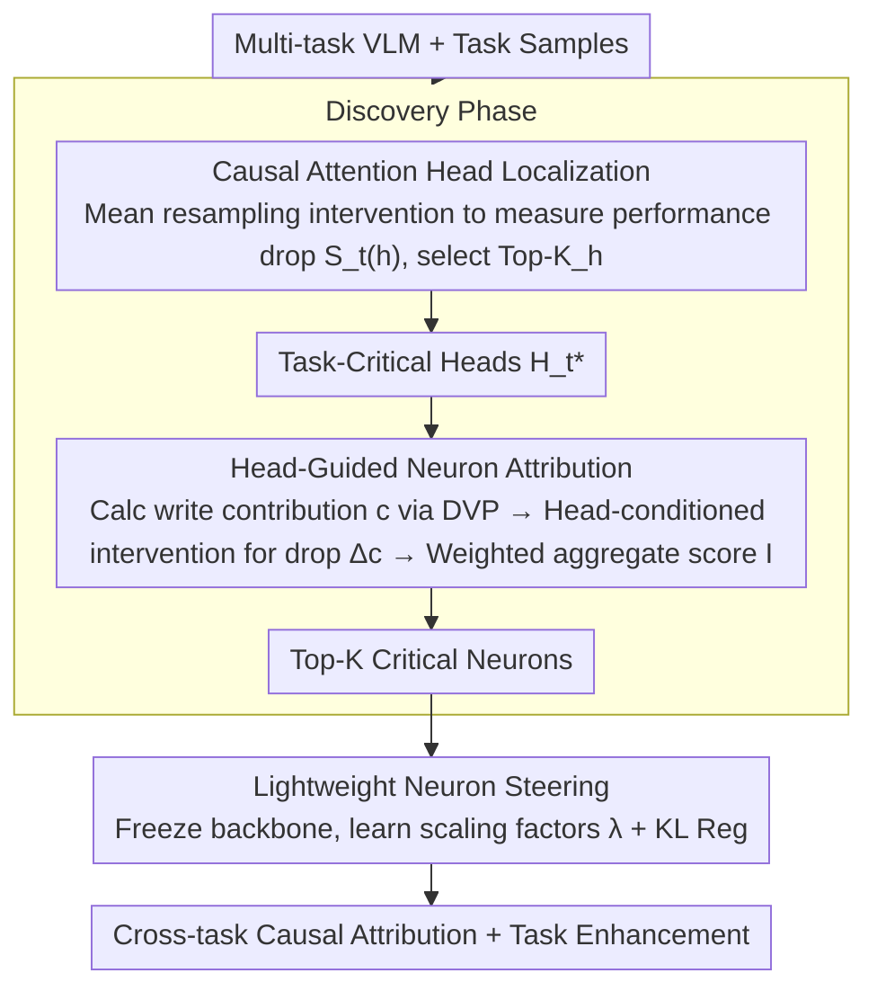

# From Heads to Neurons: Causal Attribution and Steering in Multi-Task Vision-Language Models

**Conference**: ACL 2026 Findings  
**arXiv**: [2604.17941](https://arxiv.org/abs/2604.17941)  
**Code**: [github](https://github.com/petergit1/HONES)  
**Area**: Multimodal VLM  
**Keywords**: Neuron Attribution, Causal Analysis, Multi-task VLM, Attention Heads, Model Interpretability

## TL;DR

The HONES framework is proposed to achieve unified, gradient-free neuron-level causal analysis across heterogeneous tasks and lightweight performance enhancement in multi-task VLMs by first locating task-critical attention heads and then guiding FFN neuron attribution conditioned on those heads.

## Background & Motivation

**Background**: Large Vision-Language Models (VLMs) excel at multi-tasking across VQA, OCR, and image captioning. However, their internal decision-making processes remain opaque—multiple capabilities are entangled within shared parameters, hindering error attribution and controllable deployment. Neuron-level analysis provides fine-grained, actionable insights.

**Limitations of Prior Work**: (1) Existing neuron analysis primarily focuses on single-task settings, failing to compare neuron importance across heterogeneous tasks (e.g., VQA vs. Image-Text Matching); (2) Most methods score neurons independently, ignoring the task-dependent routing effects of attention heads, which leads to inflated importance scores for polysemantic neurons.

**Key Challenge**: How to accurately identify critical neurons for different tasks within a shared parameter space while avoiding noise introduced by polysemanticity?

**Goal**: Design a unified cross-task neuron attribution framework and utilize the identified critical neurons for lightweight task performance enhancement.

**Key Insight**: Following the structural causal view of Transformers—where attention heads select and route task-critical inputs and FFN neurons write the routed information into the residual stream—one should first locate the routing nodes (attention heads) and then attribute FFN neurons conditioned on them.

**Core Idea**: The task importance of a neuron should be measured by its "write contribution" under the routing path of task-critical attention heads, rather than simple activation magnitude.

## Method

### Overall Architecture

HONES addresses a long-standing problem in multi-task VLMs: capabilities are entangled in shared parameters, making it difficult to distinguish which neurons are important for OCR versus VQA. Existing methods score neurons independently and ignore the routing effects of attention heads, resulting in polysemantic neurons receiving falsely high scores. HONES follows the causal structure of Transformers—attention heads route task-critical inputs, and FFN neurons write information into the residual stream. Consequently, it consists of two phases: The discovery phase first locates task-critical attention heads $\mathcal{H}_t^*$ using mean resampling intervention, then measures the causal write contribution of each FFN neuron to the task objective using Direct Vocabulary Projection (DVP) conditioned on these heads to select the Top-K. The steering phase freezes the backbone and learns a set of sparse scaling factors only for these critical neurons, achieving controllable task enhancement via KL regularization. This "heads-then-neurons" approach represents a coarse-to-fine causal path.

### Key Designs

**1. Causal Attention Head Localization: Narrowing the search space for downstream neurons by identifying "routing nodes"**

Scoring all FFN neurons directly is computationally intensive and prone to interference from irrelevant paths. HONES performs an initial screening of attention heads: for a target head, it applies a mean resampling intervention—replacing its output with the mean of the other $H-1$ heads—and measures the task performance degradation $S_t(h)$. A larger drop indicates a more critical head, and the Top-$K_h$ heads form $\mathcal{H}_t^*$. Mean resampling is used instead of zeroing out to avoid out-of-distribution artifacts. Locating these routing nodes first isolates effective computation paths, ensuring that subsequent neuron attribution is not compromised by noise.

**2. Head-Guided Neuron Attribution (Causal Write Effect): Accounting only for contributions along task routing paths**

Traditional methods based on activation magnitude are easily misled by polysemantic neurons—high activation across many tasks does not necessarily imply importance for the current task. HONES instead measures "write contribution": for each neuron $(l,i)$, it calculates the vector $\Delta \mathbf{r}_i^{(l)}$ written into the residual stream via down-projection, then projects it onto the unembedding vector direction of the target token using DVP to obtain the write contribution $c_{l,i}$. Subsequently, interventions are applied to each critical head to observe the drop in contribution $\Delta c$, which is aggregated into a final score $I_{l,i}$ weighted by head importance. Crucially, by conditioning on heads, only writes that actually flow through the task routing path are counted, naturally filtering out falsely high contributions from polysemanticity.

**3. Lightweight Neuron Steering: Learning a scaling "knob" on critical neurons while freezing the backbone**

Beyond attribution, the paper aims to improve task performance without modifying the entire model. All backbone parameters are frozen, and a scaling factor $\lambda_{l,i}$ is learned for each critical neuron. The optimization objective adds a KL divergence regularization term to the task loss:

$$\min_{\lambda_t}\; \mathcal{L}_t + \beta\, \text{KL}(p_\theta \,\|\, p_{\theta_{\lambda_t}}),$$

The KL term prevents the steered model behavior from deviating too far from the original model. Since only a sparse set of scaling factors is learned, the parameter overhead is minimal, and the steering demonstrates zero-shot transferability to OOD data.

### Loss & Training

The discovery phase uses a discovery split of 7K images. The steering phase utilizes a dev split of 2K images to learn scaling factors, and 3K images are used for testing. For open-ended targets (e.g., captioning), token unembedding vectors are aggregated using IDF weighting.

## Key Experimental Results

### Main Results (% Performance drop after masking Top-1% neurons)

| Method | VQA | OCR | Caption | Retrieval | Average |
|------|-----|-----|---------|-----------|------|
| AP | 11.33 | 10.40 | 8.65 | 0.50 | 7.72 |
| MA | 6.82 | 15.50 | 11.90 | 1.35 | 8.89 |
| APE | 3.20 | -1.87 | 12.20 | 0.90 | 3.61 |
| **Ours (HONES)** | **27.30** | **19.00** | **19.80** | **7.43** | **18.38** |

### Steering Effects (LLaVA-1.5-7B)

| Method | VQA | OCR | Caption | Retrieval | Average |
|------|-------|-------|---------|-----------|-------|
| Base | 0.652 | 0.576 | 0.129 | 0.933 | 0.572 |
| Grid-Search | 0.666 | 0.594 | 0.132 | 0.956 | 0.587 |
| **Ours (HONES)** | **0.673** | **0.602** | **0.141** | **0.963** | **0.595** |

### Key Findings
- HONES outperforms activation statistics methods across all tasks and both VLMs, with an average performance drop of 18.38% (LLaVA) and 21.91% (Qwen).
- Critical neurons exhibit task-dependent layer preferences: retrieval tasks concentrate in middle layers (vision-text alignment), while other tasks lean toward deeper layers (answer decoding).
- VQA shared neurons show the highest cross-task significance, exhibiting a "Hub" effect—VQA-related neurons support a wide range of vision-language tasks.
- In OOD experiments, direct zero-shot transfer of scaling factors learned in-domain achieves consistent improvements.

## Highlights & Insights
- The "coarse-to-fine" attribution logic from attention heads to neurons is elegant and efficient—head-guided conditioning effectively suppresses polysemantic noise.
- The proposed unified cross-task scoring interface (DVP + IDF weighting) solves the challenge of incomparable outputs across heterogeneous tasks.
- The discovery of VQA as a cross-task "Hub" provides significant insights for model understanding.
- The steering method requires minimal parameter overhead and exhibits OOD transferability.

## Limitations & Future Work
- Experiments were limited to 7B-scale dense models; validation on larger models or MoE architectures is pending.
- Four coarse-grained task categories may mask differences at the sub-task level (e.g., counting vs. spatial reasoning in VQA).
- Causal analysis requires multiple forward passes, leading to high computational overhead and restricted scalability on large datasets.
- Complementary integration with feature-level methods like Sparse Autoencoders (SAE) has not been explored.

## Related Work & Insights
- **vs. AP/MA/APE (Activation Statistics)**: Magnitude alone cannot distinguish polysemanticity; HONES's head-guided conditioning is more accurate.
- **vs. QRNCA (Gradient Methods)**: HONES is gradient-free, more efficient, and faster at localization.
- **vs. SAE**: HONES operates directly on the original model without additional feature learning, supporting both causal attribution and lightweight steering.
- **vs. MultEdit**: While MultEdit edits knowledge in MLP blocks, HONES analyzes the shared neuron structure across tasks.

## Rating
- Novelty: ⭐⭐⭐⭐⭐ The framework design for head-guided neuron attribution is novel, and the unified cross-task scoring interface addresses practical bottlenecks.
- Experimental Thoroughness: ⭐⭐⭐⭐⭐ Four tasks across two models, extensive control variants, ablation studies, and OOD validation.
- Writing Quality: ⭐⭐⭐⭐ Clear framework description and rich insights.
- Value: ⭐⭐⭐⭐⭐ Significant advancement for VLM interpretability and controllability; the steering method offers practical utility.

<!-- RELATED:START -->

## Related Papers

- [\[CVPR 2026\] Understanding Task Transfer in Vision-Language Models](../../CVPR2026/multimodal_vlm/understanding_task_transfer_in_vision-language_models.md)
- [\[CVPR 2026\] BiomedCCPL: Causal Conditional Prompt Learning for Biomedical Vision-Language Models](../../CVPR2026/multimodal_vlm/biomedccpl_causal_conditional_prompt_learning_for_biomedical_vision-language_mod.md)
- [\[ICML 2025\] Learning Invariant Causal Mechanism from Vision-Language Models](../../ICML2025/multimodal_vlm/learning_invariant_causal_mechanism_from_vision-language_models.md)
- [\[CVPR 2026\] LVLM-Aided Alignment of Task-Specific Vision Models](../../CVPR2026/multimodal_vlm/lvlm-aided_alignment_of_task-specific_vision_models.md)
- [\[CVPR 2025\] Task Preference Optimization: Improving Multimodal Large Language Models with Vision Task Alignment](../../CVPR2025/multimodal_vlm/task_preference_optimization_improving_multimodal_large_language_models_with_vis.md)

<!-- RELATED:END -->
