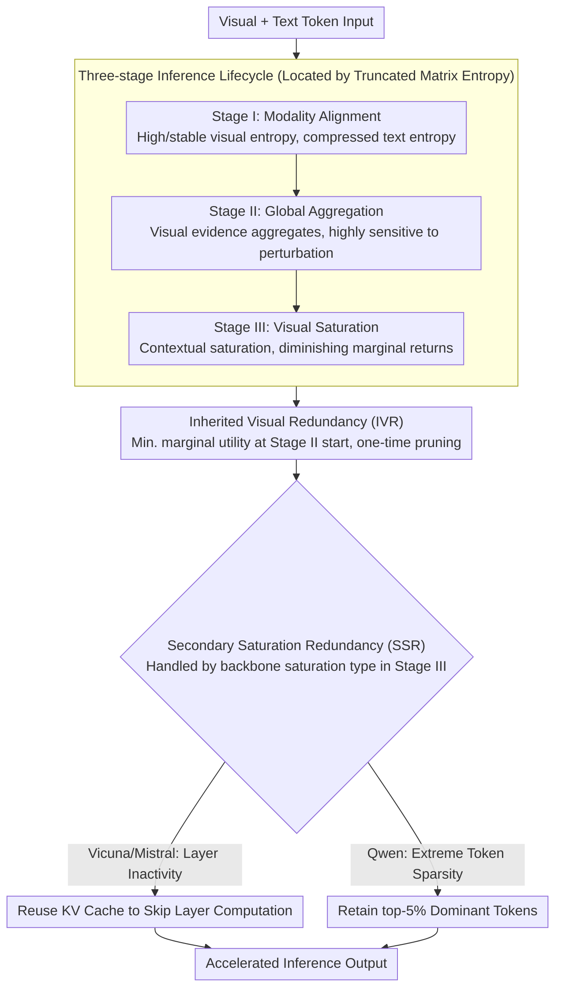

# From Inheritance to Saturation: Disentangling the Evolution of Visual Redundancy for Architecture-Aware MLLM Inference Acceleration

**Conference**: ACL 2026  
**arXiv**: [2604.16462](https://arxiv.org/abs/2604.16462)  
**Code**: [https://github.com/civilizwa/HalfV](https://github.com/civilizwa/HalfV)  
**Area**: Multimodal VLM / Inference Acceleration  
**Keywords**: Visual Redundancy, MLLM Acceleration, Architecture-Aware, token pruning, Matrix Entropy

## TL;DR

This work reveals two sources of visual redundancy during MLLM inference: Inherited Visual Redundancy (IVR) caused by dense tokenization in ViT, and Secondary Saturation Redundancy (SSR) resulting from deep semantic saturation, whose manifestation varies across backbone architectures. The proposed HalfV framework addresses these redundancies separately, achieving a 4.1x FLOPs speedup on Qwen2.5-VL while retaining 96.8% of the performance.

## Background & Motivation

**Background**: High-resolution MLLMs incur extremely high inference costs due to the explosion of visual tokens. Existing acceleration methods involve token-level pruning and layer-level sparsity.

**Limitations of Prior Work**: Existing acceleration strategies exhibit severe "backbone dependence"—performing well on Vicuna/Mistral architectures (e.g., LLaVA) but suffering performance degradation of 5.7%-22.4% when transferred to the Qwen architecture. Controlled experiments (using LLaVA-Next with the same visual front-end) confirm that the bottleneck lies in the different intrinsic mechanisms of LLM backbones for processing visual information.

**Key Challenge**: While fundamental differences exist in how different backbone architectures handle visual information, current methods assume a "one-strategy-fits-all" approach. Understanding the essential differences in visual redundancy across architectures is necessary to design universal acceleration schemes.

**Goal**: To systematically track the evolution of visual information across various architectures using truncated matrix entropy as a probe, and to design an architecture-aware acceleration framework based on these findings.

**Key Insight**: By tracing the evolution of the eigenvalue spectrum of visual representations using truncated matrix entropy, a universal three-stage inference lifecycle is discovered across architectures: Modality Alignment → Global Aggregation → Visual Saturation.

**Core Idea**: Visual redundancy is decoupled into universal IVR (from ViT dense tokenization) and architecture-dependent SSR (from deep saturation). The former is handled with a unified pruning strategy, while the latter is processed adaptively based on architecture-specific manifestations (layer inactivity in Vicuna/Mistral vs. extreme token sparsity in Qwen).

## Method

### Overall Architecture

HalfV operates in two steps: (1) A one-time token pruning is executed uniformly for all architectures at the start of Stage II to eliminate IVR; (2) SSR is handled in Stage III based on architecture specificity—reusing KV caches to skip layer computations for Vicuna/Mistral architectures, and retaining only the top-5% dominant tokens for computation in Qwen architectures. These steps are predicated on using the "ruler" of truncated matrix entropy to segment the inference process into three stages and identify the intervention points for IVR and SSR.

### Key Designs

**1. Three-stage Inference Lifecycle: Decoupling Visual Evolution into Alignable Segments via Matrix Entropy**

To explain why acceleration strategies fail across backbones, a universal cross-architecture metric is required. The authors use truncated matrix entropy to track the eigenvalue spectrum evolution of visual and text representations. They found that Vicuna, Mistral, and Qwen all undergo three stages. Stage I (Modality Alignment) features high, stable visual entropy and rapidly compressed text entropy, as attention shifts to text dominance. In Stage II (Global Aggregation), visual entropy decreases as scattered visual evidence aggregates into key semantic regions; this stage is extremely sensitive to local perturbations—suppressing only 1% of tokens can cause severe degradation. Stage III (Visual Saturation) involves saturated visual context where further computation yields diminishing returns.

This metric partitions "redundancy" into a chronological process, allowing the identification of the specific layers for IVR pruning and the segments where SSR emerges.

**2. Inherited Visual Redundancy (IVR): One-time Pruning at Stage II Start to Avoid Sensitive Aggregation Zones**

Dense tokenization in ViT inherently introduces spatial redundancy regardless of the backbone. The challenge is "when to prune"—as Stage II is sensitive to perturbations, layer-wise pruning disrupts ongoing evidence aggregation. The authors quantify the "information lost per unit of saved computation" using marginal utility $\text{MU}_{l,r} = -\Delta\mathcal{M} / (\Delta\mathcal{C} + \epsilon)$. They found that the starting layer of Stage II is the unique "sweet spot" ($\text{MU}=0.21$, significantly lower than $0.29–0.87$ elsewhere).

This layer is optimal because it sits precisely between the completion of Stage I alignment and the start of sensitive Stage II aggregation. Visual representations are most redundant and least fragile here, allowing for massive token pruning without interfering with alignment or disrupting subsequent aggregation.

**3. Secondary Saturation Redundancy (SSR): Branching by Backbone Saturation Patterns**

SSR manifests differently across backbones after deep semantic saturation, which is the root cause of cross-architecture failure in existing methods. In Vicuna/Mistral, SSR appears as layer inactivity (KL divergence between adjacent layers $\approx 0$), allowing for layer skipping via KV cache reuse. In Qwen, SSR manifests as extreme token sparsity: the layers remain active, but information flow collapses onto a few dominant tokens. Thus, full-precision computation must be reserved for the top-5% of tokens.

Experiments highlight these differences: inhibiting all visual updates improves performance on Vicuna (OCRBench +13.1%) but causes a catastrophic collapse on Qwen (−86.2%). Conversely, retaining only 5% of tokens on Qwen is nearly lossless (−0.1% to −2.4%). Consequently, HalfV assigns specific acceleration modes to different backbones in Stage III.

### Loss & Training

HalfV is a training-free inference-time acceleration method. It requires a pre-analysis on a small dataset (100 samples) to determine the three-stage boundaries. Evaluation was conducted on LLaVA-1.5v-7B (Vicuna), LLaVA-1.5v-7B (Mistral), and Qwen2.5-VL-7B across benchmarks including GQA, MME, POPE, SQA, and AI2D.

## Key Experimental Results

### Main Results

| Model | Method | FLOPs Speedup | Avg. Performance Retention |
|------|------|-----------|------------|
| Qwen2.5-VL | HoloV (Prior) | High | Poor (5.7-22.4% degradation) |
| Qwen2.5-VL | **HalfV** | **4.1×** | **96.8%** |
| LLaVA-1.5v (Vicuna) | **HalfV** | High | Excellent |
| LLaVA-1.5v (Mistral) | **HalfV** | High | Excellent |

### Ablation Study

| Configuration | Effect | Description |
|------|------|------|
| IVR Only | Moderate Speedup | Universal pruning is effective but insufficient |
| SSR Only | Limited Speedup | Only addresses deep-layer redundancy |
| IVR + SSR (Full HalfV) | **Optimal** | Two stages are complementary |
| Incorrect SSR Strategy | Catastrophic | Confirms the necessity of architecture-awareness |

### Key Findings

- The degradation of existing methods on Qwen is rooted in the different manifestations of SSR—Qwen's deep layers remain active but are extremely sparse, meaning layers cannot be simply skipped.
- The starting layer of Stage II is the optimal timing for one-time pruning (lowest marginal utility).
- Suppressing only 1% of tokens leads to performance collapse in Stage II, confirming the high coupling of the global aggregation process.
- The three-stage lifecycle is consistent across all tested architectures, but SSR manifestation is architecture-dependent.

## Highlights & Insights

- **Systematic Reveal and Explanation of "Backbone Dependence"**: This work is the first to confirm that the failure of MLLM acceleration methods stems from backbone differences rather than visual front-end differences, providing a mechanistic explanation through matrix entropy analysis.
- **Elegance of IVR/SSR Decoupling**: The framework decomposes complex visual redundancy into two independently manageable components and provides optimal strategies for each.
- **Locating Pruning Timing via Marginal Utility**: The use of quantitative rather than heuristic methods to determine the pruning layer provides significant methodological value.

## Limitations & Future Work

- The pre-analysis phase requires 100 samples to determine stage boundaries; different data distributions might affect these positions.
- Validation was limited to Vicuna, Mistral, and Qwen; SSR manifestations in other architectures remain unknown.
- The top-5% ratio in the extreme token sparsity strategy may require adjustment for different tasks.
- No comparison was made with the latest dynamic token management methods.

## Related Work & Insights

- **vs HoloV/DART (Token Pruning Methods)**: These methods implicitly assume identical redundancy patterns across all architectures, leading to severe degradation on Qwen. HalfV resolves this through architecture-aware SSR handling.
- **vs ShortV (Layer-level Methods)**: ShortV assumes deep layers can be skipped, which holds for Vicuna but not for Qwen. HalfV distinguishes between "layer inactivity" and "token sparsity" in SSR modes.

## Rating

- **Novelty**: ⭐⭐⭐⭐⭐ The IVR/SSR decoupling and architecture-aware analysis are original contributions; the discovery of the three-stage lifecycle has independent value.
- **Experimental Thoroughness**: ⭐⭐⭐⭐⭐ Extensive testing across three architectures and eight benchmarks, combined with marginal utility and SSR cross-validation.
- **Writing Quality**: ⭐⭐⭐⭐ In-depth analysis and rich visualizations, though some technical descriptions are complex.

<!-- RELATED:START -->

<!-- RELATED:END -->

## Related Papers

- [\[AAAI 2026\] Filter, Correlate, Compress: Training-Free Token Reduction for MLLM Acceleration](../../AAAI2026/multimodal_vlm/filter_correlate_compress_training-free_token_reduction_for_.md)
- [\[ICLR 2026\] Visual Prompt-Agnostic Evolution](../../ICLR2026/multimodal_vlm/visual_prompt-agnostic_evolution.md)
- [\[AAAI 2026\] Global Compression Commander: Plug-and-Play Inference Acceleration for High-Resolution Large Vision-Language Models](../../AAAI2026/multimodal_vlm/global_compression_commander_plug-and-play_inference_acceler.md)
- [\[CVPR 2026\] VGent: Visual Grounding via Modular Design for Disentangling Reasoning and Prediction](../../CVPR2026/multimodal_vlm/vgent_visual_grounding_via_modular_design_for_disentangling_reasoning_and_predic.md)
- [\[ACL 2026\] Stability Implies Redundancy: Delta Attention Selective Halting for Efficient Long-Context Prefilling](stability_implies_redundancy_delta_attention_selective_halting_for_efficient_lon.md)

<!-- RELATED:END -->
