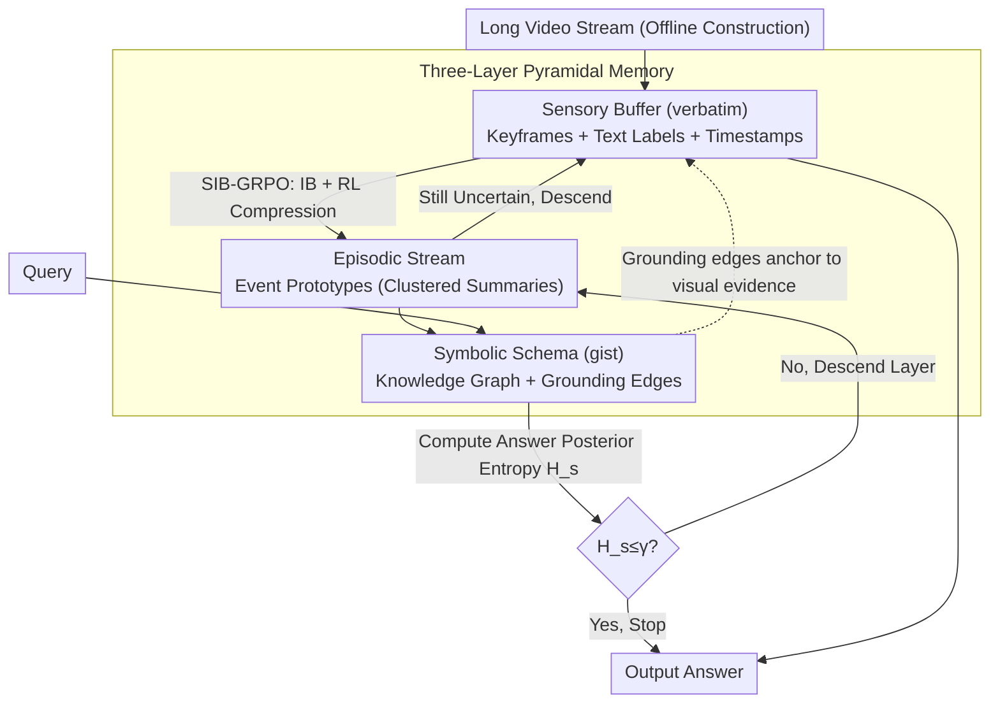

# From Verbatim to Gist: Distilling Pyramidal Multimodal Memory via Semantic Information Bottleneck

**Conference**: ACL 2026  
**arXiv**: [2603.01455](https://arxiv.org/abs/2603.01455)  
**Code**: [GitHub](https://github.com/EliSpectre/MM-Mem)  
**Area**: Multimodal VLM  
**Keywords**: Long Video Understanding, Multimodal Memory, Information Bottleneck, Fuzzy Trace Theory, Reinforcement Learning

## TL;DR

This paper proposes MM-Mem, a pyramidal multimodal memory architecture inspired by Fuzzy Trace Theory. It organizes memory into three levels: a Sensory Buffer (visual-dominant), an Episodic Stream (event-level summaries), and a Symbolic Schema (Knowledge Graph). Redundancy is compressed bottom-up via SIB-GRPO (Semantic Information Bottleneck + Reinforcement Learning), while retrieval is conducted top-down driven by entropy. The method achieves SOTA performance on four long-video benchmarks.

## Background & Motivation

**Background**: Multimodal Large Language Models (MLLMs) excel in short-term perception but are limited by context windows and static memory mechanisms in long-video understanding. Existing methods fall into two extremes: visual-centric approaches (e.g., LongVA, VideoRAG), which suffer from high latency and redundancy due to dense frame sampling, and text-centric approaches (e.g., Vgent), which suffer from detail loss and hallucinations caused by converting video into text-only memory.

**Limitations of Prior Work**: (1) Visual-centric methods accumulate excessive visual tokens, leading to computational redundancy and neglect of high-level semantics; (2) Text-centric methods use lossy compression via captioning, losing critical visual cues and causing ambiguity; (3) Existing memory systems are static and lack the dynamic organization found in human memory; (4) Dynamic memory management in multimodal scenarios remains significantly under-explored.

**Key Challenge**: Long-video understanding requires both fine-grained visual details (for precise verification) and high-level semantic abstractions (for cross-event reasoning). Existing methods face a fundamental trade-off between visual fidelity and semantic abstraction.

**Goal**: To design a hierarchical multimodal memory architecture that enables progressive distillation from fine-grained perception to high-level cognition, supporting dynamic memory compression and adaptive retrieval.

**Key Insight**: Fuzzy Trace Theory (FTT) in cognitive psychology suggests that human memory comprises two parallel traces: *verbatim* (precise perceptual details) and *gist* (abstract semantic meaning). Visual data naturally corresponds to verbatim, while text corresponds to gist—this cross-modal complementarity can be directly mapped to a hierarchical memory architecture.

**Core Idea**: Build a three-layer pyramidal memory that transitions from visual-dominant to text-dominant bottom-up. Use Information Bottleneck theory to guide compression (SIB-GRPO) and employ entropy-driven top-down retrieval to dynamically switch between abstraction and detail.

## Method

### Overall Architecture

MM-Mem takes a long video stream as input to construct a three-layer pyramidal memory offline: (1) **Sensory Buffer** retains visual representations of keyframes along with short textual labels; (2) **Episodic Stream** generates event-level representations through clustering and summarization; (3) **Symbolic Schema** builds an entity Knowledge Graph (KG). During querying, it performs top-down retrieval: searching the KG (gist) first, descending to the episodic layer if uncertain, and accessing visual frames (verbatim) only as a last resort.

### Key Designs

**1. Three-Layer Pyramidal Memory: Anchoring Visual Details to Semantic Abstractions**

MM-Mem organizes memory into three levels according to FTT abstraction. The **Sensory Buffer** $\mathcal{M}_{sens} = \{(v_{t,i}, l_{t,i}, \tau_{t,i})\}$ uses content-adaptive temporal segmentation (PySceneDetect) and selects keyframes to store visual features, labels, and timestamps (*verbatim*). The **Episodic Stream** uses a decision operator $\psi(m_{t,i}, e^\star) \in \{ADD\_NEW, MERGE, DISCARD\}$ to organize perceptions into compact event sequences, using K-means to extract representative prototypes. The **Symbolic Schema** constructs a KG $\mathcal{G} = (\mathcal{N}, \mathcal{E})$ where nodes are episodic units and entity prototypes (*gist*).

A critical innovation is the **grounding edge**, which anchors high-level textual concepts back to specific visual evidence. This allows the system to trace back to "raw footage" when details need verification—bridging the gap where text-only memory models often hallucinate.

**2. SIB-GRPO: Determining Compression via Information Bottleneck and RL**

The distillation from perception to episodic layers is modeled as stochastic compression, optimizing the Information Bottleneck objective:

$$\min_{p_\theta(m|x)} [I(X;M) - \beta I(M;Y)]$$

where $X$ is sensory memory, $M$ is the episodic representation, and $Y$ is the downstream VQA answer. Since $M$ consists of discrete text generated by an LLM, the objective is translated into a sequence-level RL goal. A quality-quantity prior $r(m) \propto p_{ref}(m) \cdot e^{-\lambda|m|}$ is introduced, and GRPO-style sampling is used to evaluate $G$ candidate traces. The reward $r(s,m) = R_{vqa} - \beta_1 \cdot Length(m) - \beta_2 \cdot \log\frac{\pi_{\theta_{old}}}{\pi_{ref}}$ penalizes excessive length and deviation from the reference policy while rewarding correct answers.

**3. Entropy-driven Top-down Retrieval: Adaptive Depth Based on Difficulty**

Retrieval starts at the most abstract layer and maintains a posterior distribution $p_i^{(s)} = p(a_i | \mathcal{Q}, R_{\leq s})$ for answer candidates, calculating its entropy:

$$H_s(\mathcal{Q}) = -\sum_i p_i^{(s)} \log p_i^{(s)}$$

Searching stops if $H_s \leq \gamma$ (sufficient certainty) or if the reduction $\Delta H_s$ falls below a threshold $\epsilon$. High-level text retrieval is fast; the system only triggers expensive low-level visual retrieval when uncertainty remains high.

### Loss & Training

The SIB-GRPO objective function is: 
$$J_{SIB-GRPO}(\theta) = \mathbb{E}[\frac{1}{G}\sum_{i=1}^{G} \min(\rho_i A_i, \text{clip}(\rho_i, 1-\epsilon, 1+\epsilon) A_i)]$$ 
The base model is Qwen3-VL-8B, fine-tuned using the SWIFT framework with $\beta_1=0.1$, $\beta_2=0.3$, and temperature=0.0.

## Key Experimental Results

### Main Results

**Video-MME Long Video Understanding (Overall Accuracy)**

| Method | Type | w/o Subtitles | w/ Subtitles |
|------|------|---------|--------|
| Gemini 1.5 Pro | Closed-source | 75.0 | 81.3 |
| Qwen2-VL-72B | Open-source 72B | 71.2 | 77.8 |
| Vgent | Agent | 68.9 | 74.3 |
| **MM-Mem (Ours)** | **Agent 8B** | **72.4** | **78.1** |

**Streaming Video VStream-QA-Ego**

| Method | Accuracy | Score |
|------|----------|-------|
| Flash-VStream | 59.0 | 3.9 |
| **MM-Mem** | **62.5** | **4.1** |

### Ablation Study

**Ablation on Video-MME w/o Subtitles**

| Configuration | Short | Medium | Long | Overall |
|------|-------|--------|------|---------|
| Full (MM-Mem) | 81.5 | 69.6 | 66.1 | 72.4 |
| w/o SIB-GRPO | ~79 | ~68 | ~63 | ~70 |
| w/o Hierarchical Memory | ~77 | ~66 | ~61 | ~68 |

### Key Findings

- MM-Mem (8B) outperforms all open-source MLLMs (including 72B) and most Agent systems.
- The largest gains were observed in the "Long" video category, proving the efficiency of SIB-GRPO for long temporal dependencies.
- On HD-EPIC++, MM-Mem (30.28%) outperformed Qwen3-VL-8B (25.88%) by 4.4 points, demonstrating strong fine-grained aggregation in egocentric videos.
- Inference latency is only 5.35s per minute of video, with VRAM usage at 17.8GB (lower than Qwen3-VL-8B's 22.8GB).

## Highlights & Insights

- The mapping from FTT to engineering is natural; visual=verbatim and text=gist is an elegant correspondence, and grounding edges prevent modal decoupling.
- The combination of Information Bottleneck theory with GRPO is generalizable to any scenario requiring a trade-off between information retention and compression.
- Entropy-driven adaptive retrieval depth avoids the need for manually designed retrieval strategies for different query types.

## Limitations & Future Work

- Computational overhead for memory construction exists, though it can be amortized; further distillation is needed for edge deployment.
- Performance depends on the quality of upstream visual encoders and captioners; noise in the sensory layer propagates upward.
- SIB-GRPO currently uses task-driven VQA rewards; defining rewards for unsupervised scenarios without explicit tasks remains an open problem.
- Lack of systematic evaluation on ultra-long videos (>2h).

## Related Work & Insights

- **vs Vgent**: MM-Mem outperforms Vgent by 3.5 points (72.4 vs 68.9) on Video-MME because Vgent's text-only compression loses fine-grained visual evidence.
- **vs VideoRAG**: MM-Mem uses less VRAM (17.8 vs 23.0 GB) and achieves higher performance (72.4 vs 60.5) by avoiding redundant visual token accumulation.
- **vs A-Mem**: Unlike text-centric dynamic memory, MM-Mem includes multimodal grounding, allowing it to descend to detail layers for visual verification.

## Rating

- Novelty: ⭐⭐⭐⭐⭐ (FTT mapping + SIB-GRPO + Entropy-driven retrieval)
- Experimental Thoroughness: ⭐⭐⭐⭐⭐ (4 benchmarks + ablation + efficiency + visualization)
- Writing Quality: ⭐⭐⭐⭐ (Clear theoretical derivation and bridge to engineering)
- Value: ⭐⭐⭐⭐⭐ (Provides a reusable cognitive architecture paradigm for long-video agents)

<!-- RELATED:START -->

## Related Papers

- [\[ICML 2025\] Learning Optimal Multimodal Information Bottleneck Representations](../../ICML2025/multimodal_vlm/learning_optimal_multimodal_information_bottleneck_representations.md)
- [\[AAAI 2026\] Conditional Information Bottleneck for Multimodal Fusion: Overcoming Shortcut Learning in Sarcasm Detection](../../AAAI2026/multimodal_vlm/conditional_information_bottleneck_for_multimodal_fusion_overcoming_shortcut_lea.md)
- [\[CVPR 2026\] SeD-UD: An Influence-Driven and Hierarchically-Decoupled Information Bottleneck for Multimodal Intent Recognition](../../CVPR2026/multimodal_vlm/sed-ud_an_influence-driven_and_hierarchically-decoupled_information_bottleneck_f.md)
- [\[ACL 2026\] Reducing Peak Memory Usage for Modern Multimodal Large Language Model Pipelines](reducing_peak_memory_usage_for_modern_multimodal_large_language_model_pipelines.md)
- [\[ACL 2026\] MONETA: Multimodal Industry Classification through Geographic Information with Multi Agent Systems](moneta_multimodal_industry_classification_through_geographic_information_with_mu.md)

<!-- RELATED:END -->
