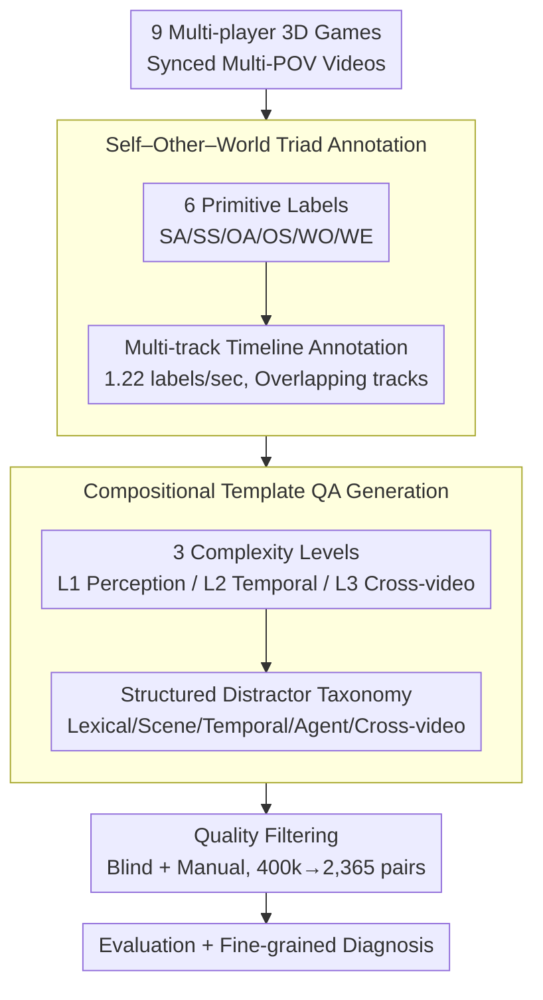

# GameplayQA: A Benchmarking Framework for Decision-Dense POV-Synced Multi-Video Understanding of 3D Virtual Agents

**Conference**: ACL 2026  
**arXiv**: [2603.24329](https://arxiv.org/abs/2603.24329)  
**Code**: [Project Page](https://hats-ict.github.io/gameplayqa/)  
**Area**: Video Understanding  
**Keywords**: Video Question Answering, Multi-view Understanding, Game AI, Hallucination Diagnosis, Multi-agent Perception

## TL;DR

GameplayQA is proposed as an end-to-end benchmarking framework based on multi-player 3D game videos. Through dense timeline annotations (1.22 labels/second) and a structured distractor taxonomy, it systematically evaluates the perception and reasoning capabilities of Multimodal Large Language Models (MLLMs) in decision-dense, multi-POV synchronized scenarios, revealing a significant gap between frontier models and human performance.

## Background & Motivation

**Background**: MLLMs are being widely deployed as perception backbones for autonomous agents in 3D environments (e.g., robotics, virtual worlds). This requires models to possess capabilities such as rapid state-change perception, action attribution, and concurrent multi-agent behavioral reasoning.

**Limitations of Prior Work**: Current video understanding benchmarks suffer from three key deficiencies: (1) Lack of embodiment and agent-grounding, mostly consisting of slow-paced passive observation videos that fail to test high-frequency state transitions and decision-dense scenarios; (2) Non-diagnostic hallucinations, providing only global performance metrics without fine-grained localization of model failure causes (temporal misjudgment? object fabrication? role confusion?); (3) Lack of multi-video understanding evaluation, with nearly all focusing on a single perspective.

**Key Challenge**: Agent perception requires simultaneous tracking of the agent's own state (Self), modeling other agents' behaviors (Other), and perceiving environmental changes (World). However, existing benchmark annotation and evaluation systems cannot cover these multi-level, multi-perspective cognitive needs.

**Goal**: To construct an end-to-end benchmark framework capable of evaluating basic perception abilities of models in decision-dense 3D environments and providing diagnostic error analysis.

**Key Insight**: Utilize multi-player 3D games as "cognitive sandboxes"—where states and outcomes are highly deterministic and decision-making is fast-paced—making them naturally suitable for evaluating agent perception.

**Core Idea**: Design an annotation system around a Self–Other–World triad decomposition, combined with compositional template-based QA generation and a structured distractor taxonomy, to achieve multi-level diagnostic evaluation from basic perception to cross-video reasoning.

## Method

### Overall Architecture

GameplayQA addresses the limitations of existing video benchmarks, which are often slow-paced, provide only global scores, and focus on single views. By treating multi-player 3D games as "cognitive sandboxes," the framework establishes an end-to-end pipeline: first, synchronized multi-POV videos are collected from 9 multi-player 3D games; then, dense multi-track timeline annotations are performed across 6 entity types (SA/SS/OA/OS/WO/WE) with a density of 1.22 labels/second; next, a compositional template algorithm generates QA pairs organized into three levels of cognitive complexity, each paired with structured distractors to induce hallucinations—yielding 2,365 final pairs after quality filtering from 400,000 candidates; finally, models are evaluated for both performance and fine-grained hallucination diagnosis. Quality filtering involves two stages: blind filtering (language-prior filtering) to remove questions answerable without visual input, and manual evaluation of a 120-question sample where approximately 8% were identified as flawed and removed.

### Key Designs

**1. Self–Other–World Triad Annotation: Structuring "What is Seen" into Diagnostic Tracks**

In 3D multi-agent environments, a model must track its own state, model other agents, and perceive environmental changes simultaneously. GameplayQA categorizes observable events along two axes: Entity (Self/Other/World) and Temporal Attribute (Action/State for agents, Object/Event for the environment), resulting in 6 primitive label types (SA/SS/OA/OS/WO/WE). Each type serves as an independent annotation track, allowing temporal overlaps to capture concurrent events. This classification directly maps to the core requirements of Multi-Agent Reinforcement Learning (MARL): dense state-action tracking (Self), opponent modeling (Other), and environmental awareness (World). Consequently, performance drops in specific tracks directly reveal deficiencies in corresponding perception categories.

**2. Three Levels of Cognitive Complexity: From Identifying "What" to "When" and "How Perspectives Relate"**

To distinguish basic perception from complex reasoning, questions are categorized into three levels across 15 task classes. L1 (Single-reference Perception) tests basic action/state/object recognition; L2 (Temporal Reasoning) requires cross-entity correlation, temporal localization, missing event identification, ordering, and intent inference; L3 (Cross-video Understanding) involves referencing, ordering, and perspective identification across synchronized multi-POV feeds. This progressive design simulates the deepening of agent cognition, allowing for decomposed capability analysis.

**3. Structured Distractor Taxonomy: Transforming "Wrong Answers" into "Why They Are Wrong"**

Traditional benchmarks only indicate that a model chose the wrong option without identifying the cause. GameplayQA categorizes every incorrect option based on its relationship to the ground truth: Lexical distillates (textual variations), Scene distractors (plausible but non-occurring events), Temporal distractors (events occurring outside the query window), Agent distractors (swapping agent attributions), and Cross-video distractors (events from other perspectives). Since distractors are constructed based on failure modes, the choice of a specific distractor exposes the model's weakness—whether it is temporal localization, agent confusion, or semantic misunderstanding.

## Key Experimental Results

### Main Results

| Model | Overall | L1 Single-ref | L2 Temporal | L3 Cross-video |
|------|------|----------|---------|----------|
| Human | 80.5 | ~84% | ~77% | ~89% |
| Gemini 2.5 Pro | 71.3 | ~63% | ~60% | ~77% |
| GPT-5 | 67.0 | ~67% | ~64% | ~62% |
| Gemini 3 Flash | 68.2 | ~64% | ~62% | ~63% |
| Qwen3 VL 235B | 63.8 | ~67% | ~62% | ~49% |
| Claude 4.5 Sonnet | 51.3 | ~62% | ~51% | ~42% |

### Ablation Study

| Configuration | Overall | L1 | L2 | L3 |
|------|------|-----|-----|-----|
| Full Video (Baseline) | 62.7 | 67.2 | 61.9 | 60.6 |
| No Video | 29.4 | 36.0 | 29.1 | 24.2 |
| Random Single Frame | 41.7 | 52.9 | 40.9 | 33.7 |
| Shuffled Frames | 54.8 | 63.1 | 52.6 | 53.4 |

### Key Findings
- Accuracy across all models monotonically decreases as cognitive level increases: L1 (61.2%) → L2 (56.0%) → L3 (49.4%), validating the complexity hierarchy.
- The most challenging tasks are Occurrence Counting (OccCnt, 36.5%) and Cross-video Ordering (X-VOrd, 38.8%), indicating that precise temporal tracking remains a fundamental weakness.
- Modeling other agents (OA: 54.0%, OS: 55.4%) is approximately 8 percentage points more difficult than world objects (WO: 62.0%).
- Cross-video and temporal distractors cause the most errors, while scene distractors are the easiest to avoid—demonstrating that models process static visual inputs better than temporal and multi-POV logic.
- Fast-paced shooters (CS2, Battlefield) yield the highest error rates, while slow-paced exploration games are easier for models.

## Highlights & Insights
- **Strong Diagnosticity**: The structured distractor taxonomy is the greatest highlight, converting "model errors" into actionable insights on "why models fail."
- **Framework as a Pipeline**: It is an end-to-end pipeline including annotation protocols, QA generation algorithms, and error analysis, rather than just a static dataset.
- **Logical Cognitive Hierarchy**: The L1→L2→L3 progression effectively distinguishes capability dimensions, revealing systematic weaknesses in temporal and multi-POV reasoning.
- **Multi-POV Synchronization**: This is the first benchmark in the gaming domain to provide synchronized multi-POV video QA, filling a gap in multi-video understanding evaluation.

## Limitations & Future Work
- **Data Scale**: The scale is relatively limited with 2,365 QA pairs and 100 videos compared to large-scale benchmarks.
- **Domain Bias**: Focused on competitive 3D games; generalization to other domains like robotics or autonomous driving requires further validation.
- **Annotation Noise**: Despite manual verification, approximately 8% of quality issues persist due to the automated generation pipeline.
- **Future Directions**: Scaling to more game genres, introducing open-ended QA, and adding active exploration evaluation for models.

## Related Work & Insights
- **vs. MarioQA**: While MarioQA pioneered game video QA, it was limited to 2D platformers; GameplayQA extends this to 3D multi-player games with multi-POV support.
- **vs. Ego4D/EgoSchema**: These focus on first-person video understanding but lack multi-agent and multi-POV dimensions.
- **vs. MVU-Eval**: MVU-Eval supports multi-video understanding but is not oriented toward agent scenarios and lacks decision density and diagnosticity.

## Rating
- Novelty: ⭐⭐⭐⭐ The Self-Other-World triad and structured distractor taxonomy are innovative, filling the gap in multi-POV game video QA.
- Experimental Thoroughness: ⭐⭐⭐⭐ Covers 15+ frontier models with ablation studies and multi-dimensional error analysis, though data scale is modest.
- Writing Quality: ⭐⭐⭐⭐⭐ Clear framework design with rich tables and a distinct hierarchy.
- Value: ⭐⭐⭐⭐ Provides a practical diagnostic tool for multi-agent perception, offering insights for embodied AI and world model research.

<!-- RELATED:START -->

## Related Papers

- [\[CVPR 2025\] MLVU: Benchmarking Multi-task Long Video Understanding](../../CVPR2025/video_understanding/mlvu_benchmarking_multi-task_long_video_understanding.md)
- [\[ACL 2026\] DualFact: A Multimodal Fact Verification Framework for Procedural Video Understanding](dualfact_a_multimodal_fact_verification_framework_for_procedural_video_understan.md)
- [\[ICCV 2025\] 4D-Bench: Benchmarking Multi-modal Large Language Models for 4D Object Understanding](../../ICCV2025/video_understanding/4d_bench_benchmarking_multimodal_llms_for_4d_object_understanding.md)
- [\[AAAI 2026\] UVLM: Benchmarking Video Language Model for Underwater World Understanding](../../AAAI2026/video_understanding/uvlm_benchmarking_video_language_model_for_underwater_world_understanding.md)
- [\[CVPR 2026\] CaST-Bench: Benchmarking Causal Chain-Grounded Spatio-Temporal Reasoning for Video Question Answering](../../CVPR2026/video_understanding/cast-bench_benchmarking_causal_chain-grounded_spatio-temporal_reasoning_for_vide.md)

<!-- RELATED:END -->
