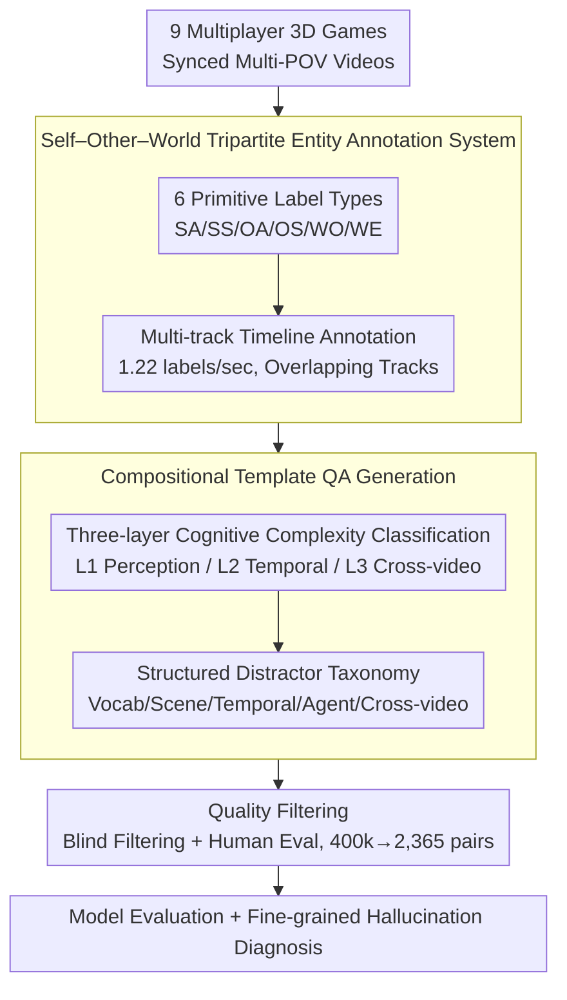

# GameplayQA: A Benchmarking Framework for Decision-Dense POV-Synced Multi-Video Understanding of 3D Virtual Agents

**Conference**: ACL 2026  
**arXiv**: [2603.24329](https://arxiv.org/abs/2603.24329)  
**Code**: [Project Homepage](https://hats-ict.github.io/gameplayqa/)  
**Area**: Video Understanding  
**Keywords**: Video Question Answering, Multi-view Understanding, Game AI, Hallucination Diagnosis, Multi-agent Perception

## TL;DR

GameplayQA is proposed as an end-to-end benchmarking framework based on multiplayer 3D game videos. Using dense timeline annotations (1.22 labels/sec) and a structured distractor taxonomy, it systematically evaluates the perception and reasoning capabilities of Multimodal Large Language Models (MLLMs) in decision-dense, POV-synced scenarios, revealing a significant performance gap between frontier models and human performance.

## Background & Motivation

**Background**: MLLMs are being widely deployed as perception backbones for autonomous agents in 3D environments (e.g., robotics, virtual worlds). This requires models to possess capabilities such as rapid state-change perception, action attribution recognition, and concurrent multi-agent behavior reasoning.

**Limitations of Prior Work**: Current video understanding benchmarks suffer from three critical deficiencies: (1) Lack of embodiment and agent grounding, mostly consisting of slow-paced passive observation videos that fail to test high-frequency state transitions and dense decision-making; (2) Non-diagnosable hallucination types, providing only global performance metrics without fine-grained localization of failure causes (temporal misjudgment? object fabrication? agent confusion?); (3) Lack of multi-video understanding evaluation, as almost all focus on a single perspective.

**Key Challenge**: Agent perception requires simultaneous tracking of its own state (Self), modeling other agents' behaviors (Other), and perceiving environmental changes (World). However, existing annotation and evaluation systems cannot cover these multi-layered, multi-view cognitive requirements.

**Goal**: To build an end-to-end benchmarking framework capable of evaluating the foundational perception of models in decision-dense 3D environments while providing diagnosable error analysis.

**Key Insight**: Multiplayer 3D games serve as "cognitive sandboxes"—where states and outcomes are highly deterministic and decision-making is fast-paced, making them naturally suitable for evaluating agent perception.

**Core Idea**: An annotation system is designed around a Self–Other–World tripartite entity decomposition. Combined with compositional template-based QA generation and a structured distractor taxonomy, this enables multi-layered diagnosable evaluation from basic perception to cross-video reasoning.

## Method

### Overall Architecture

GameplayQA addresses the limitations of existing benchmarks—slow-paced passive observation, global-only scoring, and single-view focus—which fail to challenge agent perception in fast-paced 3D environments. Utilizing multiplayer 3D games as "cognitive sandboxes," the framework establishes an end-to-end pipeline: first, synchronized multi-POV videos are collected from 9 multiplayer 3D games; second, dense multi-track timeline annotations are performed across 6 entity types (SA/SS/OA/OS/WO/WE) with a density of 1.22 labels/sec; third, a compositional template algorithm generates QA pairs from these annotations, organized by three levels of cognitive complexity and paired with structured distractors to induce hallucinations (producing 400k initial candidates downsampled to 4k and filtered to 2,365 pairs); finally, models are evaluated with fine-grained hallucination diagnosis. Quality filtering involves two stages: blind filtering (language-prior filtering) to remove questions solvable without vision, followed by human evaluation of 120 sampled questions, resulting in the removal of ~8% flawed entries.

### Key Designs

**1. Self–Other–World Tripartite Annotation: Structuring "What is Seen" into Diagnosable Tracks**

In 3D multi-agent environments, a model must track its own state, model others, and perceive the environment. GameplayQA categorizes observable events along two axes: Entity (Self/Other/World) and Attribute (Action/State for agents, Object/Event for environment), resulting in 6 primitive label types (SA/SS/OA/OS/WO/WE). Each type acts as an independent annotation track, allowing temporal overlaps to capture concurrent events. This mapping corresponds directly to the three core needs of multi-agent reinforcement learning: dense state-action tracking (Self), opponent/ally modeling (Other), and world perception (World).

**2. Three-layer Cognitive Complexity: From Detection to Multi-view Association**

To differentiate basic perception from complex reasoning, questions are categorized into three levels across 15 task categories. L1 (Single-reference Perception) tests basic recognition; L2 (Temporal Reasoning) requires cross-entity association, temporal localization, and intent inference; L3 (Cross-video Understanding) involves cross-referencing and sequencing across synchronized views. Accuracy typically declines monotonically from L1 to L3, validating that these layers measure distinct cognitive dimensions.

**3. Structured Distractor Taxonomy: Turning "Wrong Answers" into "Why It Failed"**

Traditional benchmarks only indicate a wrong choice without identifying the cause. GameplayQA categorizes every incorrect option based on its relationship to the truth: Lexical (textual variants), Scene (plausible but non-occurring events), Temporal (events outside the query window), Agent (swapped agent attributions), and Cross-video (events from other perspectives). This transforms the benchmark from a performance meter into a diagnostic tool.

## Key Experimental Results

### Main Results

| Model | Overall | L1 Single-ref | L2 Temporal | L3 Cross-video |
|------|------|----------|---------|----------|
| Human | 80.5 | ~84% | ~77% | ~89% |
| Gemini 2.5 Pro | 71.3 | ~63% | ~60% | ~77% |
| GPT-5 | 67.0 | ~67% | ~64% | ~62% |
| Gemini 3 Flash | 68.2 | ~64% | ~62% | ~63% |
| Qwen3 VL 235B | 63.8 | ~67% | ~62% | ~49% |
| Claude 4.5 Sonnet | 51.3 | ~62% | ~51% | ~42% |

### Ablation Study

| Configuration | Overall | L1 | L2 | L3 |
|------|------|-----|-----|-----|
| Full Video (Baseline) | 62.7 | 67.2 | 61.9 | 60.6 |
| No Video | 29.4 | 36.0 | 29.1 | 24.2 |
| Random Single Frame | 41.7 | 52.9 | 40.9 | 33.7 |
| Shuffled Frames | 54.8 | 63.1 | 52.6 | 53.4 |

### Key Findings
- Model accuracy consistently decreases as cognitive levels rise: L1 (61.2%) → L2 (56.0%) → L3 (49.4%).
- Hardest tasks: Occurrence Counting (OccCnt, 36.5%) and Cross-video Ordering (X-VOrd, 38.8%), indicating that precise temporal tracking is a fundamental weakness.
- Agent-related tasks (OA: 54.0%, OS: 55.4%) are ~8% more difficult than World Object tasks (WO: 62.0%).
- Cross-video and Temporal distractors cause the most errors, while Scene distractors are the easiest to refute.
- Fast-paced FPS games (CS2, Battlefield) show the highest error rates compared to exploration games.

## Highlights & Insights
- **High Diagnosability**: The structured distractor taxonomy turns "failed" into "actionable insight," identifying exactly why a model failed.
- **Framework over Static Dataset**: It provides a complete end-to-end pipeline (annotation protocols, QA generation, error analysis) extensible to new domains.
- **Cognitive Hierarchy**: The L1→L2→L3 progression effectively distinguishes failure in perception vs. failure in reasoning.
- **Multi-view Synchronization**: This is the first benchmark to provide synced multi-POV QA in the gaming domain, filling a gap in multi-video evaluation.

## Limitations & Future Work
- **Data Scale**: Limited to 2,365 QA pairs and 100 videos, which is smaller than massive general benchmarks.
- **Domain Bias**: Focused on competitive 3D games; generalization to robotics or autonomous driving remains to be validated.
- **Annotation Error**: ~8% quality issues remain after automated generation and manual checking.
- **Future Directions**: Expansion to more genres, integration of open-ended QA, and inclusion of active exploration evaluation.

## Related Work & Insights
- **vs. MarioQA**: GameplayQA extends from 2D platformers to 3D multiplayer games with multi-view support.
- **vs. Ego4D/EgoSchema**: While Ego4D focuses on first-person views, it lacks the multi-agent and multi-POV dimensions of GameplayQA.
- **vs. MVU-Eval**: Supports multi-video understanding but is not geared toward agent-based decision-dense scenarios and lacks diagnostic depth.

## Rating
- Novelty: ⭐⭐⭐⭐ The Self-Other-World decomposition and structured distractor taxonomy are highly innovative.
- Experimental Thoroughness: ⭐⭐⭐⭐ Covers 15+ frontier models with detailed error analysis, though data scale is modest.
- Writing Quality: ⭐⭐⭐⭐⭐ Clear framework design with high-quality visualizations.
- Value: ⭐⭐⭐⭐ Provides a practical diagnostic tool for multi-agent perception, relevant to embodied AI and world models.

<!-- RELATED:START -->

## Related Papers

- [\[ACL 2026\] SlideAgent: Hierarchical Agentic Framework for Multi-Page Visual Document Understanding](slideagent_hierarchical_agentic_framework_for_multi-page_visual_document_underst.md)
- [\[ACL 2026\] DualFact: A Multimodal Fact Verification Framework for Procedural Video Understanding](dualfact_a_multimodal_fact_verification_framework_for_procedural_video_understan.md)
- [\[ACL 2026\] TRACE: Evidence Localization-based Multi-video Event Understanding and Claim Generation](trace_evidence_grounding-guided_multi-video_event_understanding_and_claim_genera.md)
- [\[CVPR 2026\] ProSoftArena: Benchmarking Hierarchical Capabilities of Multi-modal Agents in Professional Software Environments](../../CVPR2026/multimodal_vlm/prosoftarena_benchmarking_hierarchical_capabilities_of_multi-modal_agents_in_pro.md)
- [\[ICLR 2026\] VaseVQA-3D: Benchmarking 3D VLMs on Ancient Greek Pottery](../../ICLR2026/multimodal_vlm/vasevqa-3d_benchmarking_3d_vlms_on_ancient_greek_pottery.md)

<!-- RELATED:END -->
