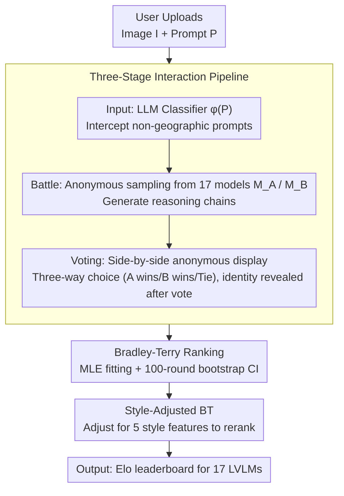

# GeoArena: Evaluating Open-World Geographic Reasoning in Large Vision-Language Models

**Conference**: ACL 2026  
**arXiv**: [2509.04334](https://arxiv.org/abs/2509.04334)  
**Code**: https://github.com/Applied-Machine-Learning-Lab/ACL2026_GeoArena  
**Area**: Multimodal VLM / Geographic Reasoning / Evaluation Benchmark  
**Keywords**: Geographic Reasoning, LVLM Evaluation, Human Preference, Bradley-Terry, Open-World

## TL;DR
This paper introduces **GeoArena**, a "dynamic, label-free, and process-oriented" evaluation platform for open-world geographic reasoning in LVLMs. It reformulates geographic localization under in-the-wild images as a pairwise reasoning alignment task, ranking 17 frontier LVLMs via human preferences and Bradley-Terry scores, achieving an expert-crowdsourcing agreement rate of 78%.

## Background & Motivation

**Background**: Existing LVLM geographic reasoning evaluations (OSV-5M, LLMGeo, IMAGEO-Bench, FairLocator, GeoChain, etc.) are almost entirely *outcome-centric*, utilizing static datasets with predefined labels (coordinate distance, country/city accuracy) to calculate "label-match."

**Limitations of Prior Work**:
- *Data Contamination*: Images in static benchmarks are easily absorbed during Web-scale pre-training; high scores may result from memorizing answers rather than reasoning.
- *Black-box Process*: Collapsing complex reasoning chains into a single label fails to distinguish between "guessing correctly" and "reasoning correctly."
- *Label Absence/Ambiguity*: In-the-wild images often lack authoritative ground truth (GT); when multiple hypotheses coexist, the concept of "correctness" itself dissolves.
- *Open-World Nature*: Geographic reasoning is inherently *abductive*—integrating visual evidence with spatial, environmental, and cultural knowledge to make rational conjectures rather than deterministic predictions.

**Key Challenge**: The evaluation paradigm (closed, static, label-only) is severely mismatched with the task's essence (open, dynamic, reasoning-heavy).

**Goal**: Construct a geographic reasoning evaluation framework that is (i) dynamically extensible, (ii) process-oriented, and (iii) free of GT labels, capable of stably ranking LVLMs.

**Key Insight**: Borrowing the "human pairwise preference + Bradley-Terry" paradigm from Chatbot Arena, the authors frame geographic reasoning evaluation as *pairwise reasoning alignment*. Two anonymous models are fed the same image and prompt, and humans vote based on "reasoning quality, evidence integration, and plausibility." This bypasses GT labels while naturally capturing the quality of reasoning chains.

**Core Idea**: Replace "correctness" with "which explanation better aligns with human geographic intuition" and instantiate it as an always-on public web arena.

## Method

### Overall Architecture
GeoArena is an in-the-wild evaluation pipeline: "upload image → automatic filtering → two-model battle → human voting → BT ranking." It is deployed as a public website that continuously collects data and updates the leaderboard. Formally, for each image $I\in\mathcal{I}$ and prompt $P\in\mathcal{P}$, the model $M$ outputs a reasoning chain $R\in\mathcal{R}$. The evaluation function is defined as
$E_{\text{reasoning}}(M)=\mathbb{E}_{(I,P)}[\mathcal{A}(M(I,P),\mathcal{H})]$
, where $\mathcal{H}$ is the latent space of "human geographic expectations" and $\mathcal{A}$ measures the alignment between the reasoning chain and human spatial logic.

### Key Designs

**1. Three-Stage Interaction Pipeline (Input → Battle → Voting): Converting casual uploads into observable controlled experiments**

In-the-wild evaluation is prone to contamination from noisy prompts and brand bias. This pipeline constrains user behavior into a scientific experiment. In the *Input* stage, an LLM classifier $\phi(P)$ intercepts non-geographic prompts to ensure the leaderboard only evaluates true geographic reasoning. In the *Battle* stage, two models $M_A, M_B$ are sampled anonymously to generate explanations for the same image and prompt. In the *Voting* stage, responses are shown side-by-side anonymously; users choose a winner, and identities are revealed only afterward.

Each step mitigates a specific bias: anonymous battles eliminate brand bias, pre-filtering blocks irrelevant noise, and side-by-side display forces judges to focus on reasoning quality over superficial formatting. The authors verified the classifier using Gemini 2.0 Flash, GPT-3.5 Turbo, and GPT-4.1 Mini on 100 positive and 100 negative examples (general Chatbot Arena prompts), achieving 100% accuracy, indicating that modern LLMs can easily distinguish geographic queries.

**2. Bradley-Terry Ranking + Bootstrap Confidence Intervals: Aggregating streaming votes into a statistically sound global leaderboard**

Pairwise voting is streaming by nature. Direct online Elo expected win rates $P(M_i \succ M_j)=\frac{1}{1+10^{(\gamma_j-\gamma_i)/\alpha}}$ are sensitive to match order. Following Chiang et al., GeoArena uses the Bradley-Terry model to perform Maximum Likelihood Estimation (MLE) on all historical pairwise results:

$$\mathcal{L}(\mathbf{\Gamma})=\sum_{i\neq j}W_{ij}\log\frac{1}{1+10^{(\gamma_j-\gamma_i)/\alpha}}$$

Ratings are then aligned to the Elo scale via $\text{rating}_i=400\cdot\hat\gamma_i + 1000$. Since BT is order-invariant, it is ideal for static LVLM evaluation. A 100-round bootstrap resampling provides 95% confidence intervals (CI), ensuring that gaps between models are statistically grounded rather than driven by a few noisy votes.

**3. Style-Adjusted BT: Decoupling "fancy writing" from "good reasoning"**

Uncontrolled human preferences are easily swayed by verbosity, lists, and fancy formatting—length bias is a classic pitfall in pairwise evaluation. GeoArena addresses this by including model one-hot encodings and five normalized style features $\{\text{length, list, header, emphasis, GPS\_ratio}\}$ in the logistic regression design matrix. The style coefficients $\beta$ are estimated first, and models are reranked based on coefficients after removing style effects.

The regression results explicitly reveal which "tricks" add points: $\beta_{\text{length}}=0.526$ (strong positive correlation), $\beta_{\text{list}}=0.095$, and $\beta_{\text{GPS}}=0.06$. Conversely, $\beta_{\text{header}}=-0.153$ and $\beta_{\text{emphasis}}=-0.117$ show that excessive headers or emphasis can be detrimental. After adjusting for style, rankings changed significantly—Gemma 3 12B dropped from 4th to 9th, confirming its high rank was partially inflated by verbose output rather than intrinsic reasoning strength.

### Loss & Training
The platform involves no training; it only invokes 17 models during inference, followed by human pairwise voting. Ranking fitting utilizes logistic regression (BT MLE) with $K=4$ scaling and 100-round bootstrap for CI estimation. Experts validated 100 pairs of samples to verify crowdsourcing reliability.

## Key Experimental Results

### Main Results
Selected BT rankings of 17 frontier LVLMs on GeoArena:

| Rank | Model | Elo | 95% CI | Remarks |
|------|------|-----|--------|------|
| 1 | Gemini 2.5 Pro | 1319.7 | [974.8, 1443.8] | Tier 1 |
| 2 | Gemini 2.5 Flash | 1206.5 | [1062.2, 1330.6] | Tier 1 |
| 3 | Qwen 2.5 VL 72B | 1094.5 | [982.6, 1181.9] | Best Open Source |
| 6 | GPT 4.1 Mini | 1059.8 | [970.0, 1161.4] | Mid-tier |
| 10 | Claude Opus 4 | 1042.3 | [933.8, 1130.0] | Overlaps with GPT 4.1 |
| 13 | GPT 4o | 1000.0 | — | Anchor |
| 17 | GPT 4o Mini | 871.6 | [715.2, 1114.7] | Last |

The Gemini series leads significantly; open-source models like Qwen 2.5 VL 72B approach the GPT-4.1 series; GPT 4.1, Llama 4 Maverick, and Claude Opus 4 show no significant difference in the 1040–1050 range based on overlapping CIs.

### Ablation Study

| Experiment | Main Metric | Conclusion |
|------|--------|------|
| Expert vs. Crowd Agreement | Avg 78% (Left Win 83.3% / Tie 65.6% / Right Win 84.4%) | Crowdsourced preferences are reliable and consistent with Chiang et al. |
| LVLM as Judge | Gemini 2.5 Pro 65.79% / Qwen 2.5 VL 72B 46.67% | Automatic evaluation remains insufficient to replace humans. |
| Style-Adjusted Elo | Gemma 3 12B: 4 → 9, Claude Opus 4: 10 → 8 | Verbosity and lists artificially inflate rankings. |
| Style Regression Coeff. | $\beta_{\text{length}}=0.526$, $\beta_{\text{header}}=-0.153$ | Length is strongly correlated; excessive headers are negative. |

### Key Findings
- **Clear Capability Tiers**: Gemini series > Qwen/Gemma mid-tier > GPT-mini/nano small models; scaling laws remain effective for geographic reasoning. Within the same family, Qwen 2.5 VL 7B→32B→72B rises monotonically.
- **High Expert-Crowd Agreement**: 78% average agreement with only 65.6% for "Tie" cases suggests that "picking a winner" is easier than "judging a tie," mirroring LMSYS experiences.
- **LVLMs Cannot Act as Judges Yet**: Even Gemini 2.5 Pro only achieves 65.8% alignment with humans, proving human judgment is still necessary.
- **Length Bias Exists in Geo-Reasoning**: Style adjustment significantly reshuffles rankings, showing a gap between "seeming comprehensive" and "reasoning correctly."
- **In-the-wild Dataset**: 94.2% outdoor, 84.2% no landmarks, 45.2% contain text, forcing models to reason from vegetation, architecture, and road textures.

## Highlights & Insights
- **Paradigm Contribution**: The first systematic migration of the Chatbot Arena concept to *geographic reasoning*—a complex task requiring vision, world knowledge, and lacking GT.
- **Decoupling Style and Capability**: Integrating style features as confounding variables in BT regression is a lightweight and effective way to control "verbose-wins" bias, applicable to any pairwise evaluation system.
- **Reliable Automatic Filtering**: 100% binary classification accuracy shows that identifying "geographic queries" is trivial for modern LLMs, allowing gatekeepers to be automated.
- **Case Study Insights**: Strong models lead significantly on difficult images without landmarks (relying on vegetation/architecture), suggesting the bottleneck is *integrating subtle multiple cues* rather than landmark recognition.

## Limitations & Future Work
- **Demographic/Geographic Bias**: The current user base determines image distribution, potentially overestimating performance in common regions.
- **Lack of User Tracking**: User IDs are not stored for privacy, preventing quantification of voting bias from a few heavy users.
- **Static Model Pool**: The 17 models are a subset of the frontier; rankings may fluctuate as new models are added.
- **Emphasis on "Reasoning Quality"**: No objective coordinate precision assessment, which may not suffice for applications requiring exact localization.
- **Lack of Systematic Failure Analysis**: Further empirical study is needed to identify which image types lead to systematic errors or cultural biases.

## Related Work & Insights
- **vs. Chatbot Arena / GenAI Arena**: Shares methodology (pairwise + BT), but is the first to ground the paradigm in the reasoning-heavy multimodal task of geographic reasoning.
- **vs. OSV-5M / LLMGeo / IMAGEO-Bench**: These use static data + GPS/country labels for outcome evaluation; GeoArena is dynamic, label-free, and process-oriented.
- **vs. GeoChain**: Reasoning-oriented but still relies on fixed datasets and pass scores; GeoArena's human pairwise preferences offer better scalability.
- **vs. Img2Loc / G3**: These focus on methods (RAG/retrieval-augmented LVLMs for localization), whereas GeoArena focuses on evaluation; the two are complementary.

## Rating
- Novelty: ⭐⭐⭐⭐ Systematically migrating the Arena paradigm to geographic reasoning is a first; the technical mechanisms largely reuse existing Arena methods.
- Experimental Thoroughness: ⭐⭐⭐⭐ 17 models, expert validation, style-adjustment, auto-filtering, and LVLM-judge analysis; lacks large-scale long-term tracking.
- Writing Quality: ⭐⭐⭐⭐ Problem motivation is clear, method formalization is sound, and comparisons are intuitive.
- Value: ⭐⭐⭐⭐⭐ Provides a necessary human-preference infrastructure for the GeoAI community; open-sourcing the code and platform makes it a vital tool for model alignment.

<!-- RELATED:START -->

## Related Papers

- [\[CVPR 2026\] From Indoor to Open World: Revealing the Spatial Reasoning Gap in MLLMs](../../CVPR2026/multimodal_vlm/from_indoor_to_open_world_revealing_the_spatial_reasoning_gap_in_mllms.md)
- [\[ICML 2026\] Immuno-VLM: Immunizing Large Vision-Language Models via Generative Semantic Antibodies for Open-World Trustworthiness](../../ICML2026/multimodal_vlm/immuno-vlm_immunizing_large_vision-language_models_via_generative_semantic_antib.md)
- [\[NeurIPS 2025\] OpenHOI: Open-World Hand-Object Interaction Synthesis with Multimodal Large Language Models](../../NeurIPS2025/multimodal_vlm/openhoi_open-world_hand-object_interaction_synthesis_with_multimodal_large_langu.md)
- [\[NeurIPS 2025\] Adapting Vision-Language Models for Evaluating World Models](../../NeurIPS2025/multimodal_vlm/adapting_visionlanguage_models_for_evaluating_world_models.md)
- [\[ACL 2026\] Addressing Overthinking in Large Vision-Language Models via Gated Perception-Reasoning Optimization](addressing_overthinking_in_large_vision-language_models_via_gated_perception-rea.md)

<!-- RELATED:END -->
