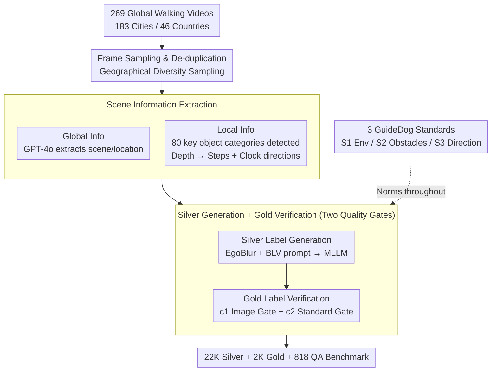

# GuideDog: A Real-World Egocentric Multimodal Dataset for Blind and Low-Vision Accessibility-Aware Guidance

**Conference**: ACL 2026  
**arXiv**: [2503.12844](https://arxiv.org/abs/2503.12844)  
**Code**: https://jun297.github.io/GuideDog/  
**Area**: Multimodal VLM / Accessibility / Dataset  
**Keywords**: BLV Navigation, Egocentric, MLLM Evaluation, Depth Perception, Human-AI Collaborative Annotation

## TL;DR
GuideDog utilizes an "expert-norm-driven silver-label generation + manual verification for gold labels" pipeline to construct 22K egocentric pedestrian scene image-text pairs (including an 818-question QA benchmark) from 269 global walking videos. This provides the first scaled, geographically diverse, and standardized training and evaluation data for MLLMs in BLV (Blind and Low-Vision) navigation tasks.

## Background & Motivation

**Background**: Globally, 2.2 billion BLV individuals face daily safety challenges in independent travel, with approximately 7% of visually impaired people falling at least once a month. Early solutions primarily relied on electronic travel aids + computer vision, which could only perform "obstacle detection/avoidance" but could not answer questions like "What environment am I in?" or "Where should I go next?". MLLMs (GPT-4o, Gemini, Qwen-VL, etc.) have made high-level scene understanding possible, and several recent works have begun using MLLMs as BLV visual assistants.

**Limitations of Prior Work**: Existing BLV datasets are either too small (VIALM: 200 images, Merchant: 48 images), lack an egocentric pedestrian perspective (VizWiz consists of casual photos of objects taken by BLV users), or suffer from severe geographical imbalance (WalkVLM covers only 10 locations). Visual tasks further require extensive "BLV-aware" descriptions; average sighted annotators cannot accurately predict what BLV users truly care about, leaving data construction dependent on a tiny number of experts, which restricts scale and diversity.

**Key Challenge**: There is a structural contradiction between "quality" and "scale" in BLV annotation—experts ensure quality but offer extremely limited supply; pure automated generation provides scale but fails to meet real BLV needs; sighted crowdsourcing is neither professional nor prone to missing critical obstacles.

**Goal**: (1) Develop a scalable pipeline to produce at least 10,000 geographically diverse image-text pairs aligned with professional BLV travel guidelines; (2) Provide a fine-grained evaluation benchmark specifically examining MLLM performance in object recognition and relative depth judgment in real street scenes; (3) Systematically characterize the current capabilities and shortcomings of MLLMs in BLV navigation.

**Key Insight**: Distill official BLV guidance norms (from over ten guidelines like Vision Australia, Be My Eyes, Wisconsin DHS, etc.) into three machine-executable "GuideDog Standards" (S1: Describe Environment / S2: Describe Obstacles / S3: Give Direction). Then, replace "generation from scratch" with "generation followed by verification"—MLLM + detectors + depth models first generate "silver labels," and humans only perform filtering and correction to obtain "gold labels," shifting expensive human labor from writing to auditing.

**Core Idea**: Utilize a three-stage pipeline consisting of "Expert Norm Templates + Silver Label Auto-generation + Gold Label Manual Verification" to transform unscalable expert writing into scalable expert auditing, complemented by a QA benchmark specifically testing MLLM spatial perception.

## Method

### Overall Architecture

GuideDog addresses the structural contradiction where BLV navigation data must be both professional and large-scale. The mechanism involves replacing unscalable expert writing with scalable expert auditing. The pipeline consists of four steps: first, sample frames from global walking videos based on geographical diversity and de-duplicate them to obtain egocentric scene images; next, extract global information (textual descriptions of scene/location) and local information (80 categories of key objects + bounding boxes + step distance + clock direction); then, feed this structured information into BLV-specific prompts for the MLLM to write "silver label" navigation text meeting the S1/S2/S3 standards; finally, three annotators filter and correct the data based on image availability $c_1$ and standard compliance $c_2$ to obtain 2,106 manually verified "gold labels." These three standards (S1/S2/S3) are referenced throughout both generation and verification. The final output includes 22K silver labels, 2K gold labels, and an 818-question QA benchmark.

### Key Designs

**1. Three GuideDog Standards (S1/S2/S3): Distilling over ten travel guides into three machine-executable, human-auditable norms.**

BLV guidance experience is scattered across various official guides. Sighted annotators cannot accurately predict what BLV users care about; any "free play" outside these norms fails in real-world use. GuideDog distills this expertise into: S1 describes the surrounding environment (location + key elements), e.g., "You are on a busy pedestrian street with shops on both sides"; S2 describes obstacles by type, clock direction, and distance in steps, e.g., "There is a signpost at 12 o'clock, 4 steps ahead"; S3 provides summary directions using intuitive measures ("3 steps", "1 o'clock direction") rather than precise units ("3 ft", "5 m"). These serve as prompt templates, manual checklists, and evaluation dimensions.

**2. Scene Information Extraction — 80 key object categories + Clock direction + Step distance: Turning images into structured obstacle lists.**

Directly allowing open-vocabulary MLLMs to generate navigation text results in synonym confusion, missed small obstacles, and non-standard units. GuideDog first decomposes images into structured info: GPT-4o filters out bad frames (sky/ground/occluded) and extracts global info $\mathcal{X}^{\text{global}}=(t^s,t^l)$; open-vocabulary detectors identify $\mathcal{O}_i, \mathcal{B}_i$ across 80 BLV-relevant categories; depth models generate maps $m_i$. Distance $d_{ij}$ is the median depth mapped to steps ($0.7$ m/step); direction $l_{ij}$ maps horizontal position to 10/11/12/1/2 o'clock. MLLMs then select the "BLV-relevant" subset $\mathcal{X}^{\text{local}}$ to write silver labels.

**3. Two-layer Quality Gate: Silver Generation + Gold Verification.**

GuideDog uses two gates to balance scale and trust. First-layer (Silver): EgoBlur desensitization + structured info + BLV-aware instructions fed to MLLM to produce S1+S2+S3 navigation text. Second-layer (Gold): Three annotators apply image-level filter $c_1$ (readability/angle/occlusion) and standard-level filter $c_2$ (compliance with S1/S2/S3). Statistically, 26.5% were rejected for image quality and 8.1% for standard non-compliance, indicating the pipeline consistently produces compliant output on high-quality images.

### Loss & Training
The paper is dataset-focused. The model side performs small-scale fine-tuning of Qwen2.5-VL using LoRA. It uses standard next-token prediction on 22K silver labels to demonstrate that fine-tuning on GuideDog significantly boosts open-source model performance.

## Key Experimental Results

### Main Results: Navigation Generation (GuideDog)
Evaluated across BLEU/ROUGE/METEOR/GPT-Eval/Gemini-Eval in 0-shot and 3-shot settings.

| Model | 0-shot GPT-Eval | 3-shot GPT-Eval | 0-shot METEOR | 3-shot METEOR |
|--------|------|------|------|------|
| Cambrian-1 (Open) | 0.219 | 0.307 | 0.267 | 0.375 |
| Qwen2.5-VL (Open) | 0.230 | 0.319 | 0.294 | 0.412 |
| Qwen2.5-VL **+ GuideDog LoRA** | **0.541** | 0.529 | **0.471** | 0.456 |
| Gemini 2.0 Flash | 0.462 | 0.481 | 0.400 | 0.463 |
| GPT-4o | 0.490 | 0.505 | 0.445 | 0.474 |
| Socratic GPT-4o (Text-only) | 0.384 | 0.391 | 0.419 | 0.417 |

### Ablation Study: Visual Perception QA (GuideDogQA)
Separating "Recognition vs. Depth" reveals capability misalignment in current MLLMs.

| Model | Object Recog. Acc | Rel. Depth Acc | Note |
|------|------|------|------|
| Random | 25.0 | 25.0 | 4-choice / 2-choice |
| Cambrian-1 | 82.3 | 24.3 | Strong recog, depth is random guessing |
| Qwen2.5-VL | 85.7 | 22.2 | Depth even lower than random |
| Qwen2.5-VL **+ GuideDog LoRA** | 83.9 | **41.5** | Recog stable, depth +19.3 |
| Gemini 2.0 Flash | 65.7 | 53.0 | Weaker recog, better depth |
| GPT-4o | 74.7 | **67.1** | Spatial perception leading |

### Key Findings
- **Fine-tuning makes the biggest impact**: Qwen2.5-VL LoRA jumped from 0.230 to 0.541 in GPT-Eval, surpassing GPT-4o, validating that silver labels effectively push open-source MLLMs to SOTA levels.
- **Depth perception is the real bottleneck**: All open-source models scored 22–32% in relative depth (near random), whereas GPT-4o hit 67%. Since BLV navigation relies on distance ("3 steps ahead"), this explains why S2 (obstacle description) scored lowest in user studies.
- **Socratic models prove vision is irreplaceable**: Converting vision to captions for text-only reasoning (SM pipeline) showed minimal 0-shot/3-shot gains and was weaker than direct MLLMs, proving the task requires "seeing" rather than "reading captions."
- **Silver labels are near the ceiling**: In user studies, filtered silver labels received a Likert mean of 4.63/5, higher than GPT-4o's 3.90, indicating the text quality is excellent; the bottleneck remains the underlying spatial perception of vision models.

## Highlights & Insights
- **Standardizing Professional Wisdom**: Converting expert travel guides into an S1/S2/S3 checklist for prompts, human auditing, and LLM-as-a-judge scores creates end-to-end "norm consistency."
- **Generation-to-Verification Paradigm**: Shifting human effort from writing to auditing, paired with quantifiable rejection rates, allows for scaling without sacrificing quality. This paradigm is transferable to any domain with clear rules but high volume requirements (e.g., medical imaging, legal compliance).
- **Decoupled Evaluation**: By testing object recognition and relative depth separately, GuideDogQA pinpointed the "strong recognition / random depth" asymmetry in open-source MLLMs, providing a roadmap for future spatial perception enhancement.

## Limitations & Future Work
- **Silver labels capped by base models**: Silver label noise primarily stems from detector hallucinations; the pipeline's ceiling is tied to open-vocabulary detectors and depth estimators.
- **Image-level vs. Video-level**: BLV navigation is a continuous stream; this dataset uses static frames, missing temporal consistency and dynamic obstacle tracking evaluation.
- **Sighted Annotator Bias**: Verification was done by 14 sighted individuals; while following a checklist, true validation requires real-world BLV user loops.
- **Future Directions**: Incorporating BLV users in the auditing loop, developing temporal video versions, and jointly training perception and language modules to optimize silver label quality.

## Related Work & Insights
- **vs VizWiz / VIALM / Merchant**: Previous works relied on pure manual labeling; VizWiz is large (31K) but not for navigation; VIALM is professional but tiny (200 images). GuideDog scales to 22K with global coverage using human-AI collaboration.
- **vs WalkVLM / EgoBlind**: Also video-derived, but WalkVLM covers only 10 locations for VideoQA; EgoBlind has only 1.3K clips. GuideDog is superior in scale and standardization.
- **vs Socratic Models**: While original Socratic Model papers suggest text reasoning can replace vision models, this work provides a counter-example—SM underperforms in BLV navigation, highlighting spatial tasks as a weakness.

## Rating
- Novelty: ⭐⭐⭐⭐ "Expert-norm-driven Gen->Verif" is a systematic first for BLV; S1/S2/S3 abstraction is original.
- Experimental Thoroughness: ⭐⭐⭐⭐ Covers 7 MLLMs across 0/3-shot with triple metrics (Auto/LLM/Human); clever QA decoupling.
- Writing Quality: ⭐⭐⭐⭐ Clear pipeline diagrams, statistical tables, and professional distillation of guidelines.
- Value: ⭐⭐⭐⭐⭐ Provides the first scaled, standardized training/eval foundation for 2.2 billion BLV users, with significant social impact.

<!-- RELATED:START -->

## Related Papers

- [\[ICLR 2026\] WorldSense: Evaluating Real-World Omnimodal Understanding for Multimodal LLMs](../../ICLR2026/multimodal_vlm/worldsense_evaluating_real-world_omnimodal_understanding_for_multimodal_llms.md)
- [\[CVPR 2026\] Towards Real-World Document Parsing via Realistic Scene Synthesis and Document-Aware Training](../../CVPR2026/multimodal_vlm/towards_real-world_document_parsing_via_realistic_scene_synthesis_and_document-a.md)
- [\[ACL 2026\] EDU-CIRCUIT-HW: Evaluating Multimodal Large Language Models on Real-World University-Level STEM Student Handwritten Solutions](edu-circuit-hw_evaluating_multimodal_large_language_models_on_real-world_univers.md)
- [\[NeurIPS 2025\] WearVQA: A Visual Question Answering Benchmark for Wearables in Egocentric Authentic Real-world scenarios](../../NeurIPS2025/multimodal_vlm/wearvqa_a_visual_question_answering_benchmark_for_wearables_in_egocentric_authen.md)
- [\[CVPR 2026\] MMSD3.0: A Multi-Image Benchmark for Real-World Multimodal Sarcasm Detection](../../CVPR2026/multimodal_vlm/mmsd30_a_multi-image_benchmark_for_real-world_multimodal_sarcasm_detection.md)

<!-- RELATED:END -->
