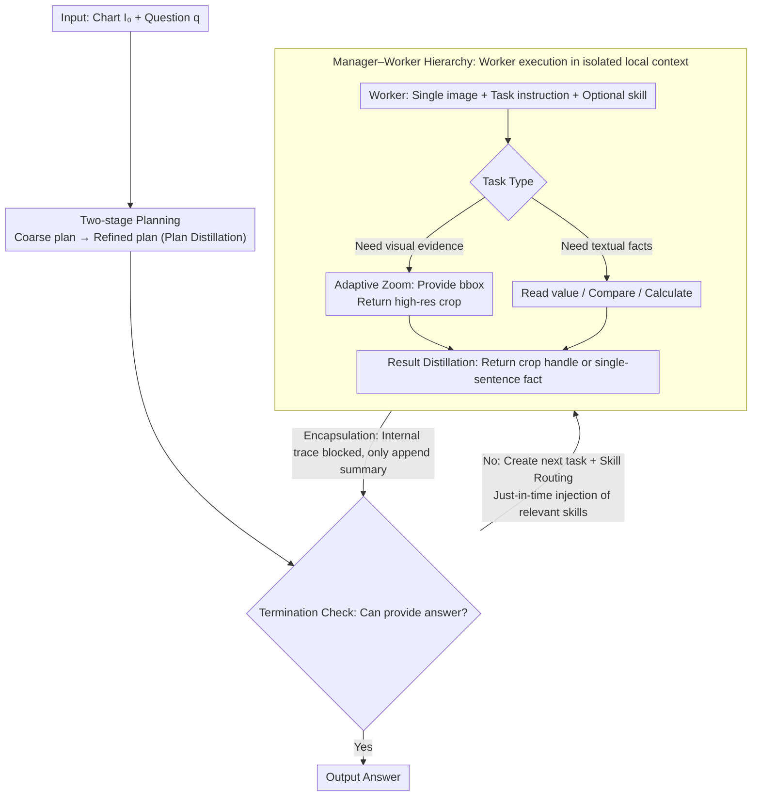

# HierVA: Hierarchical Visual Agent — Managing Contexts in Joint Image-Text Space for Advanced Chart Reasoning

**Conference**: ACL 2026  
**arXiv**: [2605.04304](https://arxiv.org/abs/2605.04304)  
**Code**: To be confirmed  
**Area**: Multimodal VLM / Agent / Chart Reasoning  
**Keywords**: chart QA, hierarchical agent, multimodal context, zoom-in, training-free

## TL;DR
HierVA utilizes a "manager–worker" two-layer multimodal agent to manage both image and text contexts during chart reasoning through a disciplined "acquisition–limitation–distillation" process. It achieves training-free performance surpassing strong baselines like CoT and "thinking with images" on complex chart reasoning benchmarks such as CharXiv.

## Background & Motivation

**Background**: Chart Question Answering (Chart QA) is a core capability for research assistants and document understanding systems. While CoT enables explicit reasoning in MLLMs, recent "thinking with images" paradigms (OpenAI 2025, Lai 2025, Zheng 2025, etc.) allow models to iteratively acquire additional visual evidence (such as zoom-in crops) during the reasoning process, integrating visual details into the reasoning trace.

**Limitations of Prior Work**: MLLMs have achieved 90%+ accuracy on single-image, single-step problems (ChartQA-style). However, performance collapses on complex charts with multiple subplots and multi-step reasoning (CharXiv reasoning split). CoT becomes distracted by irrelevant elements in the global image, while "thinking with images" repeatedly appends each zoom-in crop to the context, leading to **monotonic context growth**. This causes images to consume tokens and intermediate steps to accumulate, eventually diluting global reference information.

**Key Challenge**: Complex chart reasoning is inherently a hybrid image-text task requiring the simultaneous preservation of "local area details" and "multi-step intermediate results." However, LLM context is finite, and the mixture of text and image information leads to mutual dilution and eventual disorder.

**Goal**: To establish rigorous multimodal context management—acquiring necessary details while promptly distilling unnecessary intermediate products—without training any models.

**Key Insight**: Transfer the same disciplines used for managing text reasoning traces (plan distillation, scope, summarize) to visual contexts and enforce them using a **manager-worker hierarchical architecture**.

**Core Idea**: A manager maintains a refined global context, while multiple workers operate within isolated local contexts. Each zoom-in or calculation result only returns a distilled summary to the manager.

## Method

### Overall Architecture

HierVA addresses the issue of "context clutter" in complex chart reasoning: in charts with multiple subplots and multi-step reasoning, the model must retain local visual details and multi-step intermediate results, both of which compete for the finite token budget. The solution transfers text context management disciplines—planning, scoped refinement, and distillation—to image contexts via a hierarchical agent architecture.

Specifically, the input is chart $I_0$ and natural language question $q$, and the output is answer $a$. A Manager maintains a refined global context $C_M = \{q, I_0, \text{refined plan}, \text{distilled summaries}\}$, while several Workers perform tasks within isolated local contexts $C_{W_t} = \{\text{task instr}, \text{optional skill}, \text{single image}\}$. The Manager operates via a control loop (Algorithm 1): performing two-stage planning (coarse to refined, keeping only the refined version), then looping through "termination check → task creation → Worker execution → appending distilled summary to $C_M$" until a final $\boxed{}$ answer is produced. The main reasoning trace only perceives the cleaned context of the Manager, shielding it from the internal deliberation of Workers.

### Key Designs

**1. Manager–Worker Hierarchy + Encapsulation: Using an abstraction barrier to block local noise from the main context**

The primary pain point addressed is monotonic context growth—prior "thinking-with-images" methods dumped all worker deliberations into the main context, causing images to consume tokens and intermediate steps to dilute global information. HierVA implements an encapsulation barrier: the Manager only accesses $C_M$. After a Worker completes a task, its internal reasoning trace is not appended to $C_M$; instead, only a "single-sentence fact" or a "crop handle" is returned as a distilled result. Simultaneously, each Worker receives only a single image (original or crop) and minimal task instructions, enforcing scoped evidence. This decouples main context growth from sub-task complexity.

**2. Adaptive Zoom as an Explicit Action: Elevating "looking closer" to a first-class action**

Small text, ticks, and legends in charts are often illegible at a global scale. HierVA abstracts zooming into an image-expected task rather than burying the intent in CoT natural language. A Worker receives a zoom-in tool call, specifies a bounding box, and returns a cropped and resized high-resolution image. Consequently, the Manager's action space converges into two clear options: requesting new visual evidence (zoom) or requesting textual facts (reading, comparing, calculating). Modeling zoom as a typed action makes scheduling and debugging more controllable than vague prompting.

**3. Skill routing + Three-fold context distillation: Just-in-time injection and blocking expansion at the source**

Naively putting all skills (e.g., code execution) into the base system prompt bloats the context. HierVA maintains a compact skill library $\mathcal{S}$, where each skill is a brief markdown description. The Manager selects relevant skills for each task and injects them **just-in-time** into the Worker's system prompt; the Manager itself never "sees" the skill content. This routing is combined with three distillation points: Plan distillation (keeping only the refined plan), Worker encapsulation (isolating internal traces), and Result distillation (compressing answers). These address the three sources of context bloat: verbose planning, execution noise, and lengthy results.

### Mechanism Example

Consider a multi-step problem from CharXiv ("In the GDP subplot, how much higher is the 2020 value than 2015?"):

- The Manager performs two-stage planning, refining the task into "Locate GDP subplot → Read 2020 and 2015 values → Calculate difference," keeping only the refined plan in $C_M$.
- First, the Manager issues a zoom task. A Worker takes the original image and bbox, returning a high-res crop of the GDP subplot. It **returns only a crop handle**; its internal search process does not enter $C_M$.
- Second, the Manager issues a reading task with a "precise coordinate reading" skill injected just-in-time. The Worker reads the values from the crop and **returns only two factual sentences**.
- Third, the Manager issues a calculation task with a code skill. The Worker calculates the difference and returns the result.
- Throughout, the Manager only sees the refined plan and three distilled summaries, allowing it to provide the final $\boxed{}$ answer directly.

The Manager's context only increases by a few summaries rather than the combined tokens of three zoom/read/calculation traces.

### Loss & Training
Ours is training-free with no parameter updates—all improvements stem from prompt orchestration design, utilizing the same base MLLM (Qwen3VL-A22B in experiments).

## Key Experimental Results

### Main Results: CharXiv reasoning split
Comparison against Direct / CoT / CoT-Plan / Thinking w/ Images baselines using Qwen3VL-A22B. Metrics include overall Acc and sub-types (Extr / First / Read / RevR / Comp / Freq), along with Peak Token count.

| Method | Image Tools | Skills | CharXiv-All | Peak Tok # |
|------|-------------|--------|-------------|------------|
| Direct | — | — | 45.7 | 702 |
| CoT | — | — | 62.1 | 1926 |
| CoT-Plan | — | — | 62.4 | 1947 |
| Thinking w/ Images | zoom | — | (See original) | — |
| **HierVA (Ours)** | zoom + code | ✓ | **Exceeds all baselines** | Controlled growth |

On ChartQA + synthetic multi-subplot charts (sp#1 to sp#6): as subplots increase, all methods drop in accuracy, but HierVA only drops **1.5%**, compared to CoT (2.6%), CoT-Plan (3.8%), and Direct (5.4%).

| Method | ChartQA | sp#1 | sp#2 | sp#4 | sp#6 |
|------|---------|------|------|------|------|
| Direct | 88.9 | 88.5 | 86.5 | 84.8 | 83.1 |
| CoT | 90.2 | 90.1 | 89.2 | 88.4 | 87.5 |
| Thinking w/ Images | 89.9 | 89.7 | 88.5 | 87.4 | 87.5 |
| **HierVA** | 89.9 | 89.7 | 89.2 | 88.5 | **88.2** |

### Ablation Study

| Configuration | Key Effect | Description |
|------|---------|------|
| Full HierVA | Best | Manager+Worker + Three-fold distillation |
| w/o Hierarchy | Significant drop | Degenerates to thinking-with-images |
| w/o Scoped Visual Context | Moderate drop | Worker gets distracted by the full image |
| w/o Distilled Context | Moderate drop | Manager context bloats, long-chain reasoning fails |

### Key Findings
- For simple problems (ChartQA-style single-step retrieval), context management gains are minor; HierVA performs similarly to thinking-with-images. The advantage is clear in complex charts requiring multi-step reasoning.
- Higher complexity (more subplots) leads to a more pronounced relative advantage for HierVA, confirming that long-chain reasoning is the primary test for context management.
- The three distillation mechanisms are complementary; removing any of them results in performance loss, indicating that planning, execution, and results are all sources of context bloat.

## Highlights & Insights
- **Transferring text context discipline to image context**: The core insight is that images and text are homogeneous regarding token budgets, making distillation, scoping, and encapsulation applicable to both.
- **Just-in-Time Skill Injection**: Compared to traditional "all-skills-in-system-prompt" approaches, this design is universally applicable to tool-use agents.
- **Zoom as a First-Class Action**: Modeling zoom as a typed action provides more control over scheduling and debugging compared to ambiguous natural language prompts.

## Limitations & Future Work
- Heavily dependent on the base MLLM's instruction-following capabilities; may fail with smaller models.
- Peak token counts remain high; further compression is needed for latency-sensitive scenarios.
- Evaluation is limited to CharXiv, ChartQA, and synthetic charts; performance on more complex visual documents (dashboards, maps, flowcharts) is unverified.
- Lacks a learned skill selection strategy, relying on heuristic manager prompts which may limit cross-domain generalization.

## Related Work & Insights
- **vs CoT / CoT-Plan**: Text-only CoT lacks details; CoT-Plan cannot dynamically acquire evidence. HierVA integrates images into the working memory.
- **vs Thinking w/ Images** (Zheng 2025): Both allow zooming, but HierVA uses a hierarchy and distillation to prevent monotonic expansion.
- **vs ReAct / Tool Agents**: Shared lineage (agent + tool), but HierVA emphasizes the often-overlooked aspect of multimodal context management.

## Rating
- Novelty: ⭐⭐⭐⭐ The framing of Manager-worker + distillation is a clear new perspective in multimodal agents.
- Experimental Thoroughness: ⭐⭐⭐ Primarily focused on CharXiv/ChartQA; synthetic subplot experiments are clever but benchmark coverage could be broader.
- Writing Quality: ⭐⭐⭐⭐ Motivation and design principles are tightly linked; the distillation points address the essence of the problem.
- Value: ⭐⭐⭐⭐ Training-free and "plug-and-play," directly applicable to chart assistant applications.

<!-- RELATED:START -->

## Related Papers

- [\[CVPR 2026\] Monet: Reasoning in Latent Visual Space Beyond Image and Language](../../CVPR2026/multimodal_vlm/monet_reasoning_in_latent_visual_space_beyond_image_and_language.md)
- [\[CVPR 2026\] Hierarchical Attacks for Multi-Modal Multi-Agent Reasoning](../../CVPR2026/multimodal_vlm/hierarchical_attacks_for_multi-modal_multi-agent_reasoning.md)
- [\[ACL 2026\] TEMA: Anchor the Image, Follow the Text for Multi-Modification Composed Image Retrieval](tema_anchor_the_image_follow_the_text_for_multi-modification_composed_image_retr.md)
- [\[ACL 2026\] Learning More from Less: Exploiting Counterfactuals for Data-Efficient Chart Understanding](learning_more_from_less_exploiting_counterfactuals_for_data-efficient_chart_unde.md)
- [\[ACL 2026\] SlideAgent: Hierarchical Agentic Framework for Multi-Page Visual Document Understanding](slideagent_hierarchical_agentic_framework_for_multi-page_visual_document_underst.md)

<!-- RELATED:END -->
