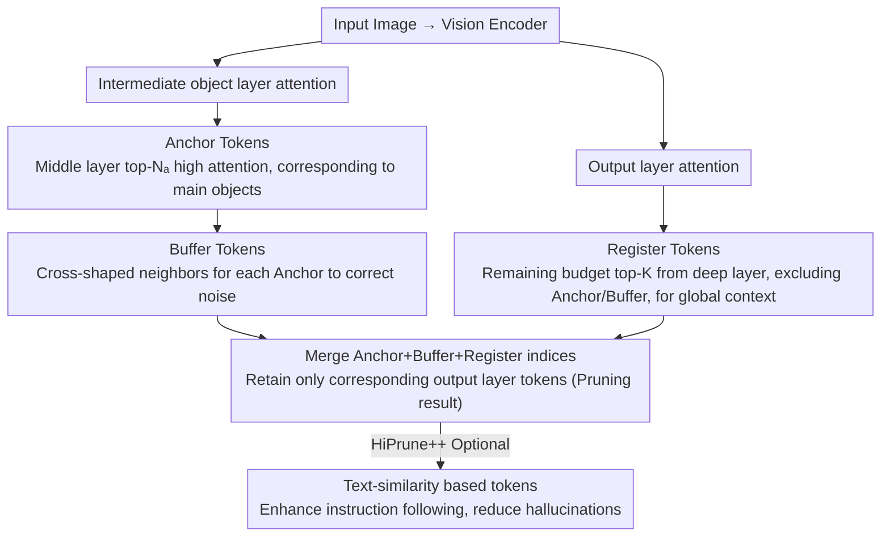

# HiPrune: Hierarchical Attention for Efficient Token Pruning in Vision-Language Models

**Conference**: ACL 2026 Findings  
**arXiv**: [2508.00553](https://arxiv.org/abs/2508.00553)  
**Code**: [GitHub](https://github.com/Danielement321/HiPrune)  
**Area**: Multimodal Efficiency / Visual Token Compression  
**Keywords**: Visual token pruning, Hierarchical attention, Training-free, Model-agnostic, VLM acceleration

## TL;DR

This paper discovers hierarchical attention patterns in vision encoders—middle layers focus on main objects, while deep layers focus on global information. Based on this, it proposes HiPrune, a training-free and model-agnostic visual token pruning method. By selecting three types of tokens (Anchor/Buffer/Register) to preserve visual information at different levels, it maintains 99.3% performance using only 1/3 of the tokens, reducing FLOPs by 58.7%.

## Background & Motivation

**Background**: VLMs encode images into a massive number of tokens (576 in LLaVA-1.5, potentially exceeding 10,000 in high-resolution scenarios), leading to significant computational and memory overhead. Visual tokens exhibit high redundancy—the performance degradation from randomly removing 50% of visual tokens is much smaller than removing 5% of text tokens.

**Limitations of Prior Work**: (1) Methods like FastV prune within the LLM decoder based on attention scores but fail to utilize the intrinsic properties of the vision encoder; (2) Methods based on CLS token attention are inapplicable to encoders without a CLS token (e.g., SigLIP); (3) Most methods are sensitive to specific models and require specialized tuning.

**Key Challenge**: Existing pruning methods either rely on feedback from the LLM side (causing computational waste—encoding all tokens before pruning) or use single-dimension metrics (e.g., only using the last layer's attention), ignoring the fact that different layers of the vision encoder capture different levels of semantic information.

**Goal**: Utilize the inherent hierarchical attention patterns of vision encoders to design a universal token pruning strategy.

**Key Insight**: A systematic analysis of hierarchical attention patterns across various vision encoders such as CLIP, SigLIP, DeiT, and VJEPA2 reveals consistent laws of hierarchical specialization.

**Core Idea**: High-attention tokens in middle layers correspond to the main objects (Anchor), complemented by spatial neighborhoods (Buffer) to retain local semantics; high-attention tokens in deep layers are uniformly distributed across the image (Register) to retain global information. Allocating these three types of tokens within a budget provides a compact image representation.

## Method

### Overall Architecture

HiPrune is executed before the vision encoder output: (1) Extract attention scores from an intermediate layer to select high-attention tokens as Anchors; (2) Select spatial neighbors of Anchors as Buffers; (3) Extract attention scores from the output layer to select the remaining budget of high-attention tokens as Registers; (4) HiPrune++ optionally adds tokens based on text similarity. Finally, only output-layer tokens corresponding to these indices are retained.

### Key Designs

**1. Anchor Token (Middle-layer object tokens): Extracts main objects from intermediate attention to preserve local details**

Most past attention-based pruning methods only consider the last layer, where high-attention tokens consist of uniformly spread global information that does not correspond to specific objects. Consequently, local details are easily pruned. HiPrune instead extracts attention scores $\mathbf{a}^{[l]}$ from a designated object layer $l$ (an intermediate layer of the vision encoder) and selects the top-$N_a$ tokens as Anchors. This choice is quantitatively grounded: researchers found that the top-10% high-attention tokens in the middle layers have the highest IoU with COCO object segmentation masks. Crucially, this "middle-layer focuses on objects" pattern consistently appears across various encoders like CLIP, SigLIP, DeiT, and VJEPA2, making Anchor selection model-agnostic.

**2. Buffer Token (Spatial neighborhood tokens): Corrects attention noise using cross-shaped neighborhoods to complete objects**

Attention maps are inherently noisy—a few high-attention tokens might be scattered across the image rather than cleanly identifying the object. Relying solely on Anchors might miss object edges or be misled by isolated noise points. The Buffer approach adds four spatial neighbors (up, down, left, right) for each Anchor token in a cross-shape:

$$\mathcal{I}_B = \cup\{\mathcal{I}_A - 1,\ \mathcal{I}_A + 1,\ \mathcal{I}_A - c,\ \mathcal{I}_A + c\}$$

where $c$ is the number of tokens per row. Through this spatial continuity, scattered high-attention points are anchored by surrounding tokens belonging to the same object, making the object region more complete. Experiments show that Buffer's contribution is small but stable (97.5% → 99.3%) and insensitive to neighborhood shapes (cross or square).

**3. Register Token (Deep-layer global tokens): Restores scene-level global context from the output layer**

Retaining only object tokens loses global information like scene type and spatial layout, leading the model to "miss the forest for the trees." HiPrune therefore selects the top remaining tokens from the output layer (the last layer) attention scores as Registers, excluding already selected Anchors and Buffers. Deep layers are used because their high-attention tokens happen to be uniformly distributed across the image, encoding global information—complementing the middle layer's object focus. Finally, the three types of tokens are combined into a compact index set representing the pruned visual state.

### Loss & Training

This is a completely training-free method that does not modify any model parameters. HiPrune++ additionally utilizes the cosine similarity between the text encoder and visual tokens to select a small number of tokens to enhance instruction following.

## Key Experimental Results

### Main Results

**LLaVA-1.5-7B (576→192 tokens, 33.3%)**

| Method | GQA | MMB | MME | POPE | SQA | VQAv2 | Average |
|------|-----|-----|-----|------|-----|-------|------|
| Original (576 tokens) | 61.9 | 64.7 | 1862 | 85.9 | 69.5 | 78.5 | 100% |
| ToMe | 54.3 | 60.5 | — | — | — | — | — |
| FastV | 58.2 | 62.1 | — | — | — | — | — |
| **HiPrune** | **61.4** | **64.2** | **1852** | **85.6** | **69.1** | **78.1** | **99.3%** |

### Ablation Study

| Configuration | Avg. Perf. Retention |
|------|-----------|
| Anchor only (Middle) | 94.2% |
| Register only (Deep) | 92.8% |
| Anchor + Register | 97.5% |
| **Anchor + Buffer + Register** | **99.3%** |

### Key Findings

- Maintains 99.3% performance with only 1/3 tokens, reducing FLOPs by 58.7%—proving high redundancy in visual tokens.
- Hierarchical attention patterns exist consistently across 6 different architectures (CLIP-L/B, SigLIP, SigLIP2, DeiT, VJEPA2)—this is an inherent property of vision encoders rather than a product of specific training.
- HiPrune++ maintains 96.1% performance at an ultra-low budget (1/9 tokens) and significantly reduces hallucinations.
- Buffer tokens provide a small but stable contribution—improving from 97.5% to 99.3%—and are insensitive to different neighborhood shapes.

## Highlights & Insights

- The discovery of "middle-layer object focus and deep-layer global focus" is simple yet powerful, validated through both quantitative analysis (IoU) and qualitative visualization (attention maps).
- The training-free and model-agnostic design makes it a true "plug-and-play" tool.
- The three-token design corresponds to three levels of image understanding: local details, spatial context, and global semantics.

## Limitations & Future Work

- The selection of the object layer $l$ needs to be determined for each encoder (typically the middle layer).
- For tasks requiring precise pixel-level understanding (e.g., OCR), pruning might lose critical information.
- Expansion into video token pruning is not yet fully explored.
- Integration with dynamic resolution encoders requires further verification.

## Related Work & Insights

- **vs FastV**: FastV prunes inside the LLM decoder and requires encoding all tokens first; HiPrune prunes at the vision encoder stage, offering earlier and higher efficiency.
- **vs CLS-based methods**: Dependency on the CLS token makes them less universal (SigLIP lacks CLS); HiPrune uses hierarchical attention scores applicable to any ViT.
- **vs ToMe**: ToMe requires training or extra computation for token merging via similarity; HiPrune is a pure index selection with zero additional overhead.

## Rating

- Novelty: ⭐⭐⭐⭐ The hierarchical attention analysis is a novel discovery, though the pruning method itself is relatively straightforward.
- Experimental Thoroughness: ⭐⭐⭐⭐⭐ Consistency verified across 4 VLMs and 6 vision encoders.
- Writing Quality: ⭐⭐⭐⭐⭐ Clear motivation with a complete logical chain from observation to method.
- Value: ⭐⭐⭐⭐⭐ Extremely high practical value as a plug-and-play tool with a 58.7% FLOPs reduction.

<!-- RELATED:START -->

## Related Papers

- [\[CVPR 2026\] TransPrune: Token Transition Pruning for Efficient Large Vision-Language Model](../../CVPR2026/multimodal_vlm/transprune_token_transition_pruning_for_efficient_large_vision-language_model.md)
- [\[CVPR 2026\] VLM-Pruner: Buffering for Spatial Sparsity in an Efficient VLM Centrifugal Token Pruning Paradigm](../../CVPR2026/multimodal_vlm/vlm-pruner_buffering_for_spatial_sparsity_in_an_efficient_vlm_centrifugal_token_.md)
- [\[ICCV 2025\] METEOR: Multi-Encoder Collaborative Token Pruning for Efficient Vision Language Models](../../ICCV2025/multimodal_vlm/meteor_multi-encoder_collaborative_token_pruning_for_efficient_vision_language_m.md)
- [\[ICML 2026\] CLIP Tricks You: Training-free Token Pruning for Efficient Pixel Grounding in Large Vision-Language Models](../../ICML2026/multimodal_vlm/clip_tricks_you_training-free_token_pruning_for_efficient_pixel_grounding_in_lar.md)
- [\[ICLR 2026\] Index-Preserving Lightweight Token Pruning for Efficient Document Understanding](../../ICLR2026/multimodal_vlm/index-preserving_lightweight_token_pruning_for_efficient_document_understanding_.md)

<!-- RELATED:END -->
